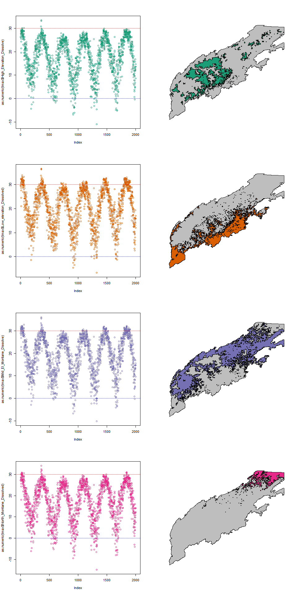

Github\_Upload\_Try
================

``` python

import pandas as pd
Models=["ppt_daily","tmax_daily","tmin_daily"]
work_dir="C:/Users/zjrobbin/Desktop/Prism_3_6/"
Years=list(range(1982,2017))

Model="ppt_daily"
Background=pd.read_csv(work_dir+"Outputs/"+str(1981)+Model+".csv")

for Year in Years:
    one=pd.read_csv(work_dir+"Outputs/"+str(Year)+Model+".csv")
    Background=pd.concat([one,Background],ignore_index=True)
```

    ## C:\Users\zjrobbin\AppData\Local\Continuum\anaconda3\envs\PythonandR\python.exe:3: FutureWarning: Sorting because non-concatenation axis is not aligned. A future version
    ## of pandas will change to not sort by default.
    ## 
    ## To accept the future behavior, pass 'sort=False'.
    ## 
    ## To retain the current behavior and silence the warning, pass 'sort=True'.

``` python
list(Background.columns.values)
```

    ## ['High_Elevation_Dissolve', 'High_Elevation_DissolveSTD', 'High_Elevation_DissolveVAR', 'Low_elevation_Dissolved', 'Low_elevation_DissolvedSTD', 'Low_elevation_DissolvedVAR', 'Mid_El_Montane_Dissolve', 'Mid_El_Montane_DissolveSTD', 'Mid_El_Montane_DissolveVAR', 'North_Montane_Dissolved', 'North_Montane_DissolvedSTD', 'North_Montane_DissolvedVAR', 'Timestep', 'Unnamed: 0']

``` python
ppt=Background[['Timestep','High_Elevation_Dissolve',
 'High_Elevation_DissolveSTD',
 'High_Elevation_DissolveVAR',
 'Low_elevation_Dissolved',
 'Low_elevation_DissolvedSTD',
 'Low_elevation_DissolvedVAR',
 'Mid_El_Montane_Dissolve',
 'Mid_El_Montane_DissolveSTD',
 'Mid_El_Montane_DissolveVAR',
 'North_Montane_Dissolved',
 'North_Montane_DissolvedSTD',
 'North_Montane_DissolvedVAR' ]]

ppt=ppt.sort_values(by=['Timestep'])


Years=list(range(1982,2017))
Model="tmax_daily"
Background=pd.read_csv(work_dir+"Outputs/"+str(1981)+Model+".csv")
for Year in Years:
    one=pd.read_csv(work_dir+"Outputs/"+str(Year)+Model+".csv")
    Background=pd.concat([one,Background],ignore_index=True)


list(Background.columns.values)
```

    ## ['Unnamed: 0', 'Timestep', 'High_Elevation_Dissolve', 'North_Montane_Dissolved', 'Low_elevation_Dissolved', 'Mid_El_Montane_Dissolve', 'High_Elevation_DissolveVAR', 'North_Montane_DissolvedVAR', 'Low_elevation_DissolvedVAR', 'Mid_El_Montane_DissolveVAR', 'High_Elevation_DissolveSTD', 'North_Montane_DissolvedSTD', 'Low_elevation_DissolvedSTD', 'Mid_El_Montane_DissolveSTD']

``` python
tmax=Background[['Timestep','High_Elevation_Dissolve',
 'High_Elevation_DissolveSTD',
 'High_Elevation_DissolveVAR',
 'Low_elevation_Dissolved',
 'Low_elevation_DissolvedSTD',
 'Low_elevation_DissolvedVAR',
 'Mid_El_Montane_Dissolve',
 'Mid_El_Montane_DissolveSTD',
 'Mid_El_Montane_DissolveVAR',
 'North_Montane_Dissolved',
 'North_Montane_DissolvedSTD',
 'North_Montane_DissolvedVAR' ]]
tmax=tmax.sort_values(by=['Timestep'])

Years=list(range(1982,2017))
Model="tmin_daily"
Background=pd.read_csv(work_dir+"Outputs/"+str(1981)+Model+".csv")
for Year in Years:
    one=pd.read_csv(work_dir+"Outputs/"+str(Year)+Model+".csv")
    Background=pd.concat([one,Background],ignore_index=True)

list(Background.columns.values)
```

    ## ['Unnamed: 0', 'Timestep', 'High_Elevation_Dissolve', 'North_Montane_Dissolved', 'Low_elevation_Dissolved', 'Mid_El_Montane_Dissolve', 'High_Elevation_DissolveVAR', 'North_Montane_DissolvedVAR', 'Low_elevation_DissolvedVAR', 'Mid_El_Montane_DissolveVAR', 'High_Elevation_DissolveSTD', 'North_Montane_DissolvedSTD', 'Low_elevation_DissolvedSTD', 'Mid_El_Montane_DissolveSTD']

``` python
tmin=Background[['Timestep','High_Elevation_Dissolve',
 'High_Elevation_DissolveSTD',
 'High_Elevation_DissolveVAR',
 'Low_elevation_Dissolved',
 'Low_elevation_DissolvedSTD',
 'Low_elevation_DissolvedVAR',
 'Mid_El_Montane_Dissolve',
 'Mid_El_Montane_DissolveSTD',
 'Mid_El_Montane_DissolveVAR',
 'North_Montane_Dissolved',
 'North_Montane_DissolvedSTD',
 'North_Montane_DissolvedVAR' ]]
tmin=tmin.sort_values(by=['Timestep'])

New=pd.concat([ppt,tmax,tmin])
New.to_csv(work_dir+"Apps_Climate_3_6.csv")
```

    ## Warning: package 'sf' was built under R version 3.4.4

    ## Warning: package 'rgdal' was built under R version 3.4.4

    ## Warning: package 'sp' was built under R version 3.4.4

    ## OGR data source with driver: ESRI Shapefile 
    ## Source: "C:\Users\zjrobbin\Desktop\Prism_3_6\Climate_Regions\AOI_4269.shp", layer: "AOI_4269"
    ## with 1 features
    ## It has 4 fields

    ## OGR data source with driver: ESRI Shapefile 
    ## Source: "C:\Users\zjrobbin\Desktop\Prism_3_6\Climate_Regions\High_Elevation_Dissolve.shp", layer: "High_Elevation_Dissolve"
    ## with 1 features
    ## It has 2 fields
    ## Integer64 fields read as strings:  DN

    ## OGR data source with driver: ESRI Shapefile 
    ## Source: "C:\Users\zjrobbin\Desktop\Prism_3_6\Climate_Regions\Low_elevation_Dissolved.shp", layer: "Low_elevation_Dissolved"
    ## with 1 features
    ## It has 2 fields
    ## Integer64 fields read as strings:  DN

    ## OGR data source with driver: ESRI Shapefile 
    ## Source: "C:\Users\zjrobbin\Desktop\Prism_3_6\Climate_Regions\Mid_El_Montane_Dissolve.shp", layer: "Mid_El_Montane_Dissolve"
    ## with 1 features
    ## It has 2 fields
    ## Integer64 fields read as strings:  DN

    ## OGR data source with driver: ESRI Shapefile 
    ## Source: "C:\Users\zjrobbin\Desktop\Prism_3_6\Climate_Regions\North_Montane_Dissolved.shp", layer: "North_Montane_Dissolved"
    ## with 1 features
    ## It has 2 fields
    ## Integer64 fields read as strings:  DN

<!-- -->

Note that the `echo = FALSE` parameter was added to the code chunk to
prevent printing of the R code that generated the plot.
