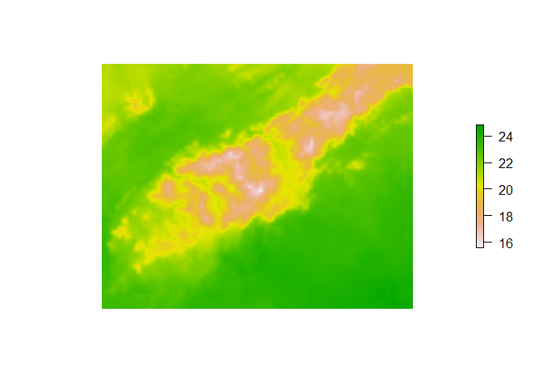
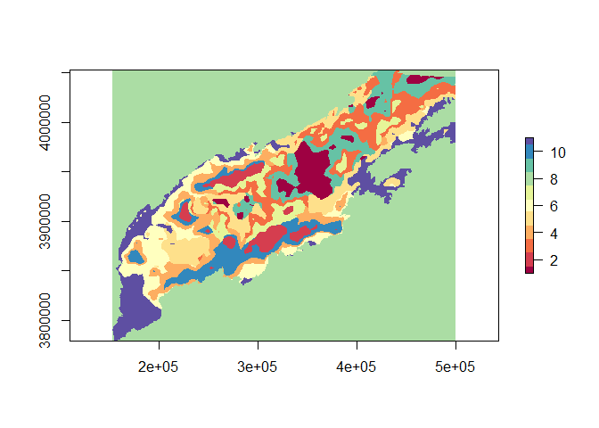

```r
knitr::opts_chunk$set(echo=F,warning=F)
library(raster)
```

```
## Warning: package 'raster' was built under R version 3.5.1
```

```
## Loading required package: sp
```

```
## Warning: package 'sp' was built under R version 3.5.1
```

```r
library(RColorBrewer)
library(plotrix)
Uniques<-brewer.pal(11,"Spectral")
Drive='C:/Users/zacha/Desktop/New_Normal/Folder/'
setwd(Drive)
```

Here is how we selected the climate regions. 

Start by defining the growing season temperatur eand percipitaiton
We got normals values from prism 
http://www.prism.oregonstate.edu/normals/

for each month and summed precipitation and meaned temperature over the growing season 

```
## [1] "+proj=utm +zone=17 +ellps=GRS80 +towgs84=0,0,0,0,0,0,0 +units=m +no_defs"
```

```
## [1] "INT4S"
```


Here is the mean growing season temperature for the area of intrest

<!-- -->

And the summed precipitation

<!-- -->

Then we scaled the variables to be comparible 


Then preformed a kmeans clustering algrothim for both varaibles. 
We looked at the means and variances clustered within each ecoregion.


Here is the clustering with 10 ecoregions 

<!-- -->

And the distribution of the variables(Normalized)


```
##    Ecoregion   MeanTemp     VarTemp       SETemp   Mean PPT     Var PPT
## 1          1  1.3103981 0.005131894 0.0003020330  1.4191958 0.004410582
## 2          2  1.4379188 0.003519878 0.0002401513  1.2727931 0.003745320
## 3          3  1.1065404 0.010490298 0.0006361870  1.9184324 0.015722265
## 4          4  1.0515696 0.004884796 0.0003805924  1.4846530 0.008871523
## 5          5  1.2886175 0.006618654 0.0003819952  1.6652949 0.005772512
## 6          6  1.1462063 0.002664160 0.0002158794  1.0327600 0.003848997
## 7          7  1.2635254 0.004482124 0.0003611993  0.8412246 0.008478706
## 8          8  1.0992791 0.004324114 0.0002536311  1.2401569 0.003763181
## 9          9  1.5095142 0.003113193 0.0002027538  1.0940419 0.003454278
## 10        10 -0.7753274 0.000000000 0.0000000000 -0.7689027 0.000000000
## 11        11  1.3071280 0.002719790 0.0001938936  1.1497095 0.004187226
##          SE PPT
## 1  0.0002800035
## 2  0.0002477226
## 3  0.0007788403
## 4  0.0005129039
## 5  0.0003567430
## 6  0.0002594806
## 7  0.0004967865
## 8  0.0002366091
## 9  0.0002135722
## 10 0.0000000000
## 11 0.0002405797
```

We experimented with values from 5 to 20 ecoregions, to find the minimum number that minizied the variance while accounting for computational cost. 

