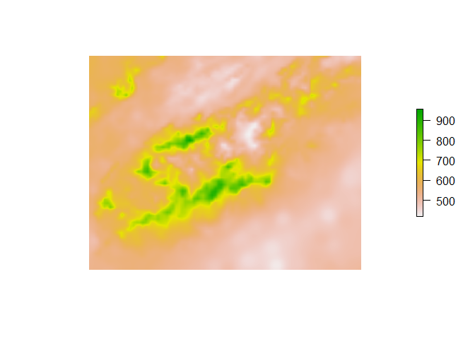

> Climate

> Climate regions were selected by clustering together the growing season normals for temperature and precipitaiton. 30 yr normal values for mean
temperature and precipitaiton were gatheredfrom Prism (http://www.prism.oregonstate.edu/normals/), these were summed over the growing season. 
We then preformed k-means clustering based on these values, with clusters ranging between 5 and 20. These were analyzed to see how much variance each one
encapsulated. We ultimately decided on 10 ecoregions. 
Climate models were downloaded from the MACA portls using the NKN Thredd Server, and the mean value for each day accessed for each of the twelve ecoregions. The variables used were precipitation, temperature(minimum), temperature(maximum),minimum relative humidity, maximum relative humidity,eastward wind speed, and northward wind speed. 

Citations

* Daly, C., & Bryant, K. (2013). The PRISM climate and weather system—an introduction. Corvallis, OR: PRISM climate group.

* Abatzoglou J.T. and Brown T.J. A comparison of statistical 
downscaling methods suited for wildfire applications, International 
Journal of Climatology (2012), 32, 
772-780https://climate.northwestknowledge.net/MACA/


)
Start by defining the growing season temperatur eand percipitaiton
We got normals values from prism 
http://www.prism.oregonstate.edu/normals/

for each month and summed precipitation and meaned temperature over the growing season 


```r
knitr::opts_chunk$set(echo=F,warning=F)
library(raster)
```

```
## Loading required package: sp
```

```r
library(RColorBrewer)
library(plotrix)
Uniques<-brewer.pal(11,"Spectral")
Drive='Z:/Robbins/Sapps/Model_Prep/New_Normal/Folder/'
#setwd(Drive)
```

Here is how we selected the climate regions. 

Start by defining the growing season temperatur eand percipitaiton
We got normals values from prism 
http://www.prism.oregonstate.edu/normals/

for each month and summed precipitation and meaned temperature over the growing season 

```
## [1] "+proj=utm +zone=17 +ellps=GRS80 +towgs84=0,0,0,0,0,0,0 +units=m +no_defs"
```

```
## [1] "INT4S"
```


Here is the mean growing season temperature for the area of intrest

<!-- -->

And the summed precipitation

<!-- -->

Then we scaled the variables to be comparible 


Then preformed a kmeans clustering algrothim for both varaibles. 
We looked at the means and variances clustered within each ecoregion.


Here is the clustering with 10 ecoregions 

<!-- -->

And the distribution of the variables(Normalized)


```
##    Ecoregion   MeanTemp     VarTemp       SETemp   Mean PPT     Var PPT
## 1          1  1.2635254 0.004482124 0.0003611993  0.8412246 0.008478706
## 2          2  1.1065404 0.010490298 0.0006361870  1.9184324 0.015722265
## 3          3  1.0992791 0.004324114 0.0002536311  1.2401569 0.003763181
## 4          4  1.3103981 0.005131894 0.0003020330  1.4191958 0.004410582
## 5          5  1.3071280 0.002719790 0.0001938936  1.1497095 0.004187226
## 6          6  1.4379188 0.003519878 0.0002401513  1.2727931 0.003745320
## 7          7  1.0515696 0.004884796 0.0003805924  1.4846530 0.008871523
## 8          8 -0.7753274 0.000000000 0.0000000000 -0.7689027 0.000000000
## 9          9  1.1462063 0.002664160 0.0002158794  1.0327600 0.003848997
## 10        10  1.2886175 0.006618654 0.0003819952  1.6652949 0.005772512
## 11        11  1.5095142 0.003113193 0.0002027538  1.0940419 0.003454278
##          SE PPT
## 1  0.0004967865
## 2  0.0007788403
## 3  0.0002366091
## 4  0.0002800035
## 5  0.0002405797
## 6  0.0002477226
## 7  0.0005129039
## 8  0.0000000000
## 9  0.0002594806
## 10 0.0003567430
## 11 0.0002135722
```

We experimented with values from 5 to 20 ecoregions, to find the minimum number that minizied the variance while accounting for computational cost. 


