Climate Files
================
Zachary Robbins
Updated June 28, 2019

##### Climate Regions

Here are the climate regions we decided on based on [USGS isobioclimates](https://rmgsc.cr.usgs.gov/ecosystems/datadownload.shtml)

High elevation

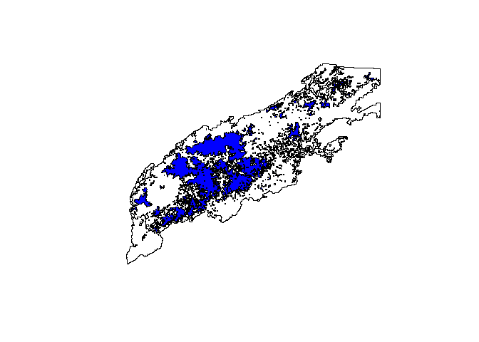

Mid-elevation montane

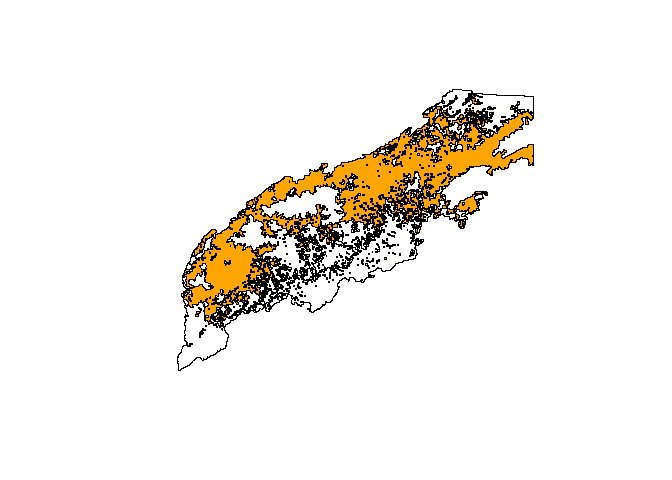

Northern montane

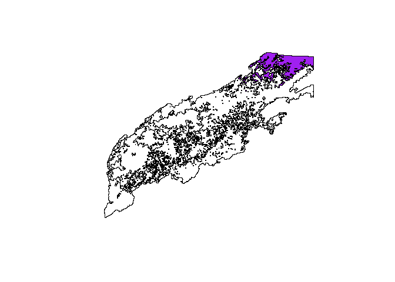

Low elevation

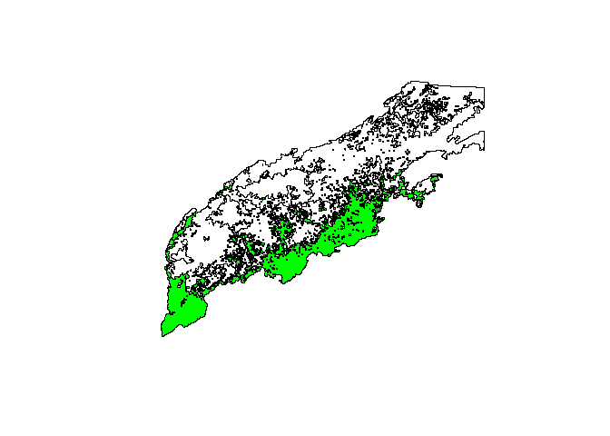

##### Historic Climate

This data is from the PRISM dataset for the years 1981 to Nov 2018. Because the geodata portal does not handle multi-polygons well, I made this script to take the raw .bil files from PRISM, match them with the climate regions maps and then calculate the mean std, var for each. This takes a while. There is one each for perciptiation, min and max temperature.

<http://www.prism.oregonstate.edu/recent/>

These are then combined on top of one another and rearranged in the mean/mean/mean/std/std/std/var/var/var style of LANDIS-II climate inputs.

Here are those climate files plotted

###### The daily maximums for each ecoregion.

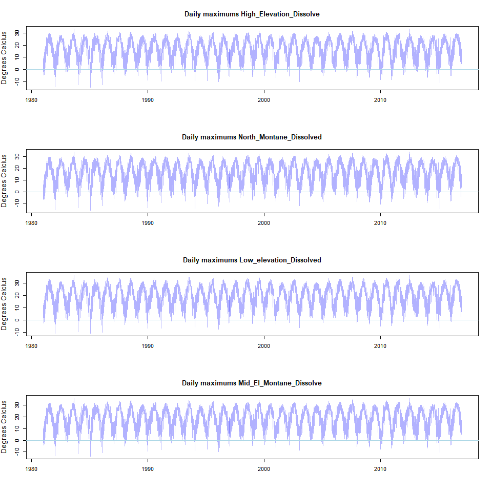

The daily minimums for each ecoregion.

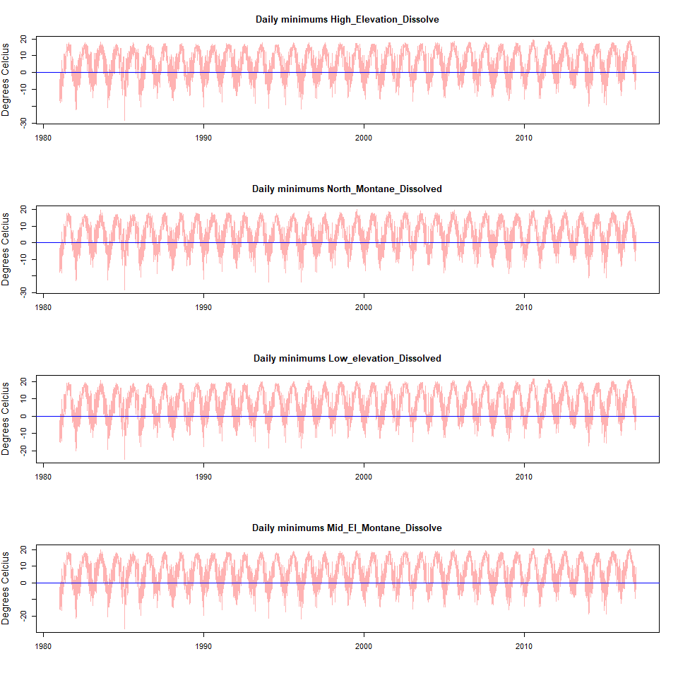

Percipitation

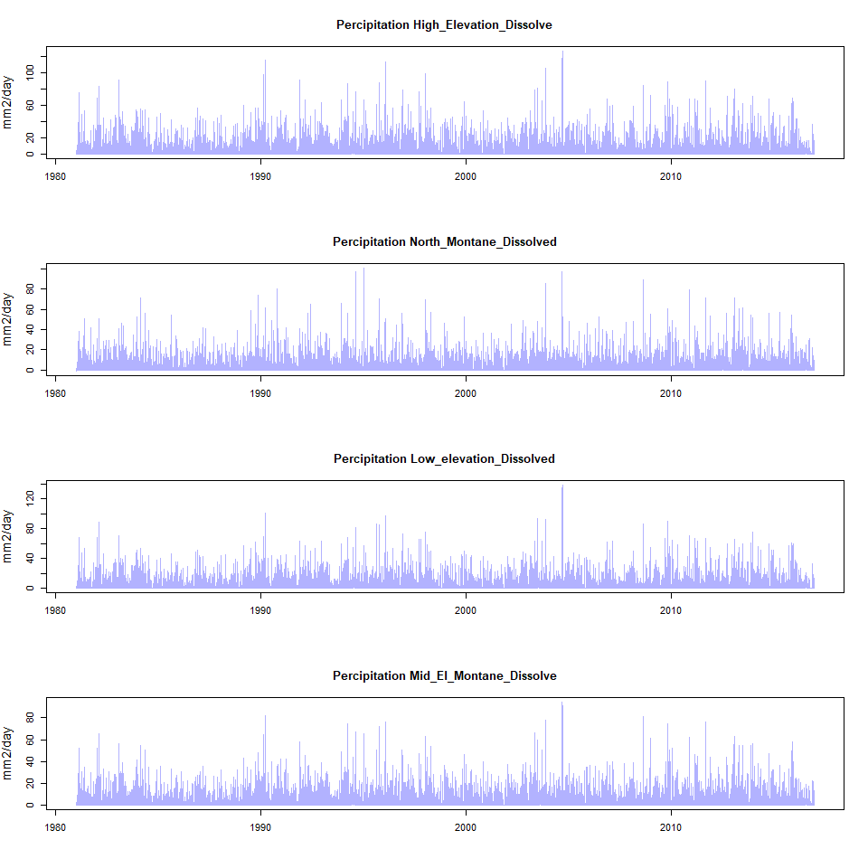

##### Future climate projections

Here we are using downscaled climate projections from GFDL-ESM2M thought this script could be used for any of the NetCDF climate files found at <https://climate.northwestknowledge.net/MACA/data_portal.php> From the MACA website:

Multivariate Adaptive Constructed Analogs (MACA) is a statistical method for downscaling Global Climate Models (GCMs) from their native coarse resolution to a higher spatial resolution that captures reflects observed patterns of daily near-surface meteorology and simulated changes in GCMs experiments. This method has been shown to be slightly preferable to direct daily interpolated bias correction in regions of complex terrain due to its use of a historical library of observations and multivariate approach.

The files for this project can be can be downloaded directly by copying these links found [here](https://github.com/LANDIS-II-Foundation/Project-Southern-Appalachians-2018/blob/master/Parameterizing/Climate/Net_cdf_macav2livneh_Source.txt)

We processed a relative concentration pathway 4.5 and 8.5 for the years 2006-2099.

Find out more information here <http://www.climatologylab.org/maca.html>

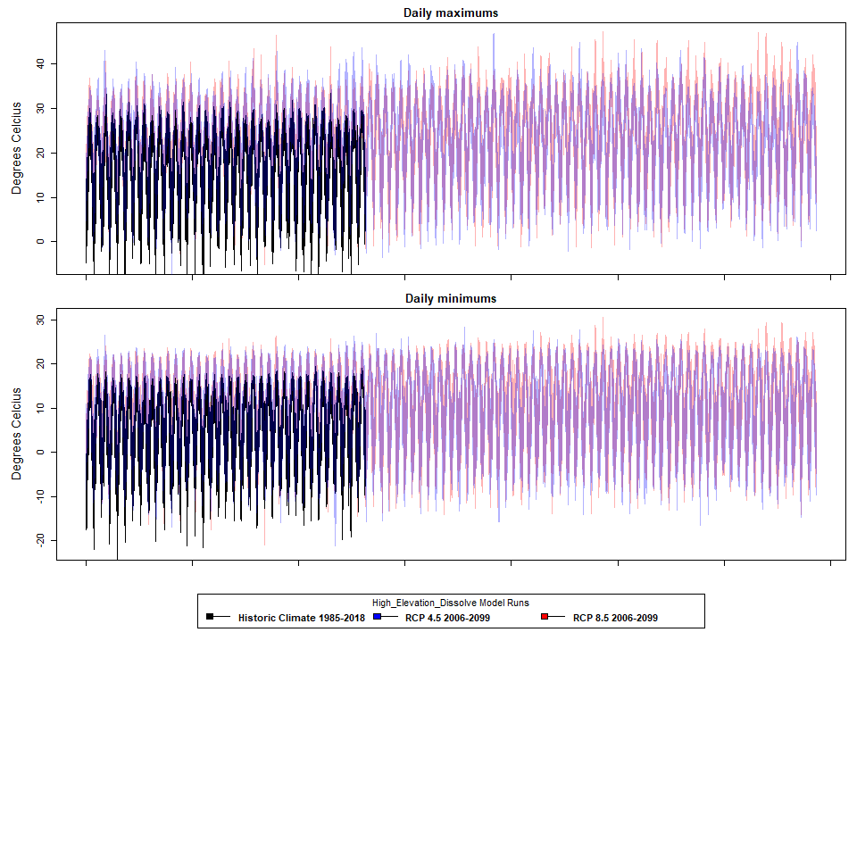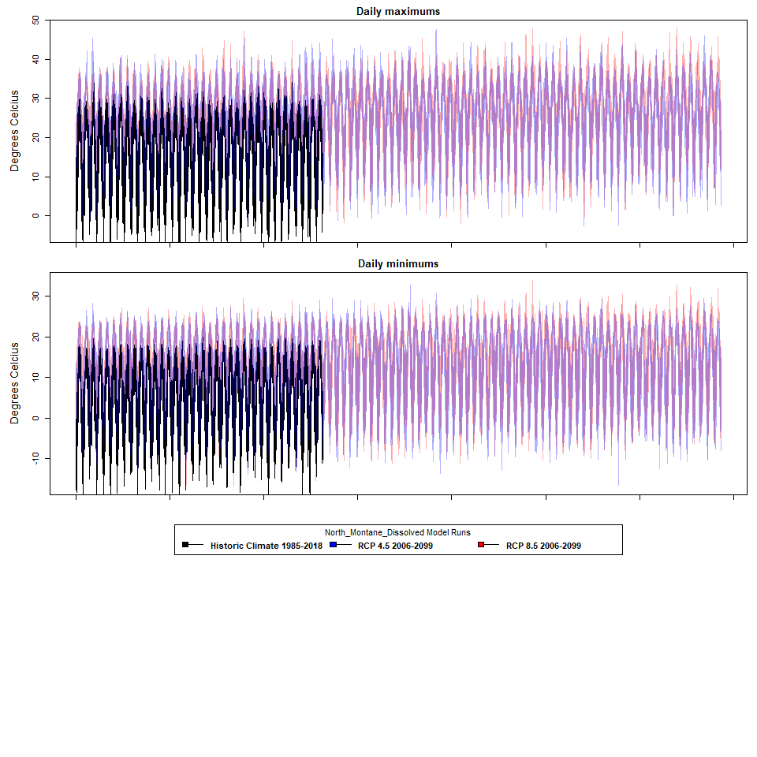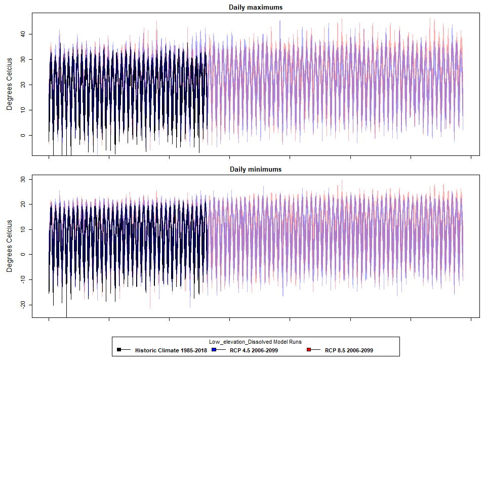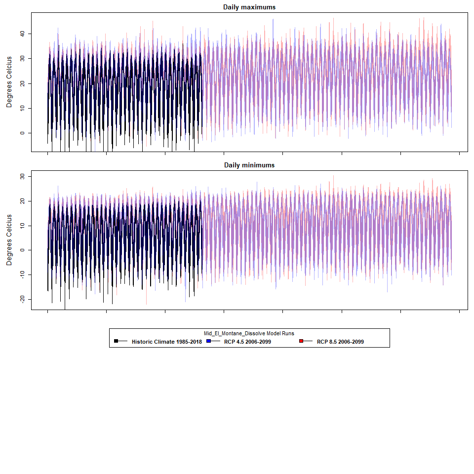
