FIA Analysis For Ecoregions
================
Zachary Robbins

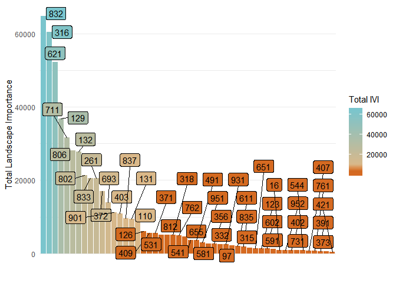<!-- -->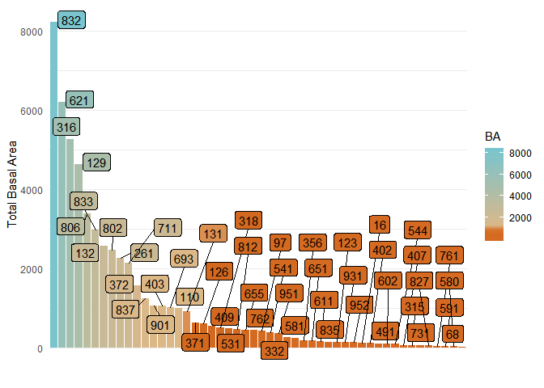<!-- -->

Doing this analysis we found the top ten species by IVI are

1.  Quercus prinus(832)
2.  Acer Rubrum (316)
3.  Liriodendron tulipifera (621)
4.  Pinus strobus (129)
5.  Oxydendrum arboreum (711)
6.  Quercus coccinea (806)
7.  Pinus virginiana (132)
8.  Quercus alba (802)
9.  Querccus rubra (833)
10. Tsuga Canadenesis (261)
11. Betula lenta (372)
12. Nyssa sylvatice (693)
13. Robinia pseudoacica (901)
14. Carya glabra (403)
15. Quercus veuntina(837)

The ratings for basal area alone may switch some positions, but no major
differnce in inclusion

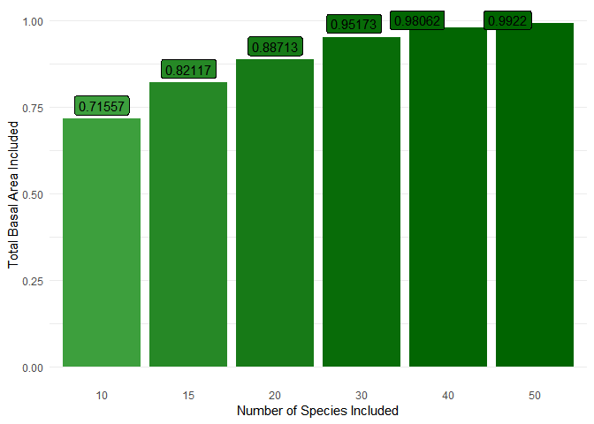<!-- -->

We additionally looked at how much of the total area was represented by
number of species. The fifty that were included in the rest of this
analysis accounted for 99.2% of the total basal area represented in the
stands we measured.

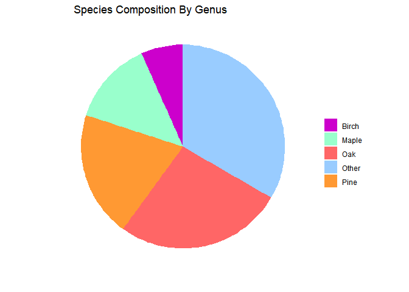<!-- -->

We also analayzed the landscape makeup by genus, Oak make up the
majority, followed by pine and maple.

Next we looked at each of the eco regions to see what species may be
locally dominant but not landscape dominant

#### Amphibolite Mountains

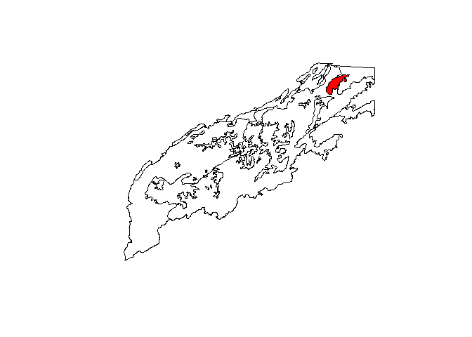<!-- -->

The Amphibolite Mountains are mountainous terrain, with amphibolite
substrate which provides a nuetralizing capacity creating edpahic
species combinations.

The most prodomminate species in the Amphibolie mountains is Tulip
poplar(621), followed by red maple (621), chestnut oak (832), black
locust (901),red oak (833) and sugar
maple.

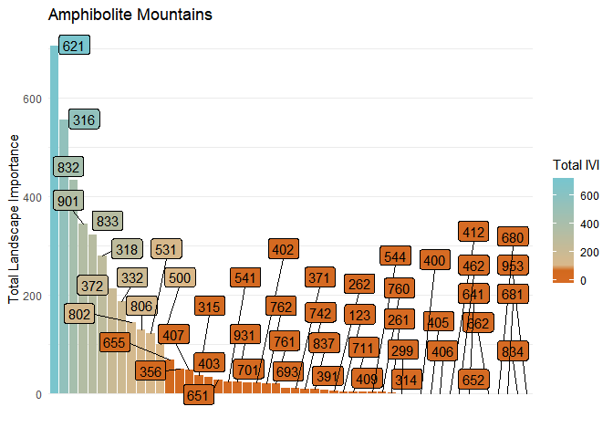<!-- -->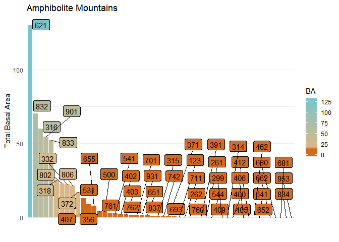<!-- -->

#### Southern Metasedimentary Mountains

The majority of the the Blue Ridge province, shaley and less firtle
soils. The dominamt species throughout this area are Chestnut oak(832),
red maple (316) ,Tulip poplar(621),Virginia pine (132),white pine(129),
and sourwood
(711)

<!-- -->

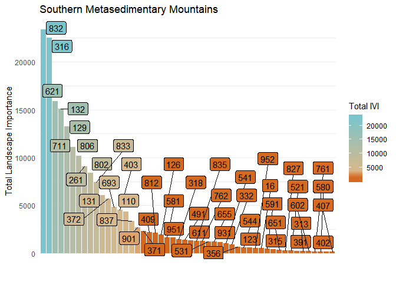<!-- -->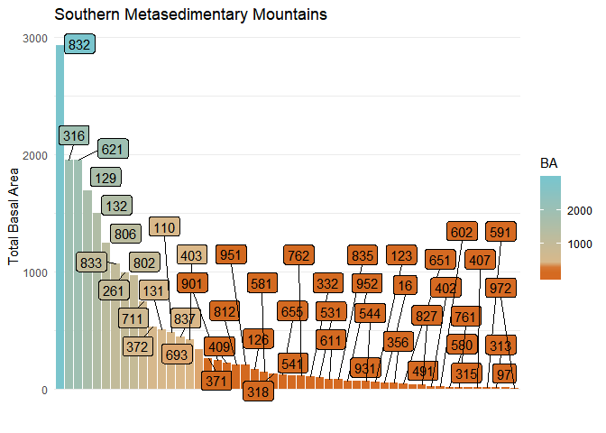<!-- -->
\#\#\#\# High Mountains

<!-- -->

At the highest elevaitons of the Apps, Spruce-Fir forests and High
elevation red oaks are common. The most common species is Red spruce(97)
followed by yellow birch(371) American beech(531), red oak(833), red
maple(316), sugar maple(318), and eastern hemlock
(261)

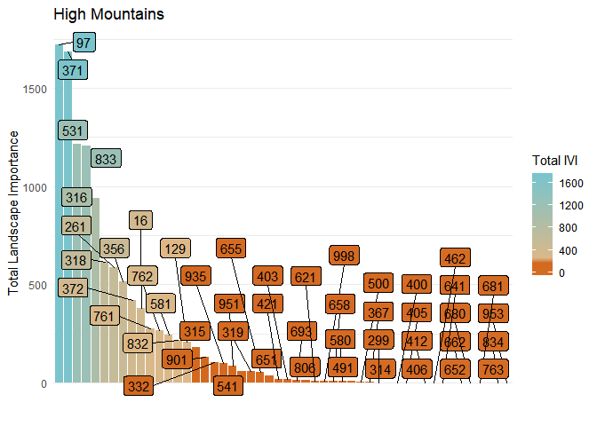<!-- -->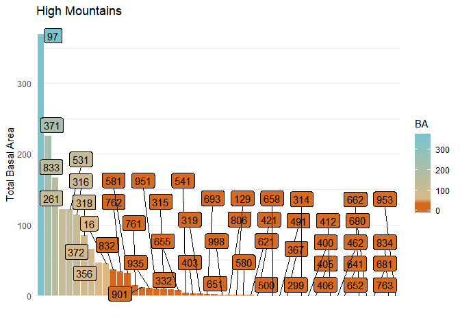<!-- -->

#### Eastern Blue Ridge Foothills

<!-- -->

The eastern foothills most dominant species is Yellow Poplar (621),
followed by chestnut oak (832), red maple(316), Pinus virginiana(132),
sourwood (711), White pine(129), white oak (802), black gum
(693).

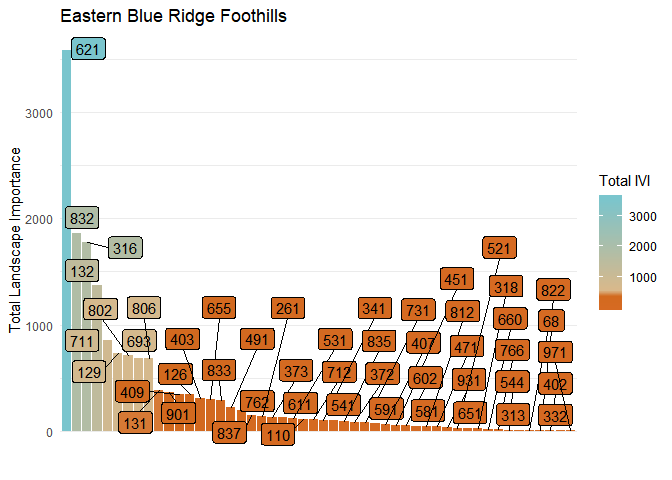<!-- -->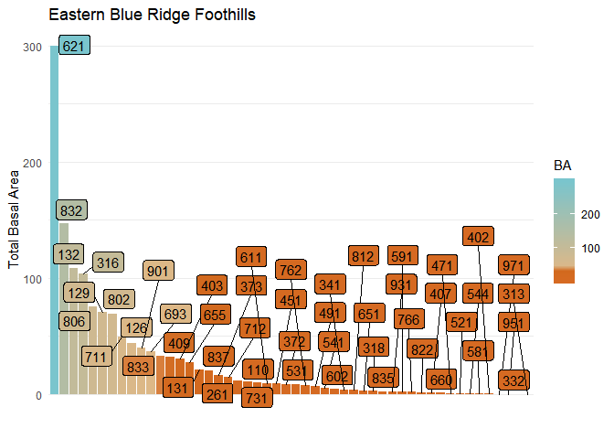<!-- -->

#### Southern Sedimentary Ridges

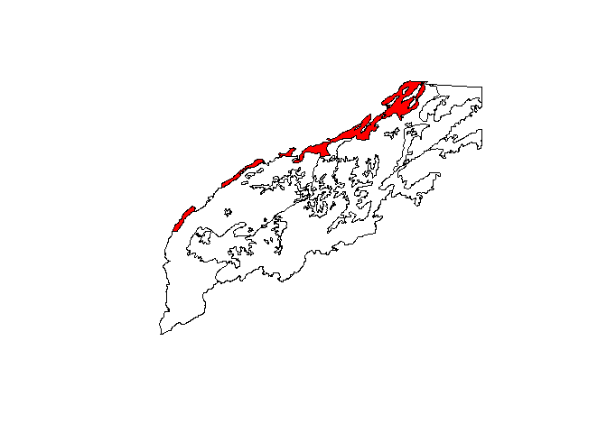<!-- -->

The eastern foothills most dominante species is chestnut oak (832),
followed by red maple(316), Yellow Poplar (621), sourwood (711),White
pine(129), Eastern Hemlock (261) Pinus virginiana(132), Red
Oak.

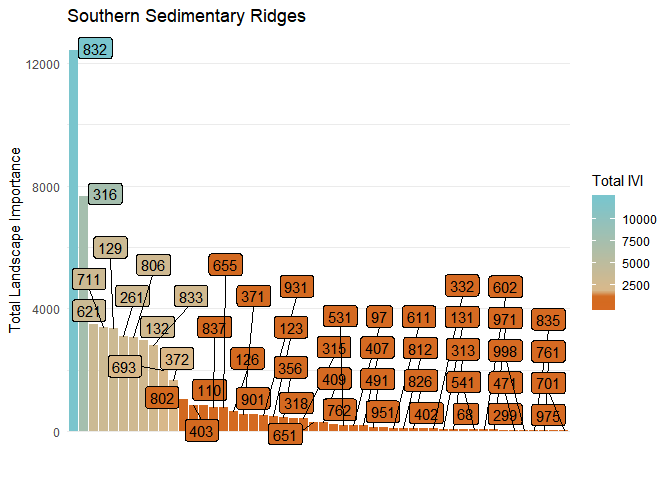<!-- -->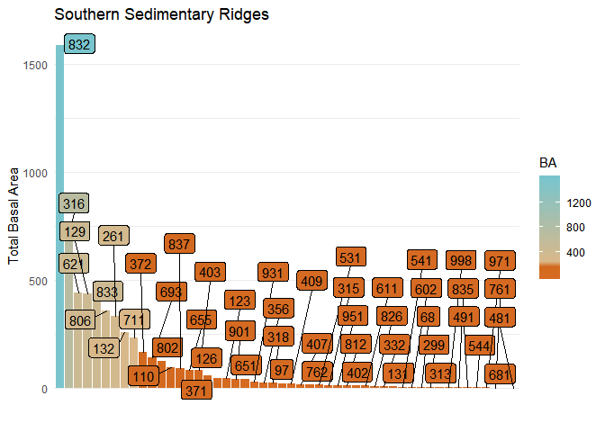<!-- -->

#### LimeStone Valleys and Coves

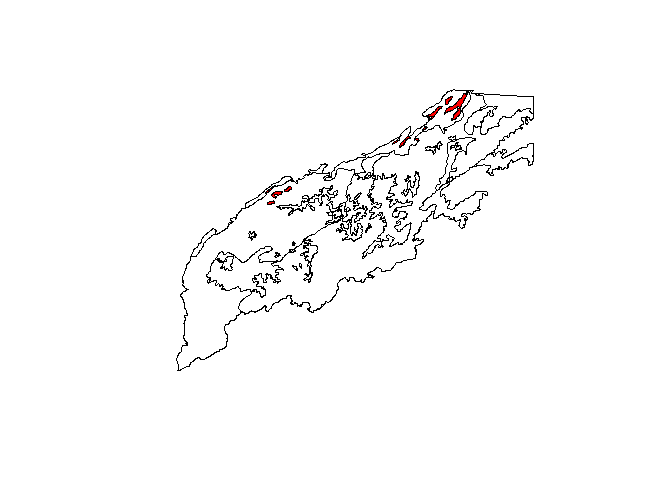<!-- -->

The major species in Limestone valleys and coves, chestnut oak (832),
tulip poplar(621),sycamore (731),red maple (316), scarlet oak
(806),black oak (837), American
basswood(951).

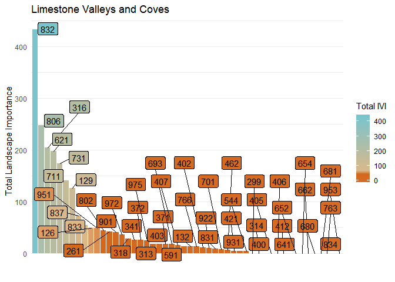<!-- -->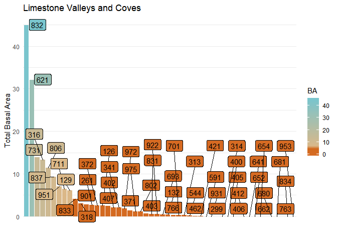<!-- -->

#### Southern Crystalline Ridges and Mountians

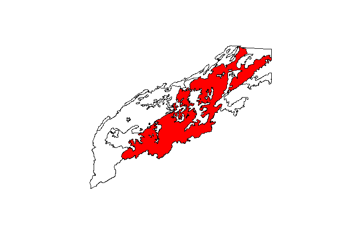<!-- -->

The major species are chestnut oak (832), tulip poplar(621), red
maple(316), white pine(129), sourwood(711), and scarlet oak(806). This
ecoregion also picks up some of the peidmonts pines shortleaf pine and
loblolly
pine.

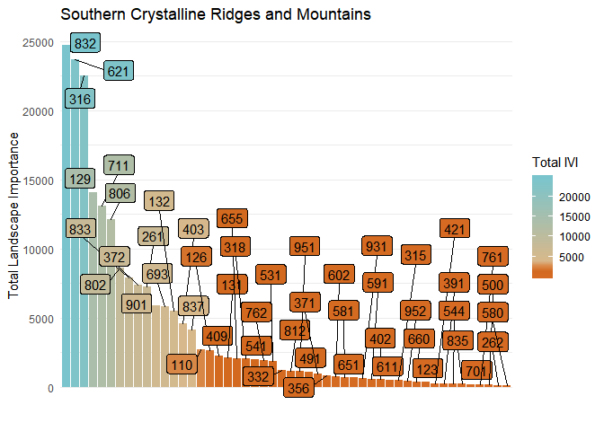<!-- -->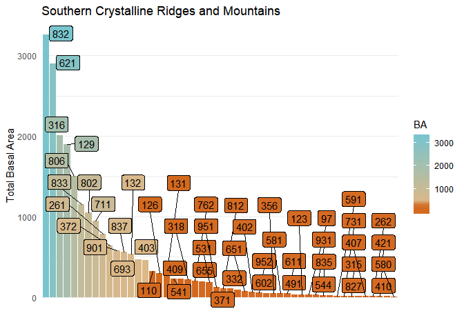<!-- -->
\#\#\#\# Broad Basins

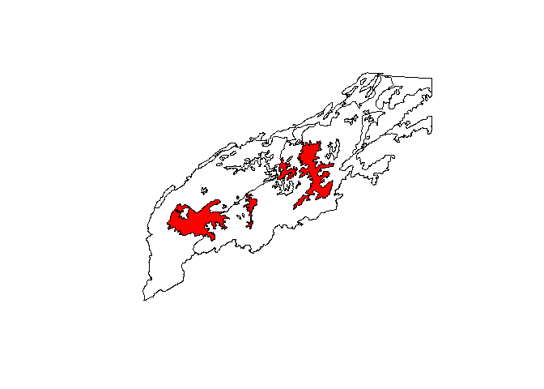<!-- -->

Broad basins most common species are Tulip poplar (621), redmaple (316),
eastern white pine (129), sourwood (711), virginia pine, white oak(802),
southern red oak( 812),scarlet oak (806), and black oak
(832).

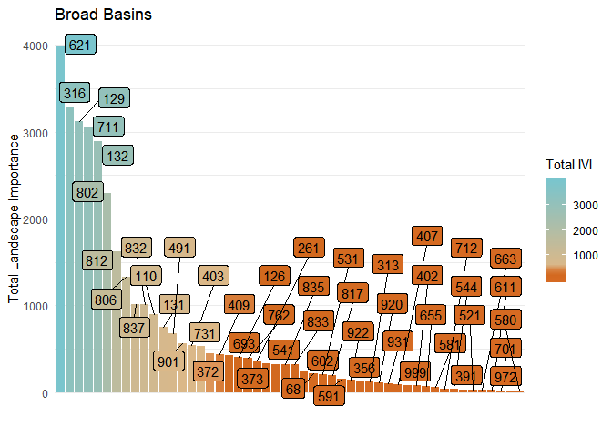<!-- -->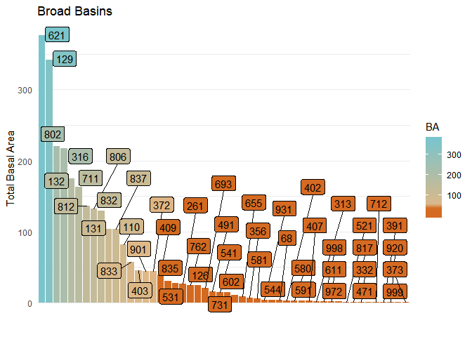<!-- -->

#### New River Plateu

<!-- -->

The Northern most part of the southern Appalachians. Eastern white pine
is the most dominante followed by black birch(372), red maple(316),
black locst(901), Tulip poplar, and scarlet oak
(806)

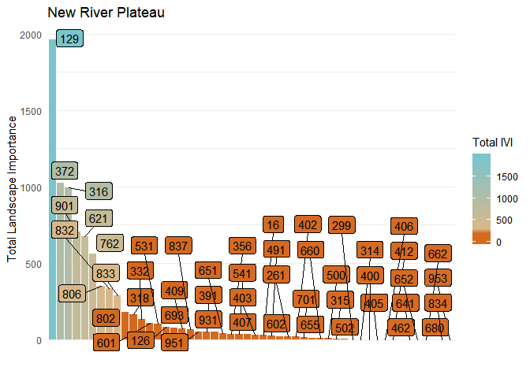<!-- -->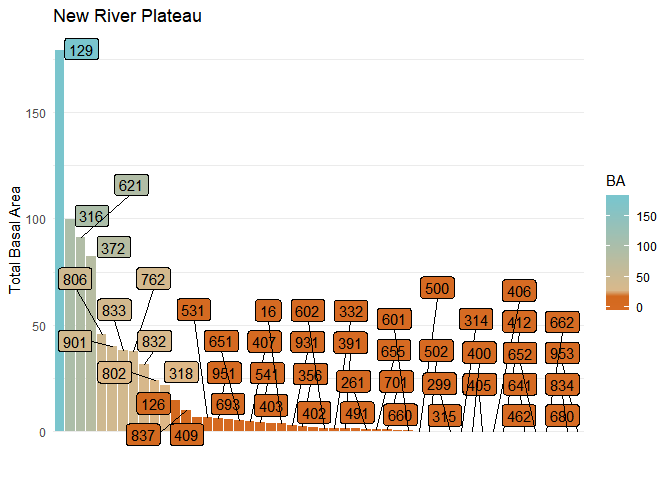<!-- -->

#### Appendix

##### Species Names and FS numbers

| Species Name | Sum of IVI |               Forest Service Number                |
| :----------: | :--------: | :------------------------------------------------: |
|     832      | 64803.7074 |                   Qurecus prinus                   |
|     316      | 60477.8516 |                    Acer Rubrum                     |
|     621      | 52185.8572 |              Liriodendron tulipifera               |
|     129      | 36846.3403 |                   Pinus strobus                    |
|     711      | 31678.5366 |                Oxydendrum arboreum                 |
|     806      | 28125.3486 |                  Quercus coccinea                  |
|     132      | 27871.4204 |                  Pinus Virginiana                  |
|     802      | 21430.8766 |                    Quercus alba                    |
|     833      | 20595.5473 |                   Quercus rubra                    |
|     261      | 20548.2840 |                 Tsuga Canadenesis                  |
|     372      | 16965.0845 |                    Betula lenta                    |
|     693      | 13943.2769 |             Nyssa sylvatice(blackgum)              |
|     901      | 11256.4078 |         Robinia pseudoacica (black locust)         |
|     403      | 10912.2079 |           Carta glabra (Pignut hickory)            |
|     837      | 9620.9004  |                 Quercus veluntina                  |
|     131      | 9460.5311  |                    Pinus taeda                     |
|     110      | 8922.1150  |                   Pinus echinata                   |
|     126      | 6134.8899  |                    Pinus rigida                    |
|     409      | 5620.6053  |           Carya alba(mockernut hickory)            |
|     371      | 5570.4549  |               Betula alleghaniensis                |
|     531      | 5078.0836  |                 fagus grandifolia                  |
|     812      | 5072.1741  |                  Quercus falcata                   |
|     318      | 5034.0687  |                   Acer saccharum                   |
|     762      | 4886.9212  |                  Prunus serotina                   |
|     655      | 4596.8727  |                Magnolia macrophylla                |
|     541      | 3608.8314  |                 Fraxinus americana                 |
|     491      | 3586.0493  |                   Cornus florida                   |
|     951      | 3079.8722  |        Tilia americana (American Basswood)         |
|     581      | 2728.8609  |        Halesia diptera(Carolina silverbell)        |
|     356      | 2682.4540  |                Amelanchier arborea                 |
|     332      | 2606.4680  |           Aesculus flava(Yellow buckeye)           |
|     931      | 2486.5932  |                  Sassafras.alidum                  |
|      97      | 2138.5384  |                    Picea rubens                    |
|     611      | 2115.9875  |         Liquidamber styraciflua(sweetgum)          |
|     835      | 1968.9992  |             Quercus stellata(post oak)             |
|     315      | 1572.6538  |                 Acer Pensylvanicum                 |
|     651      | 1466.1266  |          Magnolia acuminata(cucumbertree)          |
|     123      | 1444.1156  |         Pinus Pungens(Table Mountain Pine)         |
|     602      | 1393.1051  |            Juglans nigra( Black walnut)            |
|     591      | 1284.9644  |            Ilex opaca (american Holly)             |
|      16      |  992.5191  |                    Fraser fir.                     |
|     952      |  969.8806  | Tilia americana var. heterophylla (white basswood) |
|     402      |  958.5509  |        Carya codiformis (bitternut Hickory)        |
|     731      |  943.9414  |          plantanus ocidentalies(sycamore)          |
|     544      |  907.6703  |         Fraxinus pennsylvanica(green ash)          |
|     407      |  725.5578  |           Carya ovata (shagbark hickory)           |
|     761      |  706.0680  |            Prunus serotina (pin cherry             |
|     391      |  626.5388  |      Carpinus caroliniana(American hornbeam)       |
|     373      |  561.4671  |             Betula nigra(River birch)              |
|     421      |  464.6689  |        Anerucan Chestnut(Castenea dentata)         |

Species Names and FS numbers
