FIA Analysis
================
Zachary Robbins

### Landscape Makeup

To understand the makeup of our landscape, we used FIA data isolated to our study-area over the last 15 years. The FIA data we used was fuzzed, so we may have included some sites outside of our study area and vice versa. However given the size of the study area (millions of hectares) and the number of samples obtained (3032 plots), we assume this effect to be small.

-   First we isolate the locations using thier geospatial location on the site level using FIA\_SITE table,

-   Second, using the FIA\_TREE table we calculate the basal area of each tree and the total basal area for the plot

-   Third we calculated a truncated important value index equal to:
    
    $$\\frac{No Of Trees Of Species X}{No Of Trees Of All Species}+\\frac{BA of Species X}{Total BA of The Species} $$

This was done in order to account for the prevalence of low basal area species which may represent the emergent understory/ future overstory.

The results fromm this are cumulative counts of these measures.

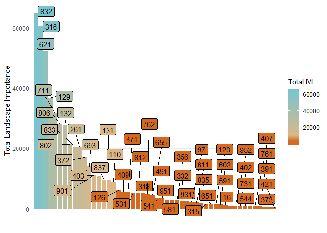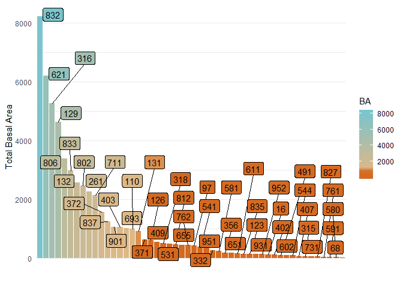

Doing this analysis we found the top ten species by IVI are

1.  Quercus prinus(832)
2.  Acer Rubrum (316)
3.  Liriodendron tulipifera (621)
4.  Pinus strobus (129)
5.  Oxydendrum arboreum (711)
6.  Quercus coccinea (806)
7.  Pinus virginiana (132)
8.  Quercus alba (802)
9.  Querccus rubra (833)
10. Tsuga Canadenesis (261)
11. Betula lenta (372)
12. Nyssa sylvatice (693)
13. Robinia pseudoacica (901)
14. Carya glabra (403)
15. Quercus veuntina(837)

The ratings for basal area alone may switch some positions, but no major difference in which species were included

In total there were far more species than we could reasonably parameterize. So we needed to determine the number of species needed to look at the total landscape. We calculated the total basal area of all trees on the landscape and then looked at the different percentages represented by the top 10,15,20,30,40,50. \#\#\#\#\# If you want to see the top 50 species or for a key to Species name see the appendix of this page.

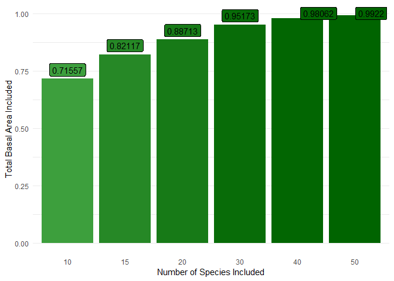

With only 10 species we represent ~72 percent on the landscape, at 20 this moves to 89%, and at 50 we are above 99% of total Basal Area. We feel that if we represent 40 of these species, we account for most of the landscape. Our goal will be to start with 50 species and discard those that may not have sufficient parameters., the top twenty species, however, may have to be extensively parameterized due to their effect on the total landscape.

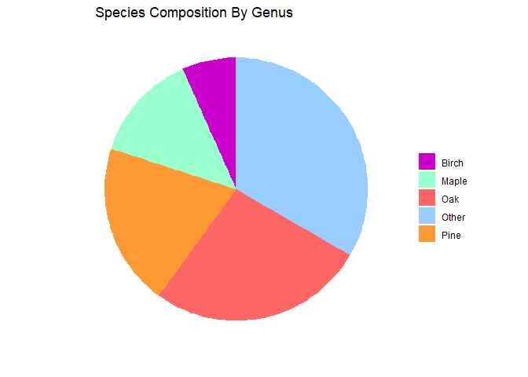 Another measure to look at the landscape was to look at the composition by genus, Oaks are the most common unsurprisingly, followed by pines, maples, and birch.

The Nine ecoregions we determined

     * Amphibolite Mountains
     
     * South Metasedimentary Mountains
     
     * High Mountains 
     * Eastern Blue Ridge
     
     * Southern Sedimentary Ridges
     
     * Limestone Valleys and Coves
     
     * Southern Crystalline Ridges and Mountains
     . 
     * Broad Basins
     
     * New River Plateau 

Next, we looked at each of the ecoregions to see what species may be locally dominant but not landscape dominant

#### Amphibolite Mountains

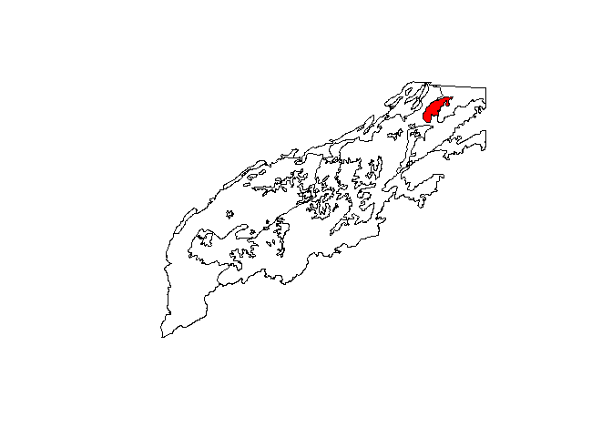

The Amphibolite Mountains are mountainous terrain, with amphibolite substrate which provides a neutralizing capacity creating edaphic species combinations.

The most predominant species in the Amphibolie mountains is Tulip poplar(621), followed by red maple (621), chestnut oak (832), black locust (901), red oak (833) and sugar maple (651).

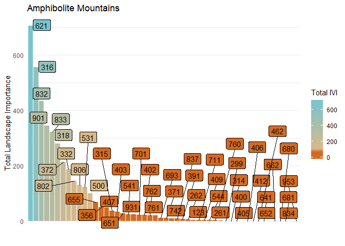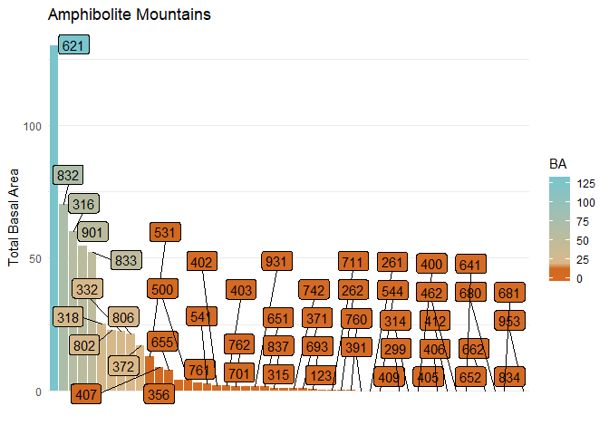

#### Southern Metasedimentary Mountains

The majority of the Blue Ridge province, shaley and less firtle soils. The dominant species throughout this area are chestnut oak(832), red maple (316) ,tulip poplar(621),Virginia pine (132),white pine(129), and sourwood (711)

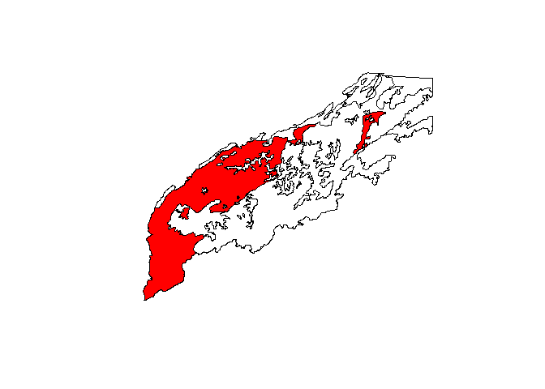

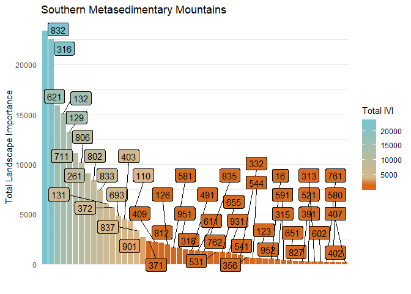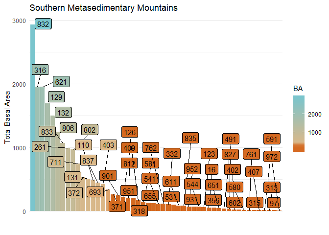 \#\#\#\# High Mountains

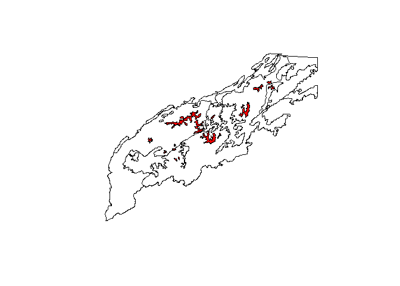

At the highest elevations of the Appalachians, spruce-fir forests and high elevation red oak forests are common. The most common species is red spruce(97) followed by yellow birch(371) American beech(531), red oak(833), red maple(316), sugar maple(318), and eastern hemlock (261).

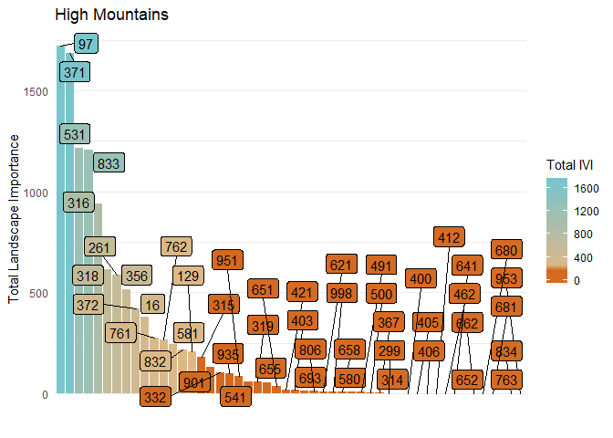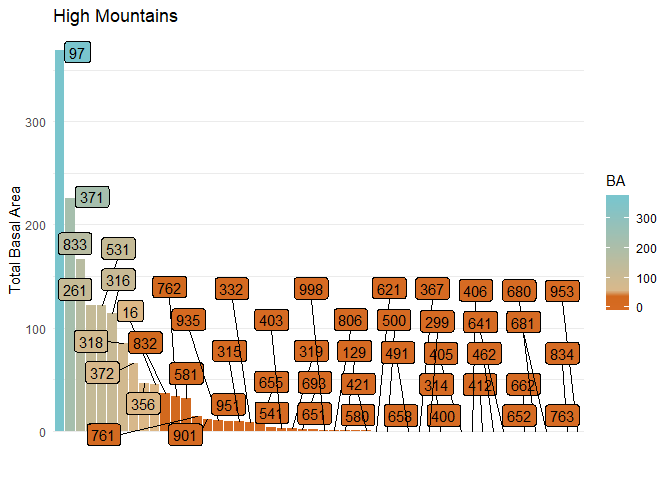

#### Eastern Blue Ridge Foothills

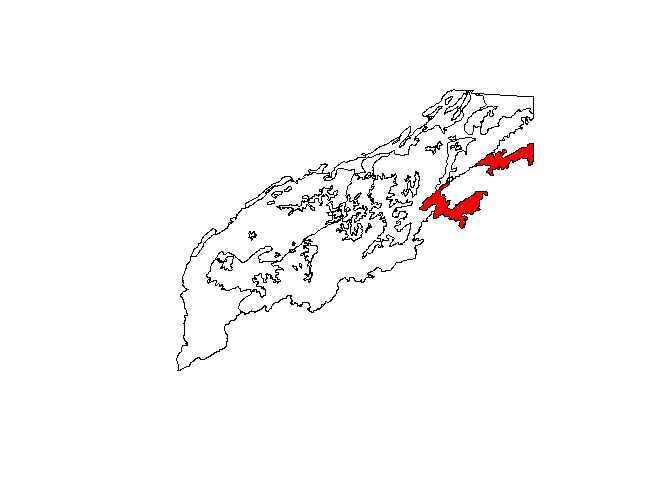

The eastern foothills most dominant species is Yellow Poplar (621), followed by chestnut oak (832), red maple(316), Pinus virginiana(132), sourwood (711), White pine(129), white oak (802), black gum (693).

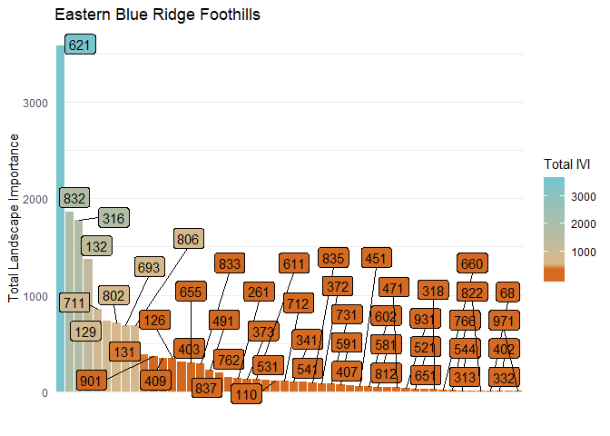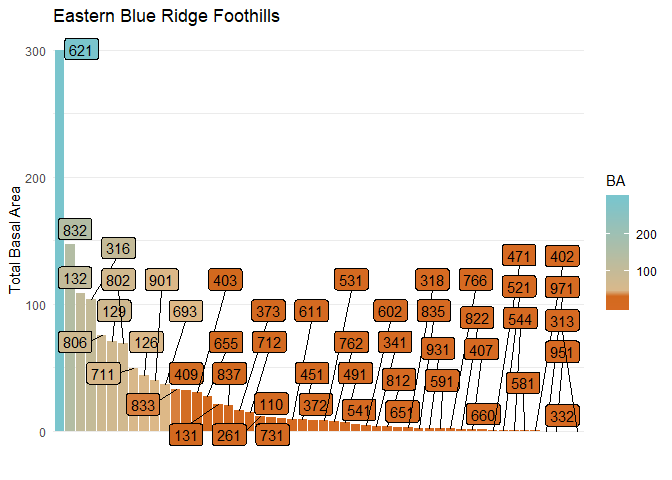

#### Southern Sedimentary Ridges

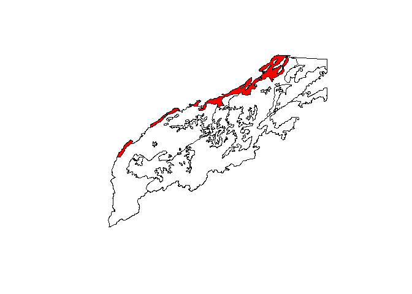

The eastern foothills most dominant species is chestnut oak (832), followed by red maple(316), yellow poplar (621), sourwood (711), white pine(129), Eastern hemlock (261) Pinus virginiana(132), red oak.

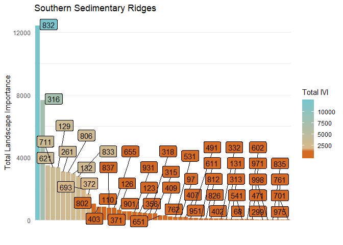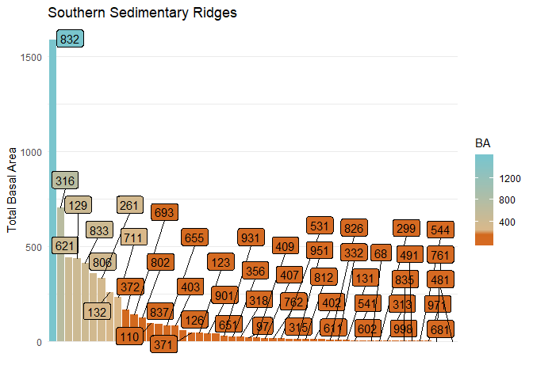

#### LimeStone Valleys and Coves

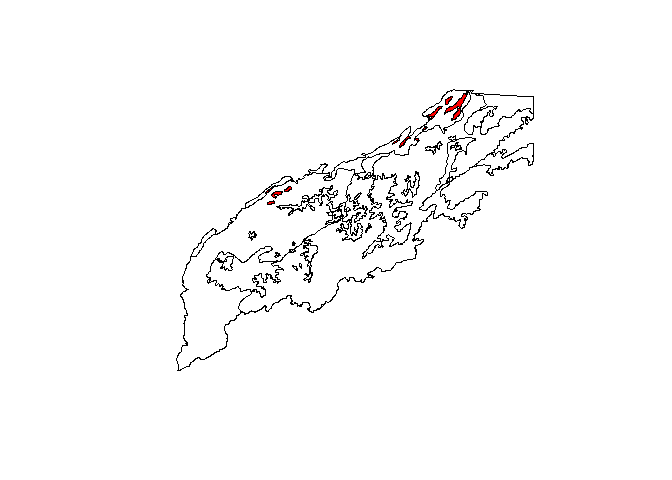

The major species in Limestone valleys and coves, chestnut oak (832), tulip poplar(621), Sycamore (731), red maple (316), scarlet oak (806), black oak (837), American basswood(951).

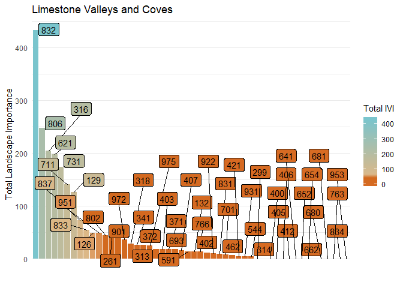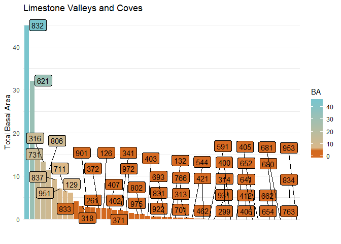

#### Southern Crystalline Ridges and Mountians

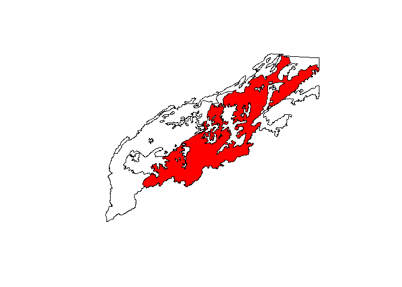

The major species are chestnut oak (832), tulip poplar(621), red maple(316), white pine(129), sourwood(711), and scarlet oak(806). This ecoregion also picks up some of the piedmont's pines shortleaf pine and loblolly pine.

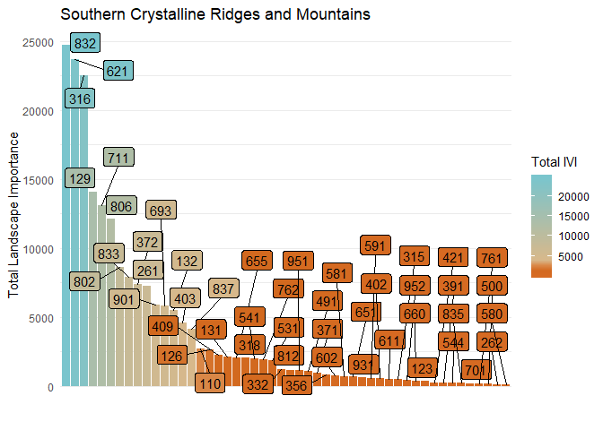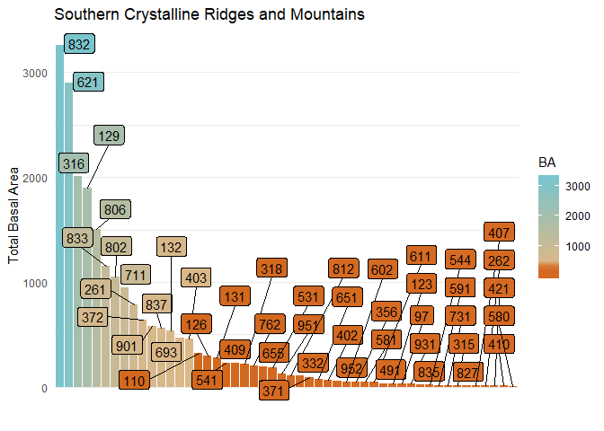 \#\#\#\# Broad Basins

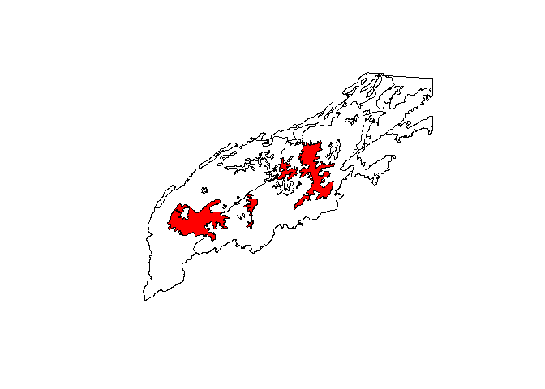

Broad basins most common species are Tulip poplar (621), red maple (316), eastern white pine (129), sourwood (711), Virginia pine, white oak(802), southern red oak( 812), scarlet oak (806), and black oak (832).

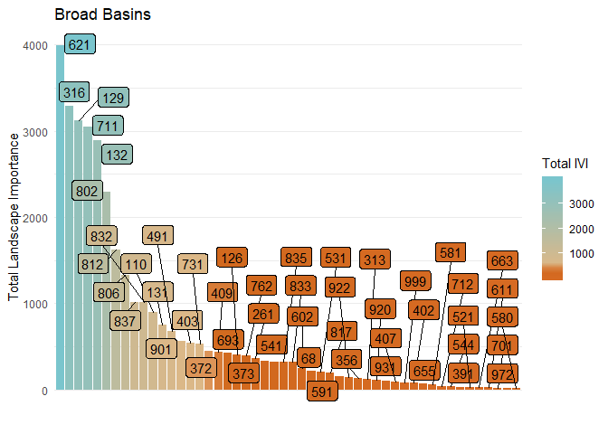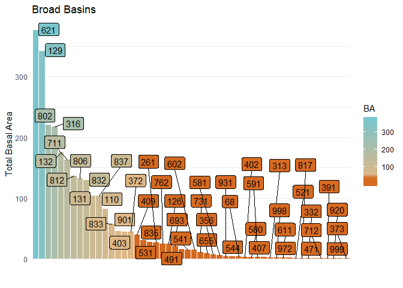

#### New River Plateu

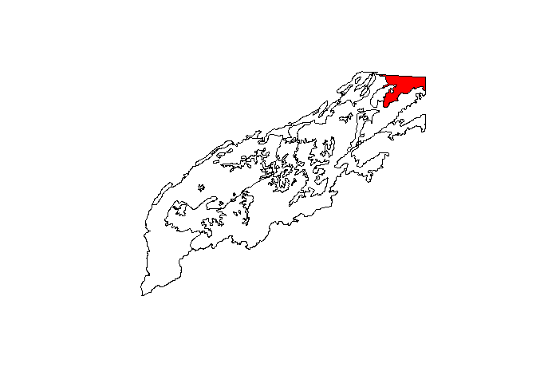

The Northernmost part of the southern Appalachians. Eastern white pine is the most dominant followed by black birch(372), red maple(316), black locust(901), tulip poplar(621), and scarlet oak (806).

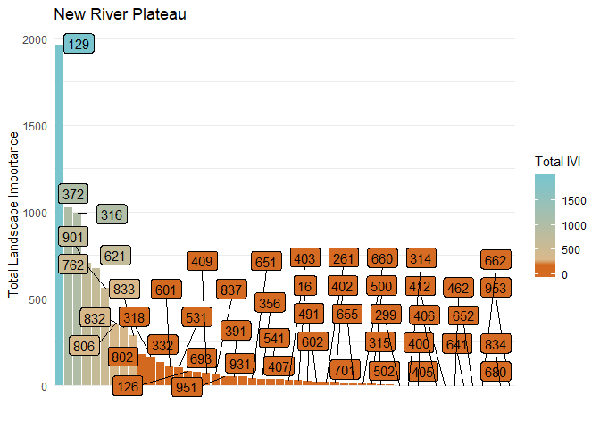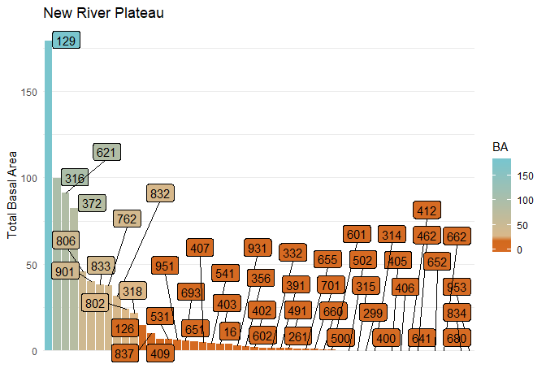

#### Appendix

##### Species Names and FS numbers

| Forest Service Number | Sum of IVI |                    Species Name                    |
|:---------------------:|:----------:|:--------------------------------------------------:|
|          832          | 64803.7074 |                   Qurecus prinus                   |
|          316          | 60477.8516 |                     Acer Rubrum                    |
|          621          | 52185.8572 |               Liriodendron tulipifera              |
|          129          | 36846.3403 |                    Pinus strobus                   |
|          711          | 31678.5366 |                 Oxydendrum arboreum                |
|          806          | 28125.3486 |                  Quercus coccinea                  |
|          132          | 27871.4204 |                  Pinus Virginiana                  |
|          802          | 21430.8766 |                    Quercus alba                    |
|          833          | 20595.5473 |                    Quercus rubra                   |
|          261          | 20548.2840 |                  Tsuga Canadenesis                 |
|          372          | 16965.0845 |                    Betula lenta                    |
|          693          | 13943.2769 |              Nyssa sylvatice(blackgum)             |
|          901          | 11256.4078 |         Robinia pseudoacica (black locust)         |
|          403          | 10912.2079 |            Carta glabra (Pignut hickory)           |
|          837          |  9620.9004 |                  Quercus veluntina                 |
|          131          |  9460.5311 |                     Pinus taeda                    |
|          110          |  8922.1150 |                   Pinus echinata                   |
|          126          |  6134.8899 |                    Pinus rigida                    |
|          409          |  5620.6053 |            Carya alba(mockernut hickory)           |
|          371          |  5570.4549 |                Betula alleghaniensis               |
|          531          |  5078.0836 |                  fagus grandifolia                 |
|          812          |  5072.1741 |                   Quercus falcata                  |
|          318          |  5034.0687 |                   Acer saccharum                   |
|          762          |  4886.9212 |                   Prunus serotina                  |
|          655          |  4596.8727 |                Magnolia macrophylla                |
|          541          |  3608.8314 |                 Fraxinus americana                 |
|          491          |  3586.0493 |                   Cornus florida                   |
|          951          |  3079.8722 |         Tilia americana (American Basswood)        |
|          581          |  2728.8609 |        Halesia diptera(Carolina silverbell)        |
|          356          |  2682.4540 |                 Amelanchier arborea                |
|          332          |  2606.4680 |           Aesculus flava(Yellow buckeye)           |
|          931          |  2486.5932 |                  Sassafras.alidum                  |
|           97          |  2138.5384 |                    Picea rubens                    |
|          611          |  2115.9875 |          Liquidamber styraciflua(sweetgum)         |
|          835          |  1968.9992 |             Quercus stellata(post oak)             |
|          315          |  1572.6538 |                 Acer Pensylvanicum                 |
|          651          |  1466.1266 |          Magnolia acuminata(cucumbertree)          |
|          123          |  1444.1156 |         Pinus Pungens(Table Mountain Pine)         |
|          602          |  1393.1051 |            Juglans nigra( Black walnut)            |
|          591          |  1284.9644 |             Ilex opaca (american Holly)            |
|           16          |  992.5191  |                     Fraser fir.                    |
|          952          |  969.8806  | Tilia americana var. heterophylla (white basswood) |
|          402          |  958.5509  |        Carya codiformis (bitternut Hickory)        |
|          731          |  943.9414  |          plantanus ocidentalies(sycamore)          |
|          544          |  907.6703  |          Fraxinus pennsylvanica(green ash)         |
|          407          |  725.5578  |           Carya ovata (shagbark hickory)           |
|          761          |  706.0680  |             Prunus serotina (pin cherry            |
|          391          |  626.5388  |       Carpinus caroliniana(American hornbeam)      |
|          373          |  561.4671  |              Betula nigra(River birch)             |
|          421          |  464.6689  |         Anerucan Chestnut(Castenea dentata)        |
