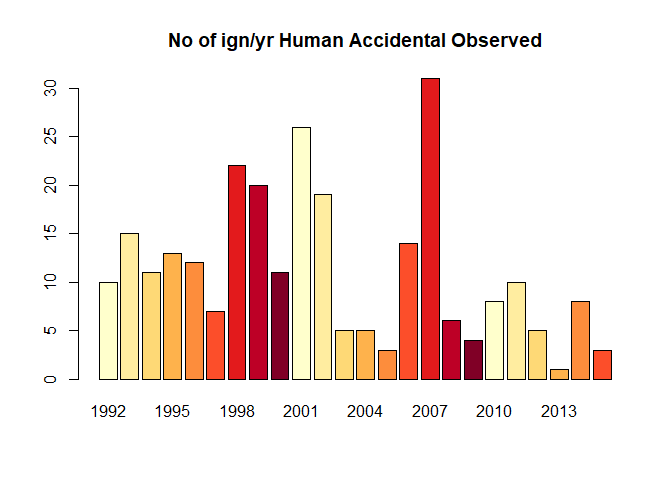
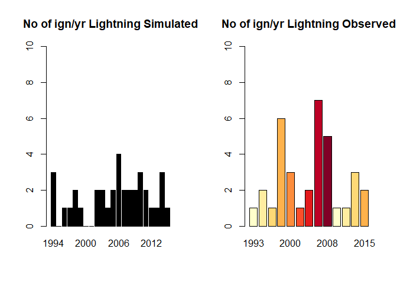
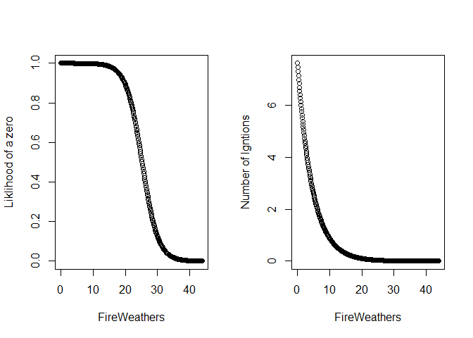
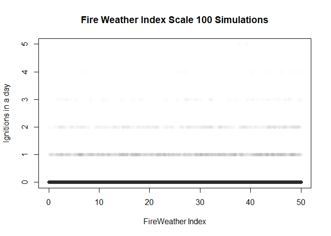
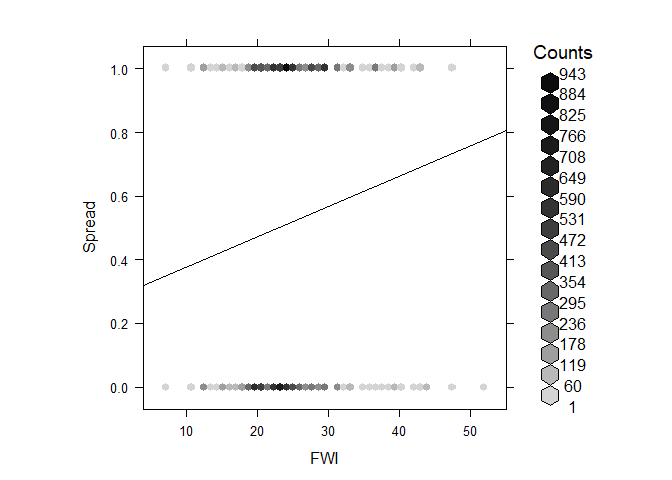

Fire Parameterization
================
Zjrobbin
3/3/2021

Loading in packages

``` r
library(plyr)
library(pscl)
library(sf)
library(sp)
library(raster)
library(geosphere)
library(maptools)
library(raster)
library(dplyr)
library(rgdal)
library(rgeos)
library(geosphere)
library(nplr)
library(pscl)
library(ROCR)
library(likelihood)
library(hexbin)
library(RColorBrewer)
```

# Ignitions

Ignitions were parameterized using the Short ignition database:

Short, K. C. (2017). Spatial wildfire occurrence data for the United
States, 1992-2015 \[FPA\_FOD\_20170508\].

in combination with the fire weather index in the LANDIS-II climate
library (Lucash et al 2017).

Lucash, M. S., Scheller, R. M., Gustafson, E. J., & Sturtevant, B. R.
(2017). Spatial resilience of forested landscapes under climate change
and management. Landscape Ecology, 32(5), 953-969.

The historical climate data used to create this is from gridmet:

Abatzoglou, J. T. (2013). Development of gridded surface meteorological
data for ecological applications and modelling. International Journal of
Climatology, 33(1), 121-131.

A zero-inflated model of the likelihood of each ignition type is then
fit to the daily fire weather index.

``` r
fix<-function(x){return(as.numeric(as.character(x)))}
## Load in 
w_dir<-"C:/Users/zacha/Desktop/Sapps_DM_paper/"
## Georgia Shapefile
CNF<-st_read("C:/Users/zacha/Desktop/Sapps_DM_paper/Georgia.shp")
```

    ## Reading layer `Georgia' from data source `C:\Users\zacha\Desktop\Sapps_DM_paper\Georgia.shp' using driver `ESRI Shapefile'
    ## Simple feature collection with 1 feature and 14 fields
    ## geometry type:  POLYGON
    ## dimension:      XY
    ## bbox:           xmin: 79536.62 ymin: 3358689 xmax: 520501.5 ymax: 3881045
    ## projected CRS:  NAD83 / UTM zone 17N

``` r
### These are the short ligthning ignitions for the larger SApps landscape
l_fire_dat <- read.csv(paste(w_dir,"Inputs/FiresInAppsLightning2.csv", sep=""))
colnames(l_fire_dat)
```

    ## [1] "X"           "FIRE_YEAR"   "DISCOVER_1"  "STAT_CAU_1"  "CONT_DATE"  
    ## [6] "FIRE_SIZE"   "LATITUDE"    "LONGITUDE"   "Coordinates"

``` r
##UTM11<-Plot_locations[Plot_locations$UTM.Zone==('11S'),]

## Get the lat and lon
xy <-l_fire_dat[,c("LONGITUDE","LATITUDE")]
## Create spatial points then transform it to shape file then performa and intersection with 
## georgia shapefile
Spati <- SpatialPointsDataFrame(coords = xy, data = l_fire_dat,
                               proj4string = CRS("+proj=longlat +ellps=WGS84 +datum=WGS84 +no_defs "))%>%
  spTransform(projection(CNF))%>%
  as("sf")
Int<-st_intersection(Spati,CNF)
```

    ## Warning: attribute variables are assumed to be spatially constant throughout all
    ## geometries

``` r
### Show the location 
plot(CNF$geometry,xlim=c(100000,400000),ylim=c(3700000,3900000),
     main="Lightning ignitions 1992-2016")
plot(Int$geometry,add=T,col="red")
```

<!-- -->

### Lightning

We filtered ignitions that resulted in fires larger than one cell size
(6.25 ha).

``` r
l_fire_dat <- Int
### Just sites that are larger than 6.25 ha 
l_fire_dat<-l_fire_dat%>%
  subset(FIRE_SIZE>15.44)
##This moves us from 676 to 155 ignitions
## set up as dataframe
l_fire_days <- as.data.frame(cbind(l_fire_dat$FIRE_YEAR, l_fire_dat$DISCOVER_1)) #Extracting year and julian day
colnames(l_fire_days) <- c("YEAR", "J_DAY")
l_fire_days_sort <- l_fire_days[order(l_fire_days[,1]),] #sorting by year
```

``` r
library(RColorBrewer)
### Here we ara plotting the number of fires
red<-RColorBrewer::brewer.pal(9,'YlOrRd')
#plot no of fires/yr
l_fire_days_sort_count<- cbind(l_fire_days_sort, rep(1, nrow(l_fire_days_sort)))
l_fires_count <- cbind.data.frame(unique(l_fire_days_sort_count$YEAR) , 
                                 tapply(l_fire_days_sort_count$`rep(1, nrow(l_fire_days_sort))`,l_fire_days_sort_count$YEAR, sum))
colnames(l_fires_count) <- c("YEAR", "COUNT")

barplot(l_fires_count$COUNT, main ="No of ign/yr Lightning Observed",col=red,names.arg=l_fires_count$YEAR)
```

<!-- -->

``` r
### Repeat with ln 48-100 with human ignitions
h_fire_dat <- read.csv(paste(w_dir, "Inputs/FiresInAppsHuman2.csv", sep=""))
xy <-h_fire_dat [,c("LONGITUDE","LATITUDE")]
Spati <- SpatialPointsDataFrame(coords = xy, data = h_fire_dat ,
                               proj4string = CRS("+proj=longlat +ellps=WGS84 +datum=WGS84 +no_defs "))%>%
  spTransform(projection(CNF))%>%
  as("sf")
Int<-st_intersection(Spati,CNF)
```

    ## Warning: attribute variables are assumed to be spatially constant throughout all
    ## geometries

``` r
plot(CNF$geometry,xlim=c(100000,400000),ylim=c(3700000,3900000),
     main="Human ignitions 1992-2016")
plot(Int$geometry,add=T,col="red")
```

<!-- -->

``` r
h_fire_dat <-Int
h_fire_dat<-h_fire_dat%>%
  subset(FIRE_SIZE>15.44)

##Goes from 24789 to 1531
#head(h.fire.dat)
h_fire_days <- as.data.frame(cbind(h_fire_dat$FIRE_YEAR, h_fire_dat$DISCOVER_1)) #Extracting year and julian day
colnames(h_fire_days) <- c("YEAR", "J_DAY")
h_fire_days_sort <- h_fire_days[order(h_fire_days[,1]),] #sorting by year
#plot no of fires/yr
h_fire_days_sort_count<- cbind(h_fire_days_sort, rep(1, nrow(h_fire_days_sort)))
h_fires_count <- cbind.data.frame(unique(h_fire_days_sort_count$YEAR) , 
                                  tapply(h_fire_days_sort_count$`rep(1, nrow(h_fire_days_sort))`,h_fire_days_sort_count$YEAR, sum))
colnames(h_fires_count) <- c("YEAR", "COUNT")
barplot(h_fires_count$COUNT, main ="No of ign/yr Human Accidental Observed",col=red,names.arg=h_fires_count$YEAR)
```

<!-- -->

``` r
ign_types <- c("Lightning", "HumanAccidental")

fire_days_list <- list(l_fire_days_sort, h_fire_days_sort) ##organizing all ignition types into a list


##Import daily historic FWI data
FWI_dat <- read.csv(paste0(w_dir,"Inputs/GA_Climate.csv"))
FWI_dat<-with(FWI_dat,aggregate(FWI,by=list(Year=Year,Timestep=Timestep),FUN=mean))
### organizing the climate and ignition data 

#l_fires_count$
colnames(FWI_dat) <-c("Year","Timestep","FWI")
#colnames(FWI_dat)[3]<-"FWI"
FWI_dat$ID <- paste(FWI_dat$Year, "_", FWI_dat$Timestep, sep="") #creating date identifier out of date and julian day
FWI_dat$Dates<-as.Date(FWI_dat$Timestep, origin=as.Date(paste0(FWI_dat$Year,"-01-01")))
fire_days_count <- ddply(l_fire_days_sort, .(l_fire_days_sort$YEAR, l_fire_days_sort$J_DAY), nrow) #
fire_days_count$Date<-as.Date(fire_days_count$`l_fire_days_sort$J_DAY`,origin=as.Date(paste0(fire_days_count$`l_fire_days_sort$YEAR`,"-01-01")))
```

``` r
### This loop goes through and combines the FWI and ignitions data. 

igns_list <- list()

for (i in 1:length(ign_types[1:2])){#THIS DOESN'T INCLUDE RX BURNS BUT THATS CAUSE WE ARE PROVIDING THOSE TO SCRAPPLE DIRECT
  ign_type_select <- fire_days_list[[i]] ##selecting each ignition type individually
  fire_days_count <- ddply(ign_type_select, .(ign_type_select[,1], ign_type_select[,2]), nrow) #finds duplicate rows in fire data
  fire_days_count$Dates<-as.Date(fire_days_count[,2],origin=as.Date(paste0(fire_days_count[,1],"-01-01")))
  ##Merging dataframes by year and julian day
  fire_days_short <- subset(fire_days_count, fire_days_count[,1] > 1993 & fire_days_count[,1] < 2016) ##restricting fire records to climate file years
  FWI_short <- subset(FWI_dat, FWI_dat$Year > 1993 & FWI_dat$Year < 2016) #restricting climate data to fire history records
  
  FWI_fire_merge <- join(FWI_short, fire_days_short, by="Dates",type="left") ##Merging based on unique date id
  FWI_fire_number <- FWI_fire_merge[,c(1,3,8)] #pulling out FWI and number of fires
  FWI_fire_number[is.na(FWI_fire_number)] <- 0 #converting NAs to 0, meaning 0 fires
  #par(mfrow=c(1,1))
 # plot(FWI_fire_number[,2], FWI_fire_number[,3], main =ign_types[i], xlab = "dailyFWI", ylab = "noFires",cex=2.0) #plotting FWI against no of fires just to look at pattern
  igns_list[[i]] <- FWI_fire_number 
}
```

### Lightning

``` r
### Get the lightning data 
Lightning<-as.data.frame(igns_list[[1]])
colnames(Lightning)[3]<-"No_FIRES"
### Look at the linear relationship 
summary(lm(Lightning$No_FIRES~Lightning$FWI))
```

    ## 
    ## Call:
    ## lm(formula = Lightning$No_FIRES ~ Lightning$FWI)
    ## 
    ## Residuals:
    ##      Min       1Q   Median       3Q      Max 
    ## -0.01875 -0.00641 -0.00438 -0.00181  2.99408 
    ## 
    ## Coefficients:
    ##                 Estimate Std. Error t value Pr(>|t|)    
    ## (Intercept)   -0.0030925  0.0020394  -1.516    0.129    
    ## Lightning$FWI  0.0005824  0.0001476   3.945 8.05e-05 ***
    ## ---
    ## Signif. codes:  0 '***' 0.001 '**' 0.01 '*' 0.05 '.' 0.1 ' ' 1
    ## 
    ## Residual standard error: 0.0755 on 8028 degrees of freedom
    ## Multiple R-squared:  0.001935,   Adjusted R-squared:  0.00181 
    ## F-statistic: 15.56 on 1 and 8028 DF,  p-value: 8.051e-05

``` r
## Fit the zero inflated model 
zeroinf_mod <- zeroinfl(as.numeric(No_FIRES)~as.numeric(FWI),data=Lightning, dist="poisson")
## See the summary of that model 
summary(zeroinf_mod)
```

    ## 
    ## Call:
    ## zeroinfl(formula = as.numeric(No_FIRES) ~ as.numeric(FWI), data = Lightning, 
    ##     dist = "poisson")
    ## 
    ## Pearson residuals:
    ##      Min       1Q   Median       3Q      Max 
    ## -0.12623 -0.06901 -0.04564 -0.02442 37.70623 
    ## 
    ## Count model coefficients (poisson with log link):
    ##                 Estimate Std. Error z value Pr(>|z|)    
    ## (Intercept)      2.02999    0.86284   2.353   0.0186 *  
    ## as.numeric(FWI) -0.21642    0.05499  -3.936  8.3e-05 ***
    ## 
    ## Zero-inflation model coefficients (binomial with logit link):
    ##                 Estimate Std. Error z value Pr(>|z|)    
    ## (Intercept)     10.24538    1.28792   7.955 1.79e-15 ***
    ## as.numeric(FWI) -0.40606    0.09149  -4.438 9.06e-06 ***
    ## ---
    ## Signif. codes:  0 '***' 0.001 '**' 0.01 '*' 0.05 '.' 0.1 ' ' 1 
    ## 
    ## Number of iterations in BFGS optimization: 14 
    ## Log-likelihood: -191.7 on 4 Df

``` r
### Create a predictive model from the zero inflated model 
zero<-predict(zeroinf_mod,data.frame(FWI=Lightning$FWI), type = "zero")
lambda <- predict(zeroinf_mod,data.frame(FWI=Lightning$FWI), type = "count")
Simulation<-ifelse(rbinom(8030,size = 1, prob = zero) > 0, 0, rpois(8030, lambda = lambda))
### Aggregate by year to compare
ReturnDf<-cbind(Simulation,Lightning)
Sample<-aggregate(ReturnDf$Simulation,by=list(year=ReturnDf$Year),FUN=sum)

## Look at yearly comparison 
par(mfrow=c(1,2))
barplot(Sample$x, main ="No of ign/yr Lightning Simulated",col='black', ylim=c(0,10),names.arg=Sample$year)

barplot(l_fires_count$COUNT, main ="No of ign/yr Lightning Observed",col=red,ylim=c(0,10),names.arg=l_fires_count$YEAR)
```

<!-- -->

``` r
### This chunk simulates man models to look at the overall trend in FWI and N ignitions
FireWeathers<-seq(0,44,.1)
par(mfrow=c(1,2))
zeros<-predict(zeroinf_mod,data.frame(FWI=FireWeathers), type = "zero")
plot(FireWeathers,zeros,ylab="Liklihood of a zero")
lambda <- predict(zeroinf_mod,data.frame(FWI=FireWeathers), type = "count")
plot(FireWeathers,lambda,ylab="Number of Igntions")
```

<!-- -->

``` r
par(mfrow=c(1,1))
FireWeathers<-rep(seq(0,50,.1),100)
lambda <- predict(zeroinf_mod,data.frame(FWI=FireWeathers), type = "count")
zeros<-predict(zeroinf_mod,data.frame(FWI=FireWeathers), type = "zero")
Simulation<-ifelse(rbinom(50100,size = 1, prob = zeros) > 0, 0, rpois(50100, lambda = lambda))
plot(FireWeathers,Simulation,col=adjustcolor("black",alpha.f = .01),pch=19,ylab=("Ignitions in a day"),xlab="FireWeather Index",
     main="Fire Weather Index Scale 100 Simulations")
```

<!-- -->

### Accidental

``` r
## Get just the accidnetal data 
Accidental<-as.data.frame(igns_list[[2]])
colnames(Accidental)[3]<-"No_FIRES"

#summary(lm(Accidental$No_FIRES~Accidental$FWI))
## Fit a zero inflated model to the data. 
Acc_zeroinf_mod <- zeroinfl(No_FIRES~FWI,data=Accidental, dist="poisson")
## See a summary of that model 
summary(Acc_zeroinf_mod)
```

    ## 
    ## Call:
    ## zeroinfl(formula = No_FIRES ~ FWI, data = Accidental, dist = "poisson")
    ## 
    ## Pearson residuals:
    ##     Min      1Q  Median      3Q     Max 
    ## -0.1636 -0.1481 -0.1455 -0.1421 20.5314 
    ## 
    ## Count model coefficients (poisson with log link):
    ##             Estimate Std. Error z value Pr(>|z|)   
    ## (Intercept) -0.94748    0.31055  -3.051  0.00228 **
    ## FWI          0.01392    0.02044   0.681  0.49577   
    ## 
    ## Zero-inflation model coefficients (binomial with logit link):
    ##               Estimate Std. Error z value Pr(>|z|)    
    ## (Intercept)  2.6605450  0.3217303   8.269   <2e-16 ***
    ## FWI         -0.0002711  0.0214416  -0.013     0.99    
    ## ---
    ## Signif. codes:  0 '***' 0.001 '**' 0.01 '*' 0.05 '.' 0.1 ' ' 1 
    ## 
    ## Number of iterations in BFGS optimization: 13 
    ## Log-likelihood: -1041 on 4 Df

``` r
### Create a predictive model based on fwi 
zero<-predict(Acc_zeroinf_mod,data.frame(FWI=Accidental$FWI), type = "zero")

lambda <- predict(Acc_zeroinf_mod,data.frame(FWI=Accidental$FWI), type = "count")
Simulation<-ifelse(rbinom(8030,size = 1, prob = zero) > 0, 0, rpois(8030, lambda = lambda))
ReturnDf<-cbind(Simulation,Lightning)
### Aggregate annually to compare outputs. 
Sample<-aggregate(ReturnDf$Simulation,by=list(year=ReturnDf$Year),FUN=sum)
par(mfrow=c(1,2))
barplot(Sample$x, main ="No of ign/yr Accidental_Simulated",col='black', ylim=c(0,50),names.arg=Sample$year)

barplot(h_fires_count$COUNT, main ="No of ign/yr Human Accidental Observed",col=red,ylim=c(0,50),names.arg=h_fires_count$YEAR)
```

<!-- -->

``` r
### Same as ln 210-223 above
FireWeathers<-seq(0,50,.1)
par(mfrow=c(1,2))
zeros<-predict(Acc_zeroinf_mod,data.frame(FWI=FireWeathers), type = "zero")
plot(FireWeathers,zeros,ylab="Liklihood of a zero",ylim=c(0,1))
lambda <- predict(Acc_zeroinf_mod,data.frame(FWI=FireWeathers), type = "count")
plot(FireWeathers,lambda,ylab="Number of Igntions")
```

<!-- -->

``` r
par(mfrow=c(1,1))
FireWeathers<-rep(seq(0,50,.1),100)
lambda <- predict(Acc_zeroinf_mod,data.frame(FWI=FireWeathers), type = "count")
zeros<-predict(Acc_zeroinf_mod,data.frame(FWI=FireWeathers), type = "zero")

Simulation<-ifelse(rbinom(50100,size = 1, prob = zeros) > 0, 0, rpois(50100, lambda = lambda))
plot(FireWeathers,Simulation,col=adjustcolor("black",alpha.f = .01),pch=19,ylab=("Ignitions in a day"),xlab="FireWeather Index",
     main="Fire Weather Index Scale 100 Simulations")
```

<!-- -->

# Fire Spread

``` r
w_dir <- "C:/Users/zacha/Desktop/Truncated_Scrapple/Inputs/"
out_dir <-  "C:/Users/zacha/Desktop/Truncated_Scrapple/Outputs/"
```

Here we are looking to fit a binomial model as to how probability of
spread is related to the FWI, wind, and fuels.

For this we have wind data and Fire weather index data located to
climate regions in LANDIS-II This is Gridmet data from the University of
Idaho <http://www.climatologylab.org/gridmet.html>
[meta](https://cida.usgs.gov/thredds/dodsC/UofIMETDATA.html)

The ecoregion map is used to locate the windspeed and the fwi data for
each time step.

``` r
fwi_dat <- read.csv(paste0(w_dir,"11_Eco_Climate.csv"),stringsAsFactors = FALSE)
wind_map<- raster::raster(paste(w_dir,"11_Ecoregions.tif",sep=""))
```

    ## Warning in showSRID(uprojargs, format = "PROJ", multiline = "NO"): Discarded datum Unknown based on GRS80 ellipsoid in CRS definition,
    ##  but +towgs84= values preserved

``` r
wsv_dat <- read.csv(paste(w_dir,"Wind_1028.csv",sep=""),stringsAsFactors = FALSE)

colnames(wsv_dat) <- c("date", "eco1", 'eco2', 'eco3', 'eco4','eco5','eco6','eco8','eco9','eco10','eco11')

plot(wind_map)
```

<!-- --> We
also have a fuel map representing landscape level fuels for the study
area as well as an uphill azimuth map and a slope map (used to calculate
the direction of spread)

``` r
ExampleRaster<-raster(paste(w_dir,"11_Ecoregions.tif",sep=""))
```

    ## Warning in showSRID(uprojargs, format = "PROJ", multiline = "NO"): Discarded datum Unknown based on GRS80 ellipsoid in CRS definition,
    ##  but +towgs84= values preserved

``` r
projy<-crs(ExampleRaster)

### This is the landis-II fuel imput for timestep 10
fccs_raster<-raster(paste(w_dir,"Fuel_129.IMG",sep=""))
#plot(fccs_raster)
crs(fccs_raster)<-projy
extent(fccs_raster)<-extent(ExampleRaster)
plot(fccs_raster)
```

<!-- -->

Given the sites that are turned off on the LANDIS-II map, we
interpolated between simulated fuel values to get an even coverage of
fuels.

``` r
r=fccs_raster
r[r==0] <- NA

fill.na <- function(x, i=5) {
  if( is.na(x)[i] ) {
    return( round(mean(x, na.rm=TRUE),0) )
  } else {
    return( round(x[i],0) )
  }
}  

r2 <- focal(r, w = matrix(1,3,3), fun = fill.na, 
            pad = TRUE, na.rm = FALSE )
plot(r2)
r3<-focal(r2, w = matrix(1,3,3), fun = fill.na, 
            pad = TRUE, na.rm = FALSE )

plot(r3)

r4<-focal(r3, w = matrix(1,3,3), fun = fill.na, 
            pad = TRUE, na.rm = FALSE )

plot(r4)
fuel_map<-r4

plot(fuel_map)
writeRaster(fuel_map,paste0(w_dir,"Interpolated_FuelMap.tif"))
```

``` r
fuel_map<-raster(paste0(w_dir,"Interpolated_FuelMap.tif"))
```

    ## Warning in showSRID(uprojargs, format = "PROJ", multiline = "NO"): Discarded datum Unknown based on GRS80 ellipsoid in CRS definition,
    ##  but +towgs84= values preserved

``` r
uphill_azi_map<- raster(paste(w_dir,"SAPPS_aspect_inverted_atModelRes.tif",sep=""))
```

    ## Warning in showSRID(uprojargs, format = "PROJ", multiline = "NO"): Discarded datum Unknown based on GRS80 ellipsoid in CRS definition,
    ##  but +towgs84= values preserved

``` r
#uphill_azi_map <- projectRaster(slope_azi_map, to = fuel_map, method='bilinear')
slope_map <-  raster(paste(w_dir,"SAPPS_Slope_ChrisArcmapprocess_modelres.tif",sep=""))
```

    ## Warning in showSRID(uprojargs, format = "PROJ", multiline = "NO"): Discarded datum Unknown based on GRS80 ellipsoid in CRS definition,
    ##  but +towgs84= values preserved

``` r
#
climate_stack <- stack(wind_map, fuel_map, uphill_azi_map, slope_map)
plot(climate_stack)
```

<!-- -->

``` r
#Empty objects and column names and stuff used in loops
newfire<-readOGR(paste(w_dir,"fire_geomac_loc.shp",sep=""))
```

    ## OGR data source with driver: ESRI Shapefile 
    ## Source: "C:\Users\zacha\Desktop\Truncated_Scrapple\Inputs\fire_geomac_loc.shp", layer: "fire_geomac_loc"
    ## with 591 features
    ## It has 64 fields
    ## Integer64 fields read as strings:  OBJECTID fireyear

``` r
## Putting into sets based on differnces in meta-data (columns not matched)
newfire1<-newfire[newfire$incidentna!=0,]
newfire2<-newfire[newfire$incidentna==0,]
newfire_df<-data.frame(newfire)
perimeter_map<-newfire
### Here we are cleaning the data
perimeter_map$TrueDate<-as.Date(perimeter_map$perimeterd)
perimeter_map$TrueDate[is.na(perimeter_map$TrueDate)]<-as.Date(perimeter_map$date_[is.na(perimeter_map$TrueDate)])
### Subseting to our time period of climate coverage (< 2017)
perimeter_map<-perimeter_map[perimeter_map$TrueDate<"2017-01-01",]
perimeter_map$incidentna[perimeter_map$incidentna=='0']<-perimeter_map$fire_name[perimeter_map$incidentna=='0']
perimeter_map$incidentna[perimeter_map$incidentna==0]<-perimeter_map$fire_name[perimeter_map$incidentna==0]

DFP<-as.data.frame(perimeter_map)

fire_names<-as.character(perimeter_map$incidentna)
## Here we plot the shapefiles to see that they overlap
###Climate regions
plot(ExampleRaster)
plot(newfire,add=TRUE)
```

<!-- -->

``` r
plot(fuel_map)
plot(newfire,add=TRUE)
```

<!-- -->

### Here is the processing of the Grimet data

``` r
fwi_dat_slim <- fwi_dat[,c(1,2,3,22)]
colnames(fwi_dat)
```

    ##  [1] "Year"                 "Timestep"             "EcoregionName"       
    ##  [4] "EcoregionIndex"       "ppt"                  "min_airtemp"         
    ##  [7] "max_airtemp"          "std_ppt"              "std_temp"            
    ## [10] "winddirection"        "windspeed"            "ndeposition"         
    ## [13] "co2"                  "relativehumidity"     "min_relativehumidity"
    ## [16] "max_relativehumidity" "specifichumidty"      "par"                 
    ## [19] "ozone"                "shortwave"            "temperature"         
    ## [22] "FWI"                  "X"

``` r
fwi_date_info <- with(fwi_dat_slim, paste(Year, Timestep))
fwi_dates <- strptime(fwi_date_info, "%Y %j") #COnverting from julian day to y-m-d
#unique(fwi_date_dat$EcoregionName)
fwi_date_dat <- cbind(as.POSIXct(fwi_dates), fwi_dat_slim[,3:4]) #attaching 
colnames(fwi_date_dat) <- c("Date", "Ecoregion", "FWI")
fwi_date_dat$Ecoregion<-gsub("eco","",fwi_date_dat$Ecoregion)
fwi_date_dat$Ecoregion<-as.numeric(as.character(fwi_date_dat$Ecoregion))
```

We then visually filtered the fires. Looking for fires that are not just
the final burn shape.

``` r
 #  years <- 1992:2017
 #  library(raster)
 #  climate_day_mat <- NULL
 # # One_fire <- newfire[newfire$incidentna,] #This pulls out all fire names
 #  
 #  ##Select for fires that lasted more than 1 day
 #  fire_names_manydays <- unique(fire_names[duplicated(fire_names)])
 #  fire_names_manydays <- fire_names_manydays[!is.na(fire_names_manydays)] ##Remo
 #  for (i in 1:length(fire_names_manydays)){
 #    
 #    #fire_select <- perimeter_map[perimeter_map$fire_name == fire_names_manydays[i],] #selecting an individual fire_ doesn't work 7/7 #
 #    #print(fire_names_manydays[i])
 #    fire_select <- subset(perimeter_map, perimeter_map$incidentna ==fire_names_manydays[i])#selecting an individual fire
 #    fire_days <- as.character(sort(unique(fire_select$perimeterd)))
 #  
 #   #print(max)
 #   #print(max[4]) 
 #   #if(is.na(fire_days)){fire_days<-as.character(sort(unique(fire_select$date_)))}
 #    #sorting fire days into chronological order
 #   # print(fire_days)
 #    ##Add a short escape in case fire days <= 1
 #    if(length(fire_days) < 2) next
 #    #par(mfrow=c(3,3))
 #    for(j in 1:(length(fire_days))){
 #    max<-raster::bbox( subset(fire_select, fire_select$perimeterd == max(fire_days)))
 #    fire_day_select <- subset(fire_select, fire_select$perimeterd == fire_days[j])
 #    if(j==1){
 #       plot(fire_day_select,axes=T,main=paste0(fire_day_select$incidentna,"   Day number ",j),xlim=c(max[1],max[3]),ylim=c(max[2],max[4]),col=adjustcolor('red',alpha.f = .01))
 #    }else(
 #    plot(fire_day_select,axes=T,add=T,main=paste0(fire_day_select$incidentna,"   Day number ",j),xlim=c(max[1],max[3]),ylim=c(max[2],max[4]),col=adjustcolor('red',alpha.f = .01)))
 #    #selecting the first fire perim from that date, in case there are multiples
 #    }
 #  }
```

We filtered the fires down to the final fires, based on having more than
one day, and visual progress that appears to be more than mearly the
same shape drawn at differnt times

``` r
SoundInc<-c("BOTELER","Halls Top","SILVER MINE",'Chestnut Knob',"Rough Ridge","DICK'S CREEK",'CLIFFSIDE','Rattlesnake Hollow','MAPLE SPRINGS','Rock Mountain',"OLD ROUGHY",
"KNOB","Quarry Creek","DOBSON 3","CLEAR CREEK","TELLICO","TIMBER RIDGE","East Miller Cove","FEREBEE MEMORIAL","HORTON","CAMP BRANCH","DOBSON KNOB","Wolf Creek","HAPPY VALLEY RIDGE","WHITE CREEK",
"Pinnacle Mountain","PARTY ROCK")

Firesinclude<-perimeter_map$incidentna[perimeter_map$incidentna %in% SoundInc]
```

``` r
years <- 1992:2017
climate_day_mat <- NULL

wsv_dat_df<-as.data.frame(wsv_dat)
##Select for fires that lasted more than 1 day
fire_names_manydays <-fire_names[!duplicated(fire_names)]
fire_names_manydays <- fire_names_manydays[!is.na(fire_names_manydays)] ##Removing potential NAs
fire_names_manydays<- fire_names_manydays[fire_names_manydays %in% SoundInc]

### For each fire for each day. 
for (i in 1:length(fire_names_manydays)){
  #print(fire_names_manydays[i])

  fire_select <- subset(perimeter_map, perimeter_map$incidentna ==fire_names_manydays[i])#selecting an individual fire
  fire_days <- as.character(sort(unique(fire_select$TrueDate)))
  ### Check that there are two days worth of data to look at. 
  if(length(fire_days) < 2) next
  storedcells<-NULL
  dftest<-as.data.frame(fire_select)
   ### This subloop looks through each set of polygons (t, t+1) and finds the last day in which expansion occurs
  ### this will indicate when to tell th algorithim to consider the remaining cells failed spread. 
  
  for(j in 1:(length(fire_days)-1)){
    ## Day t shape
    fire_day_select <- subset(fire_select, fire_select$TrueDate == fire_days[j])# selecting the first day of the fire
    fire_day_select<-fire_day_select[order(fire_day_select$acres),]
    fire_day_select <- fire_day_select[1,] #selecting the first fire perim from that date, in case there are multiples
    ## Day t+1 shape
    fire_day_select_1 <- subset(fire_select, fire_select$TrueDate== fire_days[j+1])# getting day 2 fire perimeter
    fire_day_select_1<-fire_day_select_1[order(fire_day_select_1$acres),]
    fire_day_select_1 <- fire_day_select_1[1,] #selecting the first fire perim from that date, in case there are multiples
    area_expansion <-(area(fire_day_select_1)/4046.86)-(area(fire_day_select)/4046.86)
    if(area_expansion < 30.00){
      next()
      }
    lastday<-j
 
  }
 
  for(j in 1:(length(fire_days)-1)){
 
    Failedvalues<-NA
    Successcells<-NA
    EndFailedvalues<-NA
    #print(paste0("day  ",j))
    ## day t shape
    fire_day_select <- subset(fire_select, fire_select$TrueDate == fire_days[j])# selecting the first day of the fire
    fire_day_select<-fire_day_select[order(fire_day_select$acres),]
    fire_day_select <- fire_day_select[1,] #selecting the first fire perim from that date, in case there are multiples
    ## day t+1 shape
    fire_day_select_1 <- subset(fire_select, fire_select$TrueDate== fire_days[j+1])#getting day 2 fire perimeter
    fire_day_select_1<-fire_day_select_1[order(fire_day_select_1$acres),]
    fire_day_select_1 <- fire_day_select_1[1,] #selecting the first fire perim from that date, in case there are multiples
    ## calculate area of expansion, Area m2 to acres.
    area_expansion <-(area(fire_day_select_1)/4046.86)-(area(fire_day_select)/4046.86)
    ### In this case the spread would be less than one 250m cell in our simulation.
    if(area_expansion < 30.00){
   #   print("next")
      next()
      }
    
    ### Here we associate the wind and fire weather index, and reclassify the 
    ### raster to associate with spread/not spread cells
    wind_today<-wsv_dat_df %>%
      subset(date==gsub("/","-",paste0(fire_days[j],'T00:00:00Z')))
    WindMap<-climate_stack$X11_Ecoregions
    WindTrans=as.matrix(data.frame(was=c(1,2,3,4,5,6,8,9,10,11),
               is=as.numeric(t(wind_today[2:11]))))
    Wind_Reclas<-reclassify(WindMap,WindTrans)
    
    fire_today<-fwi_date_dat%>%
      subset(Date ==gsub("/","-",paste0(fire_days[j],'T00:00:00Z')))%>%
      arrange(Ecoregion)
    FireMap<-climate_stack$X11_Ecoregions
    FireTrans=as.matrix(data.frame(was=c(1,2,3,4,5,6,8,9,10,11),
               is=fire_today$FWI))
    FireWeather<-reclassify(FireMap,FireTrans)  
    End_stack<-stack(climate_stack,FireWeather)
    End_stack<-stack(End_stack,Wind_Reclas)
    
    #Creating vector of fire dates. It doesnt work when I bind them below for some reason 
    date_char <- as.POSIXct(as.character(fire_day_select$TrueDate)) 
    
    ##Extracting climate and fuels variables from raster stack.
    #This will compile a data frame of every cell that fire perimeters touch and whether 
    day1 <- extract(End_stack, fire_day_select, cellnumbers = TRUE, df=TRUE, method="simple")
    
    day2 <- extract(End_stack, fire_day_select_1, cellnumbers = TRUE, df=TRUE, method="simple")
    
    # First find day not in stored, then find adajecnts, remove adjecnets in stored. 
    
    day1cells<-day1$cell[!day1$cell %in% storedcells]
    storedcells<-c(storedcells,day1$cell)
    if( length(day1cells) >0){ 
    adjacentcells1<-adjacent(End_stack,day1cells,directions=4, pairs=TRUE,id=TRUE)
    adjacentcells1<-unique(adjacentcells1[,3])
    adjacentcells1<-adjacentcells1[!adjacentcells1 %in% storedcells]
    }else(adjacentcells1=NA)
    newspread<-day2$cell[!day2$cell %in% storedcells]
    ### Calculate failed spread, areas where spred could occur, but are have not previously been tried. 
    Failedvalues<-data.frame()
    if( length(day1cells) >0){ 
    FailedCells=adjacentcells1[!adjacentcells1 %in% newspread]
    Failedvalues<-as.data.frame(extract(End_stack,adjacentcells1))
    }
    if (nrow(Failedvalues)>0){ Failedvalues$spread_success<-0}
    Successcells<-as.data.frame(extract(End_stack,newspread))
    if (nrow(Successcells)==0){next}
    ### Successful spread gets one 
    Successcells$spread_success<-1
    ### Here if it is the last day of spread, calculate one more days possible spread,
    ### all of which is counted as failed. 
    EndFailedvalues<-data.frame()
    if(j==(lastday)){
    ### Creating the same wind and fire weather index as above. 
    wind_today<-wsv_dat_df %>%
      subset(date==gsub("/","-",paste0(fire_days[j],'T00:00:00Z')))
    WindMap<-climate_stack$X11_Ecoregions
    WindTrans=as.matrix(data.frame(was=c(1,2,3,4,5,6,8,9,10,11),
               is=as.numeric(t(wind_today[2:11]))))
    Wind_Reclas<-reclassify(WindMap,WindTrans)
    
    fire_today<-fwi_date_dat%>%
      subset(Date ==gsub("/","-",paste0(fire_days[j],'T00:00:00Z')))%>%
      arrange(Ecoregion)
    FireMap<-climate_stack$X11_Ecoregions
    FireTrans=as.matrix(data.frame(was=c(1,2,3,4,5,6,8,9,10,11),
               is=fire_today$FWI))
    FireWeather<-reclassify(FireMap,FireTrans)  
    End_stack<-stack(climate_stack,FireWeather)
    End_stack<-stack(End_stack,Wind_Reclas)
    EndCells<-adjacent(End_stack,day2$cell,directions=4, pairs=TRUE,id=TRUE)
    EndCells<-unique(EndCells[,3])
    EndCells<-EndCells[!EndCells %in% storedcells]
    EndFailedvalues<-as.data.frame(extract(End_stack,EndCells))
    EndFailedvalues$spread_success<-0
    }
    ### Adding cells to one dataframe.
    if(nrow(Failedvalues)>0 & nrow(Successcells)>0){
    Dfout<-rbind(Failedvalues,Successcells)}else{Dfout<-Successcells}
    if(nrow(EndFailedvalues)>0){Dfout<-rbind(Dfout,EndFailedvalues) }
    #print(table(Dfout$spread_success))
    Dfout$Area_expansion<-area_expansion
    climate_day_df <- cbind(fire_names_manydays[j],
                                 as.character(date_char),Dfout) #Putting everything into a big dataframe with all climate variables
    climate_day_mat <- rbind.data.frame(climate_day_mat, climate_day_df) #binding individual days to everyother day
  }
  
}
## Save for future analysis
write.csv(climate_day_mat,"Example.csv")
```

``` r
### Cleaning up the dataframe. 
climate_day_mat<-read.csv("Spread_3_3.csv")
climate_day_total<-climate_day_mat[-1]

### Looking at files that have all the nessecary data 
climate_day_total<-climate_day_total[climate_day_total$X11_Ecoregions.1!=0,]
climate_day_complete <- climate_day_total[complete.cases(climate_day_total[2:10]),]

##Attaching a unique ID to each row in case we need it later
climate_day_complete <- cbind(1:nrow(climate_day_complete), climate_day_complete)

##Renaming columns
#climate_day_complete<-climate_day_complete[,-1]
colnames(climate_day_complete) <- c("ID","FireName",  "date", "wind_region", "fuel_number", "uphill_azi", "slope",
                               "FWI","WSPD" , "spread","expansion")
climate_day_complete$expansion<-climate_day_complete$expansion*0.404686 ## To hectares
climate_day_complete$fuel_number<-climate_day_complete$fuel_number/3000
climate_day_complete$fuel_number[climate_day_complete$fuel_number >1.0]<-1.0


U_b <- 5 # This changes based on fire severity. Combustion bounancy.
### Caculating windspeed in direction of spread 
relative_wd <- as.numeric(climate_day_complete$WSPD) - as.numeric(climate_day_complete$uphill_azi)
### Calculating effective wind speed. 
climate_day_complete$effective_wsv <- U_b * ((fix(climate_day_complete$WSPD)/U_b) ^ 2 + 2*(fix(climate_day_complete$WSPD)/U_b) *  
                sin(fix(climate_day_complete$slope)) * cos(relative_wd) + (sin(fix(climate_day_complete$slope))^2)^0.5)

head(climate_day_complete)
```

    ##   ID FireName       date wind_region fuel_number uphill_azi    slope   FWI
    ## 1  1  BOTELER 2016-11-01           1   0.5153333   151.4595 54.83991 22.26
    ## 2  2  BOTELER 2016-11-01           1   0.5476667   145.3944 56.86004 22.26
    ## 3  3  BOTELER 2016-11-01           1   0.5980000   137.9744 53.96480 22.26
    ## 4  4  BOTELER 2016-11-01           1   0.4790000   121.1148 58.76532 22.26
    ## 5  5  BOTELER 2016-11-01           1   0.6153333   142.9772 34.39577 22.26
    ## 6  6  BOTELER 2016-11-01           1   0.5306667   181.8610 38.66940 22.26
    ##       WSPD spread expansion effective_wsv
    ## 1 3.961008      0  197.1839     15.841470
    ## 2 3.961008      0  197.1839      2.247329
    ## 3 3.961008      0  197.1839      7.778363
    ## 4 3.961008      0  197.1839      3.272490
    ## 5 3.961008      0  197.1839      4.844688
    ## 6 3.961008      0  197.1839      4.718093

``` r
hexbinplot(fix(climate_day_complete$spread)~fix(climate_day_complete$FWI),xlab="FWI",ylab="Spread",xbins=50,aspect=1,type="r")
```

<!-- -->

``` r
hexbinplot(fix(climate_day_complete$spread)~fix(climate_day_complete$effective_wsv),xlab="Wind Speed",ylab="Spread",xbins=50,aspect=1,type="r")
```

<!-- -->

``` r
hexbinplot(fix(climate_day_complete$spread)~fix(climate_day_complete$fuel_number),xlab="Fuel number",ylab="Spread",xbins=50,aspect=1,type="r")
```

<!-- -->

``` r
hexbinplot(fix(climate_day_complete$expansion)~fix(climate_day_complete$FWI),xlab="FWI",ylab="Spread",xbins=50,aspect=1,type="r")
```

<!-- -->

``` r
hexbinplot(fix(climate_day_complete$expansion)~fix(climate_day_complete$effective_wsv),xlab="Wind Speed",ylab="Spread",xbins=50,aspect=1,type="r")
```

<!-- -->

We tested a glm model with FWI, windspeed and fuel. The model used in
the GA project uses only FWI

``` r
spread_vars_short<-climate_day_complete
table(spread_vars_short$spread)
```

    ## 
    ##    0    1 
    ## 6846 7368

``` r
### Fit the logistic model 
Full_logit <- glm(spread ~fix(FWI), 
                  data = spread_vars_short, family = "binomial")
### See the summary of that model 
summary(Full_logit)
```

    ## 
    ## Call:
    ## glm(formula = spread ~ fix(FWI), family = "binomial", data = spread_vars_short)
    ## 
    ## Deviance Residuals: 
    ##     Min       1Q   Median       3Q      Max  
    ## -1.6851  -1.1823   0.9176   1.1538   1.4485  
    ## 
    ## Coefficients:
    ##              Estimate Std. Error z value Pr(>|z|)    
    ## (Intercept) -0.892329   0.071383  -12.50   <2e-16 ***
    ## fix(FWI)     0.039216   0.002825   13.88   <2e-16 ***
    ## ---
    ## Signif. codes:  0 '***' 0.001 '**' 0.01 '*' 0.05 '.' 0.1 ' ' 1
    ## 
    ## (Dispersion parameter for binomial family taken to be 1)
    ## 
    ##     Null deviance: 19686  on 14213  degrees of freedom
    ## Residual deviance: 19486  on 14212  degrees of freedom
    ## AIC: 19490
    ## 
    ## Number of Fisher Scoring iterations: 4

``` r
AIC(Full_logit)
```

    ## [1] 19490.06

Here is the model plotted as a response.

``` r
### Here it is plotted as a response 
FWI<-seq(0,max(spread_vars_short$FWI),.5)
xB<-exp((-0.892329)+ 0.039216*(FWI))
binomial2<-xB/(1+xB)

xB<-exp(( -0.892329  )+ 0.039216*(FWI))
binomial2min<-xB/(1+xB)

xB<-exp(( -0.892329  )+  0.039216*(FWI))
binomial2mean<-xB/(1+xB)

plot(FWI,binomial2,xlab="Fire Weather Index",ylab="Spread Probability",ylim=c(0,1),col="red")
points(FWI,binomial2mean)
points(FWI,binomial2min,col="blue")
```

<!-- -->

``` r
spread_vars_short<-climate_day_complete
#table(spread_vars_short$spread)
Full_logit <- glm(spread ~fix(FWI)+fix(fuel_number), 
                  data = spread_vars_short, family = "binomial")
summary(Full_logit)
```

    ## 
    ## Call:
    ## glm(formula = spread ~ fix(FWI) + fix(fuel_number), family = "binomial", 
    ##     data = spread_vars_short)
    ## 
    ## Deviance Residuals: 
    ##     Min       1Q   Median       3Q      Max  
    ## -1.7373  -1.1810   0.9002   1.1367   1.5321  
    ## 
    ## Coefficients:
    ##                   Estimate Std. Error z value Pr(>|z|)    
    ## (Intercept)      -1.259443   0.087121 -14.456  < 2e-16 ***
    ## fix(FWI)          0.036959   0.002849  12.974  < 2e-16 ***
    ## fix(fuel_number)  0.694115   0.092975   7.466 8.29e-14 ***
    ## ---
    ## Signif. codes:  0 '***' 0.001 '**' 0.01 '*' 0.05 '.' 0.1 ' ' 1
    ## 
    ## (Dispersion parameter for binomial family taken to be 1)
    ## 
    ##     Null deviance: 19686  on 14213  degrees of freedom
    ## Residual deviance: 19430  on 14211  degrees of freedom
    ## AIC: 19436
    ## 
    ## Number of Fisher Scoring iterations: 4

``` r
#hist(spread_vars_short$finefuels)
AIC(Full_logit)
```

    ## [1] 19436.07

``` r
FWI<-seq(0,max(spread_vars_short$FWI),.5)
xB<-exp(( -1.259443 )+ 0.036959*(FWI)+0.694115*max(spread_vars_short$fuel_number))
binomial2<-xB/(1+xB)

xB<-exp(( -1.259443 )+ 0.036959*(FWI)+0.694115*min(spread_vars_short$fuel_number))
binomial2min<-xB/(1+xB)

xB<-exp(( -1.259443 )+ 0.036959*(FWI)+0.694115*mean(spread_vars_short$fuel_number))
binomial2mean<-xB/(1+xB)

plot(FWI,binomial2,xlab="Fire Weather Index",ylab="Spread Probability",ylim=c(0,1),col="red",type="l",lwd=3.0,cex=1.2,cex.axis=1.2,cex.lab=1.2,
     main="Probablity of Spread")
lines(FWI,binomial2mean,lwd=3.0)
lines(FWI,binomial2min,col="blue",lwd=3.0)
legend(0,1.0,legend=c("High Fine Fuels","Median Fine Fuels"," Low Fine Fuels"),
       lty=c(1,1,1),lwd=c(3,3,3),col=c("red","black","blue"))
```

<!-- -->

### Max spread.

Take the max spread per FWI and WS fit to that.

``` r
check<-aggregate(x=list(Ws=climate_day_complete$effective_wsv,FWI=as.numeric(climate_day_complete$FWI)),
          by=list(date=climate_day_complete$dat,expansion=as.numeric(climate_day_complete$expansion)),FUN=mean)

check$RWS<-round(check$Ws)
check$RFWI<-round(check$FWI)


mean(check$expansion)
```

    ## [1] 409.1673

``` r
plot(fix(check$expansion)~fix(check$FWI),xlab="FWI",pch=19,col=adjustcolor("red",alpha.f = .3),ylab="Spread",cex.lab=1.2,cex.axis=1.2)
```

<!-- -->

``` r
plot(fix(check$expansion)~fix(check$Ws),xlab="Wind Speed",ylab="Spread",pch=19,col=adjustcolor("red",alpha.f = .3),cex.lab=1.2,cex.axis=1.2)
```

<!-- -->

``` r
Expansionfull<-lm(fix(expansion) ~FWI , data =check)
#?glm()
summary(Expansionfull)
```

    ## 
    ## Call:
    ## lm(formula = fix(expansion) ~ FWI, data = check)
    ## 
    ## Residuals:
    ##    Min     1Q Median     3Q    Max 
    ## -480.4 -301.7 -146.2  146.6 3248.5 
    ## 
    ## Coefficients:
    ##             Estimate Std. Error t value Pr(>|t|)
    ## (Intercept)  282.877    206.852   1.368    0.174
    ## FWI            5.059      8.086   0.626    0.533
    ## 
    ## Residual standard error: 496.6 on 119 degrees of freedom
    ## Multiple R-squared:  0.003278,   Adjusted R-squared:  -0.005098 
    ## F-statistic: 0.3914 on 1 and 119 DF,  p-value: 0.5328

``` r
FwI<-seq(0,max(spread_vars_short$FWI),.5)
FWI_Spread<- 282.877+(5.059*FwI)
plot(FwI,FWI_Spread,xlab="FWI",ylab="Spread per day")
```

<!-- -->
None of the variables were predcitive to maximum fire size: We ended
using the mean of the fire spread

``` r
mean(check$expansion)
```

    ## [1] 409.1673
