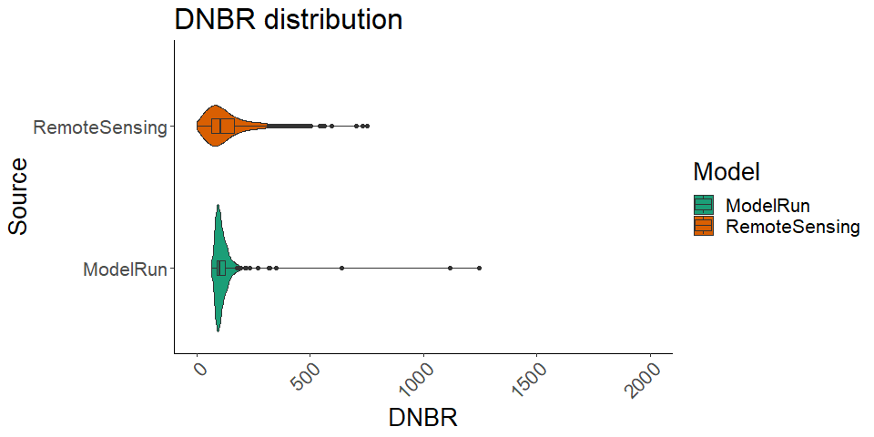
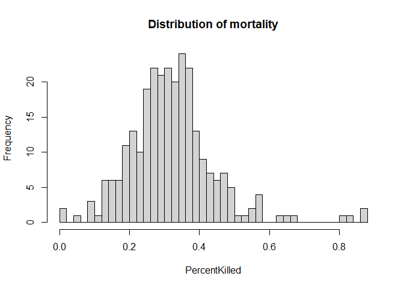
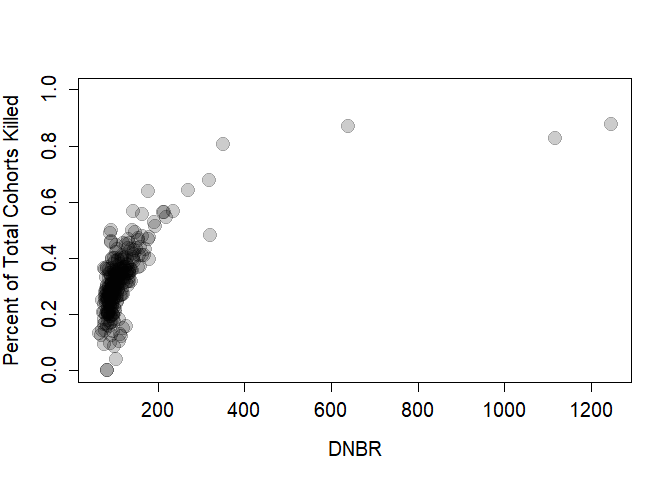
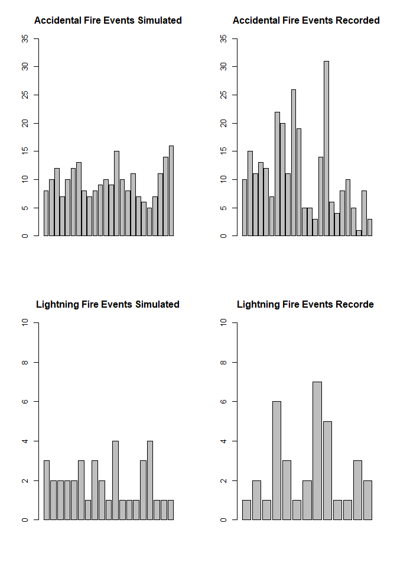
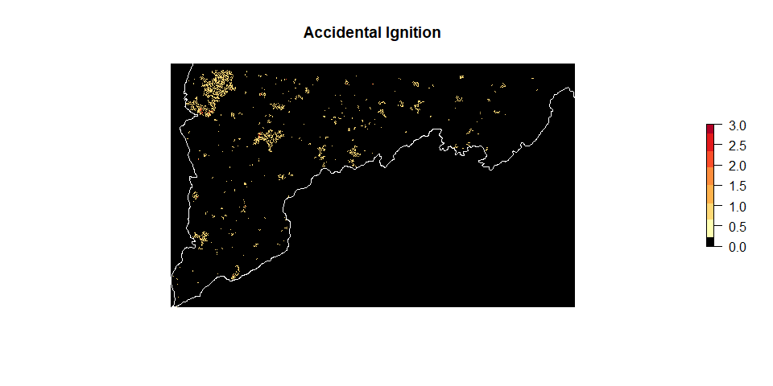
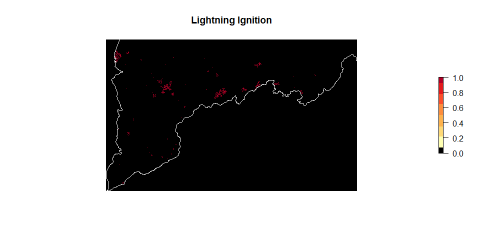
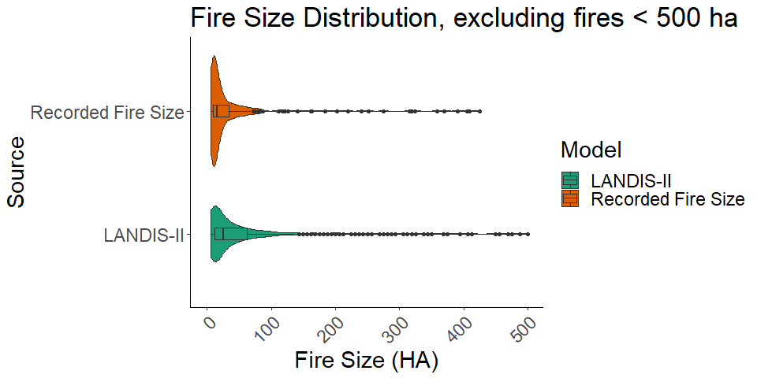
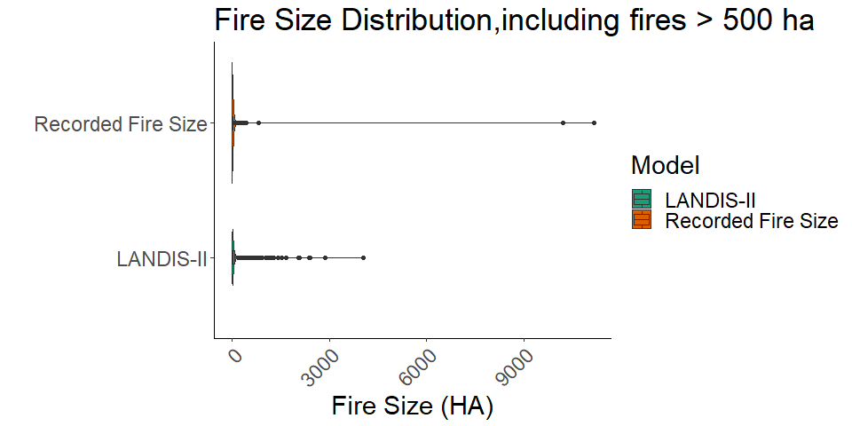

Validating Fire regime
================

``` r
library(grDevices)
library(ggplot2)
library(sf)
library(ggplot2)
library(vioplot)
library(raster)
Drive<-'E:/DM_Runs_2_1/GA_Model_D_1/'

Remotesensing<-read.csv(
  paste0('C:/Users/zacha/Desktop/Sapps_DM_paper/All_250_2_8.csv'))
EventLog<-read.csv(
  paste0('E:/DM_Runs_222/GA_Model_D1/scrapple-events-log.csv'))
AllStack<-stack(
  paste0('E:/DM_Runs_222/GA_Model_D1/scrapple-fire/',
                      list.files('E:/DM_Runs_222/GA_Model_D1/scrapple-fire/',pattern = ("^site-mortality-"))))
All_df<-as.data.frame(AllStack)

RS_2<-na.omit(Remotesensing$RdNBR)
RS_2<-RS_2[RS_2>0]
```

### DNBR/Site Severity

``` r
print("Median Simulation")
```

    ## [1] "Median Simulation"

``` r
median(EventLog$MeanDNBR)
```

    ## [1] 102

``` r
print("Median Remote Sensing")
```

    ## [1] "Median Remote Sensing"

``` r
median(na.omit(Remotesensing$RdNBR))
```

    ## [1] 103.2275

``` r
print("Mean Simulation")
```

    ## [1] "Mean Simulation"

``` r
mean(EventLog$MeanDNBR)
```

    ## [1] 121.7118

``` r
print("Mean Remote Sensing")
```

    ## [1] "Mean Remote Sensing"

``` r
mean(na.omit(Remotesensing$RdNBR))
```

    ## [1] 124.0862

``` r
List<-EventLog$MeanDNBR
VioFrame<-data.frame(Model=c(rep("RemoteSensing",length(RS_2)),rep("ModelRun",length(List)))
           ,Score=c(RS_2,List))

p <- ggplot(VioFrame, aes(x=factor(Model), y=Score, fill=Model)) + 
     
     geom_violin()+ 
     coord_flip() + 
     scale_y_continuous(limits = c(0, 2000))+
     geom_boxplot(width=0.1)+
     scale_fill_brewer(palette="Dark2")+
     labs(title="DNBR distribution",x="Source", y = "DNBR")+
     theme_classic()+
     theme(text = element_text(size=20),
        axis.text.x = element_text(angle=45, hjust=1)) 
     #stat_summary(fun.data=data_summary)
p
```

<!-- -->

### Resulting Mortality (Delayed Mortality).

``` r
PercentKilled<-EventLog$CohortsKilled/EventLog$AvailableCohorts

plot(PercentKilled~EventLog$MeanDNBR,pch=19,cex.lab=1.25,cex.axis=1.25,cex=2.0,col=adjustcolor("black",alpha.f = .2),ylim=c(0,1.0),
     xlab="DNBR",ylab="Percent of Total Cohorts Killed")
```

<!-- -->

``` r
hist(PercentKilled,breaks=40,main="Distribution of mortality")
```

<!-- -->

#### Ignition:

``` r
l_fire_dat<-read.csv("C:/Users/zacha/Desktop/Sapps_DM_paper/KS_All_FiresGA.csv")
l_fire_dat<-l_fire_dat[c(-1)]
l<-l_fire_dat[l_fire_dat$STAT_CAU_1=="Lightning",]%>%
  subset(FIRE_SIZE>15.44)
h<-l_fire_dat[!l_fire_dat$STAT_CAU_1=="Lightning",]%>%
  subset(FIRE_SIZE>15.44)
#<-table(l$FIRE_YEAR)

barplot(as.data.frame(table(EventLog$SimulationYear))[,2],main="Total Fire Events",ylim=c(0,35))
```

<!-- -->

``` r
par(mfrow=c(2,2))
barplot(as.data.frame(table(EventLog$SimulationYear[EventLog$IgnitionType==" Accidental"]))[,2],main="Accidental Fire Events Simulated",ylim=c(0,35))
barplot(as.data.frame(table(h$FIRE_YEAR))[,2],main="Accidental Fire Events Recorded",ylim=c(0,35))
barplot(as.data.frame(table(EventLog$SimulationYear[EventLog$IgnitionType==" Lightning"]))[,2],main="Lightning Fire Events Simulated",ylim=c(0,10))
barplot(as.data.frame(table(l$FIRE_YEAR))[,2],main="Lightning Fire Events Recorde ",ylim=c(0,10))
```

<!-- -->

``` r
print("Accidental Simulated 1992-2016")
```

    ## [1] "Accidental Simulated 1992-2016"

``` r
sum(as.data.frame(table(EventLog$SimulationYear[EventLog$IgnitionType==" Accidental"]))[,2])
```

    ## [1] 233

``` r
print("Accidental Recorded 1992-2016")
```

    ## [1] "Accidental Recorded 1992-2016"

``` r
sum(as.data.frame(table(h$FIRE_YEAR))[,2])
```

    ## [1] 269

``` r
print("Lightning Simulated 1992-2016")
```

    ## [1] "Lightning Simulated 1992-2016"

``` r
sum(as.data.frame(table(EventLog$SimulationYear[EventLog$IgnitionType==" Lightning"]))[,2])
```

    ## [1] 38

``` r
print("Lightning Recorded 1992-2016")
```

    ## [1] "Lightning Recorded 1992-2016"

``` r
sum(as.data.frame(table(l$FIRE_YEAR))[,2])
```

    ## [1] 35

``` r
#Looking at repeat burns in the simulation 
Rd<-RColorBrewer::brewer.pal(7,"YlOrRd")
Rd<-c("black",Rd)
shape<-read_sf('C:/Users/zacha/Desktop/Sapps_Mortality/AOI_4269.shp')
folder<-"C:/Users/zacha/Desktop/Sapps_DM_paper/Fire_Size/1_20_1/scrapple-fire/"
sample_raster<-raster("E:/DM_Runs_222/GA_Model_D1/Clay_42919.tif")
```

    ## Warning in showSRID(uprojargs, format = "PROJ", multiline = "NO"): Discarded datum Unknown based on GRS80 ellipsoid in CRS definition,
    ##  but +towgs84= values preserved

``` r
### Create stack of all ignition types
IgnitionStack<-stack(paste0(folder,list.files(folder,pattern = "^ignition-type-")))
crs(IgnitionStack)<-crs(sample_raster)
extent(IgnitionStack)<-extent(sample_raster)
shape_t<-st_transform(shape,crs=crs(IgnitionStack))
###Filter out just lightning 
IgnitionStack[IgnitionStack!=2]<-0
```

    ## Warning in showSRID(uprojargs, format = "PROJ", multiline = "NO"): Discarded datum Unknown based on GRS80 ellipsoid in CRS definition,
    ##  but +towgs84= values preserved

``` r
Just2<-calc(IgnitionStack,sum)
```

    ## Warning in showSRID(uprojargs, format = "PROJ", multiline = "NO"): Discarded datum Unknown based on GRS80 ellipsoid in CRS definition,
    ##  but +towgs84= values preserved

``` r
## entry code is 2 so divide 2 for unique events
Just2<-Just2/2

## Filtering just accidental 
IgnitionStack<-stack(paste0(folder,list.files(folder,pattern = "^ignition-type-")))
#plot(IgnitionStack)        
crs(IgnitionStack)<-crs(sample_raster)
extent(IgnitionStack)<-extent(sample_raster)
IgnitionStack[IgnitionStack!=3]<-0
```

    ## Warning in showSRID(uprojargs, format = "PROJ", multiline = "NO"): Discarded datum Unknown based on GRS80 ellipsoid in CRS definition,
    ##  but +towgs84= values preserved

``` r
Just3<-calc(IgnitionStack,sum)
```

    ## Warning in showSRID(uprojargs, format = "PROJ", multiline = "NO"): Discarded datum Unknown based on GRS80 ellipsoid in CRS definition,
    ##  but +towgs84= values preserved

``` r
### entry code is 3 so divide 3 for unique events 
Just3<-Just3/3
```

``` r
### Plot the fire. 
plot(Just2,main="Accidental Ignition",xlim=c(153228,320000),
     ylim=c(3779459,3880000),axes=F,box=F,col=Rd)
plot(shape_t$geometry,add=T,border="white")
```

<!-- -->

``` r
plot(Just3,main="Lightning Ignition",xlim=c(153228,320000),
     ylim=c(3779459,3880000),col=Rd,axes=F,box=F,)
plot(shape_t$geometry,add=T,border="white")
```

<!-- -->

### Area of fires

Here we compare the fire size in the simulations and the combined Short
and MTBS estimated fire area for the years of 1992-2016

``` r
### Load in 
w_dir<-"C:/Users/zacha/Desktop/Sapps_DM_paper/"
### Shape file of georgia
CNF<-st_read("C:/Users/zacha/Desktop/Sapps_DM_paper/Georgia.shp")
## Karenshort Lightning and Accidental ignitions data
l_fire_dat <- read.csv(paste(w_dir,"Inputs/FiresInAppsLightning2.csv", sep=""))
h_fire_dat <- read.csv(paste(w_dir, "Inputs/FiresInAppsHuman2.csv", sep=""))
l_fire_dat<-rbind(l_fire_dat,h_fire_dat)
colnames(l_fire_dat)
#UTM11<-Plot_locations[Plot_locations$UTM.Zone==('11S'),]
xy <-l_fire_dat[,c("LONGITUDE","LATITUDE")]
### Make spatial points, transform projection and itersect with GA_Shape file
Spati <- SpatialPointsDataFrame(coords = xy, data = l_fire_dat,
                               proj4string = CRS("+proj=longlat +ellps=WGS84 +datum=WGS84 +no_defs "))%>%
  spTransform(projection(CNF))%>%
  as("sf")
Int<-st_intersection(Spati,CNF)
l_fire_dat <- Int
### Subset out fires smaller than 6.25ha
l_fire_dat<-l_fire_dat%>%
  subset(FIRE_SIZE>15.44)
write.csv(l_fire_dat,"KS_All_FiresGA.csv")
```

``` r
### Load in the ignition data from above
l_fire_dat<-read.csv("C:/Users/zacha/Desktop/Sapps_DM_paper/KS_All_FiresGA.csv")
l_fire_dat<-l_fire_dat[c(-1)]
### Subset to fire year and size
l_fire_dat<-l_fire_dat[c("FIRE_YEAR","FIRE_SIZE")]
### Load in MTBS shape file
MTBS_GA<-read_sf('C:/Users/zacha/Desktop/Sapps_Mortality/MTBS_GA.shp')
### Add MTBS wildfire data for 2016 to fire record
Wild<-MTBS_GA%>%
  subset(Fire_Type=="Wildfire"& Year==2016)%>%
  as.data.frame()
Wild<-Wild[c("Year","Acres")]
colnames(Wild)<-c("FIRE_YEAR","FIRE_SIZE")
l_fire_dat<-rbind(l_fire_dat,Wild)
### Load in simulation data from LANDIS-II
EventLog1<-read.csv(
  paste0('E:/DM_Runs_222/GA_Model_D1/scrapple-events-log.csv'))
EventLog2<-read.csv(
  paste0('E:/DM_Runs_222/GA_Model_D2/scrapple-events-log.csv'))
EventLog3<-read.csv(
  paste0('E:/DM_Runs_222/GA_Model_D3/scrapple-events-log.csv'))
EventLog<-rbind(EventLog1,EventLog2,EventLog3)
###Create one dataframe comparing the two records (LANDIS-II and MTBS/Karenshort)

VioFrame<-data.frame(
          Model=c(rep("Recorded Fire Size",length(l_fire_dat$FIRE_SIZE)),
                            rep("LANDIS-II",length(EventLog$TotalSitesBurned))
                  ),
           Score=c(l_fire_dat$FIRE_SIZE/2.47105,## Acres to ha 
                    EventLog$TotalSitesBurned*6.25 ## Cells to ha 
                    ))
### Plot it out (Contrained <500 to show variance)
p <- ggplot(VioFrame, aes(x=Model, y=as.numeric(Score), fill=Model)) + # fill=name allow to automatically dedicate a color for each group
     geom_violin()+ 
     coord_flip() + 
     geom_boxplot(width=0.1)+
     scale_fill_brewer(palette="Dark2")+
     labs(title="Fire Size Distribution, excluding fires < 500 ha",x="Source", y = "Fire Size (HA)")+
     scale_y_continuous(limits = c(-1, 500))+
     theme_classic()+
     theme(text = element_text(size=22),
        axis.text.x = element_text(angle=45, hjust=1)) 
     #stat_summary(fun.data=data_summary)
p
```

    ## Warning: Removed 51 rows containing non-finite values (stat_ydensity).

    ## Warning: Removed 51 rows containing non-finite values (stat_boxplot).

<!-- -->

``` r
### Here is the same plot without constraints

q <- ggplot(VioFrame, aes(x=Model, y=as.numeric(Score), fill=Model)) + # fill=name allow to automatically dedicate a color for each group
     geom_violin()+ 
     coord_flip() + 
     geom_boxplot(width=0.1)+
     scale_fill_brewer(palette="Dark2")+
     labs(title="Fire Size Distribution,including fires > 500 ha",x="", y = "Fire Size (HA)")+
     #scale_y_continuous(limits = c(0, 10000))+
     theme_classic()+
     theme(text = element_text(size=22),
        axis.text.x = element_text(angle=45, hjust=1)) 
     #stat_summary(fun.data=data_summary)
q
```

<!-- -->

``` r
#27000/2.471
```

``` r
### Here we compare the combined total for each run with the record 
## sum of each run. Cells to HA
ModelRuns<-cbind(sum(EventLog1$TotalSitesBurned)*6.25,sum(EventLog2$TotalSitesBurned)*6.25,sum(
EventLog3$TotalSitesBurned)*6.25)
### Create a bar plot
bars<-c(mean(ModelRuns),sum(l_fire_dat$FIRE_SIZE)/2.54)                    
error<-c(sd(ModelRuns),0)
foo<-barplot(bars,names.arg=c("Landis-II","Karen Short+ MTBS"),main="Total Hectares Burned 1992-2016",ylab="Hectares",ylim=c(0,40000),cex.names=1.7,cex.lab=1.5,cex.axis=1.2)
arrows(x0=foo,y0=bars+error,y1=bars-error,angle=90,code=3,length=0.1,lwd=3.0)
```

    ## Warning in arrows(x0 = foo, y0 = bars + error, y1 = bars - error, angle = 90, :
    ## zero-length arrow is of indeterminate angle and so skipped

<!-- -->

``` r
### Cacluating the range of variation
(35100-33822.39)/33822.39
```

    ## [1] 0.03777409

``` r
(31225-33822.39)/33822.39
```

    ## [1] -0.07679499

``` r
print("-7.6% - 3.8%")
```

    ## [1] "-7.6% - 3.8%"
