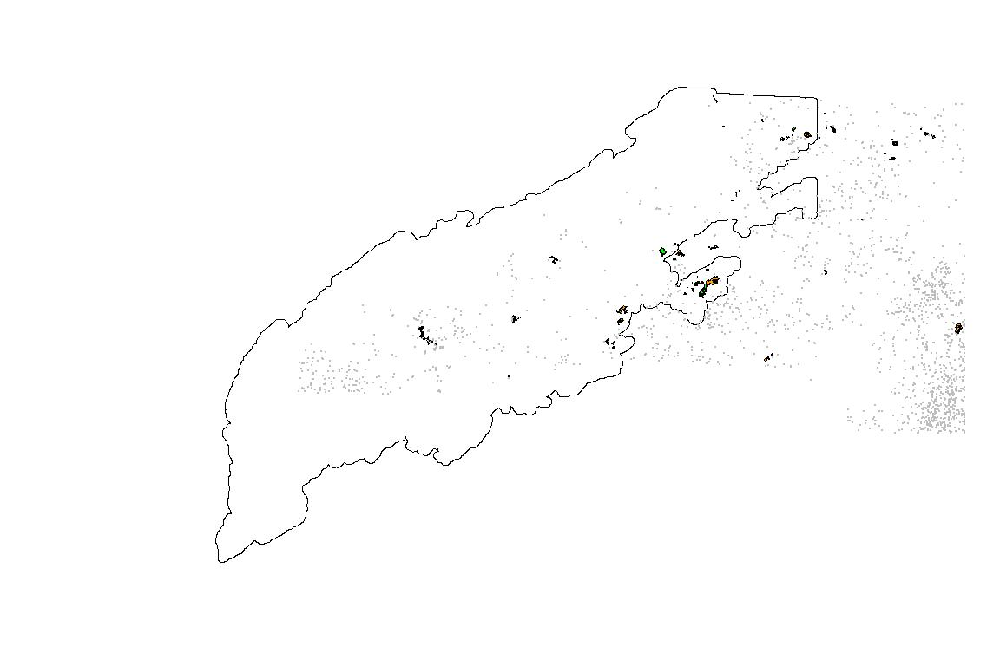
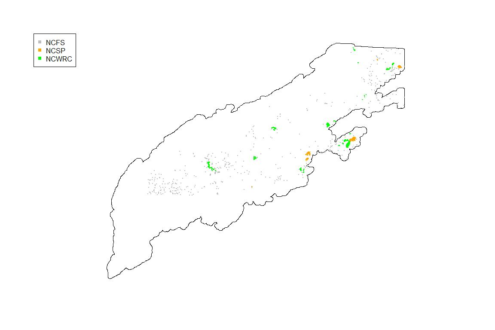
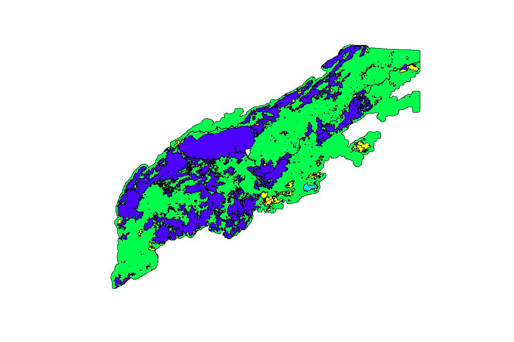
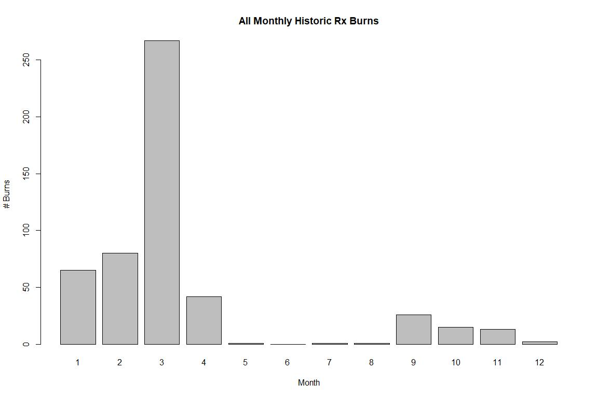
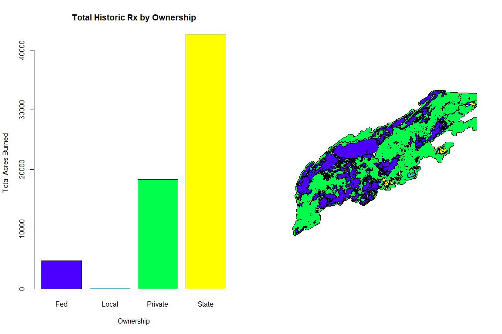
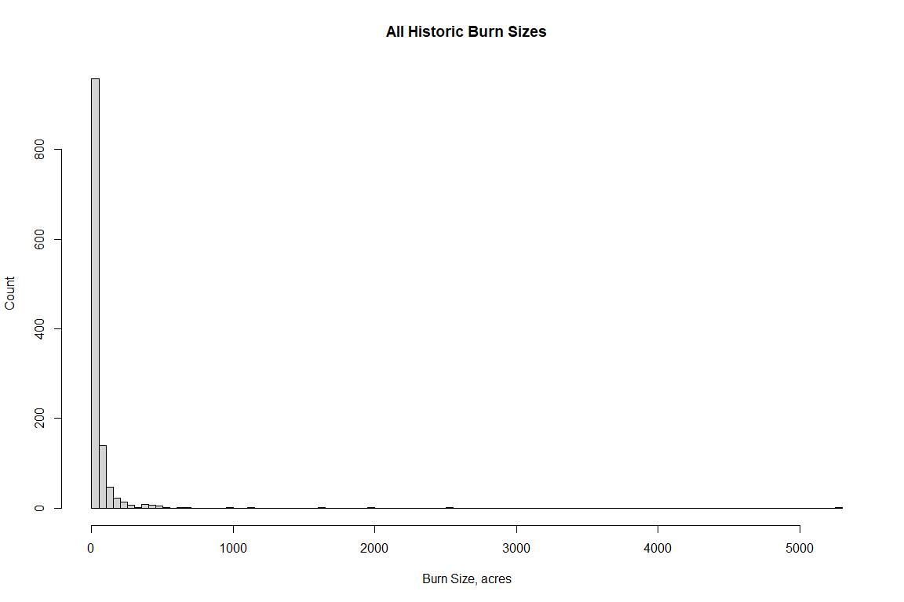
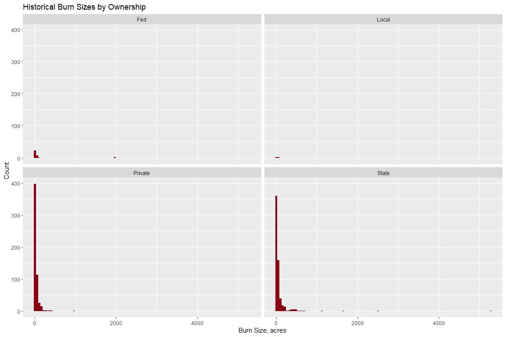
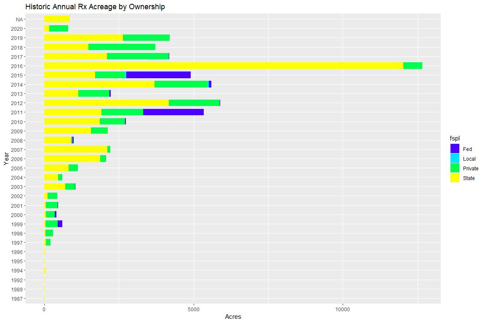
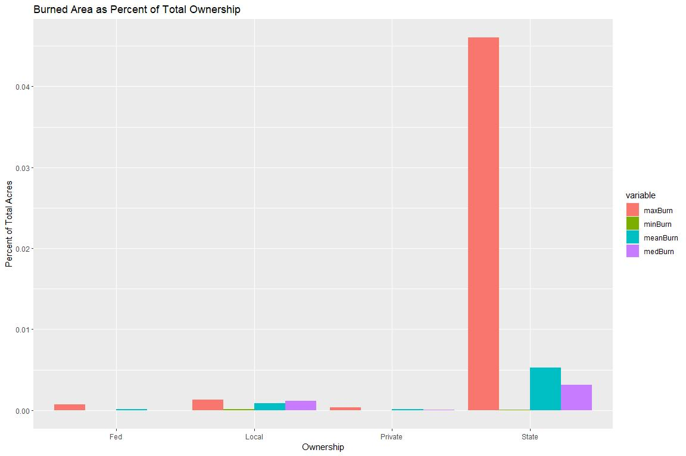
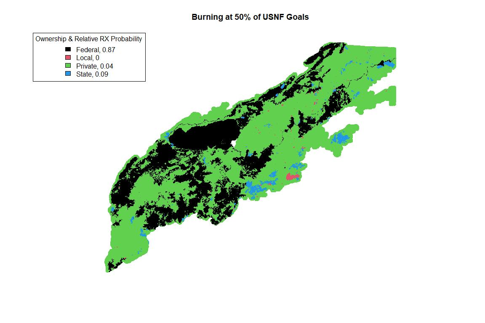

Rx\_Burn\_Data
================
Kate Jones
updated 01/21/2021

This markdown describes acquiring, cleaning, and processing RX data in
Western North Carolina to create an RX input raster for the S. Apps
SCRPPLE extension.

**Data**

The data to create the RX surface were predominantly gathered through
personal correspondence with managers in western North Carolina. We were
unable to acquire data for TN, GA, or SC, so the data values calculated
for NC were extrapolated to the other states in our study area. Data to
estimate federal forest burning was gathered separately from a USFS
report - no spatial data for Federal lands were acquired, so we expect
RX burning on federal lands is underestimated in this work flow. It
should also be noted, that the numbers reflected in the USFS report are
annual targets, which may or may not be met each year, so we handled
these data separately than the observed RX data gathered from the NC
agencies.

Contacts where RX data were acquired:

**1) NC Forest Service (NCFS)**  
- Christian D. Vose \| Information Technology Branch Head \|
<christian.vose@ncagr.gov>

**2) NC State Parks (NCSP)**  
- John Amoroso \| Planning & GIS \| <john.amoroso@ncparks.gov>

**3) NC Wildlife Resources Commission (NCWRC)**  
- Ryan Jacobs \| Wildlife Forest Manager \| <Ryan.Jacobs@ncwildlife.org>

**Step 1: Load & Project Data**

The data collected from each agency were in slightly different formats,
but all spatial. We read all the datasets in and project to UTM 17N and
crop them to the AOI.

``` r
#loading in data
stprk<-shapefile(paste0(wd,"\\dprburnrecords\\DPR_areaburned0820.shp"))
#set projection of state parks because i'm confident it's in lcc, 
#but need it for wrc which was unmarked projection
lcc<-as.character(crs(stprk))#set projection of state parks because i'm confident it's in lcc, but need it for wrc which was unmarked projection

wrc<-shapefile(paste0(wd,"\\reexternaljfspstateparksinmodeledarea\\NCWRC_Lands Burned as of 06292020_Mountain Region.shp"))

ncfs<-shapefile(paste0(wd,"\\reexternalrxburnspatialdata\\NCFS_Accomp_Points.shp"))

#assign string for utm project to be used throughout
utm<-"+proj=utm +zone=17 +ellps=GRS80 +datum=NAD83 +units=m +no_defs"

#project all files to utm17n
stprk_utm<-spTransform(stprk,CRS(utm))
crs(wrc)<-CRS(lcc)#think wrc came in as lambert conformal conic??, need to set the crs because not designated
wrc_utm<-spTransform(wrc,CRS(utm))
wrc_clean<-gBuffer(wrc_utm,byid=T,width=50)
ncfs_utm<-spTransform(ncfs,CRS(utm))

#read in buffered aoi to crop to 
aoi<-shapefile("C:\\Users\\thebrain\\Dropbox\\DEAL_lab\\S_Apps_Project\\diss_aoi\\buffered3.shp")

#read in the surface management layer thats cropped and cleaned
#did this in grass cause it's infinitely better 
juris<-shapefile(paste0(wd,"\\juris_aoi_clip_utm\\juris_aoi_clip.shp"))
```

**Step 2: Plot and Check**

To make sure everything spatially aligns and looks as expected, we plot
the data. Looks ok, but we’ll want to zoom in spatially to the AOI and
change plotting for the polygons layers.

\*The NCWRC and NC State Parks provided area data, while the NCFS
provided point data. We will convert all data to points (using area
centroids) for consistency.

``` r
#plotting to make sure nothing looks to squirrely
plot(aoi)
plot(ncfs_utm,col="grey",pch=16,cex=.1,add=TRUE)
plot(stprk_utm,col="orange",add=T,ol="transparent")
plot(wrc_utm,col="green",add=T,ol="transparent")
```

<!-- -->

**Step 3: Better Plotting**

Once zoomed into the AOI, we can better see the RX locations for the
three agencies. You’ll notice there are hard cutoffs in the AOI between
areas with ignitions and areas without ignitions - this is because we
were only able to collect data from NC, so these boundaries follow state
lines. We can see the RX burns are fairly clustered (i.e. the
observations generally occur in the same locations, which are contained
within management boundaries). The exception is the NCFS in grey, which
had an unexpected number of burns that appeared on private lands
(according to the land ownership data we use). This may explain why the
NCFS RX ignitions are more distributed throughout the state and not
confined to certain land ownership. More on this later.

``` r
#crop all 3 burn layers to AOI
stprk_aoi<-crop(stprk_utm,aoi)
wrc_aoi<-crop(wrc_clean,aoi)
ncfs_aoi<-crop(ncfs_utm,aoi)


plot(aoi)
plot(ncfs_aoi,col="grey",pch=16,cex=.1,add=T)
plot(stprk_aoi,col="orange",border="orange",add=TRUE)
plot(wrc_aoi,col="green",add=T,border="green")
legend("topleft",legend=c("NCFS","NCSP","NCWRC"),col=c("grey","orange","green"),pch=15)
```

<!-- -->

**Step 4: Dividing Data by Jurisdiction/Ownership**

There could be multiple iterations of this process, but for now, we’ve
grouped the land ownership layer into Federal, State, Private, and Local
(local is likely an unnecessary class, but without further discussion on
where to group it, it stands alone). The land ownership data will be
intersected with the RX locations.

Land ownership data was acquired via correspondence with NIFCC and
downloaded from this link:
<https://wfdss.usgs.gov/wfdss_help/WFDSSHelp_SMA_Layer.html>, then
navigate to the Data Downloads page.

``` r
#want to summarize by federal state & private for starters, so need to create 
#polygons to back that data
juris_by<-aggregate(juris,"LandownerC",  dissolve=TRUE)
#plot(juris_by,col=topo.colors(11))

#create a lookup table to merge with the jurisdiction to aggregate them with different, more general categories
jurisdictions<-as.character(juris_by$LandownerC)
fed_state_priv_loc<-c("Fed","Local","Local","Fed","Fed","Fed","Local","Private","State","Fed","Fed")

#get the current landowner values that represent jurisdiction
#& make a table that assigns them to fed, state, private, local
juris_lookup<-as.data.frame(cbind(jurisdictions,fed_state_priv_loc))
colnames(juris_lookup)<-c("LandownerC","fspl")

#join it to the jurisdiction layer
jur_fedstprlo<-merge(juris_by,juris_lookup,"LandownerC")

#now data reflects 4 categories to be intersected with burn data
juris_fspl<-aggregate(jur_fedstprlo,"fspl", dissolve=TRUE)

#plot to check it out
plot(juris_fspl,col=topo.colors(4),border=NULL)
```

<!-- -->

**Step 5: Format Rx Datasets as Points** For now, converting everything
to points (i.e. centroids of polygons) so it’s in the same format and
assigning the polygon dataframe (attributes) to the centroids.

``` r
###since the state parks data & ncwrc commission data are footprints
#lets take the centroid and assign the attributes to the centroids
stprk_cent<-centroid(stprk_aoi)
wrc_cent<-centroid(wrc_aoi)

###add the polygon attributes to the centroids, now all fire observations are point data
stprk_pnts<-SpatialPointsDataFrame(stprk_cent,data=stprk_aoi@data,proj4string=CRS(as.character(utm)))
wrc_pnts<-SpatialPointsDataFrame(wrc_cent,data=wrc_aoi@data,proj4string=CRS(as.character(utm)))

#get rid of wildfire data for stateparks
stprk_rx<-stprk_pnts[stprk_pnts@data$Unit!="Wildfire",]

ncfs_rx<-ncfs_aoi
```

**Step 6: Getting all of the data in the same format**

Across the datasets, there are different formats for dates, burn names,
objectids, etc. Need to get everything into a format that has the
following columns:

-OBJECTID  
-Burn Unit (if possible)  
-Year  
-Month  
-Date  
-Acreage

``` r
library(stringr)
library(splitstackshape)
#create object id's where they don't exist 
ncfs_aoi@data$OBJECTID<-c(1:nrow(ncfs_aoi))
wrc_pnts@data$OBJECTID<-c(1:nrow(wrc_pnts))

#create year fields where they don't exist
#only one with data field but no year
ncfs_aoi@data$Year<-format(as.Date(ncfs_aoi@data$Date, format="%Y/%m/%d"),"%Y")
ncfs_aoi@data$Month<-format(as.Date(ncfs_aoi@data$Date, format="%Y/%m/%d"),"%m")
ncfs_aoi@data$Day<-format(as.Date(ncfs_aoi@data$Date, format="%Y/%m/%d"),"%d")

stprk_pnts@data$Month<-format(as.Date(stprk_pnts@data$Date_, format="%Y/%m/%d"),"%m")
stprk_pnts@data$Day<-format(as.Date(stprk_pnts@data$Date_, format="%Y/%m/%d"),"%d")
```

To get the above columns in a unified format, the WRC data needs the
most cleaning. Cleaning steps commented in code.

``` r
#the wrc is going to be weird because they have multiple observations for a burn unit in the same cell
wrc_pnts_splits<-data.frame(do.call("rbind", strsplit(as.character(wrc_pnts@data$DATES_BU_1), ",", fixed = TRUE)))

#search for duplicates across columns 
for (row in 1:nrow(wrc_pnts_splits)) {
      vec = wrc_pnts_splits %>% slice(row) %>% unlist() %>% unname()
      #check for duplicates
      if(length(unique(vec)) != length(wrc_pnts_splits)) {
        positions <- which(duplicated(vec) %in% c("TRUE"))
        #iterate through positions to assign NA's where duplciates detected
        for(i in 1:length(positions)) {
        wrc_pnts_splits[row,positions[i]]  <- NA
        }
      }
    }

#splitting the text column, but preserving date
test<-cSplit(wrc_pnts_splits, "X1", ";")
test2<-cSplit(test, "X3", ".")

#gets rid of the text column
test3<-as.data.frame(test2[,-c("X1_2")])

#create an index of where na's where detected in test3...don't want to iterate through the NA's
index_of_nonas<-as.data.frame(which(!is.na(test3), arr.ind=TRUE))

#create a new dataframe to receive the wrc observations
new.data <- data.frame(matrix(ncol = 13, nrow = nrow(index_of_nonas)))

#give them colnames so rbind is possible
colnames(new.data)<-c("date_to_clean","BURN_UNIT_","OTHER_FORE","FIREBREAKS","GAME_LAND","DATES_BU_1","Acres","Hectares","Perimeter","Area","Type","Last_YR","OBJECTID")

#iterate through....need to comment this better
for (row in 1:nrow(index_of_nonas)){
  #iterating through index_of_nonas, select the row value 
  row_val_toext<-as.integer(index_of_nonas[row,][1])
   #iterating through index_of_nonas, select the col value 
  col_val_toext<-as.integer(index_of_nonas[row,][2])
  #now, use those indexed row and column values to grab the date from test3 
  date_to_clean<-as.character(test3[row_val_toext,col_val_toext])
  #since test3 and the original data have the same number of rows, select teh same     row value as above
  col_data<-wrc_pnts@data[row_val_toext,]
  #assign the date and all other information from original df to new row
  new_row_data<-cbind(date_to_clean,col_data)
  new.data[row,]<-new_row_data
  
}

wrc_toclean<-new.data

#still gotta clean up the dates, separate into 3 columns
#but because most are just month and year, this 3 col will produce many NA's
wrc_almostclean<-wrc_toclean %>% 
    separate(date_to_clean, c("month","day_yr", "yr"), sep = "/")

#where wrc_almostclean$yr is NA, fillwith day_yr 
wrc_almostclean$yr[is.na(wrc_almostclean$yr)] <- as.character(wrc_almostclean$day_yr[is.na(wrc_almostclean$yr)])

#want to clean up where we have NAs for day_yr because these are either wildfires/incomplete
wrc_noyrnas<-wrc_almostclean[!is.na(wrc_almostclean$yr),]

#since we don't have complete years, will need to pad with either "20" or "19" depending on the value in the column
#make a copy of yr as yr_int so I have integers to work with 
wrc_noyrnas$yr<-as.numeric(as.integer(wrc_noyrnas$yr))
wrc_noyrnas$yr_int<-as.numeric(as.integer(wrc_noyrnas$yr))

#everywhere where the yr value is over 20 but under 2000, add 1900
wrc_noyrnas$yr_int[wrc_noyrnas$yr_int>20 & wrc_noyrnas$yr_int<2000]<-wrc_noyrnas$yr[wrc_noyrnas$yr_int>20 & wrc_noyrnas$yr_int<2000]+1900

#everywhere where the yr value is less than or equal to 20, add 2000
wrc_noyrnas$yr_int[wrc_noyrnas$yr_int<=20]<-wrc_noyrnas$yr[wrc_noyrnas$yr_int<=20]+2000

#test sending the html too dylan!
wrc_almost<-wrc_noyrnas
```

**Step 7: Final data formatting**

Combine all formatted data into single spatial object with tabular
information.

``` r
##merge cleaned WRC tabular to spatial data
eh<-merge(wrc_pnts,wrc_almost,"OBJECTID",duplicateGeoms=T)

#now have spatial information for all 3 data sources
wrc_rx<-eh
ncfs_rx<-ncfs_aoi
stprk_rx<-stprk_pnts


#get each of the 3 datasets, add column that designates agency
#and select columns/change columns names so they can use cbind for the final data

wrc_rx$agency<-"WRC"
stprk_rx$agency<-"StPrk"
ncfs_rx$agency<-"NCFS"

#change all columns names and create new spatial objects with only columns I plan to join
to_name<-c("OBJECTID","Burn_Unit","Year","Month","Acres","Agency")

#all in correct order
wrc_sub<-wrc_rx[,c("OBJECTID","BURN_UNIT_.x","yr_int","month","Acres.x","agency")]
stprk_sub<-stprk_rx[,c("OBJECTID","Unit","Year","Month","Acres","agency")]
ncfs_sub<-ncfs_rx[c("OBJECTID","County","Year","Date","Acres","agency")]

#now assign uniform columns names
colnames(wrc_sub@data)<-to_name
colnames(stprk_sub@data)<-to_name
colnames(ncfs_sub@data)<-to_name

#aggregate all points
rx_burns <-bind(wrc_sub, ncfs_sub, stprk_sub)

rx_burns@data$Month<-as.integer(rx_burns@data$Month)
rx_burns@data$Acres<-as.integer(rx_burns@data$Acres)
rx_burns@data$Acres<-round(rx_burns@data$Acres,2)
```

**Quick Diagnostic: Monthly RX occurrences all years, all data sources**

``` r
#plot generaly monthly rx occurrence
range(rx_burns@data$Month,na.rm=T)
```

    ## [1]  1 12

``` r
monthly_cnt<-as.data.frame(table(rx_burns@data$Month))

june<-data.frame("Var1"="6","Freq"=0)

top<-head(monthly_cnt,5)
bottom<-tail(monthly_cnt,6)

updated<-as.data.frame(rbind(top,june,bottom))

barplot(updated$Freq,names.arg = updated$Var1,main="All Monthly Historic Rx Burns",xlab="Month",ylab="# Burns")
```

<!-- -->

**Quick Diagnostic: Historic RX Acreage Burned by Ownership**

``` r
#intersect burn points & jurisdiction polygons
burns_injuris <- spatialEco::point.in.poly(rx_burns, juris_fspl)

#historical total acreage by ownership
acres_perjuris <- burns_injuris@data %>%
  group_by(fspl) %>%
  summarize(tot_acres = sum(as.integer(Acres), na.rm = TRUE))

barplot(acres_perjuris$tot_acres,names.arg = acres_perjuris$fspl,main="Total Historic Rx by Ownership",col=topo.colors(4),xlab="Ownership",ylab="Total Acres Burned")

old.par <- par(mfrow=c(1, 2))
barplot(acres_perjuris$tot_acres,names.arg = acres_perjuris$fspl,main="Total Historic Rx by Ownership",col=topo.colors(4),xlab="Ownership",ylab="Total Acres Burned")
plot(juris_fspl,col=topo.colors(4))
```

<!-- -->

``` r
par(old.par)
```

**Quick Diagnostic: Historic Burn Sizes by Ownership**

``` r
#distribution of sizes
all_records_fspl <- burns_injuris@data %>%
  group_by(fspl)

all_records_fspl$Acres<-round(as.integer(all_records_fspl$Acres,2))

hist(all_records_fspl$Acres,breaks=100,main="All Historic Burn Sizes",xlab="Burn Size, acres",ylab="Count")
```

<!-- -->

``` r
avg<-mean(all_records_fspl$Acres)

ggplot(data=all_records_fspl, aes(x=Acres)) +
  geom_histogram(fill="#880011",bins=100) +
  ggtitle("Historical Burn Sizes by Ownership") +
  labs(x="Burn Size, acres", y="Count") +
  facet_wrap(~fspl) 
```

<!-- -->

**Step 8: Determine Burned Area %’s by Land Ownership**

``` r
#get percentage of total burns for each ownership area
total_acres_burned_all_history = sum(all_records_fspl$Acres)

total_ac_burn_vec<-rep(total_acres_burned_all_history,4)

all_records_fspl_test <- burns_injuris@data %>%
  group_by(fspl) %>% summarize(sum(Acres))

wholedf<-cbind(all_records_fspl_test,total_ac_burn_vec)

colnames(wholedf)<-c("fspl","total_burnedacres_injuris","total_burnedacres_landscape")

wholedf$perc_of_land_burn<-wholedf$total_burnedacres_injuris/wholedf$total_burnedacres_landscape

#join this information to juris_fspl

possibly<-merge(juris_fspl,wholedf,by="fspl")
#colnames(possibly@data)[2]<-"total_acres_injuris"

#because the RX data I received do not reflect national forest burning, I am taking the data that zachary found in national forest reports and turning them into the units we need to create the proportional burning raster

#this means i am overriding the spatially calculated "NF values and inputting new NF forest values
#since the values from the report Zachary found are very much aspirational (i.e. the values represent what they would like to burn, not what is being burned), we've created three burning scenarios where 100% of goal is met, 50% met, and 10% met

##we use 800000 as the total acres burned on national forest land if we consider the years with the best RX data (2003-2019), this is the equivalent of ~50,000 acres burned per year. This is the value for "aspirational goals"

#creating possible tables that reflect the 3 national forest tables
possibly_100<-possibly
possibly_50<-possibly
possibly_10<-possibly

#in all tables, make this the total acres burned on national forest land
possibly_100@data[1,2]<-800000
possibly_50@data[1,2]<-800000*0.5
possibly_10@data[1,2]<-800000*0.1

#in all the tables, make column 4 reflect the total acres burned on the landscape(rx empirical data + the totals added from NF)
possibly_100@data[,3]<-sum(possibly_100@data[,2])
possibly_50@data[,3]<-sum(possibly_50@data[,2])
possibly_10@data[,3]<-sum(possibly_10@data[,2])

####THIS ABOVE NEEDS TO BE REWORKED

possibly_100$perc_of_land_burn<-possibly_100$total_burnedacres_injuris/possibly_100$total_burnedacres_landscape
possibly_50$perc_of_land_burn<-possibly_50$total_burnedacres_injuris/possibly_50$total_burnedacres_landscape
possibly_10$perc_of_land_burn<-possibly_10$total_burnedacres_injuris/possibly_10$total_burnedacres_landscape

possibly_100$round_perc_land_burn<-round(possibly_100$perc_of_land_burn,2)
possibly_50$round_perc_land_burn<-round(possibly_50$perc_of_land_burn,2)
possibly_10$round_perc_land_burn<-round(possibly_10$perc_of_land_burn,2)
```

**Quick Diagnostic: Annual Acres Burned by Ownership**

``` r
#plot of annual amount burned within broader fed/state/priv & more specific ownership polygons
yearly_fspl <- burns_injuris@data %>%
  group_by(fspl,Year)


ggplot(yearly_fspl, aes(x = Acres, y = Year))+
  ggtitle("Historic Annual Rx Acreage by Ownership")+
  geom_col(aes(fill = fspl), width = 0.7)+
  scale_fill_manual(values=topo.colors(4))
```

<!-- -->

``` r
#create a plot with annual min, max, avg. as proportion of the jurisdiction type

#first calculate area of fed, state, local, private
juris_fspl$acres <- area(juris_fspl) * 0.00024711

#getting the total acres burned, annually for each jurisdiction
#
annual_acres_byjuris<-yearly_fspl %>% group_by(fspl,Year) %>%
  summarize(TotAcres=sum(Acres))#%>% rename(sum(Acres)= TotAcres)

#now, want to search through and find the min max and avg across all years
#these data area annual
avg_min_max_acres<-annual_acres_byjuris %>% group_by(fspl) %>%
  summarize(maxBurn=max(TotAcres),minBurn=min(TotAcres),meanBurn=mean(TotAcres),medBurn=median(TotAcres)) 


tot_jur_ac<-juris_fspl$acres

burn_tot_acrs<-cbind(avg_min_max_acres,tot_jur_ac)

test<-(burn_tot_acrs[,2:5]/burn_tot_acrs$tot_jur_ac) 

jur_vec<-juris_fspl$fspl

stats_burnacres<-cbind(jur_vec,test)

melted<-melt(stats_burnacres, id="jur_vec")


ggplot(data = melted, aes(x = jur_vec, y = value, fill = variable)) + 
       geom_bar(stat = 'identity', position = 'dodge')+
        xlab("Ownership")+
        ylab("Percent of Total Acres")+
        ggtitle("Burned Area as Percent of Total Ownership")
```

<!-- -->

``` r
#look at every year amounts burned by state
#what was the min/max/avg acres
#plot proportionate to total acreage
```

**Step 9: Assigning raster cells a percentage of total acres burned
across the landscape**

This represents the probability that a given cell will burn. The tables
below each raster show the relative burn probabilities and the
hypothetical burned areas used to calculate the probabilities for each
ownership for the 10/50/100 scenarios.

``` r
#need total acres burned in each landscape as percentage of total acres 
#possibly is just that

#then need to convert that to raster that matches s. app AOI
model_rast<-raster("C:\\Users\\thebrain\\Dropbox\\DEAL_lab\\landis\\Run11_2\\LANDIS_Sapps_Active_v1_3\\Sapps_Aspect.tif")

create_rast<-function(x){
  
  r <- raster()
  extent(r) <- extent(model_rast)
  res(r)<-res(model_rast)
  #crs(r)<-crs(model_rast)
  #crs(r)<-"+proj=utm +zone=17 +ellps=GRS80 +towgs84=0,0,0,0,0,0,0 +units=m +no_defs"
  theCRS <- sp::CRS('+init=epsg:32617')    # GDA94 (Australia)
  crs(r) <- theCRS 
  rp <- rasterize(x, r, 'round_perc_land_burn')
  rx_scale<-climateStability::rescale0to1(rp)
  # 
  # #can't have 0 values, so want to just barely assign the mimnimum value
  rx_scale[rx_scale==0]<-0.1

  # #resample to get to correct study area raster specs
  # test<-resample(ha_out,aoi,method="bilinear")

  #round it and multiple by 100
  rx_out<-round(rp,2)*100
  return(rx_out)
}


to_rast<-list(possibly_100,possibly_50,possibly_10)

rast_names<-c("possibly100","possibly50", "possibly10")

for (i in 1:length(to_rast)){
  
  rx_out<-create_rast(to_rast[[i]])
  
  writeRaster(rx_out,paste0("C:\\Users\\thebrain\\Dropbox\\DEAL_lab\\SCRPPLE\\RXdata\\",rast_names[i],".tif"),overwrite=T)

}
```

``` r
###colors need to be assigned in accordance with the ownership...


#show the three different rasters and print the table of burned areas that displays them 

plot(possibly_10, col= as.factor(possibly_10@data$fspl),main="Burning at 10% of USNF Goals",border=NA)
# legend("topleft",   # location of legend
#       legend = as.character(possibly_10@data$round_perc_land_burn),
#       fill = as.factor(possibly_10@data$fspl))

legend("topleft",   # location of legend
      legend = c(paste0("Federal, ",possibly_10@data$round_perc_land_burn[1]),paste0("Local, ",possibly_10@data$round_perc_land_burn[2]),paste0("Private, ",possibly_10@data$round_perc_land_burn[3]),paste0("State, ",possibly_10@data$round_perc_land_burn[4])),
      fill = as.factor(possibly_10@data$fspl),
      title="Ownership & Relative RX Probability")
```

<!-- -->

``` r
knitr::kable(possibly_10@data, caption="This table shows the values (empirical and derived) to represent RX fire across the landscape when the NF is meeting 10% of their acreage goals. All RX values are held constant across the 10/50/100 % scenarios, as these are observed data.")
```

| fspl    | total\_burnedacres\_injuris | total\_burnedacres\_landscape | perc\_of\_land\_burn | round\_perc\_land\_burn |
|:--------|----------------------------:|------------------------------:|---------------------:|------------------------:|
| Fed     |                       80000 |                        141153 |            0.5667609 |                    0.57 |
| Local   |                         126 |                        141153 |            0.0008926 |                    0.00 |
| Private |                       18372 |                        141153 |            0.1301566 |                    0.13 |
| State   |                       42655 |                        141153 |            0.3021898 |                    0.30 |

This table shows the values (empirical and derived) to represent RX fire
across the landscape when the NF is meeting 10% of their acreage goals.
All RX values are held constant across the 10/50/100 % scenarios, as
these are observed data.

``` r
plot(possibly_50, col= as.factor(possibly_50@data$fspl),main="Burning at 50% of USNF Goals",border=NA)
# legend("topleft",   # location of legend
#       legend = as.character(possibly_10@data$round_perc_land_burn),
#       fill = as.factor(possibly_10@data$fspl))

legend("topleft",   # location of legend
      legend = c(paste0("Federal, ",possibly_50@data$round_perc_land_burn[1]),paste0("Local, ",possibly_50@data$round_perc_land_burn[2]),paste0("Private, ",possibly_50@data$round_perc_land_burn[3]),paste0("State, ",possibly_50@data$round_perc_land_burn[4])),
      fill = as.factor(possibly_50@data$fspl),
      title="Ownership & Relative RX Probability")
```

<!-- -->

``` r
knitr::kable(possibly_50@data, caption="This table shows the values (empirical and derived) to represent RX fire across the landscape when the NF is meeting 50% of their acreage goals. All RX values are held constant across the 10/50/100 % scenarios, as these are observed data.")
```

| fspl    | total\_burnedacres\_injuris | total\_burnedacres\_landscape | perc\_of\_land\_burn | round\_perc\_land\_burn |
|:--------|----------------------------:|------------------------------:|---------------------:|------------------------:|
| Fed     |                      400000 |                        461153 |            0.8673911 |                    0.87 |
| Local   |                         126 |                        461153 |            0.0002732 |                    0.00 |
| Private |                       18372 |                        461153 |            0.0398393 |                    0.04 |
| State   |                       42655 |                        461153 |            0.0924964 |                    0.09 |

This table shows the values (empirical and derived) to represent RX fire
across the landscape when the NF is meeting 50% of their acreage goals.
All RX values are held constant across the 10/50/100 % scenarios, as
these are observed data.

``` r
# 

plot(possibly_100, col= as.factor(possibly_100@data$fspl),main="Burning at 100% of USNF Goals",border=NA)
# legend("topleft",   # location of legend
#       legend = as.character(possibly_10@data$round_perc_land_burn),
#       fill = as.factor(possibly_10@data$fspl))

legend("topleft",   # location of legend
      legend = c(paste0("Federal, ",possibly_100@data$round_perc_land_burn[1]),paste0("Local, ",possibly_100@data$round_perc_land_burn[2]),paste0("Private, ",possibly_100@data$round_perc_land_burn[3]),paste0("State, ",possibly_100@data$round_perc_land_burn[4])),
      fill = as.factor(possibly_100@data$fspl),
      title="Ownership & Relative RX Probability")
```

<!-- -->

``` r
knitr::kable(possibly_100@data, caption="This table shows the values (empirical and derived) to represent RX fire across the landscape when the NF is meeting 100% of their acreage goals. All RX values are held constant across the 10/50/100 % scenarios, as these are observed data.")
```

| fspl    | total\_burnedacres\_injuris | total\_burnedacres\_landscape | perc\_of\_land\_burn | round\_perc\_land\_burn |
|:--------|----------------------------:|------------------------------:|---------------------:|------------------------:|
| Fed     |                      800000 |                        861153 |            0.9289871 |                    0.93 |
| Local   |                         126 |                        861153 |            0.0001463 |                    0.00 |
| Private |                       18372 |                        861153 |            0.0213342 |                    0.02 |
| State   |                       42655 |                        861153 |            0.0495324 |                    0.05 |

This table shows the values (empirical and derived) to represent RX fire
across the landscape when the NF is meeting 100% of their acreage goals.
All RX values are held constant across the 10/50/100 % scenarios, as
these are observed data.

``` r
#plot interval within a given sub-polygon of that ownership?
##could get that level specific, or could just say within federal, can i identify rotations? #how much finer can/should the jurisdictional data polygons be?
#average time between burns within a sub polygon? or amount of time between point and neighboring point burn?
```
