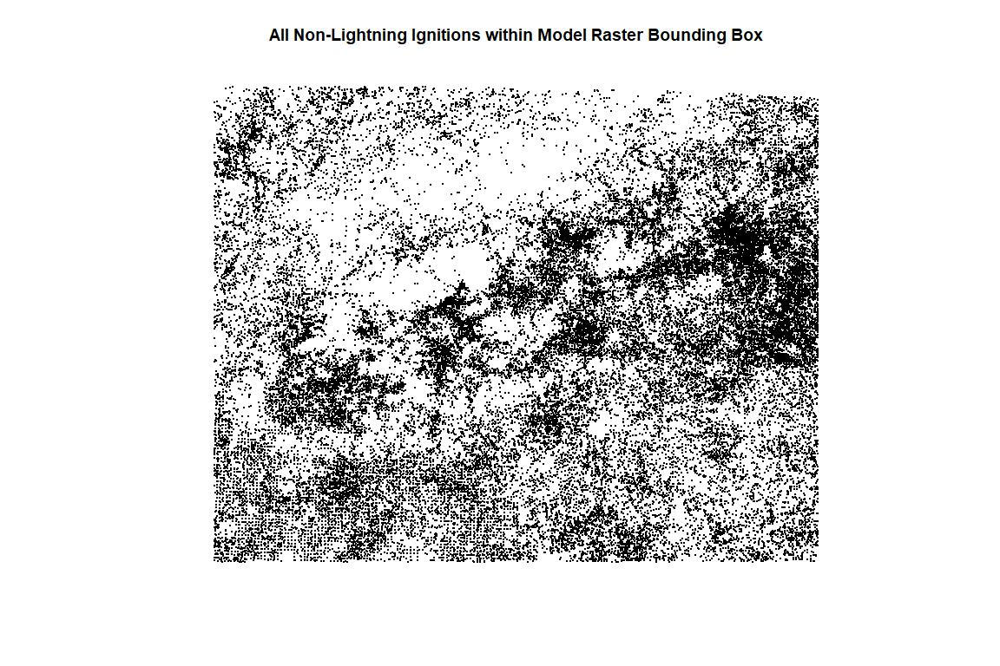
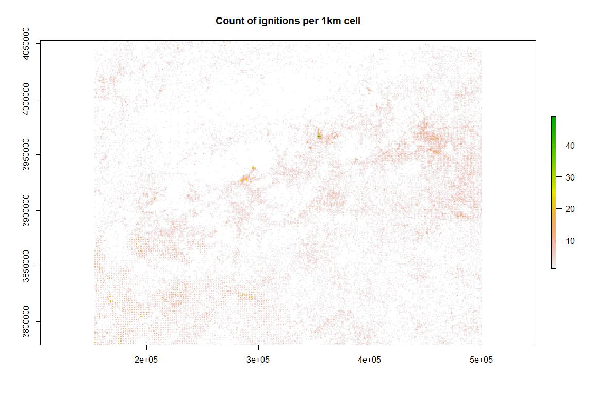
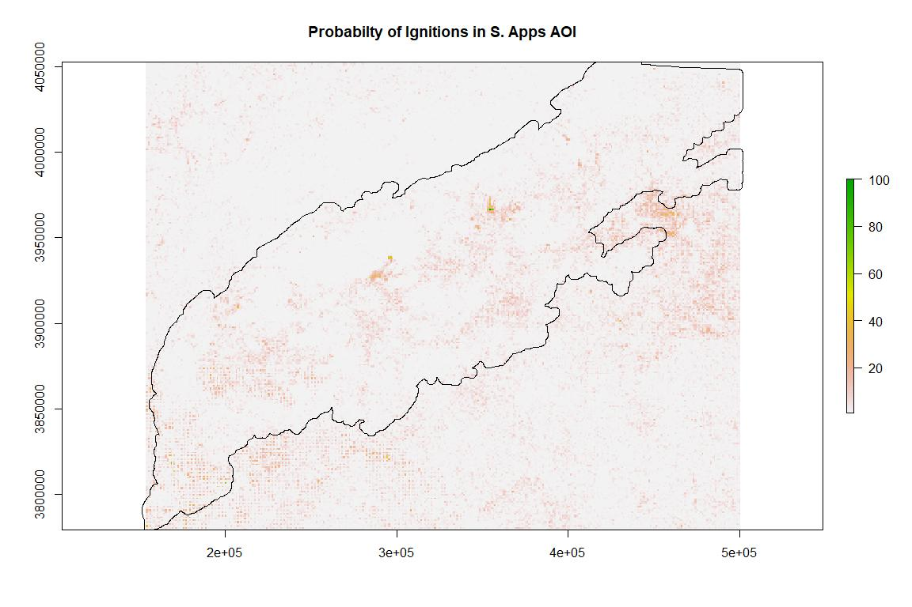

Human Accidental Ignitions - SCRPPLE
================
Kate Jones
12/8/2020

This markdown describes the process of creating the human accidental
ignitions raster for the southern Appalachians LANDIS-II model (SCRPPLE
extension). Fitting several statistical models were attempted to try and
quantify a relationship between landscape level variables and historic
ignition locations. With mixed results, we opted to simply map the
density of historic ignitions, such that this would govern the
probability of human accidental ignitions in the model.

**Data**  
The USFS Fire Occurrence Dataset (FOD) (Short, 2017) is the only input
to create this SCRPPLE raster. The FOD data can be downloaded in
multiple formats from this location:
<https://www.fs.usda.gov/rds/archive/catalog/RDS-2013-0009.4>

**Step 1**  
Because the USFS FOD data contains all national ignitions, we initially
want to subset the data to the 4 states in our study area and subset to
only the human accidental igntions - this excludes lightning ignitions.
Once we’ve subset down to the ignitions of interest, we convert them to
a spatial points object in R.

``` r
# in tabular form, make it smaller
subset_fires <- fires[fires$STATE == "GA" | fires$STATE == "TN" | fires$STATE == 
    "SC" | fires$STATE == "NC", ]

only_human <- subset_fires[subset_fires$STAT_CAU_1 != "Lightning", ]
only_lightning <- subset_fires[subset_fires$STAT_CAU_1 == "Lightning", ]

# assign lat/longs for making spatial object coords
lat <- only_human$LATITUDE
long <- only_human$LONGITUDE

lat_light <- only_lightning$LATITUDE
long_light <- only_lightning$LONGITUDE

# bind them up
fire_coords <- cbind(long, lat)
fire_light_coords <- cbind(long_light, lat_light)

# make sure wgs 1984, matching shorts lat/longs
fire_pnts_wgs <- SpatialPoints(fire_coords, proj4string = CRS(as.character("+proj=longlat +datum=WGS84 +no_defs +ellps=WGS84 +towgs84=0,0,0")))

fire_light_pts_wgs <- SpatialPoints(fire_light_coords, proj4string = CRS(as.character("+proj=longlat +datum=WGS84 +no_defs +ellps=WGS84 +towgs84=0,0,0")))
```

**Step 2**  
We will need to rasterize the spatial points we just created, so to
assure we have the correct raster specs (extent, res, crs), I read in
any raster from the model (since all of the tifs in the model should
have the same spatial reference information). From the bounding box of
the model raster, I create a polygon object. Once the newly created
polygon object and the fire ignition points are in the same projection
as the model raster (UTM 17N), I crop the fire ignitions to the extent
of the bounding box polygon. I then write out a shapefile of all
ignitions in the bounding box (of the model raster) to document this
intermediate step in the process.

``` r
# clip 4 states worth of ignitions down to the study area extent
aoi <- raster("C:\\Users\\thebrain\\Dropbox\\DEAL_lab\\S_Apps_Project\\Project-Southern-Appalachians-2018\\Models\\LANDIS_Sapps_Active_v1_3\\11_Ecoregions.tif")
# get the specs for the study area maps
utm <- crs(aoi)
crs(aoi)
```

    ## CRS arguments:
    ##  +proj=utm +zone=17 +ellps=GRS80 +units=m +no_defs

``` r
e <- extent(aoi)

# make a SpatialPolygons object from the study area extent information
p <- as(e, "SpatialPolygons")
crs(p) <- proj4string(aoi)


# now transform the points from wgs to utm
fire_utm <- spTransform(fire_pnts_wgs, CRS(proj4string(aoi)))
fire_light_utm <- spTransform(fire_light_pts_wgs, CRS(proj4string(aoi)))

# now, since both are in correct, metered project - clip!
fires_inextent <- crop(fire_utm, p)
fires_light_inextet <- crop(fire_light_utm, p)

# write out the fires/ignitions as points within our study area so we have it for
# later
shapefile(fires_inextent, "ha_ign_aoi.shp", overwrite = TRUE)
shapefile(fires_light_inextet, "light_ign_aoi.shp", overwrite = TRUE)

plot(fires_inextent, pch = 16, cex = 0.2, main = "All Non-Lightning Ignitions within Model Raster Bounding Box")
```

<!-- -->

**Step 3**  
Now I need to rasterize the ignitions to create the density raster.
Because of the somewhat sparse data, I aggregate the points at the 1km
scale, additionally, 1 km seems like an appropriate scale of certainty
(i.e. the difference between an ignition occurring in one cell or 8 of
its neighbors is less important at the landscape scale). We rasterize
the ignitions to the raster extent and resolution (of the model raster)
- we rasterize the count of points in each cell.

``` r
### now for rasterizing

# rasterize those points to prespecified raster template
rast <- raster()
crs(rast) <- crs(aoi)
extent(rast) <- extent(aoi)
# res(rast)<-res(aoi)
res(rast) <- 1000  #choose to rasterize at 1km  scale because you get higher ignitions counts than at 250m scale 

# rasterize the ignition count to the raster we created just above
ha_surf <- rasterize(fires_inextent, rast, fun = "count")

plot(ha_surf, main = "Count of ignitions per 1km cell")
```

<!-- -->

**Step 4**  
There are a number of cells that have no ignitions, and therefore have 0
the count but are returned as NA’s. We don’t want to have zeros for the
ignitions layers. If there are zeros in a cell, it will never be
selected for an accidental ignition. So, we want to slightly adjust the
zero probability by adding 0.01. We selected 0.01 because the Then, we
resample the 1km cells down to 250m to match the original model raster
and scale the cell values 0.01 to 1. Then multiply the values by 3
because SCRPPLE only requires a relative weight and storing decimal
places isn’t necessary.

``` r
# where tehre are na's, write to 0 - these are cells with no ignitions counted
ha_surf[is.na(ha_surf)] <- 0

# to get back to the extent and 250m resolution of the model raster, resample
# using nearest neighbor
test <- resample(ha_surf, aoi, method = "ngb")

# scale these cell values 0 to 1
ha_scale <- rescale0to1(test)

# then, to avoid zero probabilities, add 0.01
ha_scale[ha_scale == 0] <- 0.01

# multiple by 100 because it's a relative weight, no need for float data storage
ha_out <- round(ha_scale, 3) * 100
# writeRaster(ha_out,'hum_acc_ign.tif')
```

``` r
## read in dissolved aoi polygon for plotting
aoi <- shapefile("C:\\Users\\thebrain\\Dropbox\\DEAL_lab\\S_Apps_Project\\diss_aoi\\buffered3.shp")

# read in aoi shapefile and plot over the final raster
plot(ha_out, main = "Probabilty of Ignitions in S. Apps AOI")
plot(aoi, add = TRUE)
```

<!-- -->
