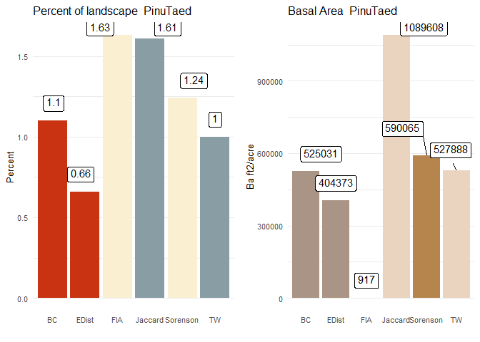
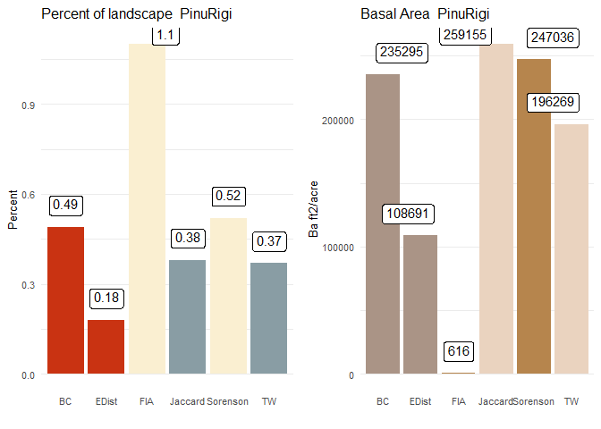

Initial Communities
================
ZJ
March 25, 2019

Initial Communities:

Within LANDIS-II each raster is given an initial community, describing
the biomass for each age class of each species present. This requires
that data both represent landscape coverage (containign sufficient data
about the location of certain stands) and be representative of
demographics ( for example, age class is not usually known, nor are
sufficient measure of carbon or biomass). The FIA database (Bechotld and
Patterson 2005) while often one of the richest source of data on forest
stands is nowhere near to contiguous and the locatplots. Conversly,
imputation maps can estimate the amount (in basal area ) of each tree
species expected at each location, but often lack the more robust data
needed for stand age and biomass. Our goal is therefore to create an
initial communities mpa that integrates the strengths of both these
methods. We will use the spatial estimations provided by imputation data
and associate it with current and recent FIA plot to take advantage of
their more robust data. We will use several indexes of similarity (or
dissimilarity) to compare imputed raster cell compositions with the
composition of FIA sites, assuming that the FIA sites provide a stand-in
example for a stand of that type.

Bechtold, W. A., & Patterson, P. L. (2005). The enhanced forest
inventory and analysis program–national sampling design and estimation
procedures (Vol. 80). USDA Forest Service, Southern Research Station.

\#\#\#\#FS imputation maps

We begin by using FS imputation maps(Wilson et al., 2013). These maps
can be found at
<https://www.fs.usda.gov/rds/archive/Product/RDS-2013-0013>. These maps
were created combining MODIS imagery with environmental variables, using
a k-nearest neighbor and canonical correspondence analysis to estimate
the abundance and distribution of each species at a 250 m pixel size
(Wilson et al., 2013).

Citation: Wilson, Barry Tyler; Lister, Andrew J.; Riemann, Rachel I.;
Griffith, Douglas M. 2013. Live tree species basal area of the
contiguous United States (2000-2009). Newtown Square, PA: USDA Forest
Service, Rocky Mountain Research Station.
<https://doi.org/10.2737/RDS-2013-0013>

First, each map was reprojected and masked to the study area.

Here is what the intial maps looked like and here is our reprojection
and masking

<!-- -->

Once we create the speices basal area maps we need to associate each
sites basal area composition with an FIA site. We used four differnt
comparison methods to compare to the FIA data we have gathered
[here](https://github.com/LANDIS-II-Foundation/Project-Southern-Appalachians-2018/tree/master/Parameterizing/FIA%20Analysis)

    ## Warning in showSRID(uprojargs, format = "PROJ", multiline = "NO"): Discarded datum Unknown based on GRS80 ellipsoid in CRS definition,
    ##  but +towgs84= values preserved
    
    ## Warning in showSRID(uprojargs, format = "PROJ", multiline = "NO"): Discarded datum Unknown based on GRS80 ellipsoid in CRS definition,
    ##  but +towgs84= values preserved
    
    ## Warning in showSRID(uprojargs, format = "PROJ", multiline = "NO"): Discarded datum Unknown based on GRS80 ellipsoid in CRS definition,
    ##  but +towgs84= values preserved
    
    ## Warning in showSRID(uprojargs, format = "PROJ", multiline = "NO"): Discarded datum Unknown based on GRS80 ellipsoid in CRS definition,
    ##  but +towgs84= values preserved
    
    ## Warning in showSRID(uprojargs, format = "PROJ", multiline = "NO"): Discarded datum Unknown based on GRS80 ellipsoid in CRS definition,
    ##  but +towgs84= values preserved
    
    ## Warning in showSRID(uprojargs, format = "PROJ", multiline = "NO"): Discarded datum Unknown based on GRS80 ellipsoid in CRS definition,
    ##  but +towgs84= values preserved
    
    ## Warning in showSRID(uprojargs, format = "PROJ", multiline = "NO"): Discarded datum Unknown based on GRS80 ellipsoid in CRS definition,
    ##  but +towgs84= values preserved
    
    ## Warning in showSRID(uprojargs, format = "PROJ", multiline = "NO"): Discarded datum Unknown based on GRS80 ellipsoid in CRS definition,
    ##  but +towgs84= values preserved
    
    ## Warning in showSRID(uprojargs, format = "PROJ", multiline = "NO"): Discarded datum Unknown based on GRS80 ellipsoid in CRS definition,
    ##  but +towgs84= values preserved
    
    ## Warning in showSRID(uprojargs, format = "PROJ", multiline = "NO"): Discarded datum Unknown based on GRS80 ellipsoid in CRS definition,
    ##  but +towgs84= values preserved
    
    ## Warning in showSRID(uprojargs, format = "PROJ", multiline = "NO"): Discarded datum Unknown based on GRS80 ellipsoid in CRS definition,
    ##  but +towgs84= values preserved
    
    ## Warning in showSRID(uprojargs, format = "PROJ", multiline = "NO"): Discarded datum Unknown based on GRS80 ellipsoid in CRS definition,
    ##  but +towgs84= values preserved
    
    ## Warning in showSRID(uprojargs, format = "PROJ", multiline = "NO"): Discarded datum Unknown based on GRS80 ellipsoid in CRS definition,
    ##  but +towgs84= values preserved
    
    ## Warning in showSRID(uprojargs, format = "PROJ", multiline = "NO"): Discarded datum Unknown based on GRS80 ellipsoid in CRS definition,
    ##  but +towgs84= values preserved
    
    ## Warning in showSRID(uprojargs, format = "PROJ", multiline = "NO"): Discarded datum Unknown based on GRS80 ellipsoid in CRS definition,
    ##  but +towgs84= values preserved
    
    ## Warning in showSRID(uprojargs, format = "PROJ", multiline = "NO"): Discarded datum Unknown based on GRS80 ellipsoid in CRS definition,
    ##  but +towgs84= values preserved
    
    ## Warning in showSRID(uprojargs, format = "PROJ", multiline = "NO"): Discarded datum Unknown based on GRS80 ellipsoid in CRS definition,
    ##  but +towgs84= values preserved
    
    ## Warning in showSRID(uprojargs, format = "PROJ", multiline = "NO"): Discarded datum Unknown based on GRS80 ellipsoid in CRS definition,
    ##  but +towgs84= values preserved
    
    ## Warning in showSRID(uprojargs, format = "PROJ", multiline = "NO"): Discarded datum Unknown based on GRS80 ellipsoid in CRS definition,
    ##  but +towgs84= values preserved
    
    ## Warning in showSRID(uprojargs, format = "PROJ", multiline = "NO"): Discarded datum Unknown based on GRS80 ellipsoid in CRS definition,
    ##  but +towgs84= values preserved
    
    ## Warning in showSRID(uprojargs, format = "PROJ", multiline = "NO"): Discarded datum Unknown based on GRS80 ellipsoid in CRS definition,
    ##  but +towgs84= values preserved
    
    ## Warning in showSRID(uprojargs, format = "PROJ", multiline = "NO"): Discarded datum Unknown based on GRS80 ellipsoid in CRS definition,
    ##  but +towgs84= values preserved
    
    ## Warning in showSRID(uprojargs, format = "PROJ", multiline = "NO"): Discarded datum Unknown based on GRS80 ellipsoid in CRS definition,
    ##  but +towgs84= values preserved
    
    ## Warning in showSRID(uprojargs, format = "PROJ", multiline = "NO"): Discarded datum Unknown based on GRS80 ellipsoid in CRS definition,
    ##  but +towgs84= values preserved
    
    ## Warning in showSRID(uprojargs, format = "PROJ", multiline = "NO"): Discarded datum Unknown based on GRS80 ellipsoid in CRS definition,
    ##  but +towgs84= values preserved
    
    ## Warning in showSRID(uprojargs, format = "PROJ", multiline = "NO"): Discarded datum Unknown based on GRS80 ellipsoid in CRS definition,
    ##  but +towgs84= values preserved
    
    ## Warning in showSRID(uprojargs, format = "PROJ", multiline = "NO"): Discarded datum Unknown based on GRS80 ellipsoid in CRS definition,
    ##  but +towgs84= values preserved
    
    ## Warning in showSRID(uprojargs, format = "PROJ", multiline = "NO"): Discarded datum Unknown based on GRS80 ellipsoid in CRS definition,
    ##  but +towgs84= values preserved
    
    ## Warning in showSRID(uprojargs, format = "PROJ", multiline = "NO"): Discarded datum Unknown based on GRS80 ellipsoid in CRS definition,
    ##  but +towgs84= values preserved
    
    ## Warning in showSRID(uprojargs, format = "PROJ", multiline = "NO"): Discarded datum Unknown based on GRS80 ellipsoid in CRS definition,
    ##  but +towgs84= values preserved
    
    ## Warning in showSRID(uprojargs, format = "PROJ", multiline = "NO"): Discarded datum Unknown based on GRS80 ellipsoid in CRS definition,
    ##  but +towgs84= values preserved
    
    ## Warning in showSRID(uprojargs, format = "PROJ", multiline = "NO"): Discarded datum Unknown based on GRS80 ellipsoid in CRS definition,
    ##  but +towgs84= values preserved
    
    ## Warning in showSRID(uprojargs, format = "PROJ", multiline = "NO"): Discarded datum Unknown based on GRS80 ellipsoid in CRS definition,
    ##  but +towgs84= values preserved
    
    ## Warning in showSRID(uprojargs, format = "PROJ", multiline = "NO"): Discarded datum Unknown based on GRS80 ellipsoid in CRS definition,
    ##  but +towgs84= values preserved
    
    ## Warning in showSRID(uprojargs, format = "PROJ", multiline = "NO"): Discarded datum Unknown based on GRS80 ellipsoid in CRS definition,
    ##  but +towgs84= values preserved
    
    ## Warning in showSRID(uprojargs, format = "PROJ", multiline = "NO"): Discarded datum Unknown based on GRS80 ellipsoid in CRS definition,
    ##  but +towgs84= values preserved
    
    ## Warning in showSRID(uprojargs, format = "PROJ", multiline = "NO"): Discarded datum Unknown based on GRS80 ellipsoid in CRS definition,
    ##  but +towgs84= values preserved
    
    ## Warning in showSRID(uprojargs, format = "PROJ", multiline = "NO"): Discarded datum Unknown based on GRS80 ellipsoid in CRS definition,
    ##  but +towgs84= values preserved
    
    ## Warning in showSRID(uprojargs, format = "PROJ", multiline = "NO"): Discarded datum Unknown based on GRS80 ellipsoid in CRS definition,
    ##  but +towgs84= values preserved
    
    ## Warning in showSRID(uprojargs, format = "PROJ", multiline = "NO"): Discarded datum Unknown based on GRS80 ellipsoid in CRS definition,
    ##  but +towgs84= values preserved
    
    ## Warning in showSRID(uprojargs, format = "PROJ", multiline = "NO"): Discarded datum Unknown based on GRS80 ellipsoid in CRS definition,
    ##  but +towgs84= values preserved
    
    ## Warning in showSRID(uprojargs, format = "PROJ", multiline = "NO"): Discarded datum Unknown based on GRS80 ellipsoid in CRS definition,
    ##  but +towgs84= values preserved
    
    ## Warning in showSRID(uprojargs, format = "PROJ", multiline = "NO"): Discarded datum Unknown based on GRS80 ellipsoid in CRS definition,
    ##  but +towgs84= values preserved
    
    ## Warning in showSRID(uprojargs, format = "PROJ", multiline = "NO"): Discarded datum Unknown based on GRS80 ellipsoid in CRS definition,
    ##  but +towgs84= values preserved
    
    ## Warning in showSRID(uprojargs, format = "PROJ", multiline = "NO"): Discarded datum Unknown based on GRS80 ellipsoid in CRS definition,
    ##  but +towgs84= values preserved
    
    ## Warning in showSRID(uprojargs, format = "PROJ", multiline = "NO"): Discarded datum Unknown based on GRS80 ellipsoid in CRS definition,
    ##  but +towgs84= values preserved
    
    ## Warning in showSRID(uprojargs, format = "PROJ", multiline = "NO"): Discarded datum Unknown based on GRS80 ellipsoid in CRS definition,
    ##  but +towgs84= values preserved
    
    ## Warning in showSRID(uprojargs, format = "PROJ", multiline = "NO"): Discarded datum Unknown based on GRS80 ellipsoid in CRS definition,
    ##  but +towgs84= values preserved
    
    ## Warning in showSRID(uprojargs, format = "PROJ", multiline = "NO"): Discarded datum Unknown based on GRS80 ellipsoid in CRS definition,
    ##  but +towgs84= values preserved
    
    ## Warning in showSRID(uprojargs, format = "PROJ", multiline = "NO"): Discarded datum Unknown based on GRS80 ellipsoid in CRS definition,
    ##  but +towgs84= values preserved

<!-- -->

We created dataframes of each site (imputation data, and FIA plots)
reformatted to have matching features with regard to basal area. In this
case, that is a basal areasum for each species, and a basal area sum for
each total plot in units of a gram per meter squared. Then each raster
cell is evaluated against each plot for dissimilarity using a formula
such as this:

``` r
####This is the New_Sorensons_Similarity_function

New_Sorensons_Similarity<-function(Break,Plt_DF_2){####Break is just our cr_bi_spp broken down for speed
                                                    ####Plt_DF_2 is the FIA product above
 ###Create Null objects to feed
  Log<-NULL
  Output<-NULL
  for(j in 1:nrow(Break)){
    ##Each raster cell
    practice<-Break[j,]
    cell<-practice$Cell
    print(cell)
    ####Get just the trees, no sums
    finder1<-practice[,c(-51,-52)]
    Sample1<-Plt_DF_2
    Sample2<-finder1
    DeltaSamples<-NULL
    ###Preforming the Indexing
    if(!is.null(nrow(Sample2))){
      for(i in 1:length(Sample2)){
        #The top half of the function
        ###is a iterable maximum function.
        absw=abs(Sample2[,i]-Sample1[,i])
        mixed<-(Sample2[,i]+Sample1[,i])
        top<-(mixed-absw)
        halfed=.5*top
        DeltaSamples<-cbind(DeltaSamples,halfed)
        
      }
    }
    ###The sum of Top
      Top<-rowSums(DeltaSamples)
    ###The sum of bottom     
      Bottom<-Plt_DF_2[,51]+practice[,51]
    ###The index
    index<-Top/Bottom
   ###Assign each site its index
    Plt_indexed<-cbind(Plt_DF_2,index)
   ###Find the one with the highest index
    Closestplot<-max(Plt_indexed[,52][Plt_indexed[,53]==max(index)])
    #Record the score
    indexscore<-(Plt_indexed$index[Plt_indexed$Plt_CN==Closestplot])
    ###Create a row of the cell, its assinged plot and the score
    row<-cbind(cell,Closestplot,indexscore)    
    Output<-rbind(row,Output)
    ###This is for analysis log
    row2<-cbind(j,indexscore,finder1)
    row3<-cbind(j,indexscore,Plt_DF_2[Plt_DF_2$Plt_CN==Closestplot,])
    row3<-row3[,c(-53,-54)]
    colnames(row3)<-c("iteration","index",'ABFR','PICRU','PIEC2','PIPU5','PIRI','PIST','PITA','PIVI2','TSCA','ACPE','ACRU','ACSA3','AEFL',
                      'AMAR','BEAL','BELE','BENI','CACA18','CARCO','CARGL','CAROV','CARAL','CASDE','COFL2','FAGR','FAXI','FAPE','HADI','ILOP',
                      'JUNI','LIST2','LITU','MAAC','MAMA','NYSY','OXAR','PLOC','PRPE','PRSE','QULA2','QUCO2','QUFA','QUPR2','QURU','QUST',
                      'LIST2','LITU',"OXAR","TIAM","TIAM2")
    colnames(row2)<-c("iteration","index",'ABFR','PICRU','PIEC2','PIPU5','PIRI','PIST','PITA','PIVI2','TSCA','ACPE','ACRU','ACSA3','AEFL',
                      'AMAR','BEAL','BELE','BENI','CACA18','CARCO','CARGL','CAROV','CARAL','CASDE','COFL2','FAGR','FAXI','FAPE','HADI','ILOP',
                      'JUNI','LIST2','LITU','MAAC','MAMA','NYSY','OXAR','PLOC','PRPE','PRSE','QULA2','QUCO2','QUFA','QUPR2','QURU','QUST',
                      'LIST2','LITU',"OXAR","TIAM","TIAM2")
    Log<-rbind(Log,row2,row3)
    
  }
  
  return(list(Output,Log))
}
```

The formulas we used for this were,

Bray Curtis: \(1- ((2Cij)/Si+Sj)\)

where C is the Basal area of species in common between the two sites and
S is the total basal area at each site.

Jaccards: \(1- (Ci+Cj/Si+Sj)\) The Basal area of species that are
include in both sites(inclusive) divided by the the totals

Euclidean Distance: \(Sqrt((ai+aj)^2+(bi+bj)^2..(ni+nj)^2)\) the common
biomass is square and the square root of the sum is taken.

And Sorensens:

\(\frac{2*\sum(min(aij+bij))}{Si+Sj}\)

The two least dissimilar plots are assigned to one another. This process
is repeated for site on the landscape.

We tested several associations to compare the results with the initial
communities maps and the FIA data we had gathered earlier

#### Method Comparison

Here we compared the four methods.

We looked at each method for its comparison of total basal area. All
methods somewhat overestimated the Basal area, with Sorensen’s and Bray
Curtis being the closest.

<!-- -->

This plot shows the number of FIA plots utilized in each analysis, with
the FIA number being the total number in the evaluation. The Bray Curtis
analysis utilized the most, with the Euclidian distance utilizing the
least.

<!-- -->

This model prediction of assemblage is a comparison from the output to
the FIA and Imputed data we have on species composition. Because the
associations select the least dissimilar plot, there is a possibility
for the inclusion or exclusion of species in the association. We find
here the Sorensen’s plots are the most accurate in terms of assemblage
to both the FIA and imputed maps.

<!-- -->

In looking at each species estimated basal from the imputed maps,
Sorenson’s shows the least variation across the 50 species. In the end,
we chose the Sorenson’s association because it best represented the
species assemblage, on a landscape that had many species.

<!-- -->

#### Height Age and Site Index Association.

Once we had the plots associated with each raster we used the values
from FIA to get age and biomass,using to Carmean Hann, and Jacobs (1989)
method to associate age with height and site index. In this method
species has unique parameters to its growth curve, which is used with
its height and site index to estimate its age.

\(AgeT=(1/c_3)*ln[1-\frac{HT}{c1*SI^{c2}}]^{(\frac{1}{c4})*(SI^{c5})}\)

Citation: Carmean, W. H., Hahn, J. T., & Jacobs, R. D. (1989). Site
index curves for forest tree species in the eastern United States.
General Technical Report NC-128. St. Paul, MN: US Dept. of Agriculture,
Forest Service, North Central Forest Experiment Station, 128.

This is used in combination with the allometric biomass for each tree
from the FIA database to determine the biomass and age of each cohort.

| Species | Species Name                       | b1     | b2     | b3       | b4      | b5       |
| :------ | :--------------------------------- | :----- | :----- | :------- | :------ | :------- |
| 16      | Fraser fir.                        | 2.0770 | 0.9303 | \-0.0285 | 2.8937  | \-0.1414 |
| 97      | Picea rubens                       | 1.3307 | 1.0442 | \-0.0496 | 3.5829  | 0.0945   |
| 110     | Pinus echinata                     | 1.4232 | 0.9989 | \-0.0285 | 1.2156  | 0.0088   |
| 123     | Pinus Pungens(Table Mountain Pine) | 0.9276 | 1.0591 | \-0.0424 | 0.3529  | 0.3114   |
| 126     | Pinus rigida                       | 1.1204 | 0.9984 | \-0.0597 | 2.4480  | \-0.0284 |
| 129     | Pinus strobus                      | 3.2425 | 0.7980 | \-0.0435 | 52.0549 | \-0.7064 |
| 131     | Pinus taeda                        | 1.1421 | 1.0042 | \-0.0374 | 0.7632  | 0.0358   |
| 132     | Pinus Virginiana                   | 1.1204 | 0.9984 | \-0.0597 | 2.4448  | \-0.0284 |
| 261     | Tsuga Canadenesis                  | 2.1493 | 0.9979 | \-0.0175 | 1.4086  | \-0.0008 |
| 315     | Acer Pensylvanicum                 | 2.9435 | 0.9132 | \-0.0141 | 1.6580  | \-0.1095 |

To validate we compared the age distribution with that found in the FIA
record.

These distribution were determined to be acceptable, though caution
should be given in determining the demographics of undersampled species
like Prunus pensylvanica, Picea rubens, and Betula nigra.

<!-- -->

Here is the distribution of DBH classes by species.

<!-- -->

Once assigned age to each stand we used the FIA calculation of above
ground carbon to estimate aboveground biomass. This is done by
multiplying the above ground carbon by the FIA growing trees per acre
multiplier(TPA\_adj), convert it from ft2 per acre to g/m2 and multiply
it by two to represent above ground biomass.

We can then look at the distribution of age curves versus total carbon,
our oaks and pines seem to be the most represented and also have higher
carbon values, we will have to be careful in our landscape runs to check
how the sparse species persist on the landscape.

Here are the results of that association.

<!-- --><!-- -->

##### Print the Initial Communites map.

We can assign the basal area values from our association to look at some
of the landscape features of our species.

##### The Top Ten Species On The Landscape

    ## Warning in showSRID(uprojargs, format = "PROJ", multiline = "NO"): Discarded datum Unknown based on GRS80 ellipsoid in CRS definition,
    ##  but +towgs84= values preserved
    
    ## Warning in showSRID(uprojargs, format = "PROJ", multiline = "NO"): Discarded datum Unknown based on GRS80 ellipsoid in CRS definition,
    ##  but +towgs84= values preserved
    
    ## Warning in showSRID(uprojargs, format = "PROJ", multiline = "NO"): Discarded datum Unknown based on GRS80 ellipsoid in CRS definition,
    ##  but +towgs84= values preserved
    
    ## Warning in showSRID(uprojargs, format = "PROJ", multiline = "NO"): Discarded datum Unknown based on GRS80 ellipsoid in CRS definition,
    ##  but +towgs84= values preserved
    
    ## Warning in showSRID(uprojargs, format = "PROJ", multiline = "NO"): Discarded datum Unknown based on GRS80 ellipsoid in CRS definition,
    ##  but +towgs84= values preserved
    
    ## Warning in showSRID(uprojargs, format = "PROJ", multiline = "NO"): Discarded datum Unknown based on GRS80 ellipsoid in CRS definition,
    ##  but +towgs84= values preserved
    
    ## Warning in showSRID(uprojargs, format = "PROJ", multiline = "NO"): Discarded datum Unknown based on GRS80 ellipsoid in CRS definition,
    ##  but +towgs84= values preserved
    
    ## Warning in showSRID(uprojargs, format = "PROJ", multiline = "NO"): Discarded datum Unknown based on GRS80 ellipsoid in CRS definition,
    ##  but +towgs84= values preserved
    
    ## Warning in showSRID(uprojargs, format = "PROJ", multiline = "NO"): Discarded datum Unknown based on GRS80 ellipsoid in CRS definition,
    ##  but +towgs84= values preserved
    
    ## Warning in showSRID(uprojargs, format = "PROJ", multiline = "NO"): Discarded datum Unknown based on GRS80 ellipsoid in CRS definition,
    ##  but +towgs84= values preserved
    
    ## Warning in showSRID(uprojargs, format = "PROJ", multiline = "NO"): Discarded datum Unknown based on GRS80 ellipsoid in CRS definition,
    ##  but +towgs84= values preserved

<!-- -->

#### Our total landscape basal area.

Here is our total landscape basal area.

    ## Warning in showSRID(uprojargs, format = "PROJ", multiline = "NO"): Discarded datum Unknown based on GRS80 ellipsoid in CRS definition,
    ##  but +towgs84= values preserved
    
    ## Warning in showSRID(uprojargs, format = "PROJ", multiline = "NO"): Discarded datum Unknown based on GRS80 ellipsoid in CRS definition,
    ##  but +towgs84= values preserved

<!-- -->

We can see much of our spatial distribution is the same, however, we
might have a less intense cluster around some of the national park areas
in the center of the map.

In analyzing the difference in the basal area we can see there is an
11.5 % percent difference in total basal area, this must be taken into
account when assessing the initial conditions of the map, however, given
that there is no empirical way to validate either method of association
this seems a reasonale amount of error.

    ## Warning in showSRID(uprojargs, format = "PROJ", multiline = "NO"): Discarded datum Unknown based on GRS80 ellipsoid in CRS definition,
    ##  but +towgs84= values preserved

<!-- -->

Here we look at the total differnce on the landscape.

    ## [1] "Basal Area on our landscape 47423420.9834728"

    ## [1] "Basal Area according to Ty Wilson 52891422.8443619"

    ## [1] "This is a 11.53 % difference"

Here is a map looking at which areas the basal areas diverge in negative
values indicate where we underestimate the imputation maps,

<!-- -->

We can also look at the above ground biomass for our most prevalent
species and the total carbon on the landscape.

<!-- -->

Here we can also see the total above carbon ground on the landscape.

    ## Warning in showSRID(uprojargs, format = "PROJ", multiline = "NO"): Discarded datum Unknown based on GRS80 ellipsoid in CRS definition,
    ##  but +towgs84= values preserved
    
    ## Warning in showSRID(uprojargs, format = "PROJ", multiline = "NO"): Discarded datum Unknown based on GRS80 ellipsoid in CRS definition,
    ##  but +towgs84= values preserved

<!-- -->

##### Appendix

1)  Individual species association by similarity index

This is the comparison of each species in each method to its values in
FIA, and the imputation maps.

    ## Warning: Use of `Onesp$percent` is discouraged. Use `percent` instead.
    
    ## Warning: Use of `Onesp$percent` is discouraged. Use `percent` instead.
    
    ## Warning: Use of `Onesp$percent` is discouraged. Use `percent` instead.

    ## Warning: Use of `Onesp$SumBA` is discouraged. Use `SumBA` instead.
    
    ## Warning: Use of `Onesp$SumBA` is discouraged. Use `SumBA` instead.
    
    ## Warning: Use of `Onesp$SumBA` is discouraged. Use `SumBA` instead.

    ## Warning: Use of `Onesp$percent` is discouraged. Use `percent` instead.
    
    ## Warning: Use of `Onesp$percent` is discouraged. Use `percent` instead.
    
    ## Warning: Use of `Onesp$percent` is discouraged. Use `percent` instead.

    ## Warning: Use of `Onesp$SumBA` is discouraged. Use `SumBA` instead.
    
    ## Warning: Use of `Onesp$SumBA` is discouraged. Use `SumBA` instead.
    
    ## Warning: Use of `Onesp$SumBA` is discouraged. Use `SumBA` instead.

<!-- -->

    ## Warning: Use of `Onesp$percent` is discouraged. Use `percent` instead.

    ## Warning: Use of `Onesp$percent` is discouraged. Use `percent` instead.
    
    ## Warning: Use of `Onesp$percent` is discouraged. Use `percent` instead.

    ## Warning: Use of `Onesp$SumBA` is discouraged. Use `SumBA` instead.
    
    ## Warning: Use of `Onesp$SumBA` is discouraged. Use `SumBA` instead.
    
    ## Warning: Use of `Onesp$SumBA` is discouraged. Use `SumBA` instead.

<!-- -->

    ## Warning: Use of `Onesp$percent` is discouraged. Use `percent` instead.

    ## Warning: Use of `Onesp$percent` is discouraged. Use `percent` instead.
    
    ## Warning: Use of `Onesp$percent` is discouraged. Use `percent` instead.

    ## Warning: Use of `Onesp$SumBA` is discouraged. Use `SumBA` instead.
    
    ## Warning: Use of `Onesp$SumBA` is discouraged. Use `SumBA` instead.
    
    ## Warning: Use of `Onesp$SumBA` is discouraged. Use `SumBA` instead.

<!-- -->

    ## Warning: Use of `Onesp$percent` is discouraged. Use `percent` instead.

    ## Warning: Use of `Onesp$percent` is discouraged. Use `percent` instead.
    
    ## Warning: Use of `Onesp$percent` is discouraged. Use `percent` instead.

    ## Warning: Use of `Onesp$SumBA` is discouraged. Use `SumBA` instead.
    
    ## Warning: Use of `Onesp$SumBA` is discouraged. Use `SumBA` instead.
    
    ## Warning: Use of `Onesp$SumBA` is discouraged. Use `SumBA` instead.

<!-- -->

    ## Warning: Use of `Onesp$percent` is discouraged. Use `percent` instead.

    ## Warning: Use of `Onesp$percent` is discouraged. Use `percent` instead.
    
    ## Warning: Use of `Onesp$percent` is discouraged. Use `percent` instead.

    ## Warning: Use of `Onesp$SumBA` is discouraged. Use `SumBA` instead.
    
    ## Warning: Use of `Onesp$SumBA` is discouraged. Use `SumBA` instead.
    
    ## Warning: Use of `Onesp$SumBA` is discouraged. Use `SumBA` instead.

<!-- -->

    ## Warning: Use of `Onesp$percent` is discouraged. Use `percent` instead.

    ## Warning: Use of `Onesp$percent` is discouraged. Use `percent` instead.
    
    ## Warning: Use of `Onesp$percent` is discouraged. Use `percent` instead.

    ## Warning: Use of `Onesp$SumBA` is discouraged. Use `SumBA` instead.
    
    ## Warning: Use of `Onesp$SumBA` is discouraged. Use `SumBA` instead.
    
    ## Warning: Use of `Onesp$SumBA` is discouraged. Use `SumBA` instead.

<!-- -->

    ## Warning: Use of `Onesp$percent` is discouraged. Use `percent` instead.

    ## Warning: Use of `Onesp$percent` is discouraged. Use `percent` instead.
    
    ## Warning: Use of `Onesp$percent` is discouraged. Use `percent` instead.

    ## Warning: Use of `Onesp$SumBA` is discouraged. Use `SumBA` instead.
    
    ## Warning: Use of `Onesp$SumBA` is discouraged. Use `SumBA` instead.
    
    ## Warning: Use of `Onesp$SumBA` is discouraged. Use `SumBA` instead.

<!-- -->

    ## Warning: Use of `Onesp$percent` is discouraged. Use `percent` instead.

    ## Warning: Use of `Onesp$percent` is discouraged. Use `percent` instead.
    
    ## Warning: Use of `Onesp$percent` is discouraged. Use `percent` instead.

    ## Warning: Use of `Onesp$SumBA` is discouraged. Use `SumBA` instead.
    
    ## Warning: Use of `Onesp$SumBA` is discouraged. Use `SumBA` instead.
    
    ## Warning: Use of `Onesp$SumBA` is discouraged. Use `SumBA` instead.

<!-- -->

    ## Warning: Use of `Onesp$percent` is discouraged. Use `percent` instead.

    ## Warning: Use of `Onesp$percent` is discouraged. Use `percent` instead.
    
    ## Warning: Use of `Onesp$percent` is discouraged. Use `percent` instead.

    ## Warning: Use of `Onesp$SumBA` is discouraged. Use `SumBA` instead.
    
    ## Warning: Use of `Onesp$SumBA` is discouraged. Use `SumBA` instead.
    
    ## Warning: Use of `Onesp$SumBA` is discouraged. Use `SumBA` instead.

<!-- -->

    ## Warning: Use of `Onesp$percent` is discouraged. Use `percent` instead.

    ## Warning: Use of `Onesp$percent` is discouraged. Use `percent` instead.
    
    ## Warning: Use of `Onesp$percent` is discouraged. Use `percent` instead.

    ## Warning: Use of `Onesp$SumBA` is discouraged. Use `SumBA` instead.
    
    ## Warning: Use of `Onesp$SumBA` is discouraged. Use `SumBA` instead.
    
    ## Warning: Use of `Onesp$SumBA` is discouraged. Use `SumBA` instead.

<!-- -->

    ## Warning: Use of `Onesp$percent` is discouraged. Use `percent` instead.

    ## Warning: Use of `Onesp$percent` is discouraged. Use `percent` instead.
    
    ## Warning: Use of `Onesp$percent` is discouraged. Use `percent` instead.

    ## Warning: Use of `Onesp$SumBA` is discouraged. Use `SumBA` instead.
    
    ## Warning: Use of `Onesp$SumBA` is discouraged. Use `SumBA` instead.
    
    ## Warning: Use of `Onesp$SumBA` is discouraged. Use `SumBA` instead.

<!-- -->

    ## Warning: Use of `Onesp$percent` is discouraged. Use `percent` instead.

    ## Warning: Use of `Onesp$percent` is discouraged. Use `percent` instead.
    
    ## Warning: Use of `Onesp$percent` is discouraged. Use `percent` instead.

    ## Warning: Use of `Onesp$SumBA` is discouraged. Use `SumBA` instead.
    
    ## Warning: Use of `Onesp$SumBA` is discouraged. Use `SumBA` instead.
    
    ## Warning: Use of `Onesp$SumBA` is discouraged. Use `SumBA` instead.

<!-- -->

    ## Warning: Use of `Onesp$percent` is discouraged. Use `percent` instead.

    ## Warning: Use of `Onesp$percent` is discouraged. Use `percent` instead.
    
    ## Warning: Use of `Onesp$percent` is discouraged. Use `percent` instead.

    ## Warning: Use of `Onesp$SumBA` is discouraged. Use `SumBA` instead.
    
    ## Warning: Use of `Onesp$SumBA` is discouraged. Use `SumBA` instead.
    
    ## Warning: Use of `Onesp$SumBA` is discouraged. Use `SumBA` instead.

<!-- -->

    ## Warning: Use of `Onesp$percent` is discouraged. Use `percent` instead.

    ## Warning: Use of `Onesp$percent` is discouraged. Use `percent` instead.
    
    ## Warning: Use of `Onesp$percent` is discouraged. Use `percent` instead.

    ## Warning: Use of `Onesp$SumBA` is discouraged. Use `SumBA` instead.
    
    ## Warning: Use of `Onesp$SumBA` is discouraged. Use `SumBA` instead.
    
    ## Warning: Use of `Onesp$SumBA` is discouraged. Use `SumBA` instead.

<!-- -->

    ## Warning: Use of `Onesp$percent` is discouraged. Use `percent` instead.

    ## Warning: Use of `Onesp$percent` is discouraged. Use `percent` instead.
    
    ## Warning: Use of `Onesp$percent` is discouraged. Use `percent` instead.

    ## Warning: Use of `Onesp$SumBA` is discouraged. Use `SumBA` instead.
    
    ## Warning: Use of `Onesp$SumBA` is discouraged. Use `SumBA` instead.
    
    ## Warning: Use of `Onesp$SumBA` is discouraged. Use `SumBA` instead.

<!-- -->

    ## Warning: Use of `Onesp$percent` is discouraged. Use `percent` instead.

    ## Warning: Use of `Onesp$percent` is discouraged. Use `percent` instead.
    
    ## Warning: Use of `Onesp$percent` is discouraged. Use `percent` instead.

    ## Warning: Use of `Onesp$SumBA` is discouraged. Use `SumBA` instead.
    
    ## Warning: Use of `Onesp$SumBA` is discouraged. Use `SumBA` instead.
    
    ## Warning: Use of `Onesp$SumBA` is discouraged. Use `SumBA` instead.

<!-- -->

    ## Warning: Use of `Onesp$percent` is discouraged. Use `percent` instead.

    ## Warning: Use of `Onesp$percent` is discouraged. Use `percent` instead.
    
    ## Warning: Use of `Onesp$percent` is discouraged. Use `percent` instead.

    ## Warning: Use of `Onesp$SumBA` is discouraged. Use `SumBA` instead.
    
    ## Warning: Use of `Onesp$SumBA` is discouraged. Use `SumBA` instead.
    
    ## Warning: Use of `Onesp$SumBA` is discouraged. Use `SumBA` instead.

<!-- -->

    ## Warning: Use of `Onesp$percent` is discouraged. Use `percent` instead.

    ## Warning: Use of `Onesp$percent` is discouraged. Use `percent` instead.
    
    ## Warning: Use of `Onesp$percent` is discouraged. Use `percent` instead.

    ## Warning: Use of `Onesp$SumBA` is discouraged. Use `SumBA` instead.
    
    ## Warning: Use of `Onesp$SumBA` is discouraged. Use `SumBA` instead.
    
    ## Warning: Use of `Onesp$SumBA` is discouraged. Use `SumBA` instead.

<!-- -->

    ## Warning: Use of `Onesp$percent` is discouraged. Use `percent` instead.

    ## Warning: Use of `Onesp$percent` is discouraged. Use `percent` instead.
    
    ## Warning: Use of `Onesp$percent` is discouraged. Use `percent` instead.

    ## Warning: Use of `Onesp$SumBA` is discouraged. Use `SumBA` instead.
    
    ## Warning: Use of `Onesp$SumBA` is discouraged. Use `SumBA` instead.
    
    ## Warning: Use of `Onesp$SumBA` is discouraged. Use `SumBA` instead.

<!-- -->

    ## Warning: Use of `Onesp$percent` is discouraged. Use `percent` instead.

    ## Warning: Use of `Onesp$percent` is discouraged. Use `percent` instead.
    
    ## Warning: Use of `Onesp$percent` is discouraged. Use `percent` instead.

    ## Warning: Use of `Onesp$SumBA` is discouraged. Use `SumBA` instead.
    
    ## Warning: Use of `Onesp$SumBA` is discouraged. Use `SumBA` instead.
    
    ## Warning: Use of `Onesp$SumBA` is discouraged. Use `SumBA` instead.

<!-- --><!-- -->
