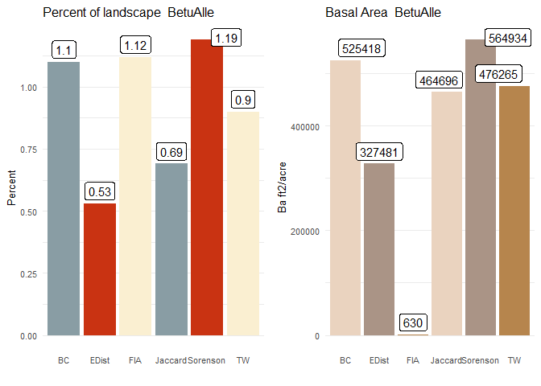

Initial Communities
================
ZJ
March 25, 2019


> The Initial Communities consist of a map and text file of the  the biomass and age for each species in each grid cell.  To accomplish this we synthesized basal area imputation maps (Wilson et al., 2013) with individual forest stand census’s (FIA). Basal area as a total and for each individual species was associated with an individual plot using the a Sorenson’s association, more information on this association testing can be found at https://github.com/LANDIS-II-Foundation/Project-Southern-Appalachians-2018/tree/master/Parameterizing/Forests/InitialCommunities. Individual sites were used to calculate the total biomass and age of each species. Age was calculated using the method by Carmean Hann, and Jacobs (1989) to associate height and site index with age. 


Initial Communities: In order to parameterize initial communities for LANDIS, you need the age classes and biomass for trees in each raster cell on the landscape. The problem here is one of coverage (have sufficient data about the location of certain stands) and data limitations (age class is not always provided, nor a sufficient measure of carbon or biomass). FIA data while often the richest source of data on forest stands is nowhere near to contiguous and is fuzzed to the public (locations are exchanged within a county) which can provide false spatial relations between trees. Imputation maps can estimate the amount of each tree species expected at each location, but often lack the more robust data needed for stand age and biomass. Our concept here in creating an initial community is to use the strengths of both these methods. We will use the spatial estimations provided by imputation data and associate it with current and recent FIA plot to take advantage of their more robust data. We will use several indexes of similarity ( or dissimilarity) to compare imputed raster cell compositions with the composition of FIA sites, assuming that the FIA sites provide a stand-in example for a stand of that type.

#### FS imputation maps

We begin by using FS imputation maps. These maps can be found at <https://www.fs.usda.gov/rds/archive/Product/RDS-2013-0013>. These maps were created combining MODIS imagery with environmental variables, using a k-nearest neighbor and canonical correspondence analysis to estimate the abundance and distribution of each species at a 250 m pixel size (Wilson et al., 2013).

Citation: Wilson, Barry Tyler; Lister, Andrew J.; Riemann, Rachel I.; Griffith, Douglas M. 2013. Live tree species basal area of the contiguous United States (2000-2009). Newtown Square, PA: USDA Forest Service, Rocky Mountain Research Station. <https://doi.org/10.2737/RDS-2013-0013>

First, each map was reprojected and masked to the study area.

Here is what the intial maps looked like and here is our reprojection and masking


Now that we have a map of those species we need more than the Basal Area. To do this we will do an association by basal area, looking a four different mechanisms of association and look which ones look most like the FIA data we have gathered [here](https://github.com/LANDIS-II-Foundation/Project-Southern-Appalachians-2018/tree/master/Parameterizing/FIA%20Analysis)

We start but looking at the FIA plots we had identified in our FIA analysis and creating a data frame of each possible species in our study. We also will get the total sum for each row.

\*Now we load in our ty wilson maps and turn it into a dataframe. 

Both data frames (imputation data, and FIA plots) are reformatted to have matching features. In this case, that is a basal area sum for each species, and a basal area sum for each total plot in units of a gram per meter squared. Then each raster cell is evaluated against each plot for dissimilarity using a formula such as this:

``` r
####This is the New_Sorensons_Similarity_function

New_Sorensons_Similarity<-function(Break,Plt_DF_2){####Break is just our cr_bi_spp broken down for speed
                                                    ####Plt_DF_2 is the FIA product above
 ###Create Null objects to feed
  Log<-NULL
  Output<-NULL
  for(j in 1:nrow(Break)){
    ##Each raster cell
    practice<-Break[j,]
    cell<-practice$Cell
    print(cell)
    ####Get just the trees, no sums
    finder1<-practice[,c(-51,-52)]
    Sample1<-Plt_DF_2
    Sample2<-finder1
    DeltaSamples<-NULL
    ###Preforming the Indexing
    if(!is.null(nrow(Sample2))){
      for(i in 1:length(Sample2)){
        #The top half of the function
        ###is a iterable maximum function.
        absw=abs(Sample2[,i]-Sample1[,i])
        mixed<-(Sample2[,i]+Sample1[,i])
        top<-(mixed-absw)
        halfed=.5*top
        DeltaSamples<-cbind(DeltaSamples,halfed)
        
      }
    }
    ###The sum of Top
      Top<-rowSums(DeltaSamples)
    ###The sum of bottom     
      Bottom<-Plt_DF_2[,51]+practice[,51]
    ###The index
    index<-Top/Bottom
   ###Assign each site its index
    Plt_indexed<-cbind(Plt_DF_2,index)
   ###Find the one with the highest index
    Closestplot<-max(Plt_indexed[,52][Plt_indexed[,53]==max(index)])
    #Record the score
    indexscore<-(Plt_indexed$index[Plt_indexed$Plt_CN==Closestplot])
    ###Create a row of the cell, its assinged plot and the score
    row<-cbind(cell,Closestplot,indexscore)    
    Output<-rbind(row,Output)
    ###This is for analysis log
    row2<-cbind(j,indexscore,finder1)
    row3<-cbind(j,indexscore,Plt_DF_2[Plt_DF_2$Plt_CN==Closestplot,])
    row3<-row3[,c(-53,-54)]
    colnames(row3)<-c("iteration","index",'ABFR','PICRU','PIEC2','PIPU5','PIRI','PIST','PITA','PIVI2','TSCA','ACPE','ACRU','ACSA3','AEFL',
                      'AMAR','BEAL','BELE','BENI','CACA18','CARCO','CARGL','CAROV','CARAL','CASDE','COFL2','FAGR','FAXI','FAPE','HADI','ILOP',
                      'JUNI','LIST2','LITU','MAAC','MAMA','NYSY','OXAR','PLOC','PRPE','PRSE','QULA2','QUCO2','QUFA','QUPR2','QURU','QUST',
                      'LIST2','LITU',"OXAR","TIAM","TIAM2")
    colnames(row2)<-c("iteration","index",'ABFR','PICRU','PIEC2','PIPU5','PIRI','PIST','PITA','PIVI2','TSCA','ACPE','ACRU','ACSA3','AEFL',
                      'AMAR','BEAL','BELE','BENI','CACA18','CARCO','CARGL','CAROV','CARAL','CASDE','COFL2','FAGR','FAXI','FAPE','HADI','ILOP',
                      'JUNI','LIST2','LITU','MAAC','MAMA','NYSY','OXAR','PLOC','PRPE','PRSE','QULA2','QUCO2','QUFA','QUPR2','QURU','QUST',
                      'LIST2','LITU',"OXAR","TIAM","TIAM2")
    Log<-rbind(Log,row2,row3)
    
  }
  
  return(list(Output,Log))
}
```

The formulas we used for this were,

Bray Curtis: 1 − ((2*C**i**j*)/*S**i* + *S**j*)

where C is the Basal area of species in common between the two sites and S is the total basal area at each site.

Jaccards: 1 − (*C**i* + *C**j*/*S**i* + *S**j*) The Basal area of species that are include in both sites(inclusive) divided by the the totals

Euclidean Distance: *S**q**r**t*((*a**i* + *a**j*)<sup>2</sup> + (*b**i* + *b**j*)<sup>2</sup>..(*n**i* + *n**j*)<sup>2</sup>) the common biomass is square and the square root of the sum is taken.

And Sorensens: $\\frac{2\*\\sum(min(aij+bij))}{Si+Sj}$

The two least dissimilar plots are assigned to one another. This process is repeated for each raster cell.

We tested several associations so we could compare the results with the initial maps and the FIA data we had gathered earlier

#### Method Comparison

Lets look at the four methods to see which is best.

We looked at each method for its comparison of total basal area. All species overestimated the Basal area, with Sorensen's and Bray Curtis being the closest.


This plot shows the number of FIA plots utilized in each analysis, with the FIA number being the total number in the evaluation. The Bray Curtis analysis utilized the most, with the Euclidian distance utilizing the least.


This model prediction of assemblage is a comparison from the output to the FIA and Imputed data we have on species composition. Because the associations select the least dissimilar plot, there is a possibility for the inclusion or exclusion of species in the association. We find here the Sorensen's plots are the most accurate in terms of assemblage to both the FIA and imputed maps.

 In looking at each species estimated Basal from the imputed maps, Sorenson's shows the least variation across the 50 species. In the end, we chose the Sorenson's association because it best represented the species assemblage.

For a project that wants to include so many species, this seems like the right measure to choose. It was also one of the more accurate in terms of total biomass, but we have to be aware of how initial biomass interplays with the equilibrium biomass on our landscape.


#### Height Age and Site Index Association.

Now that we have a plot associated with each raster cell with the need to use the values from FIA to get age and carbon. To do this we will use to Carmean Hann, and Jacobs (1989) to associate age with height and site index. Each species has unique parameters to its growth curve, which is used with its height and site index to estimate its age. Now each tree in each plot will have age and carbon necessary to build the cohorts at each location.

$AgeT=(1/c\_3)\*ln\[1-\\frac{HT}{c1\*SI^{c2}}\]^{(\\frac{1}{c4})\*(SI^{c5})}$

Citation: Carmean, W. H., Hahn, J. T., & Jacobs, R. D. (1989). Site index curves for forest tree species in the eastern United States. General Technical Report NC-128. St. Paul, MN: US Dept. of Agriculture, Forest Service, North Central Forest Experiment Station, 128.

| Species | Species Name                       | b1     | b2     | b3      | b4      | b5      |
|:--------|:-----------------------------------|:-------|:-------|:--------|:--------|:--------|
| 16      | Fraser fir.                        | 2.0770 | 0.9303 | -0.0285 | 2.8937  | -0.1414 |
| 97      | Picea rubens                       | 1.3307 | 1.0442 | -0.0496 | 3.5829  | 0.0945  |
| 110     | Pinus echinata                     | 1.4232 | 0.9989 | -0.0285 | 1.2156  | 0.0088  |
| 123     | Pinus Pungens(Table Mountain Pine) | 0.9276 | 1.0591 | -0.0424 | 0.3529  | 0.3114  |
| 126     | Pinus rigida                       | 1.1204 | 0.9984 | -0.0597 | 2.4480  | -0.0284 |
| 129     | Pinus strobus                      | 3.2425 | 0.7980 | -0.0435 | 52.0549 | -0.7064 |
| 131     | Pinus taeda                        | 1.1421 | 1.0042 | -0.0374 | 0.7632  | 0.0358  |
| 132     | Pinus Virginiana                   | 1.1204 | 0.9984 | -0.0597 | 2.4448  | -0.0284 |
| 261     | Tsuga Canadenesis                  | 2.1493 | 0.9979 | -0.0175 | 1.4086  | -0.0008 |
| 315     | Acer Pensylvanicum                 | 2.9435 | 0.9132 | -0.0141 | 1.6580  | -0.1095 |

Here we can compare the age and DBH distribution of each species

The ages all seem reasonable to me, though we will have to look out for the undersampled species like Prunus pensylvanica, Picea rubens, and Betula nigra.


The DBH distributions seem correct, with clustering around the less than 15 but good distributions for the species we would expect to be long living, or more vigorous.

 Once we have this age assigned to each stand, we can use FIA calculation of above ground carbon to estimate biomass (2x carbon). We can then look at the distribution of age curves versus total carbon, our oaks and pines seem to be the most represented and also have higher carbon values, we will have to be careful in our landscape runs to check how the sparse species persist on the landscape. We should also look out for Frasier fir and species that only begin with 10 age cohorts.

Here are the results of that association. 

We now take the above ground carbon multiple it by FIA Growing trees per acre multiplier, convert it from ft2 per acre to g/m2 and multiply it by two to represent above ground biomass.

Now we can print this out into an Initial communities file. Here is an R version of it. It can also be seen in the text file on this page.

##### Print the Initial Communites map.

We will also print the initial communities map. This map is always un-intelligible because map codes are assigned in no visually descriptive way, just 1 through the number of initial communities.

We can assign the basal area values from our association to look at some of the landscape features of our species.

##### The Top Ten Species On The Landscape

Here is our total landscape basal area.

 Here we should compare to imputation maps.

#### Our total landscape basal area.

 We can see much of our spatial distribution is the same, however, we might have a less intense cluster around some of the national park areas in the center of the map.

In analyzing the difference in the basal area we can see there is an 11.5 % percent difference in total basal area, this must be taken into account when assessing the initial conditions of the map, however, given that there is no empirical way to validate either method of association, we will call this good.


Here we look at the total differnce on the landscape.

    ## [1] "Basal Area on our landscape 47423420.9834728"

    ## [1] "Basal Area according to Ty Wilson 52891422.8443619"

    ## [1] "This is a 11.53 % difference"

Here is a map looking at which areas the basal areas diverge in negative values indicate where we underestimate the imputation maps, My take away here is that we may be over assigning on a wide dispersion (dark blue spots), but under assigning in high-density clusters(pale blue areas).

We can also look at the above ground carbon for our most prevalent species and the total carbon on the landscape.


Here we can also see the total green carbon on the landscape 

If you are interested in the code to create this see the R-Markdown file on this page. To return to the main page click [here](https://github.com/LANDIS-II-Foundation/Project-Southern-Appalachians-2018)

##### Appendix

1.  Individual species association by similarity index 
