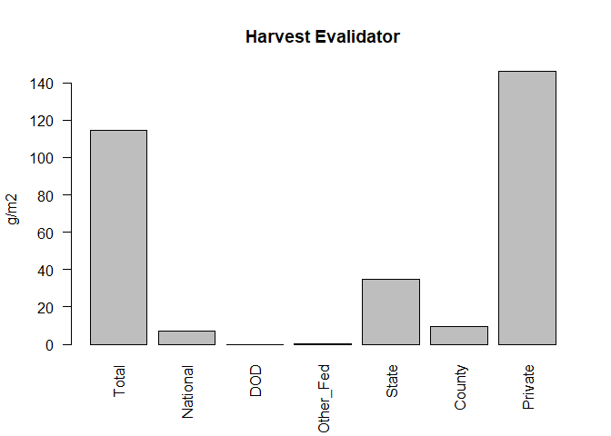

Harvest\_RMD
================
Zjrobbin
9/9/2020

The harvest module was parameterized using hte EVALIDATOR data tool.
Evalidator use sql to query the most recent FIA census for an area. I
broke down the data by county, and used a map of the counties within our
study area to associate the data.

``` r
library(reshape2)
library(ggplot2)
library(rgdal)
```

    ## Loading required package: sp

    ## rgdal: version: 1.5-16, (SVN revision 1050)
    ## Geospatial Data Abstraction Library extensions to R successfully loaded
    ## Loaded GDAL runtime: GDAL 3.0.4, released 2020/01/28
    ## Path to GDAL shared files: C:/Users/zacha/Documents/R/win-library/4.0/rgdal/gdal
    ## GDAL binary built with GEOS: TRUE 
    ## Loaded PROJ runtime: Rel. 6.3.1, February 10th, 2020, [PJ_VERSION: 631]
    ## Path to PROJ shared files: C:/Users/zacha/Documents/R/win-library/4.0/rgdal/proj
    ## Linking to sp version:1.4-2
    ## To mute warnings of possible GDAL/OSR exportToProj4() degradation,
    ## use options("rgdal_show_exportToProj4_warnings"="none") before loading rgdal.

``` r
w_dir<-"Z:/Robbins/Sapps/Model_Prep/Harvest_Work/"
setwd(w_dir)
Countyshape<-readOGR(paste(w_dir,'Clip_county_correct.shp',sep=""))
```

    ## OGR data source with driver: ESRI Shapefile 
    ## Source: "Z:\Robbins\Sapps\Model_Prep\Harvest_Work\Clip_county_correct.shp", layer: "Clip_county_correct"
    ## with 60 features
    ## It has 17 fields
    ## Integer64 fields read as strings:  ALAND AWATER

``` r
plot(Countyshape)
```

<!-- -->

``` r
Countyshapedf<-as.data.frame(Countyshape)
Countys_in<-paste(Countyshapedf$STATEFP,Countyshapedf$COUNTYFP,sep="")
```

``` r
#Plots

TL_AgeClass_DF<-read.csv(paste(w_dir,"TL_Age_Class_DF.csv",sep=""))
TL_Ownership_DF<-read.csv(paste(w_dir,"TL_Ownership_DF.csv",sep=""))

AgeClass_DF<-read.csv(paste(w_dir,'Age_Class_DF.csv',sep=""))
Ownership_DF<-read.csv(paste(w_dir,"Ownership_DF.csv",sep=""))

TL_AgeClass_DF$Landtype<-"Timberlands"
AgeClass_DF$Landtype<-"Forestlands"
TL_Ownership_DF$Landtype<-"Timberlands"
Ownership_DF$Landtype<-"Forestlands"


colnames(AgeClass_DF)
```

    ##  [1] "X"            "Total"        "WRJP"         "SpFir"        "LngSl"       
    ##  [6] "LobSh"        "OthESw"       "OkP"          "OkH"          "OkGC"        
    ## [11] "EAC"          "MapBB"        "AsBir"        "OtHw"         "TropHw"      
    ## [16] "ExHd"         "Nons"         "STCountycode" "Age_Class"    "Landtype"

``` r
colnames(TL_AgeClass_DF)
```

    ##  [1] "X"         "Total"     "WRJP"      "SpFir"     "LngSl"     "LobSh"    
    ##  [7] "OthESw"    "OkP"       "OkH"       "OkGC"      "EAC"       "MapBB"    
    ## [13] "OtHw"      "TropHw"    "ExHd"      "Nons"      "NA."       "NA..1"    
    ## [19] "Age_Class" "Landtype"

``` r
AgeClass_DF<-AgeClass_DF[,c(-18)]
TL_AgeClass_DF<-TL_AgeClass_DF[,c(-17,-18)]
TL_AgeClass_DF$AsBir<-NA
AllAgeClass<-rbind(TL_AgeClass_DF)

AllAgeClass[,c(2:16)]<-AllAgeClass[,c(2:16)]*224.17 ##(covert short tons per acre to g/m2)

theme_set(theme_gray(base_size = 18))
AA_melt<-melt(AllAgeClass, id.vars = c("Age_Class","Landtype"), measure.vars = c(colnames(AllAgeClass[,c(2:16)])))
AA_melt_sub<-AA_melt[AA_melt$Age_Class!='Sum',]
colnames(AllAgeClass)
```

    ##  [1] "X"         "Total"     "WRJP"      "SpFir"     "LngSl"     "LobSh"    
    ##  [7] "OthESw"    "OkP"       "OkH"       "OkGC"      "EAC"       "MapBB"    
    ## [13] "OtHw"      "TropHw"    "ExHd"      "Nons"      "Age_Class" "Landtype" 
    ## [19] "AsBir"

``` r
ggplot(AA_melt_sub, aes(fill=Age_Class, y=value, x=variable)) + 
  geom_bar(stat="identity")+
  ylab("Dry Biomass Harvested g/m2")+
  xlab("Forest Type")+
  theme(text = element_text(size=20),
        axis.text.x = element_text(angle=90, hjust=1)) 
```

<!-- -->
WRJP= Jack Pine, Red pine ,easter white pine, eastern white pine
hemlock, hemlock SpFir= Balsam, White spruce, red spruce,
redspiurce/basam, black spruce, tamarack northern white ceder.
\#Longleaf/Slash pine= \#Lobllogy/Shortleaf pine= \#Other eastern soft=
Eastern redcedar. \#OakPine: Pine component needs to be 25-49 percent.
\#Oak Hickory: \#Oak Gum Cypress: \#Elm/ash/Cottonwood \#MapleBeech
Birch \#\#\#Aspen Birch-pin cherry and paper birch. \#other hardwoods

So looking at this it seems like most of the harvest is in the white
pine/red pine, Loblolly/Shortleaf pine, Oak Pine/Oak Hicokory, and Some
Maple.

StandRanking Economic

| Species  | Economic Rank | MinimumAge |
| -------- | ------------- | ---------- |
| PinuStro | 80            | 40         |
| PinuTaed | 80            | 20         |
| PinuEnch | 60            | 20         |
| QuerAlba | 30            | 20         |
| QuerCocc | 30            | 20         |
| QuerFalc | 30            | 20         |
| QuerRubr | 30            | 20         |
| QuerStel | 30            | 20         |
| QuerVelu | 30            | 20         |
| AcerSacc | 30            | 40         |
| CaryAlba | 20            | 40         |
| CaryOvat | 20            | 40         |
| CaryCodi | 20            | 40         |
| CaryGlab | 20            | 40         |
| JuglNigr | 10            | 30         |

``` r
colnames(TL_Ownership_DF) 
```

    ##  [1] "X"         "Total"     "WRJP"      "SpFir"     "LngSl"     "LobSh"    
    ##  [7] "OthESw"    "OkP"       "OkH"       "OkGC"      "EAC"       "MapBB"    
    ## [13] "OtHw"      "TropHw"    "ExHd"      "Nons"      "NA."       "NA..1"    
    ## [19] "Ownership" "Landtype"

``` r
colnames(Ownership_DF)
```

    ##  [1] "X"            "Total"        "WRJP"         "SpFir"        "LngSl"       
    ##  [6] "LobSh"        "OthESw"       "OkP"          "OkH"          "OkGC"        
    ## [11] "EAC"          "MapBB"        "AsBir"        "OtHw"         "TropHw"      
    ## [16] "ExHd"         "Nons"         "STCountycode" "Ownership"    "Landtype"

``` r
TL_Ownership_DF<-TL_Ownership_DF[,c(-17,-18)]
Ownership_DF<-Ownership_DF[,c(-18)]
TL_Ownership_DF$AsBir<-NA
AllOwnership<-rbind(TL_Ownership_DF)
AllOwnership[,c(2:16)]<-AllOwnership[,c(2:16)]*224.17 ##(covert short tons per acre to g/m2)
library(reshape2)
library(ggplot2)
library(RColorBrewer)
Own_melt<-melt(AllOwnership, id.vars = c("Ownership","Landtype"), measure.vars = c(colnames(AllAgeClass[,c(2:16)])))
Own_melt_sub<-Own_melt[Own_melt$Ownership!='Total',]
cbPalette <- c("#999999", "#E69F00", "#56B4E9", "#009E73", "#F0E442", "#0072B2", "#D55E00", "#CC79A7")

ggplot(Own_melt_sub, aes(fill=variable, y=value, x=Ownership)) + 
  geom_bar(aes(fill = variable), position = position_dodge(0.6),stat="identity")+
  ylab("Dry Biomass Harvested g/m2")+
  xlab("Ownership")+
  scale_fill_manual(values=c(cbPalette,brewer.pal(7,'Paired')))
```

<!-- -->

Here are the totals by ownership.

``` r
barplot(AllOwnership$Total,names=AllOwnership$Ownership,las=2,ylab="g/m2",
        main="Harvest Evalidator")
```

<!-- -->

This was used to validate the amount of commercial harvest on the
landscape.

#### Making the Map

##### [Landownership](https://www.fs.usda.gov/rds/archive/Product/RDS-2017-0007)

From the FS Website

This data publication contains 250 meter raster data depicting the
spatial distribution of forest ownership types in the conterminous
United States. The data are a modeled representation of forest land by
ownership type, and include three types of public ownership: federal,
state, and local; three types of private: family (includes individuals
and families), corporate, and other private (includes conservation and
natural resource organizations, and unincorporated partnerships and
associations); as well as Native American tribal lands. The most
up-to-date data available were used in creating this data publication.

A plurality of the ownership data were from 2014, but some data were as
old as 2004.

``` python
####Import libraries
import rasterio as rt 
import geopandas as gp
import gdal
from rasterio.mask import mask
###Get coordinate features and geometry
def getFeatures(gdf):
    """Function to parse features from GeoDataFrame in such a manner that rasterio wants them"""
    import json
    return [json.loads(gdf.to_json())['features'][0]['geometry']]

##Work Drive
w_dir="E:/Harvest_Work/"
###The orgininal Ownership raster
Ownership=(w_dir+"/RDS-2017-0007/Data/forown2016/hdr.adf")

###Study Area
AOI=gp.read_file(w_dir+"Dissolved_AOI.shp")
##Get CRS
ShpCRS=AOI.crs
###Warp raster
### I entered CRS manually
input_raster = gdal.Open(Ownership)
output_raster=(w_dir+"Ownership_reproj.tif")
gdal.Warp(output_raster,input_raster,dstSRS='EPSG:26917')
###Bring back reshaped raster
reshape_Ownership=rt.open(w_dir+"Ownership_reproj.tif")
###Get geometry from Study Area
coords=getFeatures(AOI)

###Get meta from raster
out_meta = reshape_Ownership.meta.copy()
###Mask raster to study area
out_img,out_transform=mask(raster=reshape_Ownership,shapes=coords,crop=True)
out_meta = reshape_Ownership.meta.copy()
epsg_code = int(reshape_Ownership.crs.data['init'][5:])
###Update meta data for new mask raster
out_meta.update({"driver": "GTiff",
                 "height": out_img.shape[1],
                 "width": out_img.shape[2],
                 "transform": out_transform}
                    )
###Set drive for masked raster
out_tif=w_dir+"Oship_cut.tif"
###Write Raster
with rt.open(out_tif, "w", **out_meta) as dest:
    dest.write(out_img)    
```

``` r
library(raster)
library(rgdal)
library(raster)
library(sf)
```

    ## Linking to GEOS 3.8.0, GDAL 3.0.4, PROJ 6.3.1

``` r
library(utils)
library(ggplot2)
library(RColorBrewer)
library(rgdal)
```

``` r
Oshipcut<-raster::raster(paste(w_dir,'Oship_cut.tif',sep=""))
crs(Oshipcut)<-CRS("+init=EPSG:26917")
SampleEcoregion<-raster::raster(paste(w_dir,'Inputs/MR_FourEcoregions.tif',sep=""))
crs(SampleEcoregion)<-CRS("+init=EPSG:26917")
resampled<-resample(Oshipcut,SampleEcoregion,method='ngb')
filename<-paste(w_dir,"Ownership_Resampled.tif")
writeRaster(resampled, filename=filename, datatype='INT4S',overwrite=TRUE)#Th
```

``` r
Ownership<-raster(paste0(w_dir,'Ownership_Resampled.tif'))
```

    ## Warning in showSRID(uprojargs, format = "PROJ", multiline = "NO"): Discarded datum Unknown based on GRS80 ellipsoid in CRS definition,
    ##  but +towgs84= values preserved

``` r
plot(Ownership,zlim=c(0,9))
```

<!-- -->

\#\>\>1-Federal * \# \>\>2-State \#\>\>3-Local \#\>\>4- Family * \#
\>\>5-Corporate\* \# \>\> 6- Other Private \#\>\>7- Tribal \#\>\>8- Off

To create the stand map I crossed the Ownership map with the HUC
Watershed map, so that each owneship with a water shed is its own stand.

<https://viewer.nationalmap.gov/basic/?basemap=b1&category=nhd&title=NHD%20View>

``` r
library(RColorBrewer)
Random<-brewer.pal(13,"Set3")
```

    ## Warning in brewer.pal(13, "Set3"): n too large, allowed maximum for palette Set3 is 12
    ## Returning the palette you asked for with that many colors

``` r
plot(raster::raster(paste0(w_dir,"Watersheds.tif")),main="HUC 8 Watershed map ",col=rep(Random,10000) )
```

    ## Warning in showSRID(uprojargs, format = "PROJ", multiline = "NO"): Discarded datum Unknown based on GRS80 ellipsoid in CRS definition,
    ##  but +towgs84= values preserved

<!-- -->

``` r
Stands3<-raster::raster(paste0(w_dir,"Stands3.tif"))
```

    ## Warning in showSRID(uprojargs, format = "PROJ", multiline = "NO"): Discarded datum Unknown based on GRS80 ellipsoid in CRS definition,
    ##  but +towgs84= values preserved

``` r
plot(Stands3,col=rep(Random,10000))
```

<!-- -->

``` r
length(unique(Stands3))
```

    ## [1] 22813

That gives us 22,000 stands

``` r
### Stand Size
StandSize<-sqrt((650000*62500)/22000)
### Gap size
sqrt(.20*(StandSize**2))
```

    ## [1] 607.7155

Each stand is therefore like 1.358km x 1.358km if our patch size is 20%
we are areound 607m x 607m or \~ a 4x4 grid

### Comparing to the Data.

``` r
library(reshape2)
library(ggplot2)
library(rgdal)
library(dplyr)
```

    ## 
    ## Attaching package: 'dplyr'

    ## The following objects are masked from 'package:raster':
    ## 
    ##     intersect, select, union

    ## The following objects are masked from 'package:stats':
    ## 
    ##     filter, lag

    ## The following objects are masked from 'package:base':
    ## 
    ##     intersect, setdiff, setequal, union

``` r
library(plyr)
```

    ## ------------------------------------------------------------------------------

    ## You have loaded plyr after dplyr - this is likely to cause problems.
    ## If you need functions from both plyr and dplyr, please load plyr first, then dplyr:
    ## library(plyr); library(dplyr)

    ## ------------------------------------------------------------------------------

    ## 
    ## Attaching package: 'plyr'

    ## The following objects are masked from 'package:dplyr':
    ## 
    ##     arrange, count, desc, failwith, id, mutate, rename, summarise,
    ##     summarize

``` r
w_dir<-"C:/Users/zacha/Documents/GitHub/Project-Southern-Appalachians-2018/Parameterizing/Harvest/"
```

``` r
TL_AgeClass_DF<-read.csv(paste(w_dir,"TL_Age_Class_DF.csv",sep=""))
TL_Ownership_DF<-read.csv(paste(w_dir,"TL_Ownership_DF.csv",sep=""))
AllOwnership<-rbind(TL_Ownership_DF)
AllOwnership[,c(2:16)]<-AllOwnership[,c(2:16)]*224.17 ##(covert short tons per acre to g/m2)
```

``` r
LANDIS_summary<-read.csv(paste0(w_dir,"biomass-harvest-summary-log_100.csv"))
#colnames(LANDIS_summary)
keep<-c(1:7,56:103)
LS_s<-LANDIS_summary[,keep]
LS_s<-LS_s[,c(-3)]
LS_s<-LS_s %>%
    group_by(Time, ManagementArea) %>% 
    summarise_each(funs(sum))
```

    ## Warning: `summarise_each_()` is deprecated as of dplyr 0.7.0.
    ## Please use `across()` instead.
    ## This warning is displayed once every 8 hours.
    ## Call `lifecycle::last_warnings()` to see where this warning was generated.

    ## Warning: `funs()` is deprecated as of dplyr 0.8.0.
    ## Please use a list of either functions or lambdas: 
    ## 
    ##   # Simple named list: 
    ##   list(mean = mean, median = median)
    ## 
    ##   # Auto named with `tibble::lst()`: 
    ##   tibble::lst(mean, median)
    ## 
    ##   # Using lambdas
    ##   list(~ mean(., trim = .2), ~ median(., na.rm = TRUE))
    ## This warning is displayed once every 8 hours.
    ## Call `lifecycle::last_warnings()` to see where this warning was generated.

``` r
Ownership<-raster(paste0(w_dir,'Ownership_Resampled.tif'))
```

    ## Warning in showSRID(uprojargs, format = "PROJ", multiline = "NO"): Discarded datum Unknown based on GRS80 ellipsoid in CRS definition,
    ##  but +towgs84= values preserved

``` r
Ownershipcells<-as.data.frame(
    table(
      as.data.frame(
          Ownership)))

Ownershipcells$Area<-Ownershipcells$Freq*62500
colnames(Ownershipcells)<-c("ManagementArea","Cells","Area(m)")

Managements<-unique(LS_s$ManagementArea)
Prescriptions<-unique(LS_s$Prescription)
```

    ## Warning: Unknown or uninitialised column: `Prescription`.

``` r
HL_DF<-NULL
for(Management in Managements){
#    Harv<- LS_s[LS_s$Prescription==Prescription,]
    sus<-LS_s[LS_s$ManagementArea==Management,]
    
    MergedOneM<-merge(
      sus,
      Ownershipcells,
      by="ManagementArea",
      all.x=T
    )
    MO_Columns<-colnames(MergedOneM)
    Names<-MO_Columns[8:55]
    Names<-gsub("Mg","g_m2_",Names)
    GramMetersq<-(MergedOneM[8:55]*1000000)/MergedOneM$`Area(m)`
    
    GramMean<-t(as.data.frame(colMeans(GramMetersq)))
    colnames(GramMean)<-Names
    OutRow<-cbind(MergedOneM[1,1:3],GramMean)
    HL_DF<-rbind(OutRow,HL_DF)
  }

HL_DF$Total<-rowSums(HL_DF[4:51])
HL_DF<-HL_DF[complete.cases(HL_DF),]
```

``` r
LUT<-data.frame(ManagementArea=c(1,2,3,4,5,6,7,8),
                Name=c("Federal","State","Local","Family",
                       "Corporate","Other_Private","Tribal","Off"))
HL_DF<-merge(HL_DF,
        LUT,
        by="ManagementArea",
        all.x=T)

ComThin<-HL_DF[HL_DF$Prescription==" CommercialThin",]


EcoHarvest<-HL_DF
```

``` r
par(mfrow=c(2,1),mar=c(5.1,4.1,4.1,.1))
barplot(EcoHarvest$Total,names=EcoHarvest$Name,las=3,ylab="g/m2",
        main="Economic Harvest LANDIS")
barplot(AllOwnership$Total,names=AllOwnership$Ownership,las=2,ylab="g/m2",
        main="Harvest Evalidator")
```

<!-- -->

``` r
Private_DF<-data.frame(names=c("Evalidator Private","LANDIS-Corporate","LANDIS-Family","LANDIS-Other_Private","LANDIS_mean"),
           values=c(AllOwnership$Total[AllOwnership$Ownership=="Private"],EcoHarvest$Total[EcoHarvest$ManagementArea==5],
                    EcoHarvest$Total[EcoHarvest$ManagementArea==4],EcoHarvest$Total[EcoHarvest$ManagementArea==6],
                    mean(c(EcoHarvest$Total[EcoHarvest$ManagementArea==5],
                    EcoHarvest$Total[EcoHarvest$ManagementArea==4],EcoHarvest$Total[EcoHarvest$ManagementArea==6]))))


#print(LUT)
par(mar=c(10.1,4.1,4.1,.1))
barplot(Private_DF$values,names=Private_DF$names,las=3,ylab="g/m2",
        main="Private harvest LANDIS")
```

<!-- -->

``` r
print(LUT)
```

    ##   ManagementArea          Name
    ## 1              1       Federal
    ## 2              2         State
    ## 3              3         Local
    ## 4              4        Family
    ## 5              5     Corporate
    ## 6              6 Other_Private
    ## 7              7        Tribal
    ## 8              8           Off

``` r
unique(AllOwnership$Ownership)
```

    ## [1] "Total"     "National"  "DOD"       "Other_Fed" "State"     "County"   
    ## [7] "Private"

``` r
Fed_DF<-data.frame(names=c("Evalidator National","Evalidator Other fed",'Evalidator federal sum',"LANDIS-Federal"),
          values=c(AllOwnership$Total[AllOwnership$Ownership=="National"],
                    AllOwnership$Total[AllOwnership$Ownership=="Other_Fed"],
                    mean(AllOwnership$Total[AllOwnership$Ownership=="National"],AllOwnership$Total[AllOwnership$Ownership=="DOD"],AllOwnership$Total[AllOwnership$Ownership=="Other_Fed"]),EcoHarvest$Total[EcoHarvest$ManagementArea==1]))

par(mar=c(10.1,4.1,4.1,.1))
barplot(Fed_DF$values,names=Fed_DF$names,las=3,ylab="g/m2",
        main="Economic Harvest LANDIS")
```

<!-- -->

``` r
StateLocal_DF<-data.frame(names=c("Evalidator State","LANDIS State",'Evalidator Local',"LANDIS-County"),
          values=c(AllOwnership$Total[AllOwnership$Ownership=="State"],EcoHarvest$Total[EcoHarvest$ManagementArea==2],
                    AllOwnership$Total[AllOwnership$Ownership=="County"],EcoHarvest$Total[EcoHarvest$ManagementArea==3]
                   ))
#EcoHarvest$Total[EcoHarvest$ManagementArea==3]
par(mar=c(10.1,4.1,4.1,.1))
barplot(StateLocal_DF$values,names=StateLocal_DF$names,las=3,ylab="g/m2",
        main="Economic Harvest LANDIS")
```

<!-- -->
