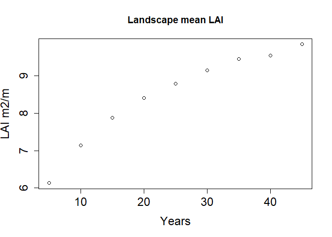

LANDIS-II landscape Run
================
Zjrobbin
3/18/2021

a

``` r
library(ggplot2)
library(raster)
```

    ## Loading required package: sp

### Landscape Validation

Here is a landscape run of 50 years at a 5 year timestep. This run has
fire turned off.

#### AGNPP

``` r
HistoricDrive<-"C:/Users/zacha/Desktop/50_yr_Historic/"
NECN_s<-read.csv(paste0(HistoricDrive,"NECN-succession-log.csv"))
NECN_s<-NECN_s[!NECN_s$Time==0,]
AG_NPP<-NECN_s[,c("Time","ClimateRegionName","AG_NPPC")]
AG_NPP[,"AG_NPPC"]<-AG_NPP[,"AG_NPPC"]/100
theme_set(theme_classic(base_size = 20))

p<-ggplot(AG_NPP, aes(x=Time, y=AG_NPPC, group=ClimateRegionName)) +
  geom_line(aes(color=ClimateRegionName))+
  geom_point(aes(color=ClimateRegionName))+
  labs(title="Abover Ground Net Primariy Productivity",
        x ="Timestep", y = "AG_NPP C(gC m-2 yr-1)")
p
```

<!-- -->

``` r
mean(c(11.8,9.8,9.6,9.8,9.2,8.1,8.1,7.5,8.3,5.2,8.4,11.2,11.6,9.8,9.3,9.8))
```

    ## [1] 9.21875

``` r
mean(c(AG_NPP$AG_NPPC))
```

    ## [1] 6.98299

The mean from our ecoregions which is \~ 7.0 which includes ecoregions
in various sucessional states.

Bolstad in studying 16 sites at the Coweeta Hydrologic labratory in
western North Carolina found ANPP values between 5.2-11.8 with a mean
\~9.2. However these represent sites that have not been disturbed since
the mid 1920s and all were closed canopies. Clinton Yeakley and Apsely
in the same study area found that follwoing disturbance primary
productivity was much lower 2.2-4.2 Mg/ha/yr in the multiple decades
following disturbance. It is therefore likely that our landscape level
values represent composition of various states of forest successional
states.

Busing, Clebesch and White 1993, in studying cove forests of the
southern Applachians found young decidious stands to have an ANPP of
between 11.7-13.1 MG/ha/yr For Old decidious stands to have between
6.3-11.8 Mg/ha/yr. and for Old coniferous-deciduous stands to have
between 8.0-10.1 Mg/ha/yr.

Citation: Bolstad, P. V., Vose, J. M., & McNulty, S. G. (2001). Forest
productivity, leaf area, and terrain in southern Appalachian deciduous
forests. Forest Science, 47(3), 419-427.

#### Mineral Nitrogen

``` r
AG_NPP<-NECN_s[,c("Time","ClimateRegionName","MineralN")]
theme_set(theme_classic(base_size = 20))
p<-ggplot(AG_NPP, aes(x=Time, y=MineralN, group=ClimateRegionName)) +
  geom_line(aes(color=ClimateRegionName))+
  geom_point(aes(color=ClimateRegionName))+
  labs(title="Mineral Nitrogen",
        x ="Timestep", y = "g N m-2")
p
```

<!-- -->

#### Leaf Area Index

``` r
LAI5<-raster("C:/Users/zacha/Desktop/50_yr_Historic/NECN/LAI-5.img")
LAI5[LAI5$LAI.5==0]<-NA
hist(LAI5$LAI.5)
```

<!-- -->

``` r
LAI1<-raster("C:/Users/zacha/Desktop/50_yr_Historic/NECN/LAI-1.img")
LAI1<-mean(as.data.frame(LAI1[!LAI1$LAI.1==0])[,1])
LAI5<-raster("C:/Users/zacha/Desktop/50_yr_Historic/NECN/LAI-5.img")
LAI5<-mean(as.data.frame(LAI5[!LAI5$LAI.5==0])[,1])
LAI10<-raster("C:/Users/zacha/Desktop/50_yr_Historic/NECN/LAI-10.img")
LAI10<-mean(as.data.frame(LAI10[!LAI10$LAI.10==0])[,1])
LAI15<-raster("C:/Users/zacha/Desktop/50_yr_Historic/NECN/LAI-15.img")
LAI15<-mean(as.data.frame(LAI15[!LAI15$LAI.15==0])[,1])
LAI20<-raster("C:/Users/zacha/Desktop/50_yr_Historic/NECN/LAI-20.img")
LAI20<-mean(as.data.frame(LAI20[!LAI20$LAI.20==0])[,1])
LAI25<-raster("C:/Users/zacha/Desktop/50_yr_Historic/NECN/LAI-25.img")
LAI25<-mean(as.data.frame(LAI25[!LAI25$LAI.25==0])[,1])
LAI30<-raster("C:/Users/zacha/Desktop/50_yr_Historic/NECN/LAI-30.img")
LAI30<-mean(as.data.frame(LAI30[!LAI30$LAI.30==0])[,1])
LAI35<-raster("C:/Users/zacha/Desktop/50_yr_Historic/NECN/LAI-35.img")
LAI35<-mean(as.data.frame(LAI35[!LAI35$LAI.35==0])[,1])
LAI40<-raster("C:/Users/zacha/Desktop/50_yr_Historic/NECN/LAI-40.img")
LAI40<-mean(as.data.frame(LAI40[!LAI40$LAI.40==0])[,1])
LAI45<-raster("C:/Users/zacha/Desktop/50_yr_Historic/NECN/LAI-45.img")
LAI45<-mean(as.data.frame(LAI45[!LAI45$LAI.45==0])[,1])

LAIS<-c(LAI5,LAI10,LAI15,LAI20,LAI25,LAI30,LAI35,LAI40,LAI45)

plot(seq(5,45,5),LAIS,xlab="Years",ylab="LAI m2/m",cex.lab=1.5,cex.axis=1.5,main="Landscape mean LAI")
```

<!-- -->

``` r
mean(6.9,5.4,5.4,6.7,6.0,5.2,4.7,4.5,7.2,2.7,4.1,5.2,8.2,6.0)
```

    ## [1] 6.9

``` r
#mean(as.data.frame(LAI5[!is.na(LAI5$LAI.5)])[,1])
```

Bolstad, Vose and McNulty site LAI between 2.7 and 8.2 with a median of
5.8 m2, our landscape averaged 6.13 in the first time NECN time step
(timestep 5). In calibration runs with no disturbance, Landscape mean
LAI got up to 9.84 in 50 years.

``` r
# LAI1<-raster("C:/Users/zacha/Desktop/50_yr_Historic/NECN/LAI-1.img")
# LAI1[LAI1$LAI.1==0]<-NA
# hist(LAI1$LAI.1)
# LAI_DF<-as.data.frame(LAI1$LAI.1)
# 
# AG_NPP1<-raster("C:/Users/zacha/Desktop/50_yr_Historic/NECN/AG_NPP-1.img")
# 
# AG_NPP1[AG_NPP1$AG_NPP.1==0]<-NA
# AG_NPP_DF<-as.data.frame(AG_NPP1$AG_NPP.1)
# 
# NPP_LAI<-cbind(AG_NPP_DF,LAI_DF)
# NPP_LAI<-na.omit(NPP_LAI)
# Sampledraw<-sample(seq(1:446966),10000)
# 
# plot(NPP_LAI$LAI.1[Sampledraw],NPP_LAI$AG_NPP.1[Sampledraw]/100,ylim=c(0,12))
# Model<-lm(NPP_LAI$AG_NPP.1[Sampledraw]/100~NPP_LAI$LAI.[Sampledraw])
# summary(Model)
# 
# plot(seq(1,10),5.00+.297614*seq(1,10),ylim=c(0,13))
# points(seq(1,10),3.6+0.94*seq(1,10),col="red")
```

#### Net ecosystem exchange.

``` r
AG_NPP<-NECN_s[,c("Time","ClimateRegionName","NEEC")]
theme_set(theme_classic(base_size = 20))
p<-ggplot(AG_NPP, aes(x=Time, y=NEEC, group=ClimateRegionName)) +
  geom_line(aes(color=ClimateRegionName))+
  geom_point(aes(color=ClimateRegionName))
p
```

<!-- -->

#### Soil organic matter total carbon.

``` r
AG_NPP<-NECN_s[,c("Time","ClimateRegionName","SOMTC")]
theme_set(theme_classic(base_size = 20))
p<-ggplot(AG_NPP, aes(x=Time, y=SOMTC, group=ClimateRegionName)) +
  geom_line(aes(color=ClimateRegionName))+
  geom_point(aes(color=ClimateRegionName))+
  labs(title="Soil Organic Matter Total Carbon",
        x ="Timestep", y = "g C m-2")
p
```

<!-- -->

``` r
AG_NPP<-NECN_s[,c("Time","ClimateRegionName","C_SOM2")]
theme_set(theme_classic(base_size = 20))
p<-ggplot(AG_NPP, aes(x=Time, y=C_SOM2, group=ClimateRegionName)) +
  geom_line(aes(color=ClimateRegionName))+
  geom_point(aes(color=ClimateRegionName))
p
```

<!-- -->

``` r
Biomass_dir<-"C:/Users/zacha/Desktop/50_yr_Historic/biomass/"
Sp<-"AcerPens"

CreateDataframe<-function(Sp){
OutStack<-stack(paste0(Biomass_dir,list.files(Biomass_dir,pattern = paste0("^",Sp))))
df<-as.data.frame(OutStack)
Biomass<-(colSums(df))/(454548*100)
return(data.frame(Time=c(0,10,20,30,40,50),Biomass=c(Biomass[1],Biomass[2],Biomass[3],Biomass[4],Biomass[5],Biomass[6]),Species=rep(Sp,6)))
}
Splist<-c("AcerRubr","AcerPens","AcerSacc","BetuAlle","CaryAlba","CaryCodi","CaryGlab","CaryOvat","FaguGran","JuglNigr","LiriTuli","MagnAcum","MagnMacr","PinuEnch","PinuPung","PinuStro","PinuTaed","PinuVirg","PrunSero","QuerAlba","QuerCocc","QuerFalc","QuerPrin","QuerRubr",
          "QuerStel","QuerVelu","TsugCana")
Dfout<-NULL
for(Sp1 in Splist){
  print(Sp1)
  Df<-CreateDataframe(Sp1)
  Dfout<-rbind(Dfout,Df)
}
```

    ## [1] "AcerRubr"
    ## [1] "AcerPens"
    ## [1] "AcerSacc"
    ## [1] "BetuAlle"
    ## [1] "CaryAlba"
    ## [1] "CaryCodi"
    ## [1] "CaryGlab"
    ## [1] "CaryOvat"
    ## [1] "FaguGran"
    ## [1] "JuglNigr"
    ## [1] "LiriTuli"
    ## [1] "MagnAcum"
    ## [1] "MagnMacr"
    ## [1] "PinuEnch"
    ## [1] "PinuPung"
    ## [1] "PinuStro"
    ## [1] "PinuTaed"
    ## [1] "PinuVirg"
    ## [1] "PrunSero"
    ## [1] "QuerAlba"
    ## [1] "QuerCocc"
    ## [1] "QuerFalc"
    ## [1] "QuerPrin"
    ## [1] "QuerRubr"
    ## [1] "QuerStel"
    ## [1] "QuerVelu"
    ## [1] "TsugCana"

``` r
par(mar=c(15,5,5,5))
Stru_df<-as.data.frame(Dfout)
Zero<-Stru_df[Stru_df$Time==0,]
barplot(Zero$Biomass[order(Zero$Biomass)],names.arg=Zero$Species[order(Zero$Biomass)],las=2,cex.names=2)
```

<!-- -->

``` r
Next10<-c("PinuEnch","AcerSacc","QuerVelu","PinuTaed","BetuAlle","QuerFalc","CaryAlba","FaguGran","PrunSero","MagnMacr")
Top10<-c("TsugCana","PinuVirg","CaryGlab","PinuStro","QuerCocc","QuerAlba","QuerRubr","AcerRubr","LiriTuli","QuerPrin")
Top10_df<-Stru_df[Stru_df$Species %in% Top10,]
colnames(Top10_df)
```

    ## [1] "Time"    "Biomass" "Species"

``` r
ggplot(data=Top10_df, aes(x=Time, y=Biomass, group=Species,col=Species)) +
  geom_line()+
  geom_point()
```

<!-- -->

``` r
Next10<-c("PinuEnch","AcerSacc","QuerVelu","PinuTaed","BetuAlle","QuerFalc","CaryAlba","FaguGran","PrunSero","MagnMacr")
Next10_df<-Stru_df[Stru_df$Species %in% Next10,]
colnames(Top10_df)
```

    ## [1] "Time"    "Biomass" "Species"

``` r
ggplot(data=Next10_df, aes(x=Time, y=Biomass, group=Species,col=Species)) +
  geom_line()+
  geom_point()
```

<!-- -->
