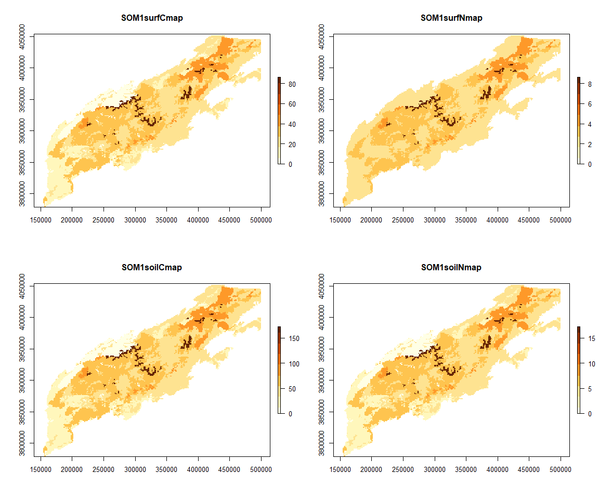
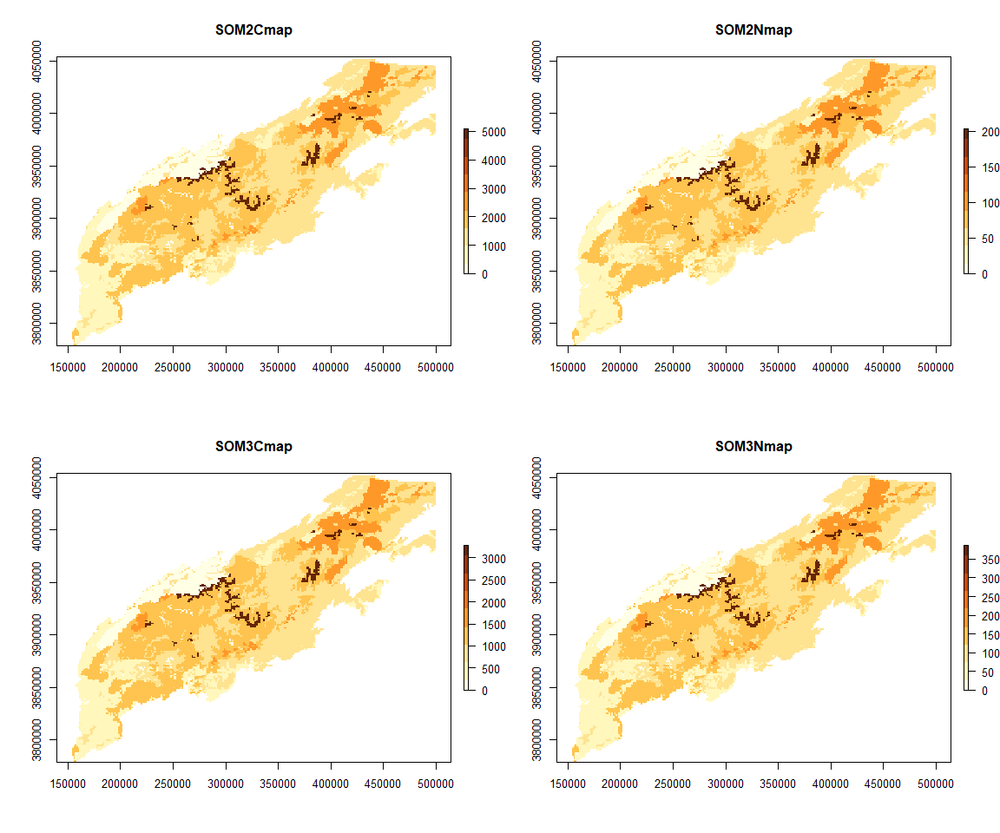
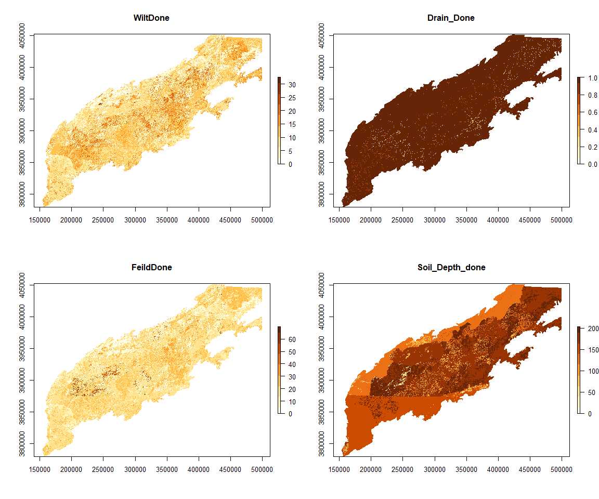
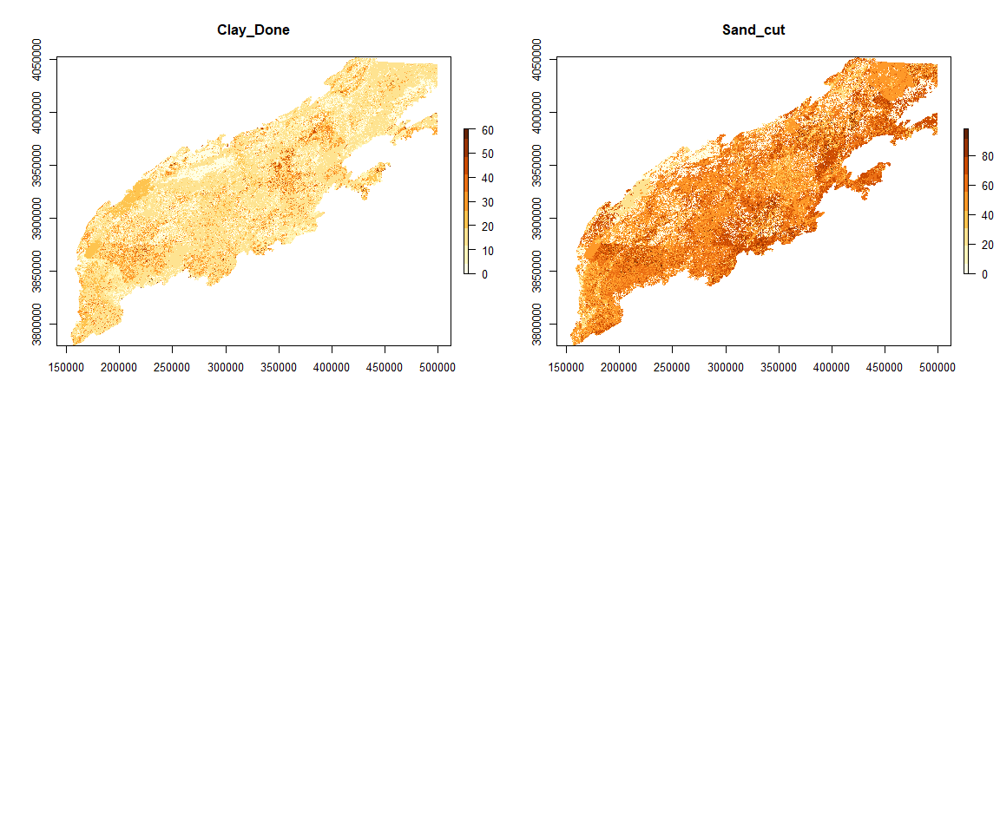
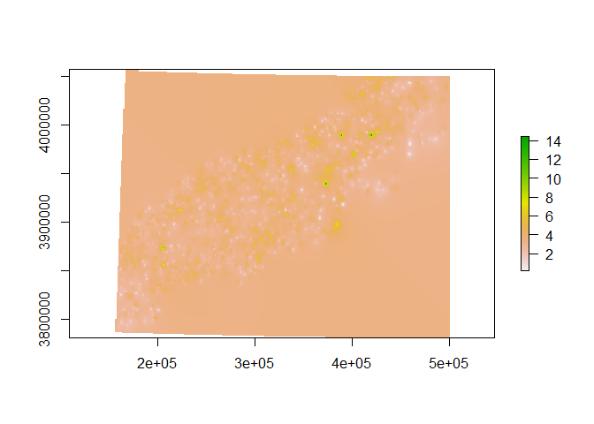
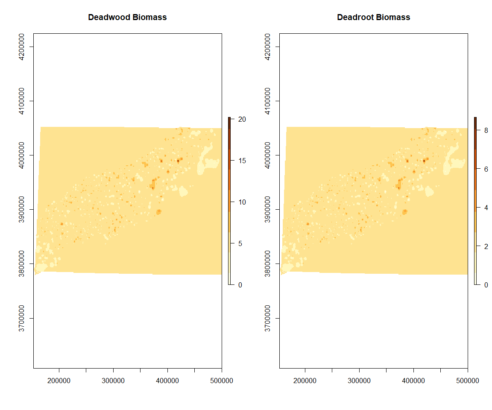
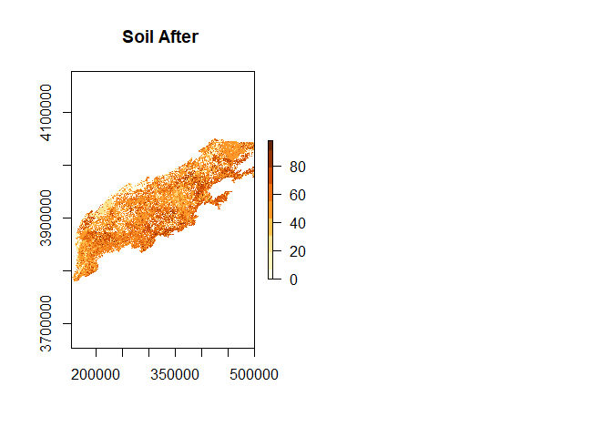
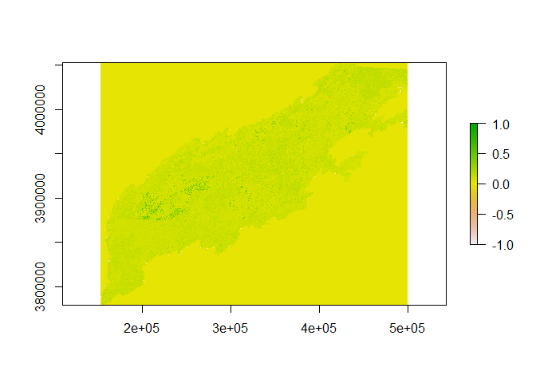

Southern Appalachians Soils
================

> Soils File

> To create the NECN soil inputs we combined SSURGO data, deadwood data
> from the US Forest Invettory and Analysis Program , baseflow and storm
> flow approximations from ( KATE), and data on soil carbon and
> nitrogen. This process can be seen at
> <https://github.com/LANDIS-II-Foundation/Project-Southern-Appalachians-2018/tree/master/Parameterizing/Soils>.
> Maps for depth, drainage, flood frequency sand, and clay percentage,
> field capacity and wilting point were derived from the USGS gssurgo
> dataset, subset to the study extent. These soils maps were aggregated
> from there an original resolution of (10m) were aggregated to the
> study resolution of 250m. Total carbon was calculated using the CONUS
> level carbon maps scale to the resolution of the study area (West,
> 2014). The guidelines in the Century the manual was used to divide the
> SOM into the fast, slow, and passive pools and then calculate the
> total N in each pool (Parton 2013). Deadwood and roots were calculated
> by interpolating between FIA sites for dead wood and assuming dead
> roots made up 1/3 or dead wood values. -ZR

  - Parton, W. 2013. CENTURY Soil Organic Matter Model Environment.
    Technical Documentation. Agroecosystem Version 3.0. USDA-ARS, Forest
    Collins, CO.
  - West, T.O. 2014. Soil Carbon Estimates in 20-cm Layers to 1-m Depth
    for the Conterminous US, 1970-1993. Data set. Available on-line
    \[<http://daac.ornl.gov>\] from Oak Ridge National Laboratory
    Distributed Active Archive Center, Oak Ridge, Tennessee, USA.
    <http://dx.doi.org/10.3334/ORNLDAAC/1238>
  - Soil Survey Staff, Natural Resources Conservation Service, United
    States Department of Agriculture. Soil Survey Geographic (SSURGO)
    Database for \[TN,GA,NC,SC\]. Available online. Accessed
    \[10/17/2019\].

This is a methodology for creating the soil and hydrology maps necessary
to Run LANDIS-II NECN. These methods were provided by Melissa Lucash and
I want to thank her for sharing them.

The Maps needed to run LANDIS-II are

  - Soil Depth <sup>1</sup>
  - Soil Drain <sup>1</sup>
  - Base Flow to Streams <sup>4</sup>
  - Storm Flow to Streams <sup>4</sup>
  - Field Capacity <sup>1</sup>
  - Wilting Point <sup>1</sup>
  - Percent Sand <sup>1</sup>
  - Percent Clay <sup>1</sup>
  - Soil Maps representing 4 layers of carbon pools <sup>2</sup>
  - Soil Maps representing 4 layers of nitrogen pools <sup>2</sup>
  - Dead Wood on the Surface <sup>3</sup>
  - Dead Wood of Coarse Roots <sup>3</sup>

All of the Maps 1 are derived from the USGS ggsurgo database. The Maps 2
are derived from total soil carbon maps and estimations of each pool.
The Maps 3 is interpolated from FIA data. BaseFlow and Storm Flow are
treated as stationary variables in this simulation.

For more information on these parameters visit
<https://drive.google.com/file/d/1RrDSn0xIA7p5hHxcWx-bWnaBzNo5SwdA/view>

I began by getting the carbon and nitrogen Maps. I started with a total
soil carbon map(West 2014), reprojected it, cut to the extent and then
used estimated ratios of carbon in each pool (surface, fast, medium and
slow) as well as C: N ratios and Dr. Lucash’s work to create the soil
maps.

As a fraction of total carbon each carbon pool is:

  - SOM1surfC=.01
  - SOM1soilC=.02
  - SOM2C=.59
  - SOM3C=.38

Each nitrogen map is then created by multiplying the carbon in that pool
by:

  - SOM1surfN=.1
  - SOM1soilN=.1
  - SOM2N=.04
  - SOM3N=.118

A minimum value of 2.0 was set for the nitrogen value to avoid complete
lack of N in some stands by having low soil carbon

Source: West, T.O. 2014. Soil Carbon Estimates in 20-cm Layers to 1-m
Depth for the Conterminous US, 1970-1993. Data set. Available on-line
\[<http://daac.ornl.gov>\] from Oak Ridge National Laboratory
Distributed Active Archive Center, Oak Ridge, Tennessee, USA.
<http://dx.doi.org/10.3334/ORNLDAAC/1238>

Include here are the rasters that this resulted in:

<!-- --><!-- -->

\*\*\*\*Soils maps in grams per meter 2

#### USGS SSurgo work

We need to pull together a file for Feild Capacity, Wilt Point, Soil
Depth, Flood Frequency, Sand Percentage, and Clay Percentage. These are
done using the gssurgo and ssurgo database. The Metadata for the ggsurgo
and ssurgo fields can be found at

[SSURGO/STATSGO2 Structural Metadata and
Documentation](https://www.nrcs.usda.gov/wps/portal/nrcs/detail/soils/survey/geo/?cid=nrcs142p2_053631)

ggsurgo is gridded to a 10m resolution which is much smaller than we
need. So for processing, I aggregated it 50m.

ggsurgo works on a component and map key system, requiring attribute
joins to create a map of a single trait. The four tables I join here are
the chorizon,component,conmonth, and corestriction tables.

This is a key to the fields used

  - Draiange = component:drainagecl
  - Flood Frequency=Conmonth:Flodfreqdcl
  - Wiltpoint= chorizon:wfifteenbar:r
  - Feild capacity= wthirdbar:r
  - Sand Percentage= Chorizon:sandtotal\_R:RV
  - Clay Percentage= Chorizon:claytotal\_R:RV
  - Soil depth = corestriction:resdept\_r

Running this requires the map key raster( later noted as
*State*\_Raster\_Sub.tif) and the geodatabase file associated with that
state

``` r
library(rgdal)
library(raster)
library(sf)
library(utils)
library(ggplot2)
w_dir<-"Z:/Robbins/Sapps/Model_Prep/Sapps_maps_2_18/"

setwd(w_dir)
```

``` r
Listofstates<-c("NC","TN","SC","GA")
for(i in Listofstates){

State<-i
NCDB <-paste(w_dir,"Inputs/gSSURGO_",State,".gdb",sep="")
NC_chor<- sf::st_read(dsn = NCDB, layer = "chorizon")
NC_comp<- sf::st_read(dsn = NCDB, layer = "component")
NC_comon<-sf::st_read(dsn=NCDB, layer = "comonth")
NC_restrictive<-sf::st_read(dsn=NCDB, layer='corestrictions')

    

AllComponent<-NC_comp

#AllComponent<-rbind(GA_comp,SC_comp,NC_comp,KY_comp,VA_comp,WV_comp)
AllComponentBridge<-AllComponent[,c(108,109,24)]
#unique(AllComponentBridge$drainagecl)


gsurLUT<-read.csv(paste(w_dir,"Inputs/gssurgoLUT.csv",sep=""))
AllComponentBridge<-merge(AllComponentBridge,gsurLUT,by="drainagecl",all.x=TRUE)
#print(AllcomponentBridge)
AllChorizon<-(NC_chor)
#AllChorizon<-rbind(GA_chor,SC_chor,NC_chor,KY_chor,VA_chor,WV_chor)
#head(AllChorizon)
#colnames(AllChorizon)
UsefulChorizon<-AllChorizon[,c(34,50,61,92,95,170)]
UsefulChorizon[is.na(UsefulChorizon)]<-0
#print(UsefulChorizon)

All_resBridge<-NC_restrictive[,c(4,12)]
print(All_resBridge)
colnames(NC_restrictive)


keytomap<-merge(UsefulChorizon,AllComponentBridge,by="cokey",all.y=TRUE)

    
keytomap<-merge(keytomap,All_resBridge,by="cokey",all.x=TRUE)

print(keytomap)
LUT<-NULL
MeanSand<-mean(keytomap$sandtotal_r[!is.na(keytomap$sandtotal_r)])
keytomap$sandtotal_r[is.na(keytomap$sandtotal_r)]<-MeanSand
row<-cbind(MeanSand,"sandtota_r")
LUT<-rbind(LUT,row)

MeanClay<-mean(keytomap$claytotal_r[!is.na(keytomap$claytotal_r)])
keytomap$claytotal_r[is.na(keytomap$claytotal_r)]<-MeanClay
row<-cbind(MeanClay,"claytotal_r")
LUT<-rbind(LUT,row)

WP<-mean(keytomap$wthirdbar_r[!is.na(keytomap$wthirdbar_r)])
keytomap$wthirdbar_r[is.na(keytomap$wthirdbar_r)]<-WP
row<-cbind(WP,"wthirdbar_r")
LUT<-rbind(LUT,row)

FC<-mean(keytomap$wfifteenbar_r[!is.na(keytomap$wfifteenbar_r)])
keytomap$wfifteenbar_r[is.na(keytomap$wfifteenbar_r)]<-FC
row<-cbind(FC,"wfifteenbar_r")
LUT<-rbind(LUT,row)

DC<-median(keytomap$Landis[!is.na(keytomap$Landis)])
keytomap$Landis[is.na(keytomap$Landis)]<-DC
row<-cbind(DC,"drainagecl")
LUT<-rbind(LUT,row)

Res<-mean(keytomap$resdept_r[!is.na(keytomap$resdept_r)])
keytomap$resdept_r[is.na(keytomap$resdept_r)]<-Res
row<-cbind(Res,"resdept_r")
LUT<-rbind(LUT,row)
LUT<-as.data.frame(LUT)
colnames(LUT)<-c("Mean","Name")

Statemap<- raster(paste(w_dir,"Inputs/",State,"_Raster_Sub.tif",sep=""))
Statedf<-as.data.frame(Statemap)
Statedf[,1][is.na(Statedf[,1])]<-(-9999)
colnames(Statedf)<-"mukey"
print(length(Statemap))

Marker<-1:nrow(Statedf)
Statedf$Marker<-Marker
a<-capture.output(head(Statedf))

keytomap<-keytomap[,-3]
#traits<-c(seq(2,5,1),8,9)
traits<-9
for(i in traits){
  #print(i)
  FeildCap<-NULL
  keytomap2<-NULL
  Name<-names(keytomap)[i]
  FeildCap<-keytomap[,c(i,7)]
  colnames(FeildCap)<-c("FeildCap","mukey")
  FeildCap<-FeildCap[!duplicated(FeildCap$mukey),]
  print(length(FeildCap$mukey))
  
  keytomap2<-merge(x=Statedf,y=FeildCap,by="mukey",all.x=TRUE)
  ExampleRaster<-Statemap
  keytomap3<-keytomap2[order(keytomap2[,2]),]
  map<-as.vector(keytomap3$FeildCap)
  
  
  #Mean<-LUT[LUT$Name==Name,]
  #mean<-Mean[1]
  #map[map==0]<-mean
  #as.numeric(mean)  
  proj<-projection(ExampleRaster)
  
  output_matrix<-matrix(map,nrow=nrow(ExampleRaster),ncol=ncol(ExampleRaster),byrow=T) #fir
  new_output_raster<-raster(output_matrix,xmn=xmin(ExampleRaster),ymn=ymin(ExampleRaster),xmx=xmax(ExampleRaster),ymx=ymax(ExampleRaster), crs=proj)
  plot(new_output_raster)
  new_output_file_name<-paste(w_dir,"Unmerged/",State,Name,".tif",sep="")
  plot(new_output_raster)
  writeRaster(new_output_raster, filename=new_output_file_name, datatype='FLT4S',overwrite=TRUE)
}
}    
```

Ran into some trouble with the merge so passed to Q-gis in order to do
the merging

Now we go back to python to cut each merged map to the study area.

These are the resulting maps.

``` r
Ramp<-brewer.pal(9,"YlOrBr")

RasterDir<-"Z:/Robbins/Sapps/Model_Prep/Sapps_maps_2_18"
maps=c("WiltDone","Drain_Done","FeildDone","Soil_Depth_done","Clay_Done","Sand_cut")
par(mfrow=c(2,2))
for(map in maps){
Im1<-raster(paste(RasterDir,'/Outputs/',map,'.tif',sep=""))
mv<-max(matrix(Im1))
plot(Im1,zlim=c(0,mv),main=map,col=Ramp)
}
```

<!-- --><!-- -->

#### Dead Wood

To calculate dead wood I isolated each FIA plot in the study area within
the last cycle. I looked at the total carbon down dead and interpolated
it to the whole study area. I assumed that dead coarse roots make up
about a third of that value.

After this, I interpolated in QGIS to get a map with continuous
coverage. Here we clean and shape to make the final map.

``` r
library(ggplot2) # start needed libraries
library(gstat)
library(sp)
library(raster)
library(rgdal)
w_dir<-"Z:/Robbins/Sapps/Model_Prep/Sapps_maps_2_18/"
```

``` r
Altered<-raster(paste(w_dir,"Deadwood/Warp.tif",sep=""))
#print(thefiles)
ICTemplate<- raster(paste(w_dir,"Cleaning/Proc_InitialCommunities.img",sep=""))

IC<-as.data.frame(raster(paste(w_dir,"Cleaning/Outputs/DummyEco.tif",sep="")))
crs(Altered)<-CRS("+init=EPSG:26917")
proj<-CRS("+init=EPSG:26917")
plot(Altered)  
```

<!-- -->

``` r
#get projection/extent from the sample
proj<-projection(ICTemplate)

##resample
resampled<-resample(Altered,ICTemplate,method='ngb')

#reassign proj
crs(resampled)<-proj

#plot(ICTemplate)
#write the raster

input<-as.data.frame(resampled)
input[,1][is.na(input[,1])] <-(-9999)
##bind all files together
df<-cbind(IC,input)
colnames(df)<-c("e","Input")
#Find mean value of the carbon/nitrogen file
meanvalue<-mean(input[input>-9999])

df$Input[df$Input<=(-1000) & df$e!=1]<-meanvalue


##Set all values that are NA in carbon/nitrogen and active in ecoregion to the mean value
root<-NULL
wood<-NULL
root$Input<-df$Input
wood$Inputs<-df$Input
root$Input[root$Input>=(-1000)]<-root$Input[root$Input>=(-1000)]*.3*2
wood$Input[wood$Input>=(-1000)]<-wood$Input[wood$Input>=(-1000)]*.7*2

#df$Input[df$Input<.00001 &df$Input != -9999]<-.0001
##Print rasters
ExampleRaster<-ICTemplate

output_matrix<-matrix(root$Input,nrow=nrow(ExampleRaster),ncol=ncol(ExampleRaster),byrow=T) #fir

new_output_raster<-raster(output_matrix,xmn=xmin(ExampleRaster),ymn=ymin(ExampleRaster),xmx=xmax(ExampleRaster),ymx=ymax(ExampleRaster), crs=proj)

new_output_file_name<-paste(w_dir,"Cleaning/Final/Deadwood_root.tif",sep="")
rast_IC_map<-writeRaster(new_output_raster, filename=new_output_file_name, datatype='FLT4S',overwrite=TRUE)#Th

output_matrix<-matrix(wood$Input,nrow=nrow(ExampleRaster),ncol=ncol(ExampleRaster),byrow=T) #fir
new_output_raster<-raster(output_matrix,xmn=xmin(ExampleRaster),ymn=ymin(ExampleRaster),xmx=xmax(ExampleRaster),ymx=ymax(ExampleRaster), crs=proj)

new_output_file_name<-paste(w_dir,"Cleaning/Final/Deadwood_wood.tif",sep="")
rast_IC_map<-writeRaster(new_output_raster, filename=new_output_file_name, datatype='FLT4S',overwrite=TRUE)#Th
```

``` r
Ramp<-brewer.pal(9,"YlOrBr")

map<-"Z:/Robbins/Sapps/Model_Prep/Sapps_maps_2_18/Cleaning/Final/Deadwood_wood.tif"

par(mfrow=c(1,2))
Im1<-raster(map)
mv<-max(matrix(Im1))
plot(Im1,zlim=c(0,mv),main="Deadwood Biomass",col=Ramp)
map<-"Z:/Robbins/Sapps/Model_Prep/Sapps_maps_2_18/Cleaning/Final/Deadwood_root.tif"


Im1<-raster(map)
mv<-max(matrix(Im1))
plot(Im1,zlim=c(0,mv),main="Deadroot Biomass",col=Ramp)
```

<!-- -->

#### Data clean up and Formatting.

Some additional steps that were used to prepare the maps for LANDIS-II
use.

  - The data needs to be resampled to the same size and in the same
    projection as the initial communities file
  - Create a simple ecoregion for testing
  - Find which files may not overlap with the ecoregion and assigned the
    missing values a mean value
  - Sand and Clay files need to be between 0 and 1.0. The USGS values
    are percentage as 100s (0.0-1.0). So here they are divided by 100.
    Also to clean up values they are minimized at .1
  - Depth that is zero can never grow trees and will trigger weird
    errors. Here I find each of these and turn the ecoregion to off.
  - Wilt point cannot be greater field capacity so their difference was
    reduced to 0.01

<!-- end list -->

``` r
w_dir<-"Z:/Robbins/Sapps/Model_Prep/Sapps_maps_2_18/Cleaning/"
ICTemplate<- raster(paste(w_dir,"Proc_InitialCommunities.img",sep=""))
projection(ICTemplate)<-CRS("+init=EPSG:26917")
```

``` r
##Pull in all files from the Input drive
thefiles<-list.files(paste(w_dir,"Inputs/",sep=""),pattern = "\\.tif$")

ICTemplate<- raster(paste(w_dir,"Proc_InitialCommunities.img",sep=""))
```

##### Resample to the same resolution.

``` r
for(file in thefiles){
  #Readd in the raster
  Altered<-raster(paste(w_dir,"Inputs/",file,sep=""))
  
  crs(Altered)<-CRS("+init=EPSG:26917")
  
  #get projection/extent from the sample
  proj<-projection(ICTemplate)
  
  extent21<-extent(ICTemplate)
  #match extents
  #extent(Altered)<-extent21
  #plot(Altered)
  ##resample
  resampled<-resample(Altered,ICTemplate,method='ngb')

  #reassign proj
  crs(resampled)<-proj

  #plot(ICTemplate)
  #write the raster
  new_output_file_name<-(paste(w_dir,"Outputs/Proc",file,sep=""))
  writeRaster(resampled, filename=new_output_file_name, datatype='FLT8S',overwrite=TRUE)  
}
```

``` r
file<-"Sand_cut.tif"
par(mfrow=c(1,2))
map<-paste(w_dir,"Inputs/",file,sep="")
Im1<-raster(map)
mv<-max(matrix(Im1))

#plot(Im1,zlim=c(0,mv),main="Soil Before",col=Ramp)

map<-paste(w_dir,"Outputs/Proc",file,sep="")
Im1<-raster(map)
mv<-max(matrix(Im1))
plot(Im1,zlim=c(0,mv),main="Soil After ",col=Ramp)
```

<!-- -->

``` r
proj<-CRS("+init=EPSG:26917")
ecoregions<-raster(paste(w_dir,"Proc_InitialCommunities.Img",sep=""))

#plot(ecoregions)
DummyEco<-ecoregions
##turn all except for the six to 1
DummyEco[DummyEco>=1,]<-2
DummyEco[is.na(DummyEco[,1]),]<-1
DummyEco[DummyEco<1,]<-1

#plot(DummyEco)
##Write Raster
new_output_file_name<-(paste(w_dir,"Outputs/DummyEco.tif",sep=""))
writeRaster(DummyEco, filename=new_output_file_name, datatype='FLT8S',overwrite=TRUE)  

ExampleRaster<-DummyEco
###Get just the Carbon/nitrogen files
```

``` r
###This lists files in the folder 
IC<-as.data.frame(DummyEco)
#thefiles<-list.files(paste(w_dir,"Outputs/",sep=""),pattern = "\\.tif$")
thefiles<-c("ProcFeildDone.tif","ProcWiltDone.tif")
```

``` r
### 
for(file in thefiles){
     #print(file)
     raster<-(raster(paste(w_dir,"Outputs/",file,sep="")))
     input<-as.data.frame(raster)
     input[,1][is.na(input[,1])] <-(-9999)
     ##bind all files together
     df<-cbind(IC,input)
     colnames(df)<-c("e","Input")
     #Find mean value of the carbon/nitrogen file
     meanvalue<-mean(input[input>-9999])
     #print("mean")
     #print(meanvalue)
     #print("min")
     #print(min(input[input>-9999]))
     #print("max")
     #print(max(input[input>-9999]))

     df$e
     #print(length(df$Input[df$Input<=(-1000) & df$e!=1]))
     ##Set all values that are NA in carbon/nitrogen and active in ecoregion to the mean value
     df$Input[df$Input<=(-1000) & df$e!=1]<-meanvalue

     #df$Input[df$Input<.00001 &df$Input != -9999]<-.0001
     ##Print rasters
     output_matrix<-matrix(df$Input,nrow=nrow(ExampleRaster),ncol=ncol(ExampleRaster),byrow=T) #fir
     new_output_raster<-raster(output_matrix,xmn=xmin(ExampleRaster),ymn=ymin(ExampleRaster),xmx=xmax(ExampleRaster),ymx=ymax(ExampleRaster), crs=proj)

     new_output_file_name<-paste(w_dir,"Mean/MeanedandCleaned",file,sep="")
     rast_IC_map<-writeRaster(new_output_raster, filename=new_output_file_name, datatype='FLT4S',overwrite=TRUE)#Th
     }
```

``` r
  file<-"MeanedandCleanedDummyEco.tif"
    
  input<-(raster(paste(w_dir,"Mean/",file,sep="")))
 
  new_output_file_name<-paste(w_dir,"Final/MR_",file,sep="")
  rast_IC_map<-writeRaster(input, filename=new_output_file_name, datatype='INT4S',overwrite=TRUE)#T
```

``` r
#paste(w_dir,"IC_Repro.tif",sep="")
ExampleRaster<-raster(paste(w_dir,"Proc_InitialCommunities.img",sep=""))
input<-raster(paste(w_dir,"Proc_InitialCommunities.img",sep=""))
input<-as.data.frame(input)
input[,1][is.na(input[,1])] <-0
input[,1][(input[,1])<0] <-0
input[,1][(input[,1])>3000]<-0
#print(max(input[,1]))
#print(min(input[,1]))
output_matrix<-matrix(input[,1],nrow=nrow(ExampleRaster),ncol=ncol(ExampleRaster),byrow=T) #fir
new_output_raster<-raster(output_matrix,xmn=xmin(ExampleRaster),ymn=ymin(ExampleRaster),xmx=xmax(ExampleRaster),ymx=ymax(ExampleRaster), crs=proj)
#plot(new_output_raster)
filename=paste(w_dir,"Final/MR_InitialCommunity_2_18.tif",sep="")
#print(filename)
writeRaster(new_output_raster, filename=filename, datatype='INT4S',overwrite=TRUE)
```

``` r
input<-as.data.frame(raster(paste(w_dir,"Mean/MeanedandCleanedDummyEco.tif",sep="")))
Stormflow<-input[,1]
Stormflow[Stormflow==2]<-0.3
Stormflow[Stormflow==1]<-(-9999)
#length(Stormflow[Stormflow==0.3])
ExampleRaster<-raster(paste(w_dir,"Mean/MeanedandCleanedDummyEco.tif",sep=""))
output_matrix<-matrix(Stormflow,nrow=nrow(ExampleRaster),ncol=ncol(ExampleRaster),byrow=T) #fir
new_output_raster<-raster(output_matrix,xmn=xmin(ExampleRaster),ymn=ymin(ExampleRaster),xmx=xmax(ExampleRaster),ymx=ymax(ExampleRaster), crs=proj)

new_output_file_name<-paste(w_dir,"Final/MR_Stormflow.tif",sep="")
rast_IC_map<-writeRaster(new_output_raster, filename=new_output_file_name, datatype='FLT4S',overwrite=TRUE)#
```

``` r
Feild<-raster(paste(w_dir,"Mean/MeanedandCleanedProcFeildDone.tif",sep=""))
WP<-raster(paste(w_dir,"Mean/MeanedandCleanedProcWiltDone.tif",sep=""))
#Depth<-as.data.frame(raster(paste(w_dir,"Mean/MeanedandCleanedProcDepth_top.tif",sep="")))
#Ecoregion<-as.data.frame(raster(paste("C:/Users/zacha/Documents/GitHub/Project-Southern-Appalachians-2018/Models/LANDIS_Sapps_Active_v1_2/MR_FourEcoregions.tif")))
#

#plot(Feild)
Feild[Feild>(-1999),]<-Feild[Feild>(-1999),]/100
Feild[Feild>(-1999) & Feild<.05,]<-.05


WP[WP>(-1999),]<-WP[WP>(-1999),]/100
WP[WP>(-1999) & WP<.05,]<-.05

#plot(WP,zlim=c(0,.25),main="Wilting point")
#plot(Feild,zlim=c(0,.75),main="Feild Capacity")
unique(Feild[Feild>(-1999) & Feild< (WP+.05)])
```

    ##   [1] 0.0500000 0.0700000 0.1530000 0.1050000 0.1560000 0.0950000 0.1590000
    ##   [8] 0.1330000 0.1740000 0.1600000 0.1610000 0.2490000 0.1690000 0.2390000
    ##  [15] 0.1790000 0.1580000 0.2510000 0.1987820 0.2600000 0.1830000 0.1570000
    ##  [22] 0.1820000 0.1500000 0.1630000 0.2040000 0.2260000 0.1780000 0.1960000
    ##  [29] 0.1660000 0.1990000 0.1940000 0.2160000 0.2240000 0.2650000 0.1640000
    ##  [36] 0.2870000 0.1370000 0.1410000 0.2850000 0.0930000 0.2170000 0.2560000
    ##  [43] 0.1340000 0.2340000 0.3070000 0.2210000 0.2740000 0.2300000 0.1420000
    ##  [50] 0.1720000 0.2820000 0.0990000 0.1797460 0.1920000 0.0720000 0.2070000
    ##  [57] 0.1710000 0.1490000 0.1550000 0.1950000 0.2330000 0.1670000 0.1220000
    ##  [64] 0.1290000 0.0980000 0.2060000 0.1480000 0.0890000 0.2328934 0.2130000
    ##  [71] 0.2110000 0.1850000 0.0820000 0.1030000 0.1230000 0.2080000 0.1800000
    ##  [78] 0.2660000 0.1520000 0.2500000 0.2150000 0.2420000 0.1980000 0.2200000
    ##  [85] 0.2010000 0.1430000 0.2750000 0.1620000 0.2100000 0.2030000 0.1730000
    ##  [92] 0.1200000 0.1750000 0.1680000 0.1890000 0.1080000 0.0590000 0.2140000
    ##  [99] 0.2350000 0.2550000 0.0550000 0.1100000 0.2380000 0.2190000 0.0750000
    ## [106] 0.1120000 0.2640000 0.1210000 0.1470000 0.1650000 0.2180000 0.2830000
    ## [113] 0.1450000 0.2090000 0.2370000 0.0570000 0.2220000 0.1180000 0.2570000
    ## [120] 0.2900000 0.2400000 0.1130000 0.2580000 0.1840000 0.1320000 0.1240000
    ## [127] 0.1260000 0.2280000 0.1910000 0.1270000 0.1300000 0.0690000 0.2000000
    ## [134] 0.1010000 0.0810000 0.2810000 0.2410000 0.1380000 0.2230000 0.1510000
    ## [141] 0.0900000 0.1460000 0.1700000 0.1770000 0.1110000 0.2620000 0.1540000
    ## [148] 0.0830000 0.1040000 0.1900000 0.2780000 0.1310000 0.0870000 0.1000000
    ## [155] 0.3060000 0.2720000 0.2700000 0.2440000 0.2310000 0.0670000 0.2770000
    ## [162] 0.2950000 0.2670000 0.2250000 0.1350000 0.2120000 0.3020000 0.2460000
    ## [169] 0.1810000 0.2360000 0.0920000 0.1390000 0.1090000 0.3000000 0.1970000
    ## [176] 0.0660000 0.2050000 0.1400000 0.1440000 0.1760000 0.1870000 0.2530000
    ## [183] 0.0680000 0.0790000 0.0840000 0.2540000 0.0770000 0.3010000 0.2470000
    ## [190] 0.0540000 0.2880000 0.2270000 0.1880000 0.3100000 0.2790000 0.2730000
    ## [197] 0.0940000 0.1930000 0.2910000 0.2320000 0.2840000 0.2690000 0.2760000
    ## [204] 0.0620000 0.1070000 0.3390000 0.0600000 0.2630000 0.1060000 0.1160000
    ## [211] 0.3040000 0.0880000 0.2020000 0.1360000 0.1860000 0.0710000 0.1020000
    ## [218] 0.0910000 0.0580000 0.2930000 0.0760000 0.1170000 0.0860000 0.2590000
    ## [225] 0.2680000 0.0850000 0.2430000 0.2480000 0.2800000 0.2980000 0.1190000
    ## [232] 0.2290000 0.1280000 0.0530000 0.2137283 0.3130000 0.2107051 0.2940000
    ## [239] 0.2610000 0.3280000 0.2450000

``` r
Feild[Feild>(-1999) & Feild< (WP+.05)]<-WP[Feild>(-1999) & Feild<(WP+.05)]+.05
plot(Feild-WP,zlim=c(-1,1))
```

<!-- -->

``` r
Dataframe<-as.data.frame(Feild-WP)
#unique(Feild$MeanedandCleanedProcFeildDone[WP[,1]>(-1999)& Feild[,1]>(-1999)& WP$MeanedandCleanedProcWiltDone+.05>Feild$MeanedandCleanedProcFeildDone])

#Feild$MeanedandCleanedProcFeildDone[WP[,1]>(-1999)& Feild[,1]>(-1999)]
                                                                                                                                                                                    #WP$MeanedandCleanedProcWiltDone+.05>Feild$MeanedandCleanedProcFeildDone]+.05

#min(Feild$MeanedandCleanedProcFeildDone[Feild$MeanedandCleanedProcFeildDone>(-1999)])


# (WP[WP[,1]>(-1999),])
# unique(Feild)
# #min(Feild[Feild[,1]>(-1999),])
# min(Feild[Feild[,1]>(-1999),]-WP[WP[,1]>(-1999),])
# min(WP[WP[,1]>(-1999),])
# unique(Ecoregion$MR_FourEcoregions[Feild$MeanedandCleanedProcFeildDone<0.05])
# 
# unique(Ecoregion$MR_FourEcoregions[WP$MeanedandCleanedProcWiltDone<0.05])


WP_Print<-as.vector(WP[,1])
FC_Print<-as.vector(Feild[,1])
ExampleRaster<-raster(paste(w_dir,"Mean/MeanedandCleanedProcFeildDone.tif",sep=""))

#output_matrix<-matrix(WP_Print,nrow=nrow(ExampleRaster),ncol=ncol(ExampleRaster),byrow=T) #fir
#new_wilt_raster<-raster(output_matrix,xmn=xmin(ExampleRaster),ymn=ymin(ExampleRaster),xmx=xmax(ExampleRaster),ymx=ymax(ExampleRaster), crs=proj)
#plot(new_output_raster,zlim=c(0,.2))
new_output_file_name<-paste(w_dir,"Mean/MeanedandCleanedProcWiltDone2.tif",sep="")
rast_IC_map<-writeRaster(WP,filename=new_output_file_name, datatype='FLT8S',overwrite=TRUE)#Th

#output_matrix<-matrix(FC_Print,nrow=nrow(ExampleRaster),ncol=ncol(ExampleRaster),byrow=T) #fir
#new_output_raster<-raster::raster(output_matrix,xmn=xmin(ExampleRaster),ymn=ymin(ExampleRaster),xmx=xmax(ExampleRaster),ymx=ymax(ExampleRaster), crs=proj)
#plot(new_output_raster,zlim=c(0,.5)

new_output_file_name<-paste(w_dir,"Mean/MeanedandCleanedProcFeildDone2.tif",sep="")
rast_IC_map<-writeRaster(Feild,filename=new_output_file_name, datatype='FLT8S',overwrite=TRUE)#Th
```

``` r
library(RColorBrewer)
```

``` r
#Sand and Clay files need to be between 0 and 1.0. The USGS values are percetages as 100s (0.0-1.0).
#So here they are divided by 100. Also to clean up values they are minimized at .1

###Sand and Clay
Sand<-as.data.frame(raster(paste(w_dir,"Mean/MeanedandCleanedProcSand_cut.tif",sep="")))

Clay<-as.data.frame(raster(paste(w_dir,"Mean/MeanedandCleanedProcClay_Done.tif",sep="")))

scaler<-.01
Sand[!is.na(Sand[,1]),]<-Sand[!is.na(Sand[,1]),]*scaler
Sand[,1][Sand[,1]<=0.1]<-0.1

Clay[!is.na(Clay[,1]),]<-Clay[!is.na(Clay[,1]),]*scaler
Clay[,1][Clay[,1]<=0.1]<-0.1


Clay_Print<-as.vector(Clay[,1])

Sand_Print<-as.vector(Sand[,1])

ExampleRaster<-raster(paste(w_dir,"Mean/MeanedandCleanedDummyEco.tif",sep=""))
proj<-projection(ExampleRaster)

output_matrix<-matrix(Clay_Print,nrow=nrow(ExampleRaster),ncol=ncol(ExampleRaster),byrow=T) #fir
new_output_raster<-raster(output_matrix,xmn=xmin(ExampleRaster),ymn=ymin(ExampleRaster),xmx=xmax(ExampleRaster),ymx=ymax(ExampleRaster), crs=proj)
new_output_file_name<-paste(w_dir,"Mean/MeanedandCleanedProcClay_Done.tif",sep="")
rast_IC_map<-writeRaster(new_output_raster, filename=new_output_file_name, datatype='FLT4S',overwrite=TRUE)#Th

output_matrix<-matrix(Sand_Print,nrow=nrow(ExampleRaster),ncol=ncol(ExampleRaster),byrow=T) #fir
new_output_raster<-raster(output_matrix,xmn=xmin(ExampleRaster),ymn=ymin(ExampleRaster),xmx=xmax(ExampleRaster),ymx=ymax(ExampleRaster), crs=proj)
new_output_file_name<-paste(w_dir,"Mean/MeanedandCleanedProcSand_cut.tif",sep="")
rast_IC_map<-writeRaster(new_output_raster, filename=new_output_file_name, datatype='FLT4S',overwrite=TRUE)#Th
```

``` r
###Depth

#Depth that are zero can never grow trees and will trigger weird errors. Here I find each of these are turn their ecoregion to off. 

Depth<-as.data.frame(raster(paste(w_dir,"Mean/MeanedandCleanedProcDepth_top.tif",sep="")))
ecoregion<-as.data.frame(raster(paste(w_dir,"Final/MR_MeanedandCleanedDummyEco.tif",sep=""))) 
df<-cbind(Depth,ecoregion)

colnames(df)<-c("Input","e")
df$e[df$Input<=(0.0) & df$e!=1]<-1.0
output_matrix<-matrix(df$e,nrow=nrow(ExampleRaster),ncol=ncol(ExampleRaster),byrow=T) 
new_output_raster<-raster(output_matrix,xmn=xmin(ExampleRaster),ymn=ymin(ExampleRaster),xmx=xmax(ExampleRaster),ymx=ymax(ExampleRaster), crs=proj)

new_output_file_name<-paste(w_dir,"Final/MR_FinalDummyEco.tif",sep="")
rast_IC_map<-writeRaster(new_output_raster, filename=new_output_file_name, datatype='INT4S',overwrite=TRUE)#Th
```

``` r
thefiles<-list.files(paste(w_dir,"Mean/",sep=""),pattern = "\\.tif$")
thefiles<-c("MeanedandCleanedProcFeildDone2.tif","MeanedandCleanedProcWiltDone2.tif")
```

``` r
for(i in thefiles){
input<-(raster(paste(w_dir,"/Mean/",i,sep="")))

projection(input)<-CRS("+init=EPSG:26917")

str1<-i

##useful

cleanname<-gsub('MeanedandCleanedProc','',str1) 

new_output_file_name<-paste(w_dir,"Final/MR",cleanname,sep="")
rast_IC_map<-writeRaster(input, filename=new_output_file_name, datatype='FLT4S',overwrite=TRUE)#Th
}
```
