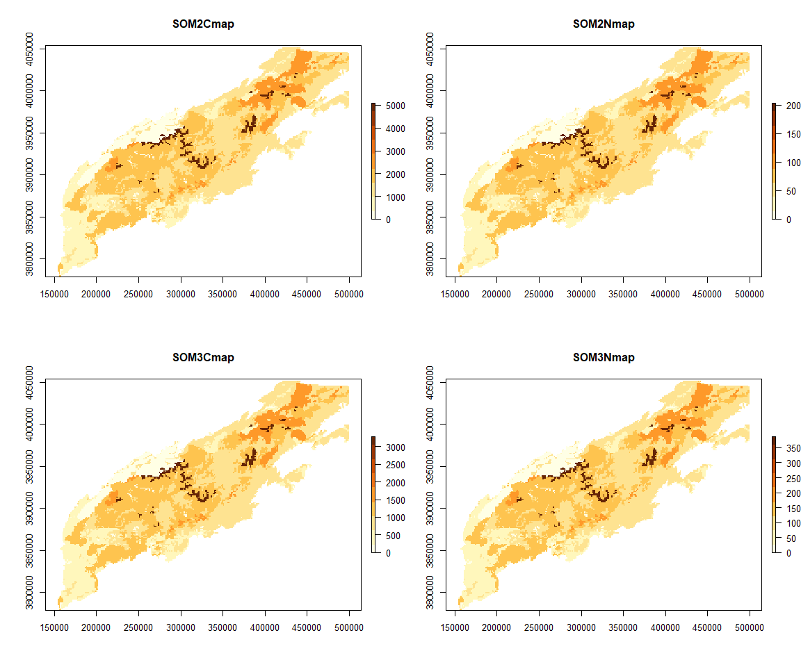
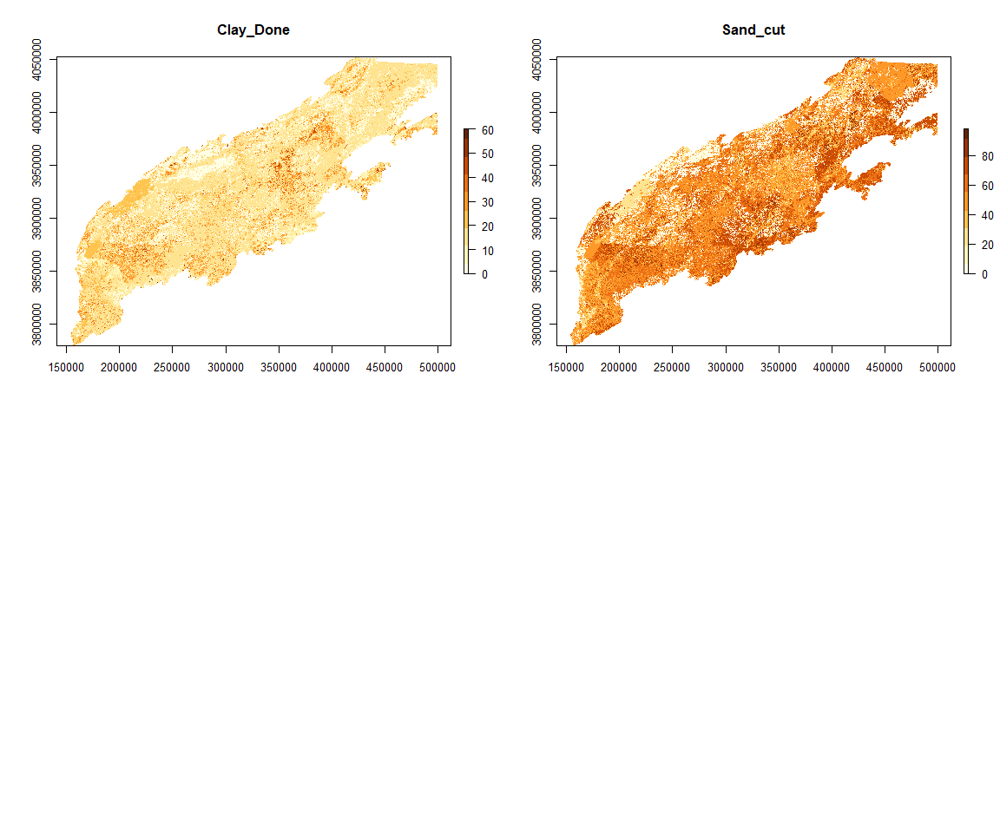

Southern Apps. Soils
================

This is a methodology for creating the soil and hydrology maps nessecary to Run LANDIS-II NECN. These methods were provided by Melissa Lucash and I want to thank her for sharing them.

The Maps needed to run LANDIS-II are

-   Soil Depth 1
-   Soiil Drain 1
-   Base Flow to Streams 4
-   Storm Flow to Streams 4
-   Field Capacity 1
-   Wilting Point 1
-   Percent Sand 1
-   Percent Clay 1
-   Soil Maps representing 4 layers of carbon pools 2
-   Soil Maps representing 4 layers of nitrogen pools 2
-   Dead Wood on the Surface 3
-   Dead Wood of Coarse Roots 3

All of the Maps 1 are derived from the USGS ggsurgo data base. The Maps 2 are derived from total soil carbon maps and estimations of each pool. The Maps 3 are interpolated from FIA data. BaseFlow and Storm Flow are treated as stationary variables in this simulation.

For more information on these parameters visit <https://drive.google.com/file/d/1RrDSn0xIA7p5hHxcWx-bWnaBzNo5SwdA/view>

I began by getting the Carbon and Nitrogen Maps. I started with a total soil carbon map(West 2014), reprojected it, cut to the extent and then used estimated ratios of carbon in each pool (surface, fast,medium and slow) as well as C:N ratios and Dr. Lucashs work to create the soil maps.

As a fraction of total carbon each carbon pool is:

-   SOM1surfC=.01
-   SOM1soilC=.02
-   SOM2C=.59
-   SOM3C=.38

Each nitrogen map is then created by mulitplying the carbon in that pool by:

-   SOM1surfN=.1
-   SOM1soilN=.1
-   SOM2N=.04
-   SOM3N=.118

A minimum value of 2.0 was set for the nitrogen value to avoid complete lack of N in some stands by having low soil carbon

Source: West, T.O. 2014. Soil Carbon Estimates in 20-cm Layers to 1-m Depth for the Conterminous US, 1970-1993. Data set. Available on-line \[<http://daac.ornl.gov>\] from Oak Ridge National Laboratory Distributed Active Archive Center, Oak Ridge, Tennessee, USA. <http://dx.doi.org/10.3334/ORNLDAAC/1238>

Include here are the rasters that this resulted in:

\*\*\*\*Soils maps in grams per meter 2

#### USGS SSurgo work

We need to pull together a file for Feild Capacity, Wilt Point, Soil Depth, Flood Frequency, Sand Percentage and Clay Percentage. These are done using the gssurgo and ssurgo database. The Metadata for the ggsurgo and ssurgo feilds can be found at

[SSURGO/STATSGO2 Structural Metadata and Documentation](https://www.nrcs.usda.gov/wps/portal/nrcs/detail/soils/survey/geo/?cid=nrcs142p2_053631)

ggsurgo is gridded to a 10m resoultion which is much smaller than we need. So for processing I aggregated it 50m.

ggsurgo works on a component and map key system, requiring attribute joins to create a map of a single trait. The four tables I join here are the chorizon,component,conmonth, and corestriction tables.

This is a key to the feilds used

-   Draiange = component:drainagecl
-   Flood Frequency=Conmonth:Flodfreqdcl
-   Wiltpoint= chorizon:wfifteenbar:r
-   Feild capacity= wthirdbar:r
-   Sand Percentage= Chorizon:sandtotal\_R:RV
-   Clay Percentage= Chorizon:claytotal\_R:RV
-   Soil depth = corestriction:resdept\_r

Running this requires the map key raster( later noted as *State*\_Raster\_Sub.tif) and the geodatabase file associated with that state

Ran into some trouble with the merge so passed to Q-gis in order to do the merging

Now we go back to python to cut each merged map to the study area.

These are the resulting maps.

#### Dead Wood

To calculate dead wood I isolated each FIA plot in the studay area within the last cycle. I looked at the total carbon down dead and interpolated it to the whole study area. I assumed that dead coarse roots make up about a third of theat value.

After this I interpolated in QGIS to get a map with continous coverage

Here we clean and shape to make the final map

#### Data clean up and Formatting.

Some additional steps that were used to prepare the maps for LANDIS-II use.

-   The data needs to be resampled to the same size and in the same projection as the intital communities file
-   Create a simple eco region for testing
-   Find which which files may not overlap with the eco region and assinged the missing values a mean value
-   Sand and Clay files need to be between 0 and 1.0. The USGS values are percetages as 100s (0.0-1.0). So here they are divided by 100. Also to clean up values they are minimized at .1
-   Depth that are zero can never grow trees and will trigger weird errors. Here I find each of these are turn their ecoregion to off.
-   Wilt point can not be greater field capacity so there differnce was reduced to 0.01

##### Resample to the same resolution.

