Scrpple\_Mortality
================
Zjrobbin
5/19/20

``` r
library(data.table)
library(dplyr)
library(caret)
library(grDevices)
library(hexbin)
library(magrittr)
library(pROC)
library(raster)
library(RColorBrewer)
library(tibble)
library(tidyr)
library(sf)
library(sp)

#remotes::install_github("rstudio/reticulate")
library(reticulate)
#conda_list()
use_condaenv('gee', required = TRUE)

#RColorBrewer::display.brewer.all()
Fire<-colorRampPalette(brewer.pal(9,'YlOrRd'))
BluesRamp<-colorRampPalette(brewer.pal(9,'Blues'))
RdYlBl<-colorRampPalette(brewer.pal(9,'RdYlBu'))
```

``` r
Drive="D:/Sapps_DM_paper/"
#Drive="C:/Users/zacha/Desktop/Sapps_DM_paper"
MtbsShapes=read_sf(paste0(Drive,'/Inputs/MTBS_Shapes.shp'))
Firestosee<-MtbsShapes[order(MtbsShapes$Acres,decreasing = T),]%>%
  subset(Fire_Type %in% c('Wildfire'))%>%
  subset(Year>2000)%>%
  subset(Acres>2000)
#Firestosee$Fire_Name
```

### Linking to Google Earth Engine

I am using reticulate to link a conda enviroment that contains the
packages. \* geemap \* folium \* ee \* geopandas \* pandas

``` python
import geemap
import folium
import ee
print(ee.__version__)
import geopandas as gp
import pandas as pd
import GEE_Fire_Functions as FF
```

``` python
Drive="C:/Users/zacha/Desktop/Sapps_DM_paper/"
MtbsShapes=gp.read_file(Drive+'Inputs/MTBS_Shapes.shp')

FireIDs=MtbsShapes["Fire_Name"]
FireNames=['ROUGH RIDE','ROCK MOUNTAIN']
#print(FireIDs)
with pd.option_context('display.max_rows', None, 'display.max_columns', None):  # more options can be specified also
    print(FireIDs)


One_Fire=MtbsShapes.loc[MtbsShapes.Fire_Name== 'ROCK MOUNTAIN']
#print(One_Fire)
preNBR,postNBR,RdNBR=FF.Cal_DRdNBR(One_Fire)
preNBR1,postNBR1,RdNBR1=FF.Cal_1yrDRdNBR(One_Fire)
```

``` python
shapefile =One_Fire
features = []
for i in range(shapefile.shape[0]):
    geom = shapefile.iloc[i:i+1,:] 
    jsonDict = eval(geom.to_json()) 
    geojsonDict = jsonDict['features'][0] 
    features.append(ee.Feature(geojsonDict)) 
AOI = ee.FeatureCollection(features)
preNBR,postNBR,RdNBR=FF.Cal_DRdNBR(One_Fire)
Locations=One_Fire['geometry'].centroid
#print(Locations)

deltadelay=RdNBR1.subtract(RdNBR)
MainFolder="Documentation"
Scale=250

FireNames=['LINVILLE COMPLEX (DOBSON KNOB)','CHIMNEY TOPS 2']
for i in list(range(0,4)):
    Name=FireNames[i]
    One_Fire=MtbsShapes.loc[MtbsShapes.Fire_Name==Name]
    bb_one=One_Fire.total_bounds
    Bound= ee.Geometry.Rectangle(bb_one.tolist())
    shapefile =One_Fire
    features = []
    for i in range(shapefile.shape[0]):
        geom = shapefile.iloc[i:i+1,:] 
        jsonDict = eval(geom.to_json()) 
        geojsonDict = jsonDict['features'][0] 
        features.append(ee.Feature(geojsonDict)) 
    AOI = ee.FeatureCollection(features)
    preNBR,postNBR,RdNBR=FF.Cal_DRdNBR(One_Fire)
    SPI=FF.GRIDMET(One_Fire,'spi1y')
    Ef_WS,aspect,slope=FF.RWS(One_Fire)
    CWD1=FF.TerraClimate(One_Fire,'def',12)
    AET2=FF.TerraClimate(One_Fire,'aet',12)
    PET2=FF.TerraClimate(One_Fire,'pet',12)
    AET,PET=FF.MODIS16(One_Fire)
    Directory=MainFolder+"/"+Name.replace(" ", "_").replace("(","").replace(")","")+"/"
    task=ee.batch.Export.image.toDrive(**{
      'image': RdNBR,
      'description': Name.replace(" ", "_").replace("(","").replace(")","")+'_DRdNBR',
      'scale': Scale,
      'folder':Directory,
      'region': Bound,
      'crs': 'EPSG:26917'
     })
    task2=ee.batch.Export.image.toDrive(**{
      'image': Ef_WS,
      'description': Name.replace(" ", "_").replace("(","").replace(")","")+'EfWS',
      'scale': Scale,
      'folder':Directory,
      'region': Bound,
      'crs': 'EPSG:26917'
      })
    task3=ee.batch.Export.image.toDrive(**{
      'image': slope,
      'description': Name.replace(" ", "_").replace("(","").replace(")","")+'_Slope',
      'scale': Scale,
      'folder':Directory,
      'region': Bound,
       'crs': 'EPSG:26917'
      })
    task4=ee.batch.Export.image.toDrive(**{
      'image': CWD1,
      'description': Name.replace(" ", "_").replace("(","").replace(")","")+'_CWD_1yr',
    'scale': Scale,
     'folder':Directory,
     'region': Bound,
      })
    task5=ee.batch.Export.image.toDrive(**{
      'image': AET2,
      'description':Name.replace(" ", "_").replace("(","").replace(")","")+ '_ModeledAET',
      'scale': Scale,
      'folder':Directory,
     'region': Bound,
      })
    task6=ee.batch.Export.image.toDrive(**{
      'image': PET2,
     'description': Name.replace(" ", "_").replace("(","").replace(")","")+'_ModeledPET',
      'scale': Scale,
      'folder':Directory,
      'region': Bound,
      })
    task7=ee.batch.Export.image.toDrive(**{
      'image': AET,
      'description': Name.replace(" ", "_").replace("(","").replace(")","")+'_ModisET',
      'scale': Scale,
      'folder':Directory,
      'region': Bound,
      'crs': 'EPSG:26917'
      })
    task8=ee.batch.Export.image.toDrive(**{
      'image': PET,
      'description':Name.replace(" ", "_").replace("(","").replace(")","")+ '_ModisPET',
      'scale': Scale,
      'folder':Directory,
      'region': Bound,
       'crs': 'EPSG:26917' 
      })
    task.start()
    task2.start()
    task3.start()
    task4.start()
    task5.start()
    task6.start()
    task7.start()
    task8.start()
```

> Mortality: To create the mortality submodel we did two things, first
> relate the fire severity in any given cell experiencing fire to the
> soil, fuel (as estimated through AET), and effective wind speed it
> experiences. This was done by created delayed relative DNBR maps
> (DRdNBR) for each of four fires (Chimney Tops,Rough Ridge, Linville
> Gorge Complex and Rock Mountian). Then creating maps for various state
> variables, and proceeding htorugh a model selection process. The
> DRdNBR was then associated with ground plots for fires in the Linville
> gorge, rock mountian and rough ridge fires. Based on the DRdNBR and
> bark thickness estimation of each tree, we calculated the probability
> of mortality. Included here is some validation of that testing.

### Processing the Variables used in the Final model

> Data Sources:

> Modis ET + Modis WD
> *<https://developers.google.com/earth-engine/datasets/catalog/MODIS_NTSG_MOD16A2_105>
> *Running, S. W., Mu, Q., Zhao, M., & Moreno, A. (2017). MODIS global
> terrestrial evapotranspiration (ET) product (NASA MOD16A2/A3) NASA
> earth observing system MODIS land algorithm. NASA: Washington, DC,
> USA.

> Wind:
> *<https://developers.google.com/earth-engine/datasets/catalog/IDAHO_EPSCOR_GRIDMET>
> *Abatzoglou, J. T. (2013). Development of gridded surface
> meteorological data for ecological applications and modelling.
> International Journal of Climatology, 33(1), 121-131.

> Clay %

Soil Survey Staff. Gridded National Soil Survey Geographic (gNATSGO)
Database for the Conterminous United States. United States Department of
Agriculture, Natural Resources Conservation Service. Available online at
<https://nrcs.app.box.com/v/soils>. 08 10 2020 (2020 official release).

``` r
FireCollection<-"Inputs/Fires_2_12/"
sampleStudy<-raster("Inputs/11_Ecoregions.tif")
```

> Fuel Estimated from LANDIS-II Biomass

``` r
Fuel<-raster("Inputs/Interpolated_FuelMap.tif")
plot(Fuel)
```

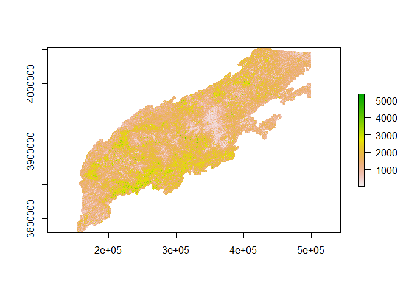<!-- -->

``` r
# NeighborhoodBurn<-function(Burn){
#   df_b<-as.data.frame(Burn)
#   Adj<-adjacent(Burn,cells=1:ncell(Burn), directions=4, pairs=TRUE, 
#           id=FALSE)
#   colnames(Adj)<-c("CellN","ID")
#   df_b$ID<-1:ncell(Burn)
#   merged<-merge(df_b,Adj,by="ID")
#   merged[,2][is.na(merged[,2])]<-0
# 
#     Neigh_DF<-aggregate(merged[,2],by=list(Cell=merged$CellN),FUN=sum)
#   rasterfrom<-raster(nrow=nrow(Burn), ncol=ncol(Burn), ext=extent(Burn), crs=crs(Burn))
#   values(rasterfrom)<-Neigh_DF$x
#   return(rasterfrom)
# }
# 


Processing_Maps<-function(LU_Path){
  Burn<-raster(paste0(LU_Path,"_DRdNBR.tif"))
  EfWs<-raster(paste0(LU_Path,"EfWS.tif"))%>%
    resample(Burn)
  ModisET<-raster(paste0(LU_Path,"_ModisET.tif"))%>%
  resample(Burn)
  ModisPET<-raster(paste0(LU_Path,"_ModisPET.tif"))%>%
  resample(Burn)
  OneYear<-raster(paste0(LU_Path,"_RDNBR_1yr.tif"))%>%
    resample(Burn)
  Clay<-raster("Inputs/clay2resample.tif")%>%
  projectRaster(Burn)%>%
  resample(Burn)
  Fuel<-raster("Inputs/Interpolated_FuelMap.tif")%>%
  projectRaster(Burn)%>%
  resample(Burn)
  par(mfrow=c(3,2))
  plot(Burn,axes=F,box=F,main="DRdNBR",zlim=c(0,600))
  plot(EfWs,axes=F,box=F,main="Eff. Wind Speed",col=BluesRamp(100))
  plot(ModisET,axes=F,box=F,main="ModisET")
  plot(ModisPET,axes=F,box=F,main="ModisPET")
  ModisWD=ModisPET-ModisET
  plot(ModisWD,axes=F,box=F,main="ModisWD")
  plot(Fuel,axes=F,box=F,main="Fuel")
  plot(Clay,axes=F,box=F,main="Clay")
  Stack<-stack(Burn,EfWs,ModisET,ModisPET,ModisWD,Clay,Fuel,OneYear)
}
```

## Processing the Variables

#### PINNACLE\_MOUNTAIN

``` r
Run<-'PINNACLE_MOUNTAIN'
LU_Path<-paste0(FireCollection,Run)
PINNACLE_MOUNTAIN_Stack2<-Processing_Maps(LU_Path = LU_Path)
```

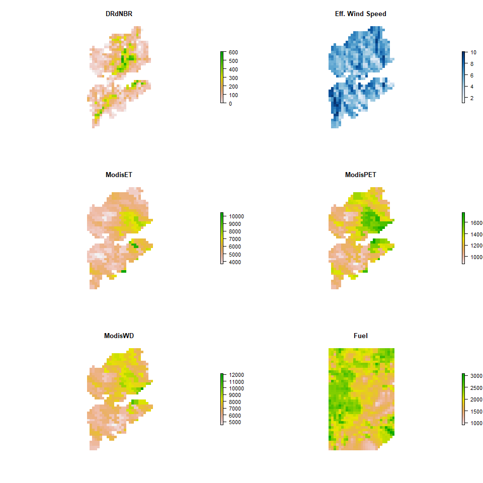<!-- -->

``` r
PINNACLE_MOUNTAIN_Stack<-as.data.frame(PINNACLE_MOUNTAIN_Stack2)
colnames(PINNACLE_MOUNTAIN_Stack)<-c("RdNBR","EfWS","ModisET","ModisPET","ModisWD","Clay","Fuel")
```

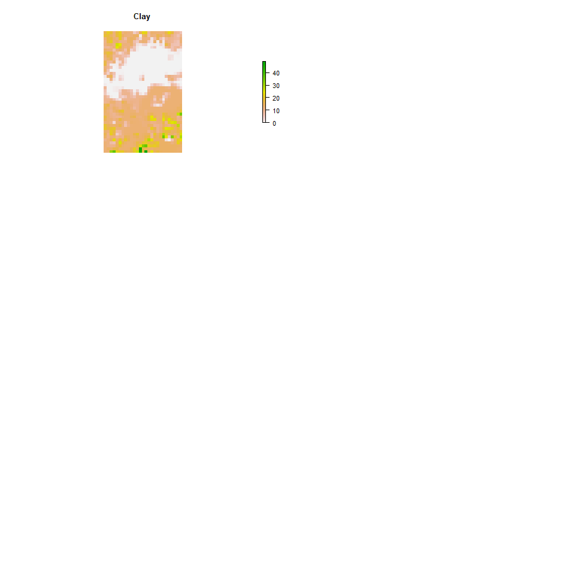<!-- -->

#### Linville Complex

``` r
Run<-'LINVILLE_COMPLEX_DOBSON_KNOB'
LU_Path<-paste0(FireCollection,Run)
LC_Stack2<-Processing_Maps(LU_Path = LU_Path)
```

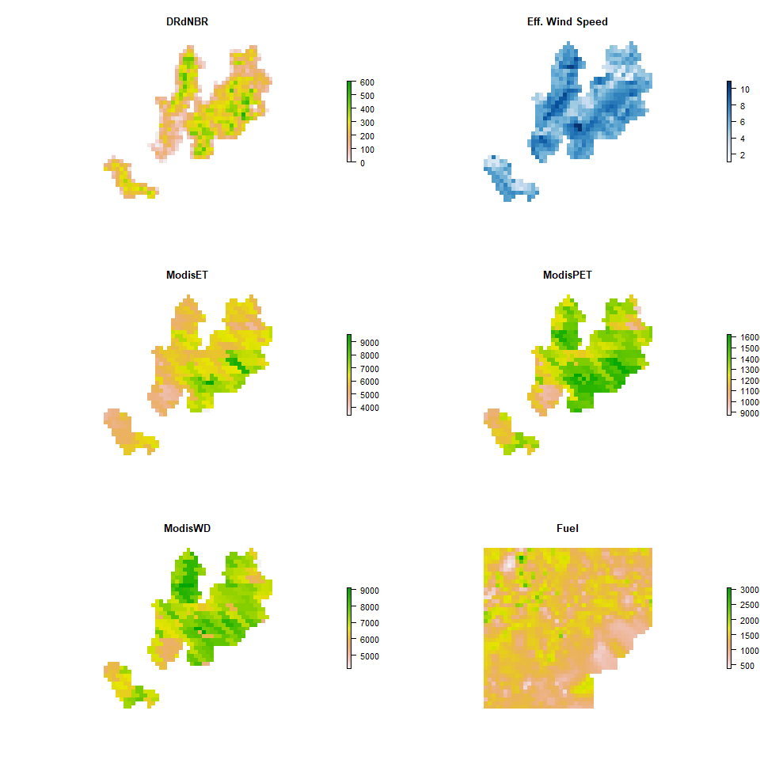<!-- -->

``` r
LC_Stack<-as.data.frame(LC_Stack2)
colnames(LC_Stack)<-c("RdNBR","EfWS","ModisET","ModisPET","ModisWD","Clay","Fuel")
```

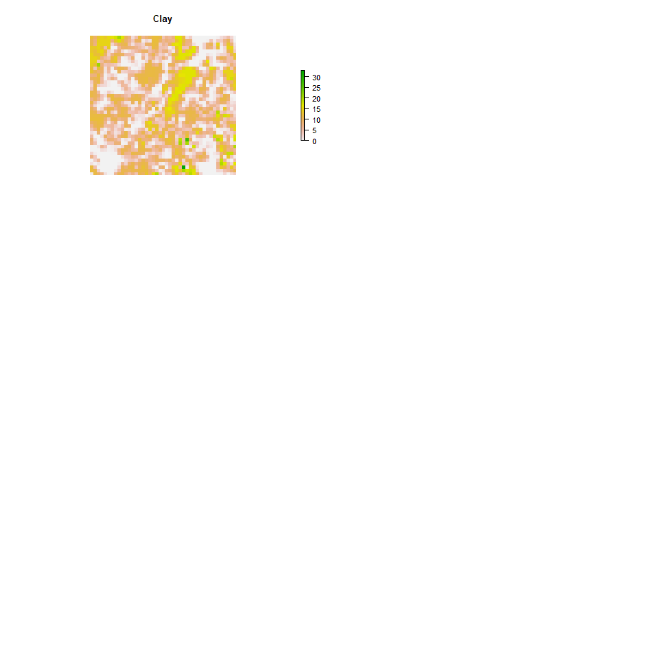<!-- -->

#### Rock Mountain

``` r
Run<-'ROCK_MOUNTAIN'
LU_Path<-paste0(FireCollection,Run)
RM_Stack2<-Processing_Maps(LU_Path = LU_Path)
```

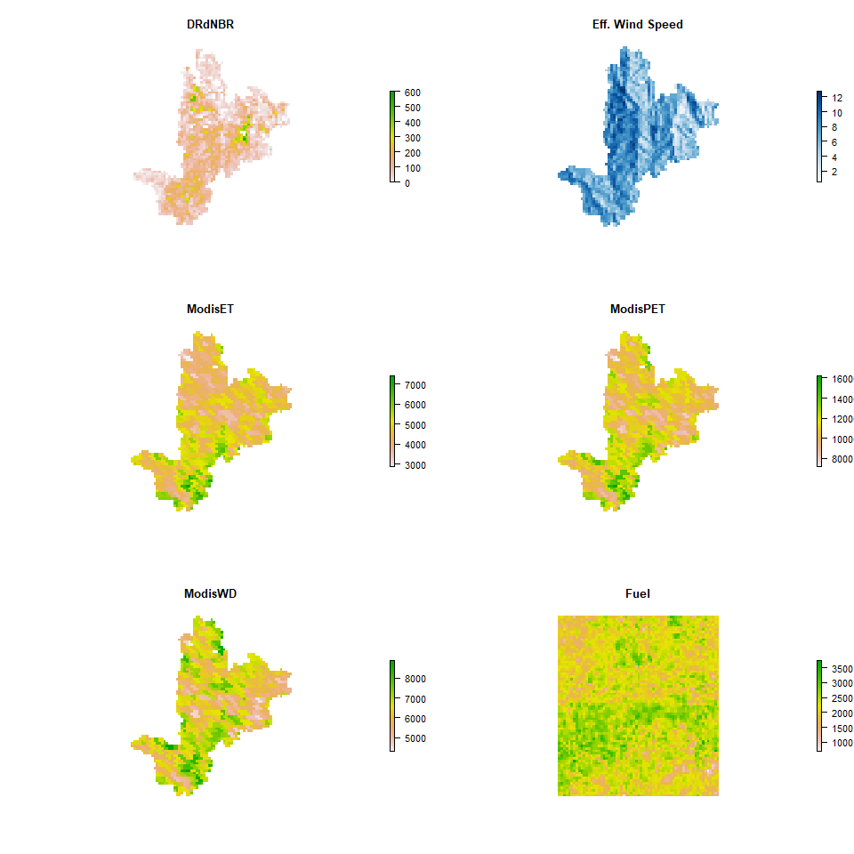<!-- -->

``` r
RM_Stack<-as.data.frame(RM_Stack2)
colnames(RM_Stack)<-c("RdNBR","EfWS","ModisET","ModisPET","ModisWD","Clay","Fuel")
```

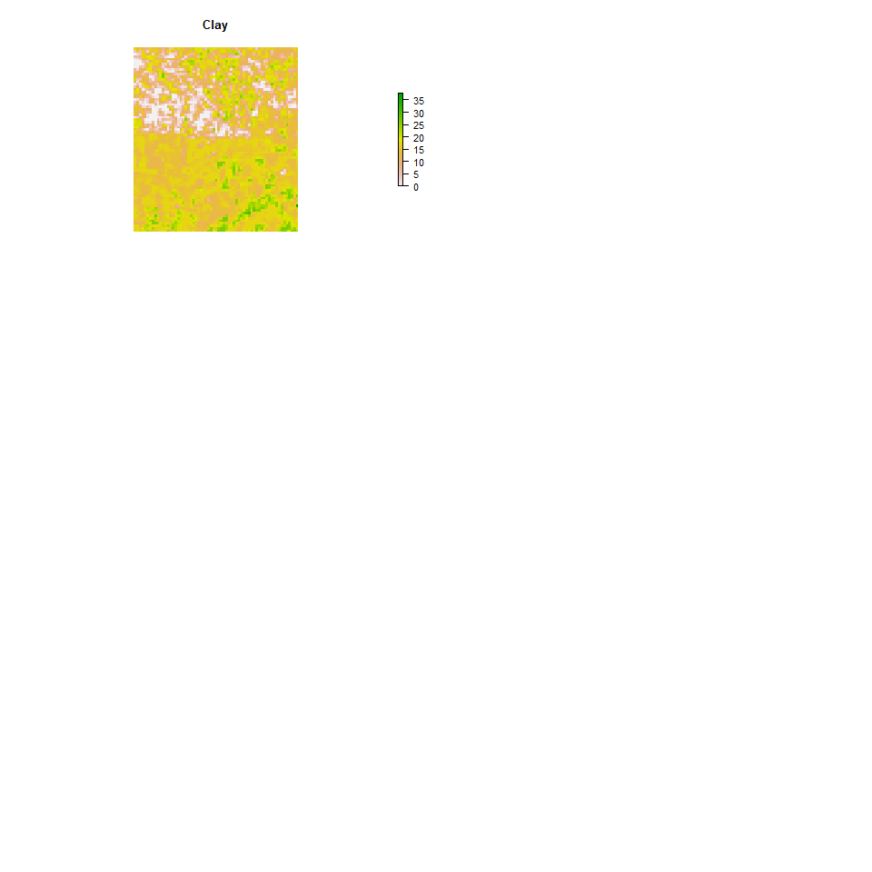<!-- -->

#### Sunrise

``` r
Run<-'SUNRISE'
LU_Path<-paste0(FireCollection,Run)
SR_Stack2<-Processing_Maps(LU_Path = LU_Path)
```

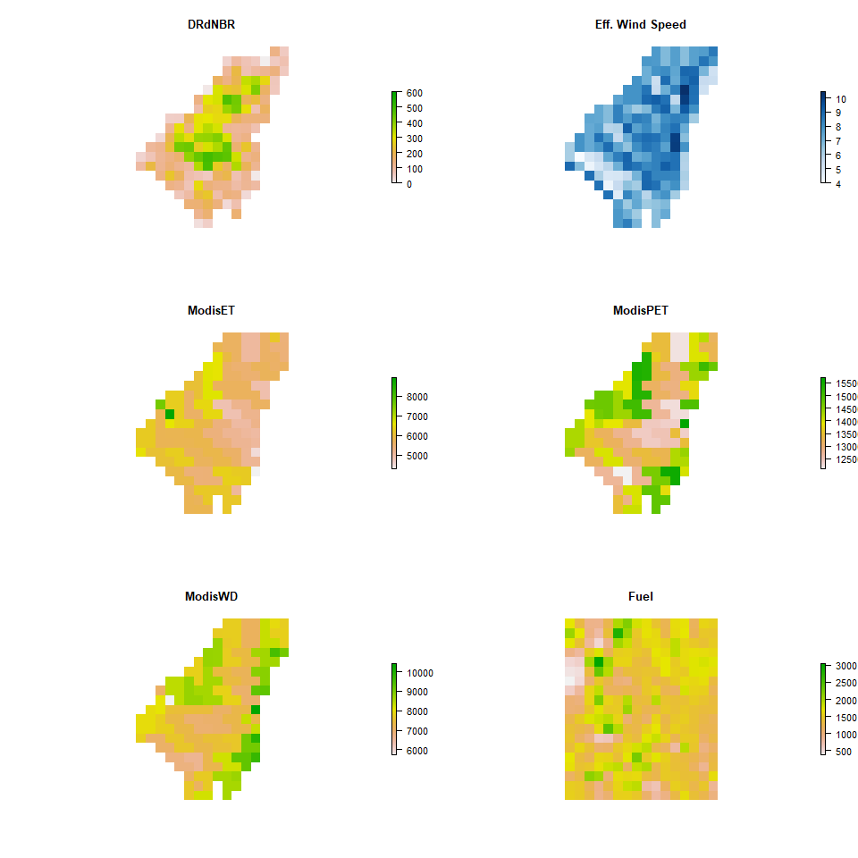<!-- -->

``` r
SR_Stack<-as.data.frame(SR_Stack2)
colnames(SR_Stack)<-c("RdNBR","EfWS","ModisET","ModisPET","ModisWD","Clay","Fuel")
```

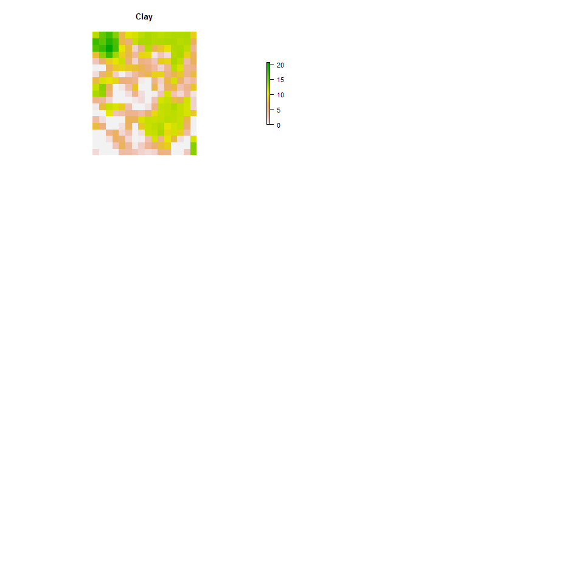<!-- -->

#### Rough Ridge

``` r
Run<-'ROUGH_RIDGE'
LU_Path<-paste0(FireCollection,Run)
RR_Stack2<-Processing_Maps(LU_Path = LU_Path)
```

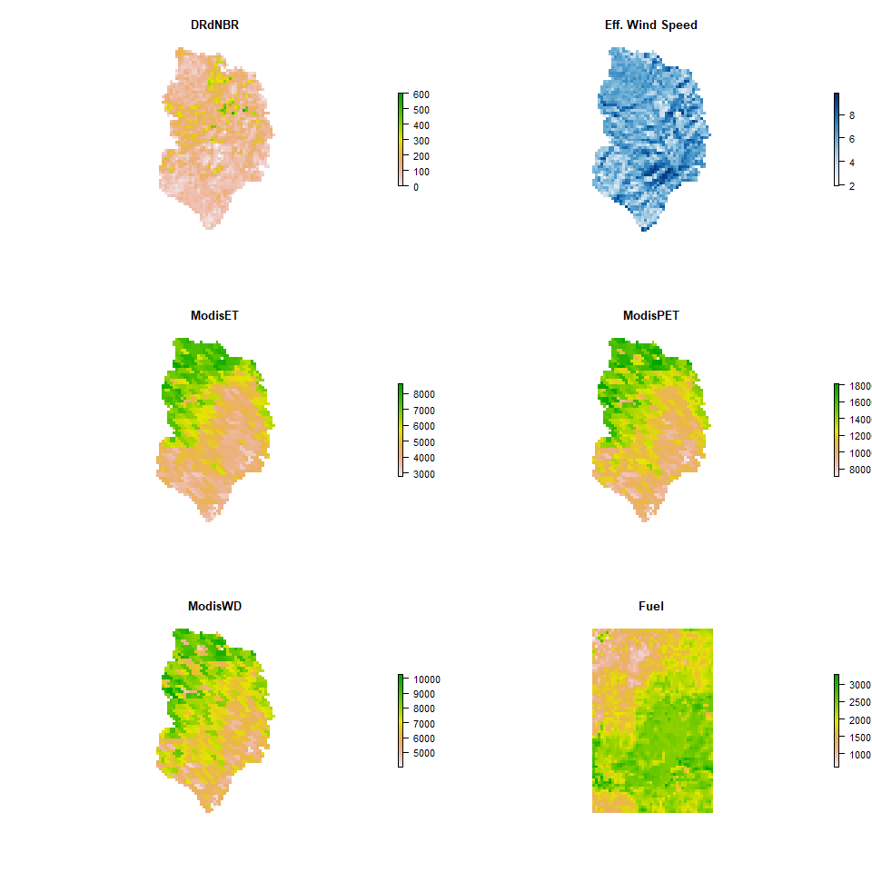<!-- -->

``` r
RR_Stack<-as.data.frame(RR_Stack2)
colnames(RR_Stack)<-c("RdNBR","EfWS","ModisET","ModisPET","ModisWD","Clay","Fuel")
plot(RR_Stack2$ROUGH_RIDGE_DRdNBR-RR_Stack2$ROUGH_RIDGE_RDNBR_1yr)
```

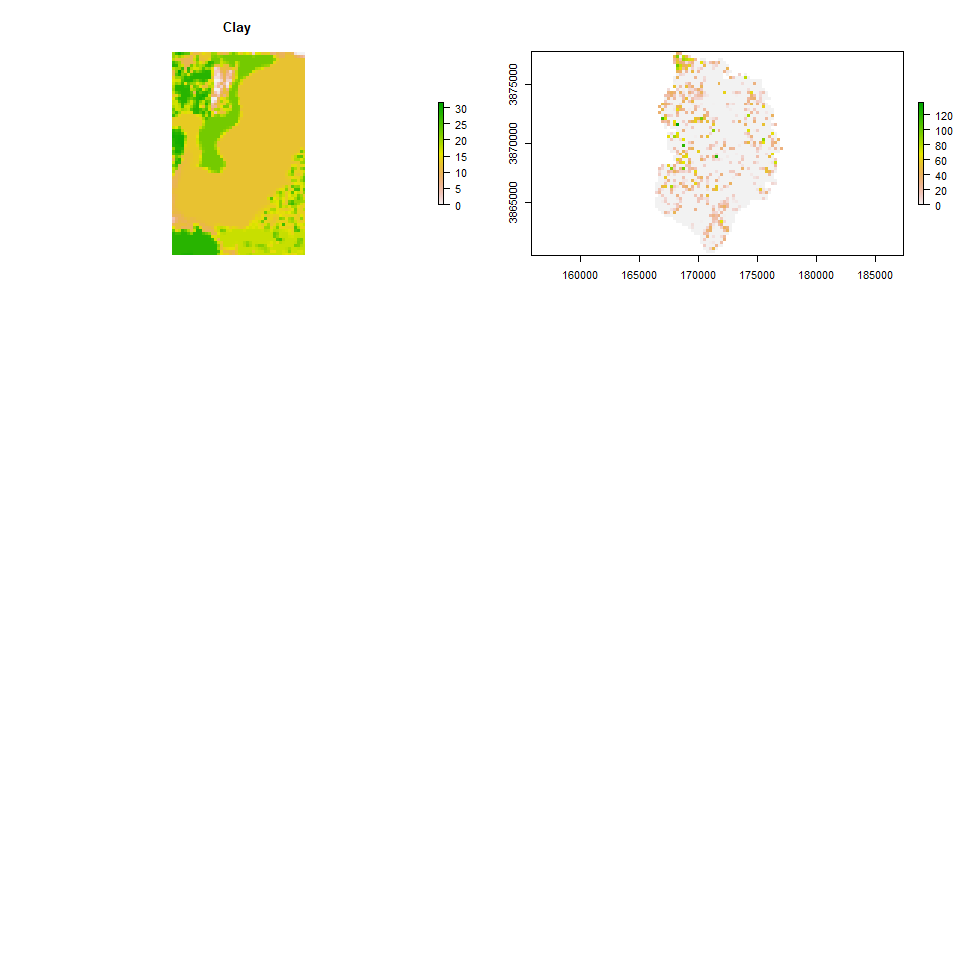<!-- -->

``` r
#### Create one dataframe of all the variales
df_all_250<-rbind(LC_Stack,RM_Stack,RR_Stack,SR_Stack)
colnames(df_all_250)<-c("RdNBR","EfWS","ModisET","ModisPET","ModisWD","Clay","Fuel","Neighbor")
#quantile(df_all_250$RdNBR,.9,na.rm=T)
#hist(df_all_250$ModisET*.1)
#hist(df_all_250$ModisPET*.1)
### Normalize the ET and PET to deal with differnces between the observed and LANDIS-II model 
df_all_250$ET_z<-(df_all_250$ModisET-mean(na.omit(df_all_250$ModisET)))/sd(na.omit(df_all_250$ModisET))
df_all_250$WD_z<-(df_all_250$ModisWD-mean(na.omit(df_all_250$ModisWD)))/sd(na.omit(df_all_250$ModisWD))
df_all_250$Wind_z<-(df_all_250$EfWS-mean(na.omit(df_all_250$EfWS)))/sd(na.omit(df_all_250$EfWS))


LANDISValues<-read.csv('D:/Sapps_DM_paper/Inputs/ET_Z_score.csv')
MeanET<-mean(LANDISValues$MeanET)
sdED<-sd(LANDISValues$MeanET)
MeanWD<-mean(LANDISValues$MeanWD)
sdWD<-sd(LANDISValues$MeanWD)
Mean_Wind<-mean(LANDISValues$MeanEffectiveWindSpeed)
SD_wind<-sd(LANDISValues$MeanEffectiveWindSpeed)
df_all_250$ET_Scaled<-(df_all_250$ET_z*sdED)+MeanET
df_all_250$WD_Scaled<-(df_all_250$WD_z*sdWD)+MeanWD
df_all_250$Wind_Scaled<-(df_all_250$Wind_z*SD_wind)+Mean_Wind


# plot(df_all_250$ET_Scaled)
# plot(df_all_250$WD_Scaled)
# plot(df_all_250$ET_z)

## Save to minimize processing 
#write.csv(df_all_250,"All_250_5_18.csv")
```

``` r
df_all_250<-read.csv("All_250_5_18.csv")

#Remove all entries where the RdNBR is less than zero. 
df_F<-df_all_250 %>%
        subset(RdNBR>0)%>%
            na.omit()


# Get the Z-values to reverse transform for testing. 
LANDISValues<-read.csv('D:/Sapps_DM_paper/Inputs/ET_Z_score.csv')
MeanET<-mean(LANDISValues$MeanET)
sdED<-sd(LANDISValues$MeanET)
MeanWD<-mean(LANDISValues$MeanWD)
sdWD<-sd(LANDISValues$MeanWD)
dWD<-sd(LANDISValues$MeanWD)
```

Testing the variable inclusion

``` r
#colnames(df_F)
df<-NULL
### roung of one 
glmt<-with(df_F,glm(RdNBR~EfWS,family=Gamma(link="inverse")))
#print(paste('wind', round(AIC(glmt))))
df<-rbind(df,cbind('wind', round(AIC(glmt))))


glmt<-with(df_F,glm(RdNBR~ModisET,family=Gamma(link="inverse")))
#print(paste('ET', round(AIC(glmt))))
df<-rbind(df,cbind('ET', round(AIC(glmt))))

glmt<-with(df_F,glm(RdNBR~ModisPET,family=Gamma(link="inverse")))
#print(paste('PET', round(AIC(glmt))))
df<-rbind(df,cbind('PET', round(AIC(glmt))))

glmt<-with(df_F,glm(RdNBR~Clay,family=Gamma(link="inverse")))
#print(paste('Clay', round(AIC(glmt))))
df<-rbind(df,cbind('clay', round(AIC(glmt))))

glmt<-with(df_F,glm(RdNBR~Fuel,family=Gamma(link="inverse")))
#print(paste('Fuel', round(AIC(glmt))))
df<-rbind(df,cbind('Fuel', round(AIC(glmt))))


### Round of two 
glmt<-with(df_F,glm(RdNBR~EfWS+Clay,family=Gamma(link="inverse")))
#print(paste('wind +clay', round(AIC(glmt))))
df<-rbind(df,cbind('wind +clay', round(AIC(glmt))))

glmt<-with(df_F,glm(RdNBR~EfWS+ModisET,family=Gamma(link="inverse")))
#print(paste('wind +ET', round(AIC(glmt))))
df<-rbind(df,cbind('wind +ET', round(AIC(glmt))))

glmt<-with(df_F,glm(RdNBR~EfWS+ModisWD,family=Gamma(link="inverse")))
#print(paste('wind +WD', round(AIC(glmt))))
df<-rbind(df,cbind('wind +WD', round(AIC(glmt))))

glmt<-with(df_F,glm(RdNBR~EfWS+Fuel,family=Gamma(link="inverse")))
#print(paste('wind +Fuel', round(AIC(glmt))))
df<-rbind(df,cbind('wind +Fuel', round(AIC(glmt))))

glmt<-with(df_F,glm(RdNBR~Clay+Fuel,family=Gamma(link="inverse")))
#print(paste('Clay+Fuel', round(AIC(glmt))))
df<-rbind(df,cbind('Clay+Fuel', round(AIC(glmt))))

glmt<-with(df_F,glm(RdNBR~Clay+ModisET,family=Gamma(link="inverse")))
#print(paste('Clay+Fuel', round(AIC(glmt))))
df<-rbind(df,cbind('Clay+Fuel', round(AIC(glmt))))

glmt<-with(df_F,glm(RdNBR~Clay+ModisWD,family=Gamma(link="inverse")))
#print(paste('Clay +WD', round(AIC(glmt))))
df<-rbind(df,cbind('Clay +WD', round(AIC(glmt))))

glmt<-with(df_F,glm(RdNBR~ModisET+ModisWD,family=Gamma(link="inverse")))
#print(paste('ET +WD', round(AIC(glmt))))
df<-rbind(df,cbind('ET +WD', round(AIC(glmt))))

glmt<-with(df_F,glm(RdNBR~ModisET+Fuel,family=Gamma(link="inverse")))
#print(paste('ET +Fuel', round(AIC(glmt))))
df<-rbind(df,cbind('ET +Fuel', round(AIC(glmt))))

glmt<-with(df_F,glm(RdNBR~ModisWD+Fuel,family=Gamma(link="inverse")))
#print(paste('WD +Fuel', round(AIC(glmt))))
df<-rbind(df,cbind('WD +Fuel', round(AIC(glmt))))


#### Round of Three
#colnames(df_F)
glmt<-with(df_F,glm(RdNBR~EfWS+Clay+ModisET,family=Gamma(link="inverse")))
#print(paste('wind +clay + ET', round(AIC(glmt))))
df<-rbind(df,cbind('wind +clay+ ET', round(AIC(glmt))))

glmt<-with(df_F,glm(RdNBR~EfWS+Clay+Fuel,family=Gamma(link="inverse")))
#print(paste('wind +clay + Fuel', round(AIC(glmt))))
df<-rbind(df,cbind('wind +clay+ Fuel', round(AIC(glmt))))

glmt<-with(df_F,glm(RdNBR~EfWS+Clay+ModisWD,family=Gamma(link="inverse")))
#print(paste('wind +clay + WD', round(AIC(glmt))))
df<-rbind(df,cbind('wind +clay+ WD', round(AIC(glmt))))

glmt<-with(df_F,glm(RdNBR~EfWS+ModisET+ModisWD,family=Gamma(link="inverse")))
#print(paste('wind +ET + WD', round(AIC(glmt))))
df<-rbind(df,cbind('wind + ET + WD', round(AIC(glmt))))

glmt<-with(df_F,glm(RdNBR~EfWS+ModisET+Fuel,family=Gamma(link="inverse")))
#print(paste('wind +ET + WD', round(AIC(glmt))))
df<-rbind(df,cbind('wind + ET + Fuel', round(AIC(glmt))))

glmt<-with(df_F,glm(RdNBR~EfWS+ModisWD+Fuel,family=Gamma(link="inverse")))
#print(paste('wind +ET + WD', round(AIC(glmt))))
df<-rbind(df,cbind('wind + WD + Fuel', round(AIC(glmt))))

#colnames(df_F)
glmt<-with(df_F,glm(RdNBR~EfWS+ModisWD+Fuel+Clay,family=Gamma(link="inverse")))
#print(paste('wind +Clay + Fuel+ WD', round(AIC(glmt))))
df<-rbind(df,cbind('wind + Clay + Fuel+ WD', round(AIC(glmt))))

glmt<-with(df_F,glm(RdNBR~EfWS+ModisWD+Fuel+ModisET,family=Gamma(link="inverse")))
#print(paste('wind +ET + WD +Fuel', round(AIC(glmt))))
df<-rbind(df,cbind('wind +ET + WD +Fuel', round(AIC(glmt))))

glmt<-with(df_F,glm(RdNBR~EfWS+Clay+Fuel+ModisET,family=Gamma(link="inverse")))
#print(paste('wind +ET + WD +Fuel', round(AIC(glmt))))
df<-rbind(df,cbind('wind +ET + Clay +Fuel', round(AIC(glmt))))

glmt<-with(df_F,glm(RdNBR~EfWS+Clay+ModisWD+ModisET,family=Gamma(link="inverse")))
#print(paste('wind +ET + WD +Fuel', round(AIC(glmt))))
df<-rbind(df,cbind('wind +ET + Clay +WD', round(AIC(glmt))))


glmt<-with(df_F,glm(RdNBR~EfWS+ModisWD+Fuel+Clay+ModisET,family=Gamma(link="inverse")))
#print(paste('All Five', round(AIC(glmt))))
df<-rbind(df,cbind('All Five', round(AIC(glmt))))
print(df[order(df[,2]),])
```

    ##       [,1]                     [,2]   
    ##  [1,] "All Five"               "50112"
    ##  [2,] "wind +ET + Clay +Fuel"  "50136"
    ##  [3,] "wind + Clay + Fuel+ WD" "50138"
    ##  [4,] "wind +ET + Clay +WD"    "50184"
    ##  [5,] "wind +ET + WD +Fuel"    "50200"
    ##  [6,] "wind + WD + Fuel"       "50210"
    ##  [7,] "wind +clay+ ET"         "50214"
    ##  [8,] "wind + ET + Fuel"       "50215"
    ##  [9,] "wind +clay+ Fuel"       "50235"
    ## [10,] "Clay+Fuel"              "50274"
    ## [11,] "wind +Fuel"             "50275"
    ## [12,] "wind +clay+ WD"         "50311"
    ## [13,] "Clay+Fuel"              "50316"
    ## [14,] "WD +Fuel"               "50318"
    ## [15,] "ET +Fuel"               "50322"
    ## [16,] "Clay +WD"               "50368"
    ## [17,] "Fuel"                   "50375"
    ## [18,] "wind + ET + WD"         "50402"
    ## [19,] "wind +ET"               "50413"
    ## [20,] "ET +WD"                 "50498"
    ## [21,] "ET"                     "50504"
    ## [22,] "PET"                    "50519"
    ## [23,] "wind +WD"               "50542"
    ## [24,] "wind +clay"             "50636"
    ## [25,] "clay"                   "50673"
    ## [26,] "wind"                   "50846"

### Model Structure.

Glm with and Gamma distribution RdNBR\~Windspeed,Fuel, and Modis ET

``` r
glm1<-glm(df_F$RdNBR~df_F$EfWS+df_F$Clay+df_F$ET_Scaled+df_F$WD_Scaled,family=Gamma(link="inverse"))
AIC(glm1)
```

    ## [1] 50184.05

``` r
summary(glm1)
```

    ## 
    ## Call:
    ## glm(formula = df_F$RdNBR ~ df_F$EfWS + df_F$Clay + df_F$ET_Scaled + 
    ##     df_F$WD_Scaled, family = Gamma(link = "inverse"))
    ## 
    ## Deviance Residuals: 
    ##     Min       1Q   Median       3Q      Max  
    ## -3.1652  -0.5636  -0.1154   0.2809   2.4179  
    ## 
    ## Coefficients:
    ##                  Estimate Std. Error t value Pr(>|t|)    
    ## (Intercept)     1.186e-02  4.156e-04  28.546  < 2e-16 ***
    ## df_F$EfWS      -3.553e-04  4.164e-05  -8.534  < 2e-16 ***
    ## df_F$Clay       1.758e-04  1.130e-05  15.560  < 2e-16 ***
    ## df_F$ET_Scaled -4.537e-06  3.531e-07 -12.850  < 2e-16 ***
    ## df_F$WD_Scaled -6.288e-06  1.125e-06  -5.588 2.43e-08 ***
    ## ---
    ## Signif. codes:  0 '***' 0.001 '**' 0.01 '*' 0.05 '.' 0.1 ' ' 1
    ## 
    ## (Dispersion parameter for Gamma family taken to be 0.4211321)
    ## 
    ##     Null deviance: 2444.6  on 4434  degrees of freedom
    ## Residual deviance: 2098.4  on 4430  degrees of freedom
    ## AIC: 50184
    ## 
    ## Number of Fisher Scoring iterations: 6

``` r
1-2098.4/2728.8
```

    ## [1] 0.2310173

Here is a summary of the model fit compared to the data

``` r
linear<-lm(df_F$RdNBR~predict(glm1,type="response"))
summary(linear)
```

    ## 
    ## Call:
    ## lm(formula = df_F$RdNBR ~ predict(glm1, type = "response"))
    ## 
    ## Residuals:
    ##     Min      1Q  Median      3Q     Max 
    ## -409.17  -54.36  -13.58   37.43  602.72 
    ## 
    ## Coefficients:
    ##                                  Estimate Std. Error t value Pr(>|t|)    
    ## (Intercept)                        6.2940     4.0924   1.538    0.124    
    ## predict(glm1, type = "response")   0.9506     0.0306  31.066   <2e-16 ***
    ## ---
    ## Signif. codes:  0 '***' 0.001 '**' 0.01 '*' 0.05 '.' 0.1 ' ' 1
    ## 
    ## Residual standard error: 82.3 on 4433 degrees of freedom
    ## Multiple R-squared:  0.1788, Adjusted R-squared:  0.1786 
    ## F-statistic: 965.1 on 1 and 4433 DF,  p-value: < 2.2e-16

Here is an estimation of the predicted values.

``` r
par(pty="s")
plot(df_F$RdNBR~predict(glm1 ,type="response"),col=adjustcolor("black",alpha.f=.05),pch=16,xlim=c(0,1000),
     ylim=c(0,1000),xlab="Model Predicts",ylab="Data Shows")
abline(1,1)
```

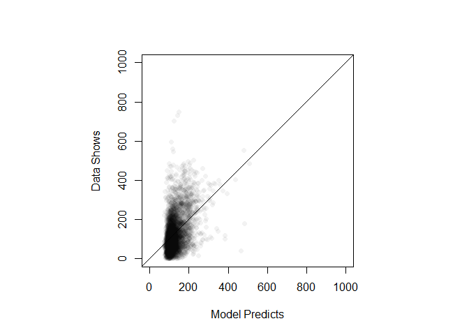<!-- -->

Here is the model reported by Z-score

``` r
glm1<-glm(df_F$RdNBR~df_F$EfWS+df_F$Clay+df_F$ET_z+df_F$WD_z,family=Gamma(link="inverse"))
AIC(glm1)
```

    ## [1] 50184.05

``` r
summary(glm1)
```

    ## 
    ## Call:
    ## glm(formula = df_F$RdNBR ~ df_F$EfWS + df_F$Clay + df_F$ET_z + 
    ##     df_F$WD_z, family = Gamma(link = "inverse"))
    ## 
    ## Deviance Residuals: 
    ##     Min       1Q   Median       3Q      Max  
    ## -3.1652  -0.5636  -0.1154   0.2809   2.4179  
    ## 
    ## Coefficients:
    ##               Estimate Std. Error t value Pr(>|t|)    
    ## (Intercept)  8.466e-03  3.404e-04  24.868  < 2e-16 ***
    ## df_F$EfWS   -3.553e-04  4.164e-05  -8.534  < 2e-16 ***
    ## df_F$Clay    1.757e-04  1.130e-05  15.560  < 2e-16 ***
    ## df_F$ET_z   -1.122e-03  8.733e-05 -12.850  < 2e-16 ***
    ## df_F$WD_z   -5.442e-04  9.738e-05  -5.588 2.43e-08 ***
    ## ---
    ## Signif. codes:  0 '***' 0.001 '**' 0.01 '*' 0.05 '.' 0.1 ' ' 1
    ## 
    ## (Dispersion parameter for Gamma family taken to be 0.4211321)
    ## 
    ##     Null deviance: 2444.6  on 4434  degrees of freedom
    ## Residual deviance: 2098.4  on 4430  degrees of freedom
    ## AIC: 50184
    ## 
    ## Number of Fisher Scoring iterations: 6

# Calculating Delayed Mortality

#### Rough Ridge and Rock Mt.

Burned in 2016 and mortality used gathered in 2019. Here are the
locations of the plot relative to the DRdNBR maps. Data is from the USFS
Athens GA feild campaign following those fires.

Include more information here.

``` r
#DNBRmapExample<-raster("C:/Users/zacha/Desktop/Sapps_Mortality/sapps_delayed_mortality-20200831T165837Z-001/sapps_delayed_mortality/delayed_rdnbr.tif")
#projection(DNBRmapExample)

DNBRmap1a<-raster("Inputs/Fires_2_12/ROCK_MOUNTAIN_DRdNBR.tif")
DNBRmap2a<-raster("Inputs/Fires_2_12/ROUGH_RIDGE_DRdNBR.tif")

DNBRmap<-merge(DNBRmap1a,DNBRmap2a)
#Mort_Drive<-"C:/Users/zacha/Desktop/Sapps_Mortality/"
PlotLocations<-read.csv("Inputs/FeildData/GA_plot_data_mastersheet.csv")
PlotLocations$Plot_simple<-substr(PlotLocations$Plot.ID,1,4)
PlotLocations$Plot_modifier<-substr(PlotLocations$Plot.ID,5,10)

RR_Points<-PlotLocations[PlotLocations$Plot.ID %like% "rr",]
plotsshort<-as.data.frame(RR_Points[c('Plot.ID','Latitude','Longitude')])

names(plotsshort)<-c("Plot.ID","x","y")


### Rough Ridge
RR_Points<-SpatialPointsDataFrame(plotsshort[,3:2],data=RR_Points)
crs(RR_Points)<- CRS("+init=epsg:4326")
RR_Points_repro<-spTransform(RR_Points,projection(DNBRmap))
RR_DNBRscore<-as.data.frame(raster::extract(DNBRmap,RR_Points_repro,sp=T))
RR_Stackscore<-as.data.frame(raster::extract(RR_Stack2,RR_Points_repro,sp=T))
RR_Merge<-merge(RR_DNBRscore,RR_Stackscore,by="Plot.ID")
#colnames(RR_Merge)
RR_Short<-RR_Merge[c(1,2,3,4,5,6,7,8,55,56,57,58,60)]
colnames(RR_Short)<-c("Plot","ID","Species.number","Tree.number",
                      "Live.Trees","Dead.Trees","Duff.Avg.cm.",
                      "Treatment","DNBR","EfWS","ModisET","ModisPET","Clay")
###Rock Mountian
RM_Points<-PlotLocations[PlotLocations$Plot.ID %like% "rm",]
plotsshort<-as.data.frame(RM_Points[c('Plot.ID','Latitude','Longitude')])
names(plotsshort)<-c("Plot.ID","x","y")
RM_Points<-SpatialPointsDataFrame(plotsshort[,3:2],data=RM_Points)
crs(RM_Points)<- CRS("+init=epsg:4326")
RM_Points_repro<-spTransform(RM_Points,projection(DNBRmap))
RM_DNBRscore<-as.data.frame(raster::extract(DNBRmap,RM_Points_repro,sp=T))
RM_Stackscore<-as.data.frame(raster::extract(RM_Stack2,RM_Points_repro,sp=T))
RM_Merge<-merge(RM_DNBRscore,RM_Stackscore,by="Plot.ID")
RM_Short<-RM_Merge[c(1,2,3,4,5,6,7,8,55,56,57,58,60 )]
colnames(RM_Short)<-c("Plot","ID","Species.number","Tree.number",
                      "Live.Trees","Dead.Trees","Duff.Avg.cm.",
                      "Treatment","DNBR","EfWS","ModisET","ModisPET","Clay")
DNBRMerge<-rbind(RM_Short,RR_Short)


plot(DNBRmap,xlim=c(260000,280000),box=F,axes=F,main="Rock Mountian 250m")
plot(RM_Points_repro[RM_Points_repro$Treatment=="Burned",],add=T,col="red",cex=1.2,pch="+")
plot(RM_Points_repro[RM_Points_repro$Treatment=="Unburned",],add=T,col="blue",cex=1.2,pch="+")
legend(260000,3880000,legend=c("Plots Burned","Plots_Unburned"),pch=c("+","+"),col=c("red","blue"))
```

<!-- -->

``` r
plot(DNBRmap,main="Rough Ridge 250m",xlim=c(160000,180000))
plot(RR_Points_repro[RR_Points_repro$Treatment=="Burned",],add=T,col="red",cex=1.2,pch="+")
plot(RR_Points_repro[RR_Points_repro$Treatment=="Unburned",],add=T,col="blue",cex=1.2,pch="+")
legend(165000,3880000,legend=c("Plots Burned","Plots_Unburned"),pch=c("+","+"),col=c("red","blue"))
```

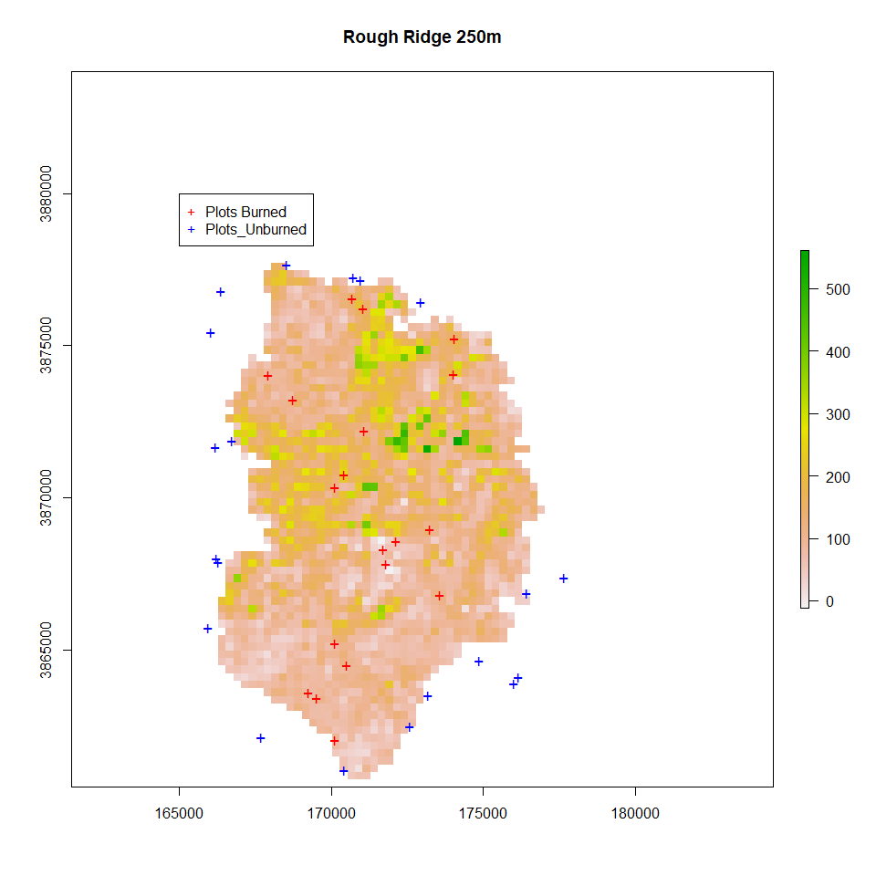<!-- -->

``` r
# plot(DNBRmap,xlim=c(160000,180000),box=F,axes=F)
# plot(RR_Points_repro[RR_Points_repro$Treatment=="Burned",],add=T,col="red",cex=1.2,pch="+")
# plot(RR_Points_repro[RR_Points_repro$Treatment=="Unburned",],add=T,col="blue",cex=1.2,pch="+")
# legend(165000,3883000,legend=c("Plots Burned","Plots Unburned"),pch=c("+","+"),col=c("red","blue"),cex=2.0, bty = "n")
```

``` r
### This the species data from the Georgia fires 
SpeciesSheets<-read.csv('Inputs/FeildData/GA_Species_info.csv')
### Cleaning the data 
Sp_LUT<-SpeciesSheets
Sp_LUT$Genus.sp[Sp_LUT$Genus.sp=="Oxdendrum arboreum"]<-"Oxydendrum arboreum"
Sp_LUT$Genus.sp[Sp_LUT$Genus.sp=="Liriodendron  tulipifera"]<-"Liriodendron tulipifera"
### This is the feild plot data from the Georgia fires
TreeSheet<-read.csv('Inputs/FeildData/GA_tree_data_mastersheet.csv')
#head(TreeSheet)
```

Estimations form bark thickness come from the Tree Fire Mortality
Database.

Citation:

Cansler, C. Alina, Sharon M. Hood, J. Morgan Varner, Phillip J. van
Mantgem, Michelle C. Agne, Robert A. Andrus, Matthew P. Ayres et
al. “The Fire and Tree Mortality Database, for empirical modeling of
individual tree mortality after fire.” Scientific data 7, no. 1 (2020):
1-14.

<https://www.fs.usda.gov/treesearch/pubs/60342>

Each tree is associated with a given bark thickness based off of its DBH
and species.

``` r
Sp_LUT3<-Sp_LUT
###Loading in the barkthickness data 
BarkThickness<-read.csv("Inputs/FeildData/Species_BarkThickness.csv")
BarkThickness<-BarkThickness[BarkThickness$Genus_Species %in% Sp_LUT$Genus.sp,]
BarkThickness<-BarkThickness[order(BarkThickness$BT_coef,decreasing=T),]
colnames(Sp_LUT3)[3]<-"Genus_Species"
Sp_LUT3<-merge(Sp_LUT3,BarkThickness,by="Genus_Species",all.x=T)
Sp_LUT3<-Sp_LUT3[!is.na(Sp_LUT3$BT_coef),]

par(mar=c(15, 4.1, 4.1, 2.1))
barplot(BarkThickness$BT_coef,names.arg = BarkThickness$Genus_Species,las=2,cex.names =1.2 ,
        main="Bark Thickness Coefficient",cex=1.4)
```

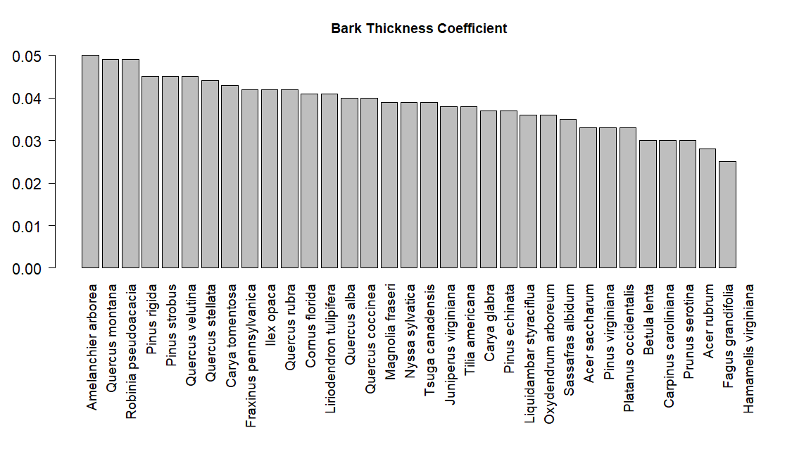<!-- -->

These species are ommitted from the analysis due to either
classification as shrub or lack of diameter data

``` r
### Aligning the data, aligning the geospatial data with the plot data 
Species<-Sp_LUT3$Genus_Species
Barkmerge<-Sp_LUT3[c('Genus_Species','BT_coef')]
colnames(Barkmerge)<-c("GNSSPP","BT_coef")
TreeSheet<-merge(TreeSheet,DNBRMerge,by='Plot',all.x=T)
Barkmerge<-Sp_LUT3[c('Genus_Species','BT_coef')]
colnames(Barkmerge)<-c("GNSSPP","BT_coef")
DuffConsumptionTerms<-c('Duff consumption','Duff consumption, Fire damaged', 'Duff consumption, Fire damaged, Tree declining','Duff consumption, Fire mortality','Duff consumption, Leaning tree, Tree declining',' Duff consumption, New mortality','Duff consumption, Root sprouts ','Duff consumption, Shares base with smaller tree(s)',"Duff consumption, Tree declining ")

## In selecting just these species, We go from 1576 to 1457 samples 
BurnedPlot=PlotLocations[PlotLocations$Treatment=="Burned",]
BurnedPlot<-BurnedPlot[BurnedPlot$Plot.ID!="rr18b",]

### Merging with the bark thickness data. 
### Calculate the bark thickness, and denote wheter the tree died and its duff consupmtion. 

TreeSheet_tr <-TreeSheet %>%
  filter(GNSSPP %in% Species) %>%
  filter(Plot %in% BurnedPlot$Plot.ID)%>%
  merge(Barkmerge,by="GNSSPP",all.x=T)%>%
  mutate(SingleBark=DBH*BT_coef)%>%
  mutate(DeadMark=ifelse(STAT19=="Dead",1,0)) %>%
  mutate(IMMMark=ifelse(STAT17=="Dead",1,0)) %>%
  mutate(DuffMark=ifelse(Notes17 %in% DuffConsumptionTerms,1,0))
```

``` r
### Looking at the species that were removed
OutPlot<-TreeSheet%>%
 filter(!Plot %in% BurnedPlot$Plot.ID)
ommited<-OutPlot[!OutPlot$GNSSPP %in% Species,]
table(ommited$GNSSPP)
```

    ## 
    ##    Acer pensylvanicum      Acer saccharinum   Betula alleghaniens 
    ##                     1                     3                     2 
    ## Betula alleghaniensis          Carya ovalis      Halesia carolina 
    ##                     2                     1                     6 
    ##      Kalmia latifolia    Magnolia acuminata      Nyssa \tsylvatica 
    ##                     4                     2                     1 
    ##    Ostraya virginiana  Rhododendron maximum   Symplocos tinctoria 
    ##                     1                     9                     2 
    ##               Unknown 
    ##                    25

### Linville complex

Pinnacle and Shortoff mountain. Burned in 2007 and sampled in 2018

More data information here.

Each tree is associated with a given bark thickness based off of its DBH
and species.

``` r
## Loading the RDNBR data 
Sample_RDNBR<-suppressWarnings(raster('Inputs/Fires_2_12/LINVILLE_COMPLEX_DOBSON_KNOB_DRdNBR.tif'))
### Loading in the feild data for the three year delayed mortality 
OverstoryTry<-read.csv('Inputs/FeildData/LN_Overstory2010_Single.csv')

### Aligning the plot locations 
Plot_Locations<-read_sf("Inputs/FeildData/new_Plots073009mjr.shp")
At<-Plot_Locations[Plot_Locations$X2010==1,]
Plts_repo<-st_transform(Plot_Locations,crs=projection(Sample_RDNBR),axes=F,box=F)
### See that they align
plot(Sample_RDNBR)
plot(Plts_repo$geometry,col="red",cex=1.2,pch="+",add=T)
```

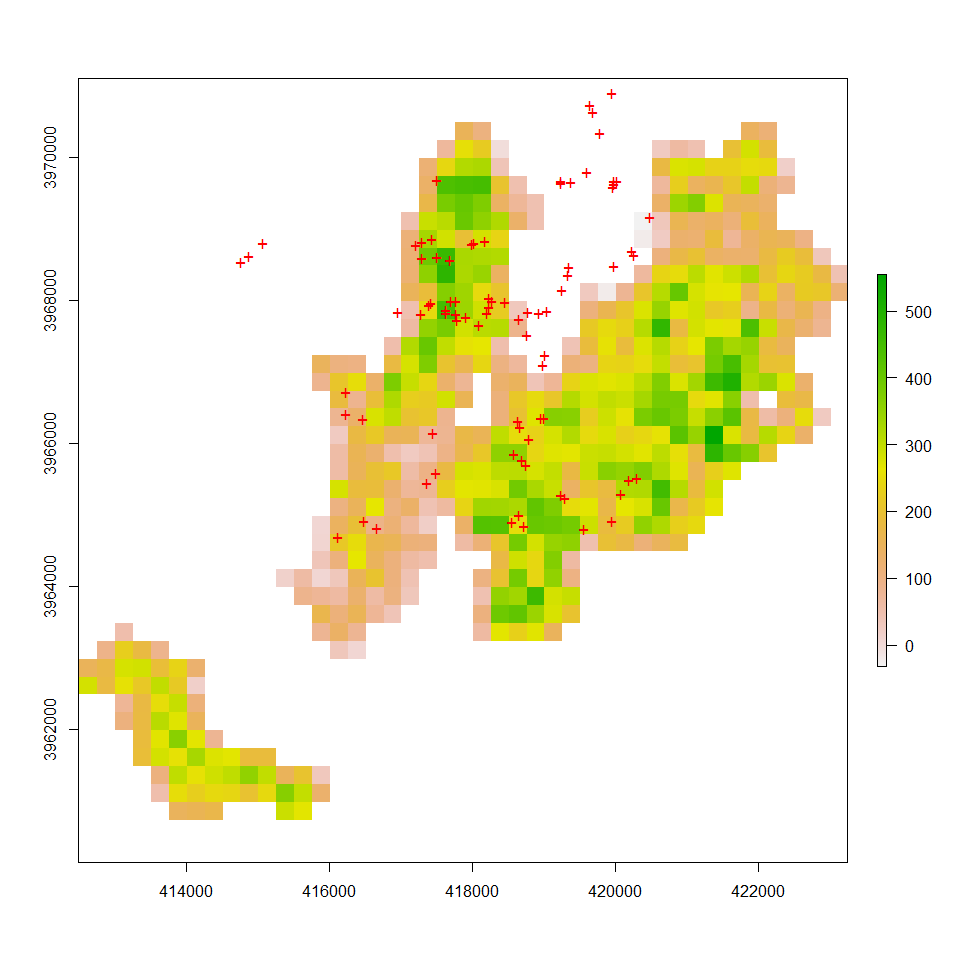<!-- -->

``` r
DF_Plots<-NULL
### Looping through the plots and organizeing them by 
# Plot,Landscape,Burned2007/2008(T/F),RDNBR,Reburn
for(i in 1:nrow(Plts_repo)){
  RDNBR=0.0
  Reburn=T
  Plot_Num<-Plts_repo$PLOT_NUM[i]
  LLU<-Plts_repo$Landscape[i]
  Location<-Plts_repo$geometry[i]
  unique(Plts_repo$Landscape)
  if (LLU %in% c("PINN1X","PINN2X","SUN","SHORT2X")){Burned2007=TRUE}else(Burned2007=FALSE)
  if(Burned2007 == TRUE){
    Search=LC_Stack2
    RDNBR<-suppressWarnings(raster::extract(Search,as(Plts_repo[i,],"sf")))
    if(LLU=="PINN2X"){Reburn=T}else{Reburn=F}
    if(LLU=="SHORT2X"){Ruburn=T}
    }
  Row<-data.frame(Number=Plot_Num,Landscape=LLU,Burned2007=Burned2007,RDNBR=RDNBR[1],EfWs=RDNBR[2],
                  ModisET=RDNBR[3],ModisWD=RDNBR[4]-RDNBR[3],Clay=RDNBR[6],Reburn=Reburn)
  DF_Plots<-rbind(DF_Plots,Row)
}

### This goes through the overstory with a mean dbh of their chategory (0-1cm = .5cm)
Process1<-function(OverstoryTry,Label,Column){

  zeroone<-data.frame(Plot=OverstoryTry$PLOT,Species=OverstoryTry$SPECIES,Status=OverstoryTry$LIVE..DEAD..DOG..DBF..DOGBF ,Size=rep(Label,length(OverstoryTry$X0.1.cm)),Count=Column)
  return(zeroone)
}
first<-Process1(OverstoryTry,.5,OverstoryTry$X0.1.cm)
second<-Process1(OverstoryTry,1.75,OverstoryTry$X1.2.5.cm)
third<-Process1(OverstoryTry,3.75,OverstoryTry$X2.5.5.cm)
fourth<-Process1(OverstoryTry,7.5,OverstoryTry$X5.10.cm)
fifth<-Process1(OverstoryTry,12.5,OverstoryTry$X10.15.cm)
six<-Process1(OverstoryTry,22.5,OverstoryTry$X20.25.cm)
seven<-Process1(OverstoryTry,27.5,OverstoryTry$X25.30.cm)
eight<-Process1(OverstoryTry,32.5,OverstoryTry$X30.35.cm)
nine<-Process1(OverstoryTry,37.5,OverstoryTry$X35.40.cm)

## This category is a numeric amoun tof dbh, I tranform that to the dbh size
ten<-data.frame(Plot=OverstoryTry$PLOT,Species=OverstoryTry$SPECIES,Status=OverstoryTry$LIVE..DEAD..DOG..DBF..DOGBF,Size=OverstoryTry$X40..cm,Count=1)
AllPlots<-rbind(first,second,third,fourth,fifth,six,seven,eight,nine,ten)
## Remove incomplete records
DataClean<-na.omit(AllPlots)
DataClean<-DataClean[DataClean$Count!='.',]
DataClean<-DataClean[DataClean$Size!='.',]
## this takes the count data and makes it individaul points 
df<-NULL
for(i in 1:length(DataClean$Count)){
  repeater<-DataClean$Count[i]
  PlotOut<-rep(DataClean$Plot[i],repeater)  
  Species<-rep(DataClean$Species[i],repeater)
  Status<-rep(DataClean$Status[i],repeater)
  Size<-rep(DataClean$Size[i],repeater)
  Outdf<-data.frame(Plots=PlotOut,Species=Species,Status=Status,Size=Size)
  df<-rbind(Outdf,df)
}
### This makes the names align with the bark data base 

Shorten<-c("QUERCOC","PINURIG", "ACERRUB","QUERPRI","QUERALB",  "QUERSPP","PINUVIR","PINUSTR", "TSUGCAN","TSUGSPP",
           "PINUSPP", "PINUPUN", "PINUECH", "NYSSSYL", "MAGNFRA" ,"BETULEN",
           "ROBIPSE","OXYDARB","QUERRUB" ,"CARYGLA" ,"QUERVEL", "QUERSTE","PINUTAE" ,
           "CORNFLO" ,"SASSALB"  , "CASTDEN" ,"CARYALB" ,"LIQUSTY", "CASTPUM", "AMELARB" ,
            "PRUNPEN" ,"ILEXOPA" , "DIOSVIR","LIRITUL")
Full<-c("Quercus coccinea" ,"Pinus rigida","Acer rubrum","Quercus montana",'Quercus species','Quercus species','Pinus virginiana','Pinus strobus','Tsuga canadensis','Tsuga canadensis',
        'Pinus ',   'Picea pungens','Pinus echinata','Nyssa sylvatica','Magnolia fraseri','Betula lenta','Robinia pseudoacacia',
        'Oxydendrum arboreum','Quercus rubra','Carya glabra','Quercus velutina','Quercus stellata','Pinus taeda',
        'Cornus florida','Sassafras albidum','Castanea dentata','Carya ' ,  'Liquidambar styraciflua','Castanea pumila',
        'Amelanchier arborea','Prunus ','Ilex opaca','Diospyros virginiana','Liriodendron tulipifera')
Spp_LUT<-cbind(Shorten,Full)
colnames(Spp_LUT)<-c("Species","Species_Full")

Full_names<-merge(df,Spp_LUT,by="Species",all.x=T)
```

``` r
### Input the bark thickness data and merge it 
BarkThickness<-read.csv("Inputs/FeildData/Species_BarkThickness.csv")
BarkThickness<-BarkThickness[BarkThickness$Genus_Species %in% Full_names$Species_Full,]
BarkThickness<-BarkThickness[order(BarkThickness$BT_coef,decreasing=T),]
colnames(BarkThickness)[2]<-"Species_Full"
WithBarkCo<-merge(Full_names,BarkThickness,by="Species_Full",all.x=T)
WOBark<-WithBarkCo[is.na(WithBarkCo$BT_coef),]
WithBarkCo<-WithBarkCo[!is.na(WithBarkCo$BT_coef),]

### Create a dummy variable for the Death 
WithBarkCo$DeathMark[WithBarkCo$Status=='DEAD']<-1
WithBarkCo$DeathMark[WithBarkCo$Status=='LIVE']<-0
Ready<-WithBarkCo[!is.na(WithBarkCo$DeathMark),]
### Calaculate Bark thickness
Ready$Size<-as.numeric(Ready$Size)
Ready$SingleBark<-as.numeric(as.numeric(Ready$Size)*as.numeric(Ready$BT_coef))
colnames(DF_Plots)[1]<-'Plots'
WithPlotData<-merge(Ready,DF_Plots,by="Plots",all.x=T)
WithPlotData$RDNBR<-as.numeric(WithPlotData$RDNBR)
## I removed trees less than 2.5 to ignore regereation 
SubSample<-WithPlotData[WithPlotData$Size>7.5,]
### Only look at plots that experienced Fire 
SubSample<-SubSample[SubSample$Burned2007==T,]
SubSample<-na.omit(SubSample)
```

### Data Model Fitting

``` r
###Calculate the Water deficit for Athens
TreeSheet_tr$ModisWD<-TreeSheet_tr$ModisPET-TreeSheet_tr$ModisET
###Reformat the two datasets and combine them. 
Athens_Trun<-TreeSheet_tr[c('DeadMark','GNSSPP','SingleBark','DNBR','EfWS','ModisET','ModisWD','Clay')]
Athens_Trun$DataSet<-"Athens"
colnames(Athens_Trun)[2]<-"Spp"
Linville_Trun<-SubSample[,c('DeathMark','Species','SingleBark',"RDNBR","EfWs", "ModisET",'ModisWD',"Clay" )]
Linville_Trun$DataSet<-"Linville"
colnames(Athens_Trun)<-colnames(Linville_Trun)
LargeMerge<-rbind(Linville_Trun,Athens_Trun)
LargeMerge<-na.omit(LargeMerge)
```

``` r
#For Cart 

Athens_Trun_Cart<-TreeSheet_tr[c('IMMMark','DeadMark','GNSSPP','SingleBark','DNBR','EfWS','ModisET','ModisWD','Clay')]
Athens_Trun_Cart$DataSet<-"Athens"
colnames(Athens_Trun)[2]<-"Spp"
write.csv(Athens_Trun_Cart,"Athens_Trun.csv")
```

The model fits a binomial probability of death based on the site level
RDNBR and the bark thickness of a given tree.

``` r
set.seed(4573)
LargeMerge$Marker<-(1:nrow(LargeMerge))

### Subset the data 80% in the training set and 20 % in the validating st 
Ss<-round(.8*nrow(LargeMerge))
Trainingdata<-LargeMerge[sample(1:nrow(LargeMerge),Ss,replace=F),]
ValidationSet<-LargeMerge[!LargeMerge$Marker %in% Trainingdata$Marker,]

## fit the model 
BinomialDeath<-with(Trainingdata,glm(DeathMark~SingleBark+RDNBR,family=binomial(link="logit")))
summary(BinomialDeath)
```

    ## 
    ## Call:
    ## glm(formula = DeathMark ~ SingleBark + RDNBR, family = binomial(link = "logit"))
    ## 
    ## Deviance Residuals: 
    ##     Min       1Q   Median       3Q      Max  
    ## -2.3543  -0.8155  -0.2944   0.8076   2.3986  
    ## 
    ## Coefficients:
    ##               Estimate Std. Error z value Pr(>|z|)    
    ## (Intercept) -1.1504921  0.2017312  -5.703 1.18e-08 ***
    ## SingleBark  -0.9826194  0.1492701  -6.583 4.62e-11 ***
    ## RDNBR        0.0105938  0.0007437  14.244  < 2e-16 ***
    ## ---
    ## Signif. codes:  0 '***' 0.001 '**' 0.01 '*' 0.05 '.' 0.1 ' ' 1
    ## 
    ## (Dispersion parameter for binomial family taken to be 1)
    ## 
    ##     Null deviance: 1477.5  on 1065  degrees of freedom
    ## Residual deviance: 1081.1  on 1063  degrees of freedom
    ## AIC: 1087.1
    ## 
    ## Number of Fisher Scoring iterations: 4

``` r
1-1081.2/1477
```

    ## [1] 0.2679756

### Validating

Here we have a reciver operating characteristic test and an AOC curve.
We can see that the model correctly classifies 83.62 percent of trees
correctly.

``` r
### How well does the trianing model predict the validation set 
roccurve<-roc(Trainingdata$DeathMark~predict(BinomialDeath,type=c("response")))
plot(roccurve)
```

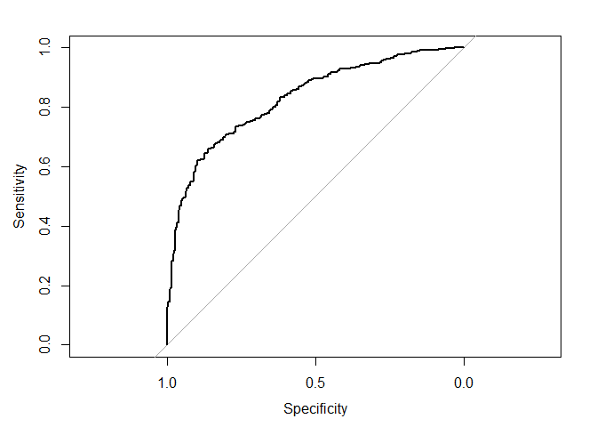<!-- -->

``` r
auc(roccurve)
```

    ## Area under the curve: 0.8278

``` r
### Calculate the variables as Z-scores to mimic the LANDIs-II values 
ValidationSet$ModisET_z<-(ValidationSet$ModisET-mean(na.omit(df_all_250$ModisET)))/sd(na.omit(df_all_250$ModisET))
ValidationSet$ModisWD_z<-(ValidationSet$ModisWD-mean(na.omit(df_all_250$ModisWD)))/sd(na.omit(df_all_250$ModisWD))
### Calculate the model without hte Z-scoring to use the original data. 
#glm4<-glm(df_F$RdNBR~df_F$EfWS+df_F$Clay+df_F$ModisET+df_F$ModisWD,family=Gamma(link="inverse"))
#summary(glm4)

### Calculating the VdNBR as the LANDIS-II model would calculate it. 
ValidationSet$VdNBR<-(1.708e-02 +(ValidationSet$EfWs*( -3.553e-04  ))+(ValidationSet$Clay*  1.758e-04 ) +(ValidationSet$ModisET*(-9.978e-07 ))+(ValidationSet$ModisWD*(-5.027e-07  )))**-1
```

``` r
### ROC testing the model with the estimated RDNBR from preditor vraibles 
roccurve<-roc(ValidationSet$DeathMark~predict(BinomialDeath,data.frame(SingleBark =ValidationSet$SingleBark,RDNBR=ValidationSet$VdNBR),type="response"))
auc(roccurve)
```

    ## Area under the curve: 0.738

``` r
par(pty = "s")
plot(roccurve)
```

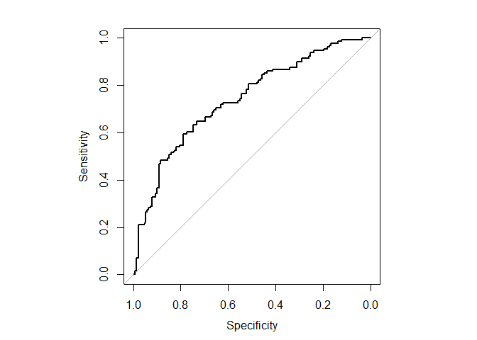<!-- -->

``` r
### ROC testin the model with the observed RDNBR. 

roccurve<-roc(ValidationSet$DeathMark~predict(BinomialDeath,data.frame(SingleBark =ValidationSet$SingleBark,RDNBR=ValidationSet$RDNBR),type="response"))
auc(roccurve)
```

    ## Area under the curve: 0.7606

``` r
par(pty = "s")
plot(roccurve)
```

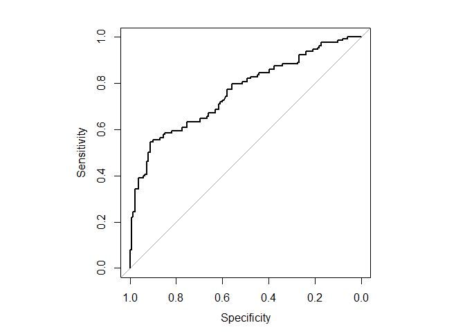<!-- -->

# Calculating Immediate Mortality

``` r
## The tabular plot data 
TreeSheet<-read.csv('Inputs/FeildData/GA_tree_data_mastersheet.csv')
## The RDNBR maps of the two locations 
DNBRmap1<-raster('Inputs/Fires_2_12/ROCK_MOUNTAIN_RDNBR_1yr.tif')
DNBRmap2<-raster("Inputs/Fires_2_12/ROUGH_RIDGE_RDNBR_1yr.tif")
DNBRmap<-merge(DNBRmap1,DNBRmap2)

### Getting the 
PlotLocations<-read.csv('Inputs/FeildData/GA_plot_data_mastersheet.csv')

### Getting the points that are in rough ridge
RR_Points<-PlotLocations[PlotLocations$Plot.ID %like% "rr",]
plotsshort<-as.data.frame(RR_Points[c('Plot.ID','Latitude','Longitude')])
names(plotsshort)<-c("Plot.ID","x","y")
### Geolocate the plots 
RR_Points<-SpatialPointsDataFrame(plotsshort[,3:2],data=RR_Points)
crs(RR_Points)<- CRS("+init=epsg:4326")
RR_Points_repro<-spTransform(RR_Points,projection(DNBRmap))
### Extract the values from stack of predictor varaible rasters. 
RR_DNBRscore<-as.data.frame(raster::extract(DNBRmap,RR_Points_repro,sp=T))
RR_Stackscore<-as.data.frame(raster::extract(RR_Stack2,RR_Points_repro,sp=T))

RR_Merge<-merge(RR_DNBRscore,RR_Stackscore,by="Plot.ID")
#colnames(RR_Merge)
RR_Short<-RR_Merge[c(1,2,3,4,5,6,7,8,58,52,53,54,56)]

colnames(RR_Short)<-c("Plot","ID","Species.number","Tree.number",
                      "Live.Trees","Dead.Trees","Duff.Avg.cm.",
                      "Treatment","DNBR","EfWS","ModisET","ModisPET","Clay")
### Repeat for the Rock Mountian sites 
RM_Points<-PlotLocations[PlotLocations$Plot.ID %like% "rm",]
plotsshort<-as.data.frame(RM_Points[c('Plot.ID','Latitude','Longitude')])
names(plotsshort)<-c("Plot.ID","x","y")
RM_Points<-SpatialPointsDataFrame(plotsshort[,3:2],data=RM_Points)
crs(RM_Points)<- CRS("+init=epsg:4326")
RM_Points_repro<-spTransform(RM_Points,projection(DNBRmap))
RM_DNBRscore<-as.data.frame(raster::extract(DNBRmap,RM_Points_repro,sp=T))
RM_Stackscore<-as.data.frame(raster::extract(RM_Stack2,RM_Points_repro,sp=T))
RM_Merge<-merge(RM_DNBRscore,RM_Stackscore,by="Plot.ID")
RM_Short<-RM_Merge[c(1,2,3,4,5,6,7,8,58,52,53,54,56)]
colnames(RM_Short)<-c("Plot","ID","Species.number","Tree.number",
                      "Live.Trees","Dead.Trees","Duff.Avg.cm.",
                      "Treatment","DNBR","EfWS","ModisET","ModisPET","Clay")
DNBRMerge<-rbind(RM_Short,RR_Short)

### here are the plot locations 
plot(DNBRmap,xlim=c(260000,280000),box=F,axes=F,main="Rock Mountian 250m")
plot(RM_Points_repro[RM_Points_repro$Treatment=="Burned",],add=T,col="red",cex=1.2,pch="+")
plot(RM_Points_repro[RM_Points_repro$Treatment=="Unburned",],add=T,col="blue",cex=1.2,pch="+")
legend(260000,3880000,legend=c("Plots Burned","Plots_Unburned"),pch=c("+","+"),col=c("red","blue"))
```

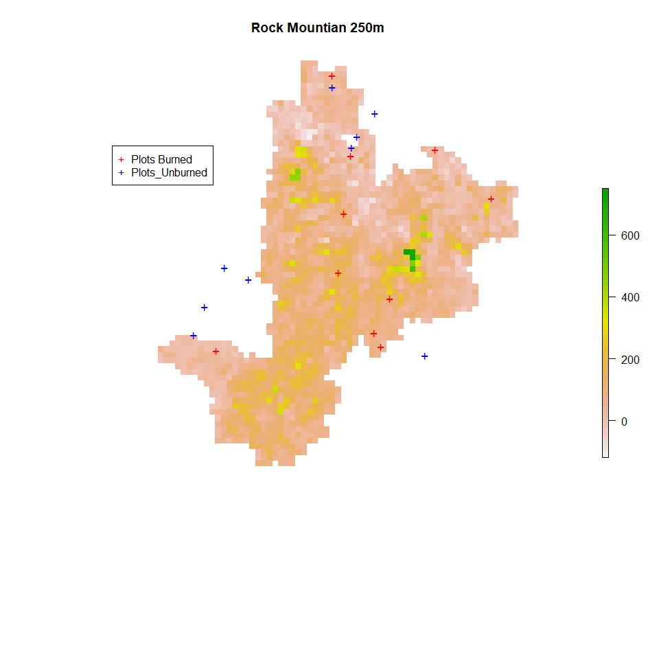<!-- -->

``` r
plot(DNBRmap,main="Rough Ridge 250m",xlim=c(160000,180000),box=F,axes=F)
plot(RR_Points_repro[RR_Points_repro$Treatment=="Burned",],add=T,col="red",cex=1.2,pch="+")
plot(RR_Points_repro[RR_Points_repro$Treatment=="Unburned",],add=T,col="blue",cex=1.2,pch="+")
legend(165000,3880000,legend=c("Plots Burned","Plots_Unburned"),pch=c("+","+"),col=c("red","blue"))
```

<!-- -->

``` r
### Cleaning up the feild data 
### Merging the LANDIS-II names, 
Species<-Sp_LUT3$Genus_Species
Barkmerge<-Sp_LUT3[c('Genus_Species','BT_coef')]
colnames(Barkmerge)<-c("GNSSPP","BT_coef")
colnames(DNBRMerge)[2]<-'Plot'
TreeSheet<-merge(TreeSheet,DNBRMerge[-2],by='Plot',all.x=T)
Barkmerge<-Sp_LUT3[c('Genus_Species','BT_coef')]
colnames(Barkmerge)<-c("GNSSPP","BT_coef")
DuffConsumptionTerms<-c('Duff consumption','Duff consumption, Fire damaged', 'Duff consumption, Fire damaged, Tree declining','Duff consumption, Fire mortality','Duff consumption, Leaning tree, Tree declining',' Duff consumption, New mortality','Duff consumption, Root sprouts ','Duff consumption, Shares base with smaller tree(s)',"Duff consumption, Tree declining ")

## In selecting just these species, We go from 1576 to 1457 samples 
BurnedPlot=PlotLocations[PlotLocations$Treatment=="Burned",]
BurnedPlot<-BurnedPlot[BurnedPlot$Plot.ID!="rr18b",]

### Finding trees that died in year 1. 
### noting duff consumption, and 
### calculating the bark thickness. 
TreeSheet_tr <-TreeSheet %>%
  filter(GNSSPP %in% Species) %>%
  filter(Plot %in% BurnedPlot$Plot.ID)%>%
  merge(Barkmerge,by="GNSSPP",all.x=T)%>%
  mutate(SingleBark=DBH*BT_coef)%>%
  mutate(DeadMark=ifelse(STAT17=="Dead",1,0)) %>%
  mutate(DuffMark=ifelse(Notes17 %in% DuffConsumptionTerms,1,0))

print("Number of trees that died (1 ==Dead)")
```

    ## [1] "Number of trees that died (1 ==Dead)"

``` r
table(TreeSheet_tr$DeadMark)
```

    ## 
    ##   0   1 
    ## 558  91

### Sunrise Fire 1 Yr Delayed

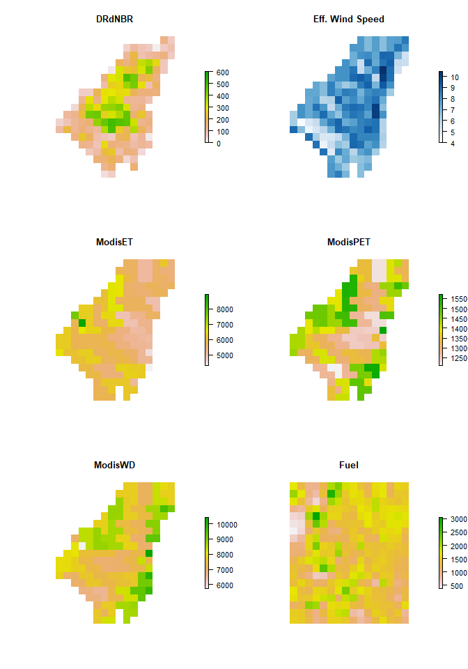<!-- -->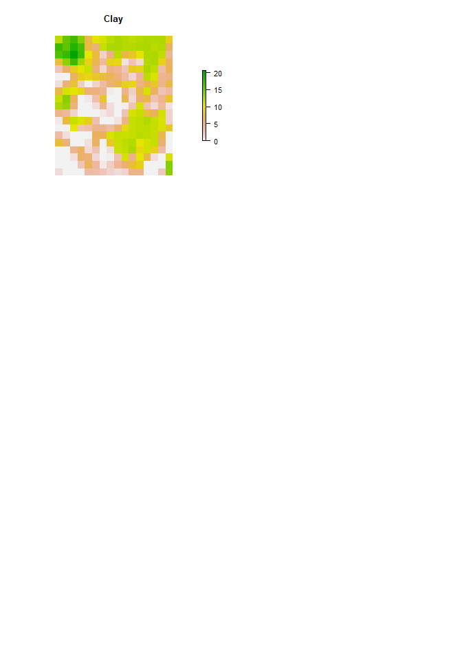<!-- -->

``` r
DF_Plots<-NULL
### Looping through the plots and organizeing them by 
# Plot,Landscape,Burned2007/2008(T/F),RDNBR,Reburn
for(i in 1:nrow(Plts_repo)){
  RDNBR=0.0
  Reburn=T
  Plot_Num<-Plts_repo$PLOT_NUM[i]
  LLU<-Plts_repo$Landscape[i]
  Location<-Plts_repo$geometry[i]
  unique(Plts_repo$Landscape)
  if (LLU %in% c("PINN1X","PINN2X","SUN","SHORT2X")){Burned2008=TRUE}else(Burned2008=FALSE)
  if(Burned2008 == TRUE){
    Search=SUN_Stack2
    RDNBR<-suppressWarnings(raster::extract(Search,as(Plts_repo[i,],"sf")))
    if(LLU=="PINN2X"){Reburn=T}else{Reburn=F}
    if(LLU=="SHORT2X"){Ruburn=T}
    }
  Row<-data.frame(Number=Plot_Num,Landscape=LLU,Burned2008=Burned2008,RDNBR=RDNBR[1],EfWs=RDNBR[2],
                  ModisET=RDNBR[3],ModisWD=RDNBR[4]-RDNBR[3],Clay=RDNBR[6],Reburn=Reburn)
  DF_Plots<-rbind(DF_Plots,Row)
}

### This goes through the overstory with a mean dbh of their chategory (0-1cm = .5cm)
Process1<-function(OverstoryTry,Label,Column){

  zeroone<-data.frame(Plot=OverstoryTry$PLOT,Species=OverstoryTry$SPECIES,Status=OverstoryTry$LIVE..DEAD..DOG..DBF..DOGBF ,Size=rep(Label,length(OverstoryTry$X0.1.cm)),Count=Column)
  return(zeroone)
}
first<-Process1(OverstoryTry,.5,OverstoryTry$X0.1.cm)
second<-Process1(OverstoryTry,1.75,OverstoryTry$X1.2.5.cm)
third<-Process1(OverstoryTry,3.75,OverstoryTry$X2.5.5.cm)
fourth<-Process1(OverstoryTry,7.5,OverstoryTry$X5.10.cm)
fifth<-Process1(OverstoryTry,12.5,OverstoryTry$X10.15.cm)
six<-Process1(OverstoryTry,22.5,OverstoryTry$X20.25.cm)
seven<-Process1(OverstoryTry,27.5,OverstoryTry$X25.30.cm)
eight<-Process1(OverstoryTry,32.5,OverstoryTry$X30.35.cm)
nine<-Process1(OverstoryTry,37.5,OverstoryTry$X35.40.cm)

## This category is a numeric amoun tof dbh, I tranform that to the dbh size
ten<-data.frame(Plot=OverstoryTry$PLOT,Species=OverstoryTry$SPECIES,Status=OverstoryTry$LIVE..DEAD..DOG..DBF..DOGBF,Size=OverstoryTry$X40..cm,Count=1)
AllPlots<-rbind(first,second,third,fourth,fifth,six,seven,eight,nine,ten)
## Remove incomplete records
DataClean<-na.omit(AllPlots)
DataClean<-DataClean[DataClean$Count!='.',]
DataClean<-DataClean[DataClean$Size!='.',]
## this takes the count data and makes it individaul points 
df<-NULL
for(i in 1:length(DataClean$Count)){
  repeater<-DataClean$Count[i]
  PlotOut<-rep(DataClean$Plot[i],repeater)  
  Species<-rep(DataClean$Species[i],repeater)
  Status<-rep(DataClean$Status[i],repeater)
  Size<-rep(DataClean$Size[i],repeater)
  Outdf<-data.frame(Plots=PlotOut,Species=Species,Status=Status,Size=Size)
  df<-rbind(Outdf,df)
}
### This makes the names align with the bark data base 
```

``` r
### Creating a look up table to assopciate the nameds in the feild database with the full ones afrom the mortality databse. 

Shorten<-c("QUERCOC","PINURIG", "ACERRUB","QUERPRI","QUERALB",  "QUERSPP","PINUVIR","PINUSTR", "TSUGCAN","TSUGSPP",
           "PINUSPP", "PINUPUN", "PINUECH", "NYSSSYL", "MAGNFRA" ,"BETULEN",
           "ROBIPSE","OXYDARB","QUERRUB" ,"CARYGLA" ,"QUERVEL", "QUERSTE","PINUTAE" ,
           "CORNFLO" ,"SASSALB"  , "CASTDEN" ,"CARYALB" ,"LIQUSTY", "CASTPUM", "AMELARB" ,
            "PRUNPEN" ,"ILEXOPA" , "DIOSVIR","LIRITUL")

Full<-c("Quercus coccinea" ,"Pinus rigida","Acer rubrum","Quercus montana",'Quercus species','Quercus species','Pinus virginiana','Pinus strobus','Tsuga canadensis','Tsuga canadensis',
        'Pinus ',   'Picea pungens','Pinus echinata','Nyssa sylvatica','Magnolia fraseri','Betula lenta','Robinia pseudoacacia',
        'Oxydendrum arboreum','Quercus rubra','Carya glabra','Quercus velutina','Quercus stellata','Pinus taeda',
        'Cornus florida','Sassafras albidum','Castanea dentata','Carya ' ,  'Liquidambar styraciflua','Castanea pumila',
        'Amelanchier arborea','Prunus ','Ilex opaca','Diospyros virginiana','Liriodendron tulipifera')
Spp_LUT<-cbind(Shorten,Full)
colnames(Spp_LUT)<-c("Species","Species_Full")

Full_names<-merge(df,Spp_LUT,by="Species",all.x=T)

### Loading in and aligning the bark thickness data. 
BarkThickness<-read.csv("Inputs/FeildData/Species_BarkThickness.csv")
BarkThickness<-BarkThickness[BarkThickness$Genus_Species %in% Full_names$Species_Full,]
BarkThickness<-BarkThickness[order(BarkThickness$BT_coef,decreasing=T),]
colnames(BarkThickness)[2]<-"Species_Full"
WithBarkCo<-merge(Full_names,BarkThickness,by="Species_Full",all.x=T)
WOBark<-WithBarkCo[is.na(WithBarkCo$BT_coef),]
WithBarkCo<-WithBarkCo[!is.na(WithBarkCo$BT_coef),]


### Create a dummy variable for the Death 
WithBarkCo$DeathMark[WithBarkCo$Status=='D']<-1
WithBarkCo$DeathMark[WithBarkCo$Status=='L']<-0
Ready<-WithBarkCo[!is.na(WithBarkCo$DeathMark),]
### Calaculate Bark thickness
Ready$Size<-as.numeric(Ready$Size)
Ready$SingleBark<-as.numeric(as.numeric(Ready$Size)*as.numeric(Ready$BT_coef))
colnames(DF_Plots)[1]<-'Plots'
WithPlotData<-merge(Ready,DF_Plots,by="Plots",all.x=T)
WithPlotData$RDNBR<-as.numeric(WithPlotData$RDNBR)
## I removed trees less than 2.5 to ignore regereation 
SubSample<-WithPlotData[WithPlotData$Size>7.5,]
### Only look at plots that experienced Fire 
SubSample<-SubSample[SubSample$Burned2008==T,]
SubSample<-na.omit(SubSample)
```

``` r
###Calculate the water deficit (PET-ET)
TreeSheet_tr$ModisWD<-TreeSheet_tr$ModisPET-TreeSheet_tr$ModisET
### Clean and align the two datasets. 
Athens_Trun2<-TreeSheet_tr[c('DeadMark','GNSSPP','SingleBark',"DNBR","EfWS","ModisET","ModisWD","Clay")]
Athens_Trun2$DataSet<-"Athens"
colnames(Athens_Trun2)[1]<-"DeathMark"
colnames(Athens_Trun2)[2]<-"Species"
colnames(Athens_Trun2)[4]<-"RDNBR"
colnames(Athens_Trun2)[5]<-"EfWs"
Linville_Trun2<-SubSample[,c('DeathMark','Species','SingleBark',"RDNBR","EfWs","ModisET","ModisWD","Clay")]
Linville_Trun2$DataSet<-"Sunrise"
LargeMerge2<-rbind(Athens_Trun2,Linville_Trun2)
LargeMerge2<-na.omit(LargeMerge2)
```

## Fitting the immediate mortality model

``` r
set.seed(4512)
LargeMerge2$Marker<-(1:nrow(LargeMerge2))
#table(LargeMerge2$DeathMark)
### Take 80 percent as the training set 
### Divide sets 
Ss<-round(.8*nrow(LargeMerge2))
Trainingdata2<-LargeMerge2[sample(1:nrow(LargeMerge2),Ss,replace=F),]
ValidationSet2<-LargeMerge2[!LargeMerge2$Marker %in% Trainingdata2$Marker,]
BinomialDeath_1yr<-with(Trainingdata2,glm(DeathMark~SingleBark+RDNBR,family=binomial(link="logit")))
summary(BinomialDeath_1yr)
```

    ## 
    ## Call:
    ## glm(formula = DeathMark ~ SingleBark + RDNBR, family = binomial(link = "logit"))
    ## 
    ## Deviance Residuals: 
    ##     Min       1Q   Median       3Q      Max  
    ## -0.9735  -0.6943  -0.5569  -0.3311   2.2789  
    ## 
    ## Coefficients:
    ##              Estimate Std. Error z value Pr(>|z|)    
    ## (Intercept) -1.194702   0.289060  -4.133 3.58e-05 ***
    ## SingleBark  -0.926577   0.237217  -3.906 9.38e-05 ***
    ## RDNBR        0.004297   0.001394   3.083  0.00205 ** 
    ## ---
    ## Signif. codes:  0 '***' 0.001 '**' 0.01 '*' 0.05 '.' 0.1 ' ' 1
    ## 
    ## (Dispersion parameter for binomial family taken to be 1)
    ## 
    ##     Null deviance: 542.55  on 579  degrees of freedom
    ## Residual deviance: 510.67  on 577  degrees of freedom
    ## AIC: 516.67
    ## 
    ## Number of Fisher Scoring iterations: 5

``` r
1-510.55/542.55
```

    ## [1] 0.05898074

``` r
# xsim <- seq(0,5,.01)
# #unique(OverstoryTry$DATE)
# ysim_NoFlame<-predict(BinomialDeath_1yr,
#                        data.frame(SingleBark = xsim,RDNBR=(rep(0,length(xsim)))) ,
#                        type="response",se=T)
# ysim_LowFlame<-predict(BinomialDeath_1yr,
#                        data.frame(SingleBark = xsim,RDNBR=(rep(100,length(xsim)))) ,
#                        type="response",se=T)
# ysim_MedianFlame<-predict(BinomialDeath_1yr,
#                           data.frame(SingleBark = xsim,RDNBR=rep(250,length(xsim))) ,
#                           type="response",se=T)
# ysim_MaxFlame<-predict(BinomialDeath_1yr,
#                        data.frame(SingleBark = xsim,RDNBR=rep(max(600,na.rm = T),length(xsim))),
#                        type="response",se=T)
# 
# par(xpd=FALSE,mar=c(4.1,4.1,2.1,12.0))
# plot(LargeMerge2$SingleBark,LargeMerge2$DeathMark,  pch = 16, xlab = "BarkThickness", ylab = "Mortality",
#      ylim=c(0,1.0),xlim=c(0,5),cex.axis=1.5,cex.lab=1.5)
# 
# #lines(newdata3$LL,col="blue",lwd=3.0,lty=3.0)
# lines(xsim,ysim_MedianFlame$fit+ysim_MedianFlame$se.fit,col="black",lwd=1.0,lty=3.0)
# lines(xsim,ysim_MedianFlame$fit,col="orange",lwd=3.0)
# lines(xsim,ysim_MedianFlame$fit-ysim_MedianFlame$se.fit,col="black",lwd=1.0,lty=3.0)
# #lines(xsim,ysim_D,col="orange",lwd=3.0)
# lines(xsim,ysim_MaxFlame$fit+ysim_MaxFlame$se.fit,col="red",lwd=1.0,lty=3.0)
# lines(xsim,ysim_MaxFlame$fit,col="red",lwd=3.0)
# lines(xsim,ysim_MaxFlame$fit-ysim_MaxFlame$se.fit,col="red",lwd=1.0,lty=3.0)
# 
# lines(xsim,ysim_LowFlame$fit+ysim_LowFlame$se.fit,col="blue",lwd=1.0,lty=3.0)
# lines(xsim,ysim_LowFlame$fit,col="blue",lwd=3.0)
# lines(xsim,ysim_LowFlame$fit-ysim_LowFlame$se.fit,col="blue",lwd=1.0,lty=3.0)
# 
# lines(xsim,ysim_NoFlame$fit+ysim_NoFlame$se.fit,col="lightblue",lwd=1.0,lty=3.0)
# lines(xsim,ysim_NoFlame$fit,col="lightblue",lwd=3.0)
# lines(xsim,ysim_NoFlame$fit-ysim_NoFlame$se.fit,col="lightblue",lwd=1.0,lty=3.0)
# 
# par(xpd=TRUE)
# legend("topright",inset=c(-0.32,0),
# legend=c("DRdNBR: 600","DRdNBR: 250","DRdNBR: 100","DRdNBR: 0"),
#lty=c(1,1,1),col=c("red","orange","blue","lightblue"),cex=1.2) 
```

``` r
### ROC testing of the immediate mortality model 

### Roc curve 
roccurve<-roc(Trainingdata2$DeathMark~predict(BinomialDeath_1yr,type=c("response")))
plot(roccurve)
```

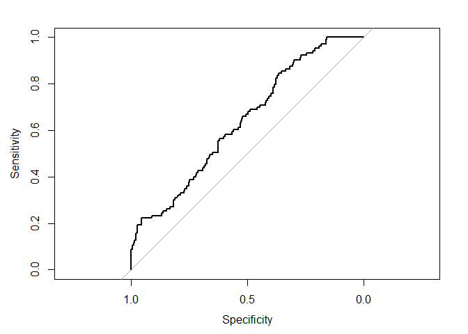<!-- -->

``` r
auc(roccurve)
```

    ## Area under the curve: 0.6375

``` r
### Roc curve as predicted from the remote sensings
predicted<-predict(BinomialDeath_1yr,data.frame(SingleBark =ValidationSet2$SingleBark,RDNBR=ValidationSet2$RDNBR),type="response")
#plot(predicted)
#roccurve<-roc(ValidationSet2$DeathMark~predict(BinomialDeath_1yr,data.frame(SingleBark =ValidationSet2$SingleBark,RDNBR=ValidationSet2$RDNBR),type="response"))
### Roc curve
roccurve<-roc(ValidationSet2$DeathMark~predict(BinomialDeath_1yr,data.frame(SingleBark =ValidationSet2$SingleBark,RDNBR=ValidationSet2$RDNBR),type="response"))
plot(roccurve)
```

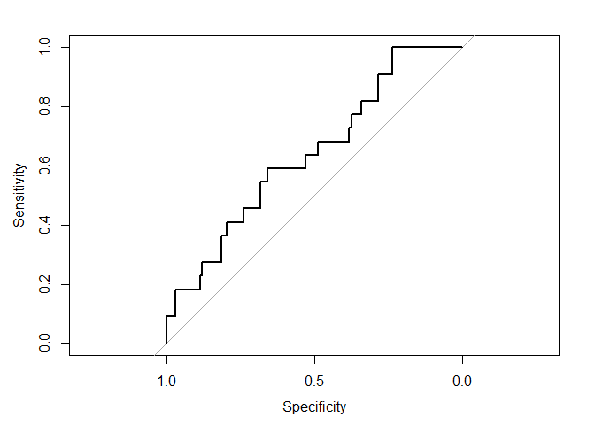<!-- -->

``` r
auc(roccurve)
```

    ## Area under the curve: 0.6382

``` r
### Removed test to see the relative contribution of variables, did not really work/ I couldn't interpret it. . 


# LargeMerge$Modelfit<-0
# LargeMerge2$Modelfit<-1
# Sub1<-LargeMerge[c("DeathMark","SingleBark","RDNBR","Modelfit","EfWs","ModisET","ModisWD","Clay")]
# Sub2<-LargeMerge2[c("DeathMark","SingleBark","RDNBR","Modelfit","EfWs","ModisET","ModisWD","Clay")]
# colnames(LargeMerge)
# colnames(LargeMerge2)
# 
# colnames(Sub1)
# AllTest<-rbind(Sub1,Sub2)
# write.csv(AllTest,"AllTest_AllVariables.csv")
# getwd()

# 
# 
# Modeltotest<-glm(DeathMark~SingleBark+RDNBR+Modelfit+SingleBark*Modelfit+Modelfit*RDNBR,data=AllTest,family="binomial")
# Modeltotest2<-glm(DeathMark~SingleBark+RDNBR,data=AllTest,family="binomial")
# Modeltotest3<-glm(DeathMark~SingleBark+RDNBR+Modelfit+SingleBark*Modelfit,data=AllTest,family="binomial")
# 
# print(anova(Modeltotest,Modeltotest2))
# AIC(Modeltotest)
# AIC(Modeltotest2)
# AIC(Modeltotest3)
# 
# summary(Modeltotest)
```

#### Comparitive figure in the paper

``` r
xsim <- seq(0,5,.001)
par(mfrow=c(2,1))
ysim_NoFlame<-predict(BinomialDeath,
                       data.frame(SingleBark = xsim,RDNBR=(rep(0,length(xsim)))) ,
                       type="response",se=T)
ysim_LowFlame<-predict(BinomialDeath,
                       data.frame(SingleBark = xsim,RDNBR=(rep(100,length(xsim)))) ,
                       type="response",se=T)
ysim_MedianFlame<-predict(BinomialDeath,
                          data.frame(SingleBark = xsim,RDNBR=rep(250,length(xsim))) ,
                          type="response",se=T)
ysim_MaxFlame<-predict(BinomialDeath,
                       data.frame(SingleBark = xsim,RDNBR=rep(600,length(xsim))),
                       type="response",se=T)

par(xpd=FALSE,mar=c(8.1,5.1,2.1,2.0))
plot(LargeMerge$SingleBark,LargeMerge$DeathMark,  pch = 16, xlab = "Bark Thickness (cm)", ylab = "(p) Mortality",
     ylim=c(0,1.0),xlim=c(0,5),cex.axis=1.5,cex.lab=1.5,main="Delayed Mortality")

#lines(newdata3$LL,col="blue",lwd=3.0,lty=3.0)
lines(xsim,ysim_MedianFlame$fit+ysim_MedianFlame$se.fit,col="orange",lwd=1.0,lty=5.0)
lines(xsim,ysim_MedianFlame$fit,col="orange",lwd=4.0)
lines(xsim,ysim_MedianFlame$fit-ysim_MedianFlame$se.fit,col="orange",lwd=1.0,lty=5.0)
#lines(xsim,ysim_D,col="orange",lwd=3.0)
lines(xsim,ysim_MaxFlame$fit+ysim_MaxFlame$se.fit,col="red",lwd=2.0,lty=5.0)
lines(xsim,ysim_MaxFlame$fit,col="red",lwd=4.0)
lines(xsim,ysim_MaxFlame$fit-ysim_MaxFlame$se.fit,col="red",lwd=2.0,lty=5.0)

lines(xsim,ysim_LowFlame$fit+ysim_LowFlame$se.fit,col="blue",lwd=2.0,lty=5.0)
lines(xsim,ysim_LowFlame$fit,col="blue",lwd=4.0)
lines(xsim,ysim_LowFlame$fit-ysim_LowFlame$se.fit,col="blue",lwd=2.0,lty=5.0)

lines(xsim,ysim_NoFlame$fit+ysim_NoFlame$se.fit,col="lightblue",lwd=2.0,lty=5.0)
lines(xsim,ysim_NoFlame$fit,col="lightblue",lwd=4.0)
lines(xsim,ysim_NoFlame$fit-ysim_NoFlame$se.fit,col="lightblue",lwd=2.0,lty=5.0)


###Immediate
xsim <- seq(0,5,.01)
#unique(OverstoryTry$DATE)
ysim_NoFlame<-predict(BinomialDeath_1yr,
                       data.frame(SingleBark = xsim,RDNBR=(rep(0,length(xsim)))) ,
                       type="response",se=T)
ysim_LowFlame<-predict(BinomialDeath_1yr,
                       data.frame(SingleBark = xsim,RDNBR=(rep(100,length(xsim)))) ,
                       type="response",se=T)
ysim_MedianFlame<-predict(BinomialDeath_1yr,
                          data.frame(SingleBark = xsim,RDNBR=rep(250,length(xsim))) ,
                          type="response",se=T)
ysim_MaxFlame<-predict(BinomialDeath_1yr,
                       data.frame(SingleBark = xsim,RDNBR=rep(max(600,na.rm = T),length(xsim))),
                       type="response",se=T)

par(xpd=FALSE,mar=c(8.1,5.1,2.1,2.0))
plot(LargeMerge2$SingleBark,LargeMerge2$DeathMark,  pch = 16, xlab = "Bark Thickness (cm)", ylab = "(p) Mortality",
     ylim=c(0,1.0),xlim=c(0,5),cex.axis=1.5,cex.lab=1.5,main="Immediate Mortality")

#lines(newdata3$LL,col="blue",lwd=3.0,lty=3.0)
lines(xsim,ysim_MedianFlame$fit+ysim_MedianFlame$se.fit,col="orange",lwd=2.0,lty=5.0)
lines(xsim,ysim_MedianFlame$fit,col="orange",lwd=4.0)
lines(xsim,ysim_MedianFlame$fit-ysim_MedianFlame$se.fit,col="orange",lwd=2.0,lty=5.0)
#lines(xsim,ysim_D,col="orange",lwd=3.0)
lines(xsim,ysim_MaxFlame$fit+ysim_MaxFlame$se.fit,col="red",lwd=2.0,lty=5.0)
lines(xsim,ysim_MaxFlame$fit,col="red",lwd=4.0)
lines(xsim,ysim_MaxFlame$fit-ysim_MaxFlame$se.fit,col="red",lwd=2.0,lty=5.0)

lines(xsim,ysim_LowFlame$fit+ysim_LowFlame$se.fit,col="blue",lwd=2.0,lty=5.0)
lines(xsim,ysim_LowFlame$fit,col="blue",lwd=4.0)
lines(xsim,ysim_LowFlame$fit-ysim_LowFlame$se.fit,col="blue",lwd=2.0,lty=5.0)

lines(xsim,ysim_NoFlame$fit+ysim_NoFlame$se.fit,col="lightblue",lwd=2.0,lty=5.0)
lines(xsim,ysim_NoFlame$fit,col="lightblue",lwd=4.0)
lines(xsim,ysim_NoFlame$fit-ysim_NoFlame$se.fit,col="lightblue",lwd=2.0,lty=5.0)

par(xpd=TRUE)
#?legend()
legend("bottom",inset=c(0.0,-.50),
legend=c("DRdNBR: 0","DRdNBR: 100","DRdNBR: 250","DRdNBR: 600"),
lty=c(1,1,1),col=c("lightblue","blue","orange","red"),cex=1.2,ncol=4) 
```

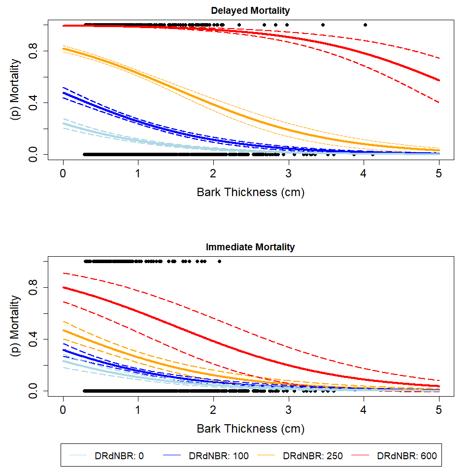<!-- -->

### Overveiw of the data

Here we look at the model predictions made by the delayed mortality and
immediate mortality models and compare them to the orignal data

``` r
### Trees in delayed mortality
print("Total Samples Delayed Mortality")
```

    ## [1] "Total Samples Delayed Mortality"

``` r
nrow(LargeMerge)
```

    ## [1] 1332

``` r
print("Break down of mortality ")
```

    ## [1] "Break down of mortality "

``` r
table(LargeMerge$DataSet)
```

    ## 
    ##   Athens Linville 
    ##      648      684

``` r
print("Total Samples Immediate Mortality")
```

    ## [1] "Total Samples Immediate Mortality"

``` r
nrow(LargeMerge2)
```

    ## [1] 725

``` r
print("Break down of mortality")
```

    ## [1] "Break down of mortality"

``` r
table(LargeMerge2$DataSet)
```

    ## 
    ##  Athens Sunrise 
    ##     648      77

### Testing the application of the

``` r
RandomDraw_1yr<-rbinom(length(LargeMerge2$DeathMark),1,prob=predict(BinomialDeath_1yr,type=c("response"),
                                                                   data.frame(SingleBark =LargeMerge2$SingleBark,RDNBR=LargeMerge2$RDNBR)))
RandomDraw_3yr<-rbinom(length(LargeMerge$DeathMark),1,prob=predict(BinomialDeath,type=c("response"),
                                                                   data.frame(SingleBark =LargeMerge$SingleBark,RDNBR=LargeMerge$RDNBR)))
table(LargeMerge2$DeathMark)
```

    ## 
    ##   0   1 
    ## 600 125

``` r
125/(625+125)
```

    ## [1] 0.1666667

``` r
table(RandomDraw_1yr)
```

    ## RandomDraw_1yr
    ##   0   1 
    ## 603 122

``` r
137/(588+137)
```

    ## [1] 0.1889655

``` r
table(LargeMerge$DeathMark)
```

    ## 
    ##   0   1 
    ## 680 652

``` r
652/(680+652)
```

    ## [1] 0.4894895

``` r
table(RandomDraw_3yr)
```

    ## RandomDraw_3yr
    ##   0   1 
    ## 702 630

``` r
650/(682+650)
```

    ## [1] 0.487988

``` r
Athenspost<-Trainingdata[Trainingdata$DataSet=="Athens",]
AthensDraw_1yr<-rbinom(length(Athenspost$DeathMark),1,prob=predict(BinomialDeath_1yr,
                                                                   data.frame(SingleBark =Athenspost$SingleBark,RDNBR=Athenspost$RDNBR),type="response"))

AthensDraw_3yr<-rbinom(length(Athenspost$DeathMark),1,prob=predict(BinomialDeath,
                                                                   data.frame(SingleBark =Athenspost$SingleBark,RDNBR=Athenspost$RDNBR),type="response"))


### Calculating the percentatages

table(Trainingdata2$DeathMark[Trainingdata2$DataSet=="Athens"])
```

    ## 
    ##   0   1 
    ## 445  74

``` r
74/(445+74)
```

    ## [1] 0.1425819

``` r
table(AthensDraw_1yr)
```

    ## AthensDraw_1yr
    ##   0   1 
    ## 418  87

``` r
(79)/(426+79)
```

    ## [1] 0.1564356

``` r
table(Trainingdata$DeathMark[Trainingdata$DataSet=="Athens"])
```

    ## 
    ##   0   1 
    ## 404 101

``` r
101/(101+401)
```

    ## [1] 0.2011952

``` r
table(AthensDraw_3yr)
```

    ## AthensDraw_3yr
    ##   0   1 
    ## 375 130

``` r
136/(136+369)
```

    ## [1] 0.2693069

``` r
#169/(374+169)
#8/(446+83)
#(28-20)/20
```

``` r
Linvillepost<-Trainingdata[Trainingdata$DataSet=="Linville",]
LinvilleDraw_1yr<-rbinom(length(Linvillepost$DeathMark),1,prob=predict(BinomialDeath_1yr,
                                                                   data.frame(SingleBark =Linvillepost$SingleBark,RDNBR=Linvillepost$RDNBR),type="response"))

LinvilleDraw_3yr<-rbinom(length(Linvillepost$DeathMark),1,prob=predict(BinomialDeath,
                                                                   data.frame(SingleBark =Linvillepost$SingleBark,RDNBR=Linvillepost$RDNBR),type="response"))

### Calculating the percentages 
table(LinvilleDraw_1yr)
```

    ## LinvilleDraw_1yr
    ##   0   1 
    ## 370 191

``` r
187/(374+187)
```

    ## [1] 0.3333333

``` r
table(Trainingdata2$DeathMark[Trainingdata2$DataSet=="Linville"])
```

    ## < table of extent 0 >

``` r
29/(32+29)
```

    ## [1] 0.4754098

``` r
table(LinvilleDraw_3yr)
```

    ## LinvilleDraw_3yr
    ##   0   1 
    ## 171 390

``` r
396/(396+165)
```

    ## [1] 0.7058824

``` r
table(Trainingdata$DeathMark[Trainingdata$DataSet=="Linville"])
```

    ## 
    ##   0   1 
    ## 138 423

``` r
426/(139+423)
```

    ## [1] 0.7580071

### Setting the bark thickness\~ age relationship

Here we use FIA data to associate together relative relationships
between Site index+height and age, and then age and DBH to use for the
relationship between age and bark thicknes per species.

``` r
## Fia data location 
FIA_location<-'Inputs/FIA_Data/'
## Subset recent years 
years<-c(2004:2017)
## This species lUT has all the names to associate with LANDIS-II, 
## this also has the associated values to relate Site index and height to age 

#Carmean, W. H., Hahn, J. T., & Jacobs, R. D. (1989). Site index curves for forest tree species 
#in the eastern United States. General Technical Report NC-128. St. Paul, MN: US 
#Dept. of Agriculture, Forest Service, North Central Forest Experiment Station, 128

spp_file<-read.csv(paste(FIA_location,"SpeciesLUT.csv",sep=""))
spp<-spp_file[,"Species"]

### Subset all the sites down to the years and species nessecary. 
### AOI_Tree here is a subset of all FIA sites withing the Area of Intrest. 

years<-c(2004:2017)

### Use the condition tables to get the site index, and stand age, as well as filiter out non-forested stands
GA_Cond<-read.csv(paste0(FIA_location,"GA_Cond.csv"))
SC_Cond<-read.csv(paste0(FIA_location,"SC_Cond.csv"))
NC_Cond<-read.csv(paste0(FIA_location,"NC_Cond.csv"))
TN_Cond<-read.csv(paste0(FIA_location,"TN_Cond.csv"))

COND_all<-rbind(NC_Cond, SC_Cond,TN_Cond,GA_Cond)%>%
  subset(INVYR %in% years)%>%#### Only recent years 
  subset(COND_STATUS_CD==1)### Only forested classification 
COND_all$SICOND[is.na(COND_all$SICOND)]<-mean(COND_all$SICOND[!is.na(COND_all$SICOND)])
### Aggregate to the stand age and conditions by plot 
Cond_agg<-with(COND_all,aggregate(x=list("STDAGE_mean"=STDAGE,'SICOND_mean'=SICOND), by=list(PLT_CN=PLT_CN),FUN=mean))

### Subset all the sites down to the years and species nessecary. 
### AOI_Tree here is a subset of all FIA sites withing the Area of Intrest. 
### Merge togehter the two data
Tree_AOI<-read.csv(paste0(FIA_location,"AOI_TREE.csv"))%>% 
  subset(INVYR_x %in% years)%>%
  subset(SPCD %in% spp)%>%
  merge(Cond_agg, by="PLT_CN")
#### Here we loop through each to calculate age. 
DF<-NULL
for(sp in spp){
  ## Get each coeffcient 
  coef_b1<-(spp_file[spp_file$Species==sp,"b1"])#coefficient for b1
  coef_b2<-(spp_file[spp_file$Species==sp,"b2"])#coeffcient for b2
  coef_b3<-(spp_file[spp_file$Species==sp,"b3"])#coeffcient for b3
  coef_b4<-(spp_file[spp_file$Species==sp,"b4"])#coeffcient for b4
  coef_b5<-(spp_file[spp_file$Species==sp,"b5"])#coeffcient for b5
  #colnames(Tree_AOI)
  ### Caculate the Age
  One<-Tree_AOI %>%
    subset(SPCD==as.numeric(sp))%>%
    mutate(Check=(coef_b1*SICOND_mean^(coef_b2)))
  #unique(Tree_AOI$X)
  Two<-One %>%
    subset(HT <= Check)%>%
    mutate(age=(log(1-(HT/(coef_b1 * SICOND_mean^(coef_b2)))^(1/(coef_b4*(SICOND_mean^(coef_b5)))))/coef_b3))%>%
    mutate(DBH_cm=DIA*2.54)
  #Here we calculate the relationship between age and barkthickness described in the manuscript.
  if(length(Two$PLT_CN)<2){next()}
  maxDBH<-max(Two$DBH_cm)
  
  FitDBHfunction<-function(maxDBH,Age,par,Obs){
    DBH_out<-(maxDBH*Age)/(Age+par[1])
    return(-sum(dnorm(Obs,mean=DBH_out,sd=.1,log=TRUE)))
  }
  ### Fit the function 
  opt1=optimize(f=FitDBHfunction,interval=c(0,200),maxDBH=as.numeric(maxDBH),Age=as.numeric(Two$age),Obs=as.numeric(Two$DBH_cm))
  ### Gather the outputs
  par1<-as.numeric(opt1$minimum)
  DBH_out<-(maxDBH*Two$age)/(Two$age+par1)
  score<-summary(lm(DBH_out~Two$DBH_cm))$r.squared
  ###Create the dataframe of outputs. 
  OutRow<-data.frame(Spp=spp_file[spp_file$Species==sp,"X"],LANDISCode=spp_file[spp_file$Species==sp,"LANDIS_CODE"],
                     maxDBH=maxDBH,Parameter=par1,score=score)
  DF<-rbind(OutRow,DF)
}
```

``` r
### Here we need to associate the LANDIS-II names with the names in the bark thickness database

Shorten<-c("QuerCocc","PinuRigi", "AcerRubr","QuerPrin","QuerAlba",  "QUERSPP","PinuVirg","PinuStro", "TsugCana","TSUGSPP",
           "PINUSPP", "PinuPung", "PinuEnch", "NyssSylv", "MAGNFRA" ,"BetuLent",
           "RobiPseu","OxydArbo","QuerRubr" ,"CaryGlab" ,"QuerVelu", "QuerStel","PinuTaed" ,
           "CornFlor" ,"SassAlid"  , "CASTDEN" ,"CaryAlba" ,"LiquStyr", "CASTPUM", "AmelArbo" ,
            "PrunPenn" ,"IlexOpac" , "DIOSVIR","LiriTuli",'FaguGran','PrunSero','AcerSacc','PlanOcid', 'TiliAmer','QuerAlba','FraxPenn', "CaryOvat","CaryCodi","JuglNigr","AcerPens","FraxAmer",
            "FrasFirr","AescBuck", "QuerFalc" )

Full<-c("Quercus coccinea" ,"Pinus rigida","Acer rubrum","Quercus montana",'Quercus species','Quercus species','Pinus virginiana','Pinus strobus','Tsuga canadensis','Tsuga canadensis',
        'Pinus ',   'Picea pungens','Pinus echinata','Nyssa sylvatica','Magnolia fraseri','Betula lenta','Robinia pseudoacacia',
        'Oxydendrum arboreum','Quercus rubra','Carya glabra','Quercus velutina','Quercus stellata','Pinus taeda',
        'Cornus florida','Sassafras albidum','Castanea dentata','Carya ' ,  'Liquidambar styraciflua','Castanea pumila',
        'Amelanchier arborea','Prunus ','Ilex opaca','Diospyros virginiana','Liriodendron tulipifera', "Fagus grandifolia" , "Prunus serotina","Acer saccharum" ,
       "Platanus occidentalis" ,"Tilia americana", "Quercus alba"  ,"Fraxinus pennsylvanica",
       'Carya ','Carya ','Juglans nigra','Acer floridanum ' ,"Fraxinus americana",
        'Abies ', 'Aesculus glabra','Quercus falcata')
Spp_LUT<-cbind(Shorten,Full)
colnames(Spp_LUT)<-c("LANDISCode","Species_Full")

Full_names<-merge(DF,Spp_LUT,by="LANDISCode",all.x=T)


BarkThickness<-read.csv("Inputs/FeildData/Species_BarkThickness.csv")

BarkThickness<-BarkThickness[order(BarkThickness$BT_coef,decreasing=T),]
colnames(BarkThickness)[2]<-"Species_Full"
WithBarkCo<-merge(Full_names,BarkThickness,by="Species_Full",all.x=T)
#### Creat the dataframe that will be the LANDIS-II input.

AllSpp<-as.data.frame(spp_file$LANDIS_CODE)
colnames(AllSpp)<-"LANDISCode"
AllSpp<-merge(AllSpp,WithBarkCo,by="LANDISCode",all.x=T)
AllSpp<-AllSpp[,c(1,4,5,8,6)]
AllSpp$MaxBarkThickness<-AllSpp$maxDBH*AllSpp$BT_coef
```

``` r
### Here is a plot to look at the relationships

Sp<-'QuerPrin'
par(mfrow=c(3,3))
for(Sp in AllSpp$LANDISCode){

Age<-seq(0,200)
BT<-AllSpp$MaxBarkThickness[AllSpp$LANDISCode==Sp]
if(!is.na(BT)){
AgeDBH<-AllSpp$Parameter[AllSpp$LANDISCode==Sp]
BH_out<-(BT*Age)/(Age+AgeDBH)

plot(Age,BH_out,main=Sp,ylim=c(0,3))
}
}
```

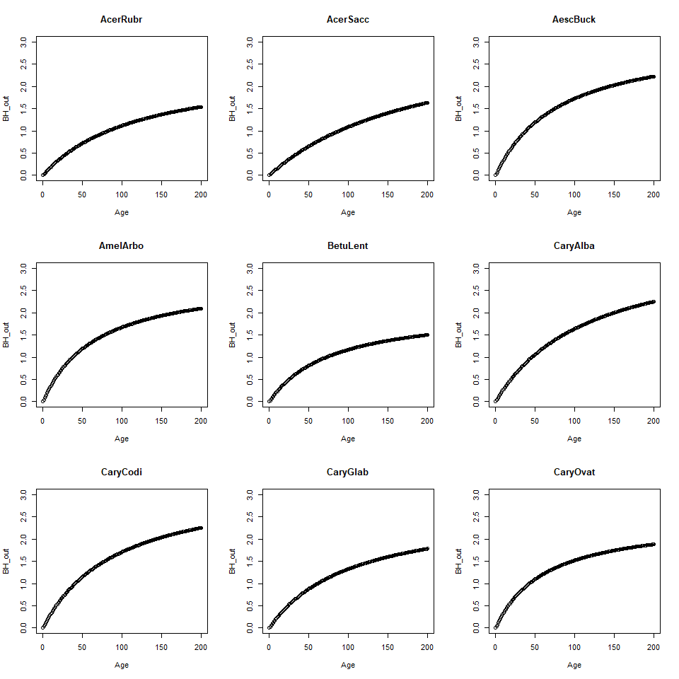<!-- -->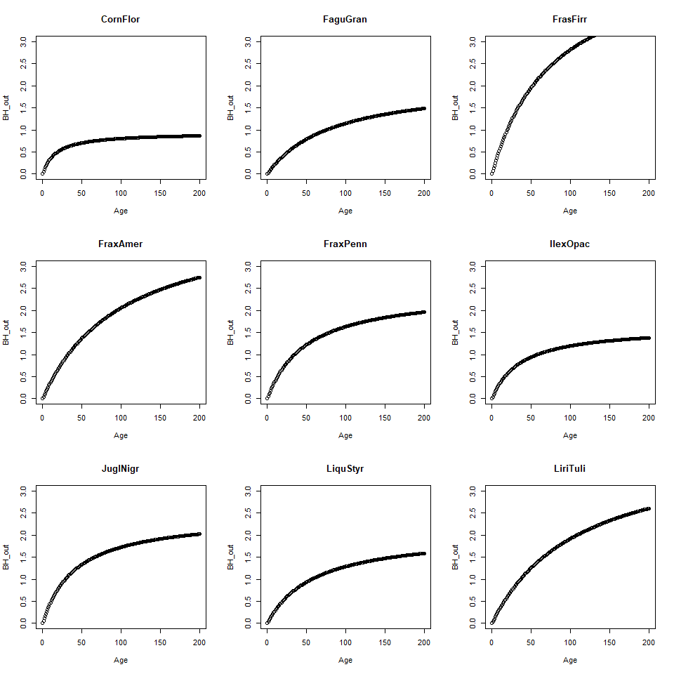<!-- -->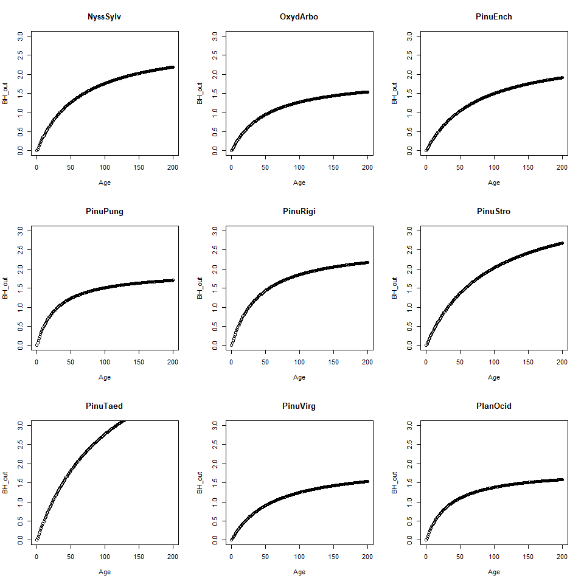<!-- -->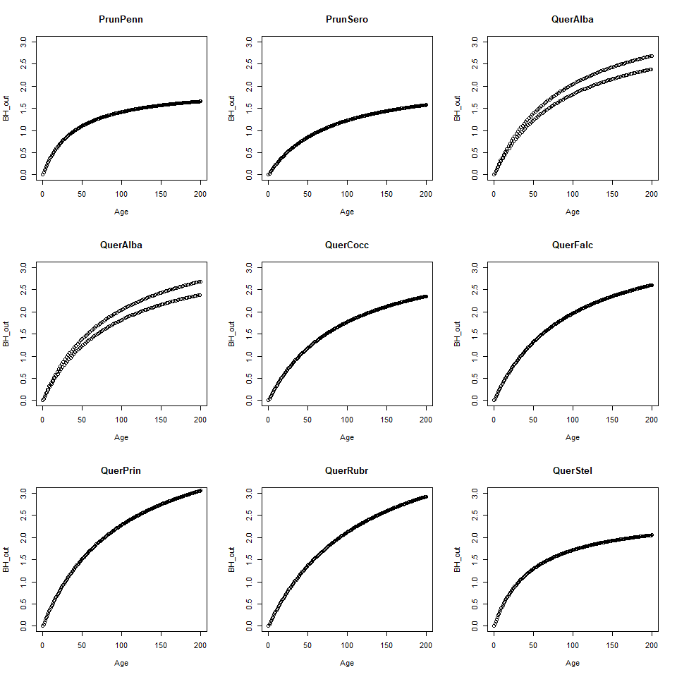<!-- -->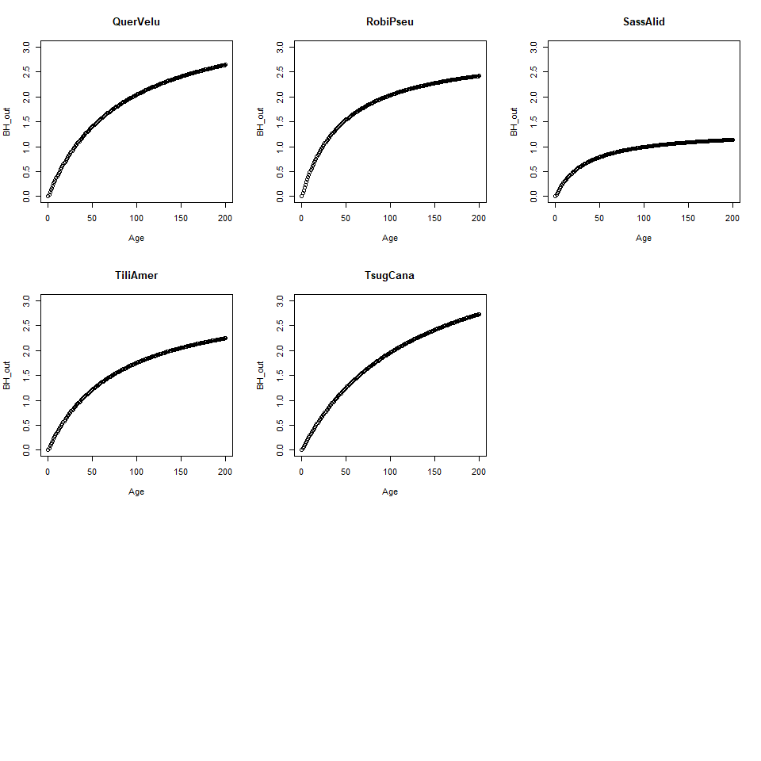<!-- -->

Here is the relationship between age and bark thickness for several
species.

``` r
#library(RColorBrewer)
#display.brewer.all()
Paly<-c(brewer.pal(8,"Dark2"),brewer.pal(10,'Set3'))
#unique(AllSpp$LANDISCode)

Age<-seq(0,300)

Calbark<-function(Sp,AllSpp){
  Age<-seq(0,300)
  BT<-AllSpp$MaxBarkThickness[AllSpp$LANDISCode==Sp]
  AgeDBH<-AllSpp$Parameter[AllSpp$LANDISCode==Sp]
  BH_out<-(BT*Age)/(Age+AgeDBH)
  return(BH_out)
}
Calbark2<-function(Sp,AllSpp){
  Age<-seq(0,300)
  BT<-AllSpp$MaxBarkThickness[AllSpp$LANDISCode==Sp]
  AgeDBH<-AllSpp$Parameter[AllSpp$LANDISCode==Sp]
  BH_out<-(94*.040*Age)/(Age+AgeDBH)
  return(BH_out)
}


Bh1<-Calbark("AcerRubr",AllSpp = AllSpp)

par(xpd=FALSE,mar=c(5.1,4.1,4.1,10.0))
plot(Age,Bh1,col=Paly[1],ylim=c(0,5.0),ylab="BarkThickness cm",pch=16,cex.lab=1.2,cex.axis=1.2)
points(Age,Calbark("QuerPrin",AllSpp = AllSpp),col=Paly[2],pch=16)
points(Age,Calbark("PinuTaed",AllSpp = AllSpp),col=Paly[3],pch=16)
points(Age,Calbark("LiriTuli",AllSpp = AllSpp),col=Paly[4],pch=16)
points(Age,Calbark("PinuStro",AllSpp = AllSpp),col=Paly[5],pch=16)
points(Age,Calbark("CornFlor",AllSpp = AllSpp),col=Paly[6],pch=16)
points(Age,Calbark("CaryAlba",AllSpp = AllSpp),col=Paly[7],pch=16)
points(Age,Calbark("QuerRubr",AllSpp = AllSpp),col=Paly[8],pch=16)
points(Age,Calbark("TsugCana",AllSpp = AllSpp),col=Paly[9],pch=16)

points(Age,Calbark("AcerSacc",AllSpp = AllSpp),col=Paly[11],pch=16)
#points(Age,Calbark("PinuPung",AllSpp = AllSpp),col=Paly[12],pch=16)
par(xpd=TRUE)
legend("topright",c("AcerRubr", "QuerMont","PinuTaed","LiriTuli","PinuStro",
                    "CornFlor","CaryAlba","QuerRubr","TsugCana","AcerSacc")
          ,inset=c(-0.3,0),pch = rep(16,10),col=c(Paly[1:9],Paly[11:12]))
```

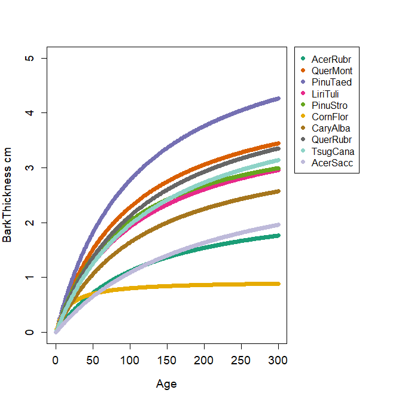<!-- -->

``` r
#legend
```

``` r
write.csv(AllSpp,"D:/Sapps_DM_paper/BarkMortality.csv")
```
