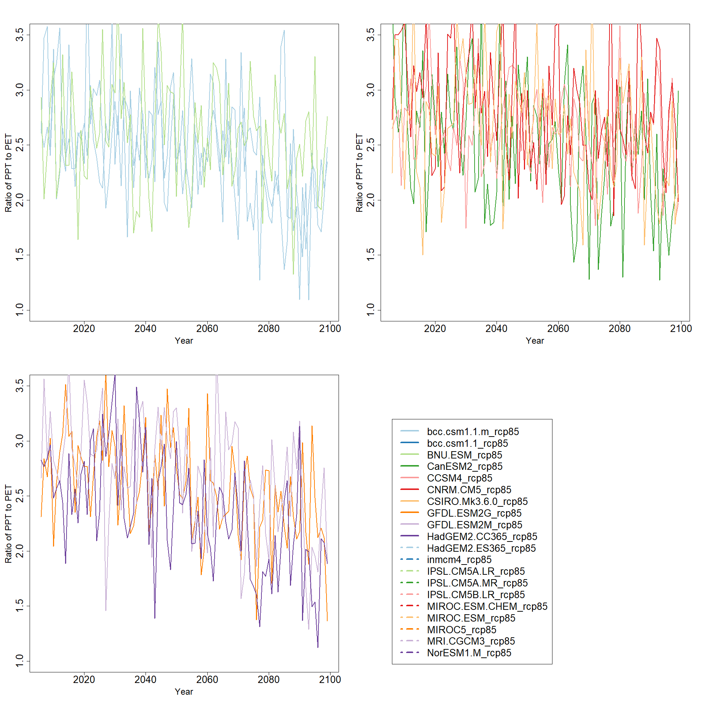

Climate Model PET
================
Zachary Robbins
2/9/2020

    ## 
    ## Attaching package: 'dplyr'

    ## The following objects are masked from 'package:stats':
    ## 
    ##     filter, lag

    ## The following objects are masked from 'package:base':
    ## 
    ##     intersect, setdiff, setequal, union

    ## 
    ## Attaching package: 'lubridate'

    ## The following objects are masked from 'package:base':
    ## 
    ##     date, intersect, setdiff, union

#### Defining the PET function

``` r
ThornwaitePET<-function(Tmax,Tmin){
    ### Calculate the Temperature mean 
    
    Tmean<-(Tmax+Tmin)/2
    ### Set up the data 
    Temp<-data.frame(Dates=as.Date(TmaxAOI85$Timestep),Temps=Tmean)
    colnames(Temp)<-c("Dates","Temps")
    MonthlyMean<-Temp %>% 
      group_by(month=floor_date(Dates, "month")) %>%
      dplyr::summarize(amoun=mean(Temps,na.rm = T))
    
    #MonthlyMean$amoun[is.na(MonthlyMean$amoun)]
    ### Heat index i = (t/5)**1.514
    mm<-as.matrix(MonthlyMean[2])
    mm[mm<0,]<-0
    MonthlyMean$amoun<-mm
    Heatindex<-(mm/5)**1.514
    #Heatindex[is.na(Heatindex),]<-mean(Heatindex,na.rm=T)
    Datai<-data.frame(Date=MonthlyMean[1],hi=Heatindex)
    ### I is equal to the sum of i over each month 
    Output<-Datai %>%
      group_by(Year=floor_date(month,"year"))%>%
      dplyr::summarize(amount=sum(amoun))
    Output$Year<-year(Output$Year)
    
    ### Get the years for monthly means 
    MonthlyMean$Year<-year(MonthlyMean$month)
    
    merged<-merge(MonthlyMean,Output,by="Year")
    merged[is.na(merged)]
    ###Isolate back out the variables 
    i=merged$amoun
    I=merged$amount
    ###Alpha
    alpha=(6.75*10**-7)*(I**3)-(7.71*(10**-5)*(I**2))+(1.792*10**-2)*I+0.49239
    alpha[is.na(alpha)]
    ### Final uncorrected equation
    PETnon_corrected<-16*((10*i)/I)**alpha
    
    d<-PETnon_corrected[is.na(PETnon_corrected)]
    ##mm/month
    PET_df<-data.frame(date=merged$month,PET=PETnon_corrected)
    
    PET_df$Month<-month(PET_df$date)
    PET_df<-PET_df[PET_df$Month%in% c(5,6,7,8,9,10),]
    PET_df<-PET_df[-3]
    colnames(PET_df)<-c("date","PET")
    ### Agg to year 
    Yearly<-PET_df %>%
      group_by(Year=floor_date(date,"year"))%>%
      dplyr::summarize(amount=sum(PET,na.rm=T))
    return(Yearly)
}
```

We start with the climate files we have processed for each of the rcp
8.5 climate models availble from MACA.

This is minimum temperature, maximum temperature and pecipitation.

#### Candidate Climate models

Here are those models

    ##  [1] "bcc.csm1.1.m_rcp85"   "bcc.csm1.1_rcp85"     "BNU.ESM_rcp85"       
    ##  [4] "CanESM2_rcp85"        "CCSM4_rcp85"          "CNRM.CM5_rcp85"      
    ##  [7] "CSIRO.Mk3.6.0_rcp85"  "GFDL.ESM2G_rcp85"     "GFDL.ESM2M_rcp85"    
    ## [10] "HadGEM2.CC365_rcp85"  "HadGEM2.ES365_rcp85"  "inmcm4_rcp85"        
    ## [13] "IPSL.CM5A.LR_rcp85"   "IPSL.CM5A.MR_rcp85"   "IPSL.CM5B.LR_rcp85"  
    ## [16] "MIROC.ESM.CHEM_rcp85" "MIROC.ESM_rcp85"      "MIROC5_rcp85"        
    ## [19] "MRI.CGCM3_rcp85"      "NorESM1.M_rcp85"

Temp to daily mean

    ## [1] "bcc.csm1.1.m_rcp85"
    ## [1] "bcc.csm1.1_rcp85"
    ## [1] "BNU.ESM_rcp85"
    ## [1] "CanESM2_rcp85"
    ## [1] "CCSM4_rcp85"
    ## [1] "CNRM.CM5_rcp85"
    ## [1] "CSIRO.Mk3.6.0_rcp85"
    ## [1] "GFDL.ESM2G_rcp85"
    ## [1] "GFDL.ESM2M_rcp85"
    ## [1] "HadGEM2.CC365_rcp85"
    ## [1] "HadGEM2.ES365_rcp85"
    ## [1] "inmcm4_rcp85"
    ## [1] "IPSL.CM5A.LR_rcp85"
    ## [1] "IPSL.CM5A.MR_rcp85"
    ## [1] "IPSL.CM5B.LR_rcp85"
    ## [1] "MIROC.ESM.CHEM_rcp85"
    ## [1] "MIROC.ESM_rcp85"
    ## [1] "MIROC5_rcp85"
    ## [1] "MRI.CGCM3_rcp85"
    ## [1] "NorESM1.M_rcp85"

    ## 
    ## Call:
    ## lm(formula = AllModels$HadGEM2.ES365_rcp85 ~ seq(1:length(AllModels$HadGEM2.ES365_rcp85)))
    ## 
    ## Coefficients:
    ##                                  (Intercept)  
    ##                                     13.19576  
    ## seq(1:length(AllModels$HadGEM2.ES365_rcp85))  
    ##                                      0.07184

    ## 
    ## Call:
    ## lm(formula = AllModels$IPSL.CM5A.MR_rcp85 ~ seq(1:length(AllModels$HadGEM2.ES365_rcp85)))
    ## 
    ## Coefficients:
    ##                                  (Intercept)  
    ##                                     12.55326  
    ## seq(1:length(AllModels$HadGEM2.ES365_rcp85))  
    ##                                      0.06111

    ## 
    ## Call:
    ## lm(formula = AllModels$MRI.CGCM3_rcp85 ~ seq(1:length(AllModels$HadGEM2.ES365_rcp85)))
    ## 
    ## Coefficients:
    ##                                  (Intercept)  
    ##                                     12.25236  
    ## seq(1:length(AllModels$HadGEM2.ES365_rcp85))  
    ##                                      0.03453

    ## 
    ## Call:
    ## lm(formula = AllModels$CNRM.CM5_rcp85 ~ seq(1:length(AllModels$HadGEM2.ES365_rcp85)))
    ## 
    ## Coefficients:
    ##                                  (Intercept)  
    ##                                     12.55598  
    ## seq(1:length(AllModels$HadGEM2.ES365_rcp85))  
    ##                                      0.04808

#### Calculate PET function from Tmean for each model: (Tmax+Tmin)/2

We then evaluate the Thornwaite model for PET using the T mean.

Each model is shown as calculated PET for the follow steps.

<!-- --><!-- -->

    ## 
    ## Call:
    ## lm(formula = AllModels$HadGEM2.CC365_rcp85 ~ seq(1:length(AllModels$HadGEM2.ES365_rcp85)))
    ## 
    ## Coefficients:
    ##                                  (Intercept)  
    ##                                      473.965  
    ## seq(1:length(AllModels$HadGEM2.ES365_rcp85))  
    ##                                        4.219

    ## 
    ## Call:
    ## lm(formula = AllModels$IPSL.CM5A.MR_rcp85 ~ seq(1:length(AllModels$HadGEM2.ES365_rcp85)))
    ## 
    ## Coefficients:
    ##                                  (Intercept)  
    ##                                      498.440  
    ## seq(1:length(AllModels$HadGEM2.ES365_rcp85))  
    ##                                        2.667

    ## 
    ## Call:
    ## lm(formula = AllModels$MRI.CGCM3_rcp85 ~ seq(1:length(AllModels$HadGEM2.ES365_rcp85)))
    ## 
    ## Coefficients:
    ##                                  (Intercept)  
    ##                                      500.229  
    ## seq(1:length(AllModels$HadGEM2.ES365_rcp85))  
    ##                                        1.216

    ## 
    ## Call:
    ## lm(formula = AllModels$CNRM.CM5_rcp85 ~ seq(1:length(AllModels$HadGEM2.ES365_rcp85)))
    ## 
    ## Coefficients:
    ##                                  (Intercept)  
    ##                                      500.240  
    ## seq(1:length(AllModels$HadGEM2.ES365_rcp85))  
    ##                                        1.488

#### Precipitation

We also look at precipitation using the same models.

<!-- --><!-- -->

Looking at the linear change

    ## 
    ## Call:
    ## lm(formula = DFP$HadGEM2.ES365_rcp85 ~ seq(1:length(AllModels$HadGEM2.ES365_rcp85)))
    ## 
    ## Coefficients:
    ##                                  (Intercept)  
    ##                                      780.939  
    ## seq(1:length(AllModels$HadGEM2.ES365_rcp85))  
    ##                                       -1.771

    ## 
    ## Call:
    ## lm(formula = DFP$IPSL.CM5A.MR_rcp85 ~ seq(1:length(AllModels$HadGEM2.ES365_rcp85)))
    ## 
    ## Coefficients:
    ##                                  (Intercept)  
    ##                                     706.4461  
    ## seq(1:length(AllModels$HadGEM2.ES365_rcp85))  
    ##                                       0.3636

    ## 
    ## Call:
    ## lm(formula = DFP$MRI.CGCM3_rcp85 ~ seq(1:length(AllModels$HadGEM2.ES365_rcp85)))
    ## 
    ## Coefficients:
    ##                                  (Intercept)  
    ##                                     742.7217  
    ## seq(1:length(AllModels$HadGEM2.ES365_rcp85))  
    ##                                       0.6064

    ## 
    ## Call:
    ## lm(formula = DFP$CNRM.CM5_rcp85 ~ seq(1:length(AllModels$HadGEM2.ES365_rcp85)))
    ## 
    ## Coefficients:
    ##                                  (Intercept)  
    ##                                     769.0141  
    ## seq(1:length(AllModels$HadGEM2.ES365_rcp85))  
    ##                                       0.8659

#### Ratio of PPT to PET over time

To look at the patterns in drought over time we looked at the
relationship between PET and PPT over time

This is obviously simplified and does not account for PPT stored within
the system

Not accounting for Runoff Greater than 1 =Storage 1= PPT=PET \<1 = Water
Deficit

<!-- --><!-- -->

#### Linear models of PET/PPT

Here we fit a linear regression to this relationship over time.

<!-- -->

#### Fixed intercept

here I fixed the intercept to the mean of the slopes, then compared the
slopes. Note: This order is the same whether you fix the slope or not.

    ## [1] 3.165642

<!-- -->

#### Here is the decadal means for the PPT/PET rato

<!-- --><!-- -->

### Mean Intradecadal Variance

So this takes the mean for each decade and calculates the square
variance, from that mean. Then that is meaned for each model

<!-- -->

### Decadal Fixed slope models

    ## [1] 3.114509

<!-- -->

### Candidate Models

We selected four models from this, finding models that have Steep/Low
Slope, and High Variance and Low Variance.

HAD_GEMES365 is steep slope/ high variance

MRI_CGCM3 is low slope/low variance

CNRM_CM5 is Low slope/high variance

IPSL CM5A_MR Steep slope/ Low variance

<!-- -->

HAD_GEMES365 is Steep Slope/ High Variance

MRI_CGCM3 is low slope/Low Variance

CNRM_CM5 is Low slope/High Variance

IPSL CM5A_MR Steep slope/ Low variance

<!-- -->
### Variance of candidate models

<!-- -->

### Slopes of candidate models

HAD_GEMES365 is Steep Slope/ High Variance

MRI_CGCM3 is Low slope/Low Variance

CNRM_CM5 is Low slope/High Variance

IPSL CM5A_MR Steep slope/ Low variance

<!-- -->
