Post Run analysis
================
Zjrobbin
3/1/2022

``` r
## Load in packages
library(dplyr)
```

    ## 
    ## Attaching package: 'dplyr'

    ## The following objects are masked from 'package:stats':
    ## 
    ##     filter, lag

    ## The following objects are masked from 'package:base':
    ## 
    ##     intersect, setdiff, setequal, union

``` r
library(raster)
```

    ## Loading required package: sp

    ## 
    ## Attaching package: 'raster'

    ## The following object is masked from 'package:dplyr':
    ## 
    ##     select

``` r
library(ggplot2)
library(gridExtra)
```

    ## 
    ## Attaching package: 'gridExtra'

    ## The following object is masked from 'package:dplyr':
    ## 
    ##     combine

``` r
# The locations of the replicates
Dir<-"F:/Chatper3/"
```

``` r
### This sums by category the fire outputs
SumFire<-function(Modely,Model_name,rep){
  Out<-Modely%>%
    mutate(Accidentalha=TotalBurnedSitesAccidental*6.25,
           Lightningha=TotalBurnedSitesLightning*6.25,
           Rxha=TotalBurnedSitesRx*6.25)%>%
    dplyr::group_by(SimulationYear)%>%
    dplyr::summarize(Accidentalha=sum(Accidentalha),
           Lightningha=sum(Lightningha),
           Rxha=sum(Rxha),
           Total=sum(Lightningha)+sum(Accidentalha)+sum(Rxha))
  Out$Model<-Model_name
  Out$Rep<-rep
  return(Out)
}
### Calculating the mean and standard error between repilcates 
RepReducer<-function(Reps){
  Out2<-Reps %>%
    dplyr::group_by(SimulationYear,Model)%>%
    dplyr::summarize(meanAccidentalha=mean(Accidentalha),seAccidentalha=sd(Accidentalha)/sqrt(n()),
              meanLightningha=mean(Lightningha),seLightningha=sd(Lightningha)/sqrt(n()),
              meanRxha=mean(Rxha),seRxha=sd(Rxha)/sqrt(n()),
              meanTotal=mean(Total),seTotal=sd(Total)/sqrt(n()))
  return(Out2)
}
### Format with confidence intervalss per model/year
CreateCI<-function(Years,Variable,SE,Model){
  Hi<-Variable+(SE*qnorm(0.975))
  Lo<-Variable-(SE*qnorm(0.975))  
return(data.frame(Years=Years,Hi=Hi,Mean=Variable,Lo=Lo,ModelName=Model))  
}
## Calculate se 
se <- function(x) sqrt(var(x)/length(x))
```

``` r
### Sum the fire categories by decade
SumFireDecade<-function(Modely,Model_name,Rep){
  Out<-Modely%>%
    mutate(Accidentalha=TotalBurnedSitesAccidental*6.25,
           Lightningha=TotalBurnedSitesLightning*6.25,
           Rxha=TotalBurnedSitesRx*6.25,
           Decade=floor(SimulationYear/10)*10)%>%
    dplyr::group_by(Decade)%>%
    dplyr::summarize(Accidentalha=sum(Accidentalha),
           Lightningha=sum(Lightningha),
           Rxha=sum(Rxha),
           Total=sum(Lightningha)+sum(Accidentalha)+sum(Rxha))
  Out$Model<-Model_name
  Out$Rep<-Rep
  return(Out)
}
## Calculate mean and SE per decade per model
RepReducerDecade<-function(Reps){
  Out2<-Reps %>%
    dplyr::group_by(Decade,Model)%>%
    dplyr::summarize(meanAccidentalha=mean(Accidentalha),seAccidentalha=sd(Accidentalha)/sqrt(n()),
              meanLightningha=mean(Lightningha),seLightningha=sd(Lightningha)/sqrt(n()),
              meanRxha=mean(Rxha),seRxha=sd(Rxha)/sqrt(n()),
              meanTotal=mean(Total),seTotal=sd(Total)/sqrt(n()))
  return(Out2)
}

###Load in the data from each model
### HadGEM 
HadGEM_Fire1<-read.csv(paste0(Dir,"R_1/HadGEM/scrapple-summary-log.csv"))
HadGEM_Fire2<-read.csv(paste0(Dir,"R_2/HadGEM/scrapple-summary-log.csv"))
HadGEM_Fire3<-read.csv(paste0(Dir,"R_3/HadGEM/scrapple-summary-log.csv"))
HadGEM_Fire4<-read.csv(paste0(Dir,"R_4/HadGEM/scrapple-summary-log.csv"))
HadGEM_Fire5<-read.csv(paste0(Dir,"R_5/HadGEM/scrapple-summary-log.csv"))
HadGEM_Fire6<-read.csv(paste0(Dir,"R_6/HadGEM/scrapple-summary-log.csv"))
HadGEM_Fire7<-read.csv(paste0(Dir,"R_7/HadGEM/scrapple-summary-log.csv"))

HadGem1<-SumFireDecade(HadGEM_Fire1,"HadGEM",1)
HadGem2<-SumFireDecade(HadGEM_Fire2,"HadGEM",2)
HadGem3<-SumFireDecade(HadGEM_Fire3,"HadGEM",3)
HadGem4<-SumFireDecade(HadGEM_Fire4,"HadGEM",4)
HadGem5<-SumFireDecade(HadGEM_Fire5,"HadGEM",5)
HadGem6<-SumFireDecade(HadGEM_Fire6,"HadGEM",6)
HadGem7<-SumFireDecade(HadGEM_Fire7,"HadGEM",7)
HadGemB<-rbind(HadGem1,HadGem2,HadGem3,HadGem4,HadGem5,HadGem6,HadGem7)
HadGemmsd<-RepReducerDecade(HadGemB)
```

    ## `summarise()` has grouped output by 'Decade'. You can override using the `.groups` argument.

``` r
###IPSL
IPSL_Fire1<-read.csv(paste0(Dir,"R_1/IPSL-CM5A-MR/scrapple-summary-log.csv"))
IPSL_Fire2<-read.csv(paste0(Dir,"R_2/IPSL-CM5A-MR/scrapple-summary-log.csv"))
IPSL_Fire3<-read.csv(paste0(Dir,"R_3/IPSL-CM5A-MR/scrapple-summary-log.csv"))
IPSL_Fire4<-read.csv(paste0(Dir,"R_4/IPSL-CM5A-MR/scrapple-summary-log.csv"))
IPSL_Fire5<-read.csv(paste0(Dir,"R_5/IPSL-CM5A-MR/scrapple-summary-log.csv"))
IPSL_Fire6<-read.csv(paste0(Dir,"R_6/IPSL-CM5A-MR/scrapple-summary-log.csv"))
IPSL_Fire7<-read.csv(paste0(Dir,"R_7/IPSL-CM5A-MR/scrapple-summary-log.csv"))


IPSL1<-SumFireDecade(IPSL_Fire1,"IPSL",1)
IPSL2<-SumFireDecade(IPSL_Fire2,"IPSL",2)
IPSL3<-SumFireDecade(IPSL_Fire3,"IPSL",3)
IPSL4<-SumFireDecade(IPSL_Fire4,"IPSL",4)
IPSL5<-SumFireDecade(IPSL_Fire5,"IPSL",5)
IPSL6<-SumFireDecade(IPSL_Fire6,"IPSL",6)
IPSL7<-SumFireDecade(IPSL_Fire7,"IPSL",7)
IPSLB<-rbind(IPSL1,IPSL2,IPSL3,IPSL4,IPSL5,IPSL6,IPSL7)
IPSLmsd<-RepReducerDecade(IPSLB)
```

    ## `summarise()` has grouped output by 'Decade'. You can override using the `.groups` argument.

``` r
###CNRM
CNRM_Fire1<-read.csv(paste0(Dir,"R_1/CNRM-CM5/scrapple-summary-log.csv")) 
CNRM_Fire2<-read.csv(paste0(Dir,"R_2/CNRM-CM5/scrapple-summary-log.csv"))
CNRM_Fire3<-read.csv(paste0(Dir,"R_3/CNRM-CM5/scrapple-summary-log.csv"))
CNRM_Fire4<-read.csv(paste0(Dir,"R_4/CNRM-CM5/scrapple-summary-log.csv"))
CNRM_Fire5<-read.csv(paste0(Dir,"R_5/CNRM-CM5/scrapple-summary-log.csv"))
CNRM_Fire6<-read.csv(paste0(Dir,"R_6/CNRM-CM5/scrapple-summary-log.csv"))
CNRM_Fire7<-read.csv(paste0(Dir,"R_7/CNRM-CM5/scrapple-summary-log.csv"))
 
CNRM1<-SumFireDecade(CNRM_Fire1,"CNRM",1)
CNRM2<-SumFireDecade(CNRM_Fire2,"CNRM",2)
CNRM3<-SumFireDecade(CNRM_Fire3,"CNRM",3)
CNRM4<-SumFireDecade(CNRM_Fire4,"CNRM",4)
CNRM5<-SumFireDecade(CNRM_Fire5,"CNRM",5)
CNRM6<-SumFireDecade(CNRM_Fire6,"CNRM",6)
CNRM7<-SumFireDecade(CNRM_Fire7,"CNRM",7)
CNRMB<-rbind(CNRM1,CNRM2,CNRM3,CNRM4,CNRM5,CNRM6,CNRM7)
CNRMmsd<-RepReducerDecade(CNRMB)
```

    ## `summarise()` has grouped output by 'Decade'. You can override using the `.groups` argument.

``` r
###MRI
MRI_Fire1<-read.csv(paste0(Dir,"R_1/MRI-CGCM3/scrapple-summary-log.csv"))
MRI_Fire2<-read.csv(paste0(Dir,"R_2/MRI-CGCM3/scrapple-summary-log.csv"))
MRI_Fire3<-read.csv(paste0(Dir,"R_3/MRI-CGCM3/scrapple-summary-log.csv"))
MRI_Fire4<-read.csv(paste0(Dir,"R_4/MRI-CGCM3/scrapple-summary-log.csv"))
MRI_Fire5<-read.csv(paste0(Dir,"R_5/MRI-CGCM3/scrapple-summary-log.csv"))
MRI_Fire6<-read.csv(paste0(Dir,"R_6/MRI-CGCM3/scrapple-summary-log.csv"))
MRI_Fire7<-read.csv(paste0(Dir,"R_7/MRI-CGCM3/scrapple-summary-log.csv"))

MRI1<-SumFireDecade(MRI_Fire1,"MRI",1)
MRI2<-SumFireDecade(MRI_Fire2,"MRI",2)
MRI3<-SumFireDecade(MRI_Fire3,"MRI",3)
MRI4<-SumFireDecade(MRI_Fire4,"MRI",4)
MRI5<-SumFireDecade(MRI_Fire5,"MRI",5)
MRI6<-SumFireDecade(MRI_Fire6,"MRI",6)
MRI7<-SumFireDecade(MRI_Fire7,"MRI",7)
MRIB<-rbind(MRI1,MRI2,MRI3,MRI4,MRI5,MRI6,MRI7)
MRImsd<-RepReducerDecade(MRIB)
```

    ## `summarise()` has grouped output by 'Decade'. You can override using the `.groups` argument.

``` r
### Historical climate
Historical_Fire1<-read.csv(paste0(Dir,"R_1/Historic_Random/scrapple-summary-log.csv"))
Historical_Fire2<-read.csv(paste0(Dir,"R_2/Historic_Random/scrapple-summary-log.csv"))
Historical_Fire3<-read.csv(paste0(Dir,"R_3/Historic_Random/scrapple-summary-log.csv"))
Historical_Fire4<-read.csv(paste0(Dir,"R_4/Historic_Random/scrapple-summary-log.csv"))
Historical_Fire5<-read.csv(paste0(Dir,"R_5/Historic_Random/scrapple-summary-log.csv"))
Historical_Fire6<-read.csv(paste0(Dir,"R_6/Historic_Random/scrapple-summary-log.csv"))
Historical_Fire7<-read.csv(paste0(Dir,"R_7/Historic_Random/scrapple-summary-log.csv"))

HR1<-SumFireDecade(Historical_Fire1,"HR",1)
HR2<-SumFireDecade(Historical_Fire2,"HR",2)
HR3<-SumFireDecade(Historical_Fire3,"HR",3)
HR4<-SumFireDecade(Historical_Fire4,"HR",4)
HR5<-SumFireDecade(Historical_Fire5,"HR",5)
HR6<-SumFireDecade(Historical_Fire6,"HR",6)
HR7<-SumFireDecade(Historical_Fire7,"HR",7)

HRB<-rbind(HR1,HR2,HR3,HR4,HR5,HR6,HR7)
HRmsd<-RepReducerDecade(HRB)
```

    ## `summarise()` has grouped output by 'Decade'. You can override using the `.groups` argument.

``` r
## Format for plotting 
HadGemCI<-CreateCI(HadGemmsd$Decade,HadGemmsd$meanTotal,HadGemmsd$seTotal,"HadGem")
IPSLCI<-CreateCI(IPSLmsd$Decade,IPSLmsd$meanTotal,IPSLmsd$seTotal,"IPSL")
CNRMCI<-CreateCI(CNRMmsd$Decade,CNRMmsd$meanTotal,CNRMmsd$seTotal,"CNRM")
MRICI<-CreateCI(MRImsd$Decade,MRImsd$meanTotal,MRImsd$seTotal,"MRI")
HRCI<-CreateCI(HRmsd$Decade,HRmsd$meanTotal,HRmsd$seTotal,"HR")
```

### Decadal trend in total burned area

``` r
PlotStack2<-rbind(HadGemCI,CNRMCI,MRICI,IPSLCI,HRCI)
Smooth<-rbind(HRB,MRIB,CNRMB,IPSLB,HadGemB)
## Clean up names
MergeModels=data.frame(Model=c("CNRM","HadGEM","IPSL","MRI","HR"),Modelfunction=c('Low T / High V','High T / High V','High T / Low V','Low T / Low V',"Historical"))
## Remove the entry for year 90 (decade 90 is only one year)
Smooth<-Smooth[Smooth$Decade<90,]
Smooth<-merge(Smooth,MergeModels,by="Model")
###Set factors for plotting 
Smooth$Modelfunction <- factor(Smooth$Modelfunction, levels = c('Low T / High V','High T / High V','High T / Low V','Low T / Low V',"Historical"))
###Plot
p1<-ggplot(data=Smooth, aes(x=Decade+2016, y=Total,fill=Modelfunction)) + 
  ggtitle("(b)")+
 geom_point(aes(colour=Modelfunction)) + 
 geom_smooth(aes(colour=Modelfunction)) +
 ylab("Hectares Burned per Decade")+
 xlab("Year")+
 theme_classic()+
 scale_y_continuous(labels =scales::comma)+
 theme(axis.text=element_text(size=18,face="bold"),
       axis.title=element_text(size=18,face="bold"),
       plot.title = element_text(size = 20, face = "bold"),
       legend.key.size = unit(1, 'cm'),
       legend.text = element_text(size=18),
       legend.title = element_text(size=18)) +
 labs(fill='Climate scenario',colour='Climate scenario') 

p1
```

    ## `geom_smooth()` using method = 'loess' and formula 'y ~ x'

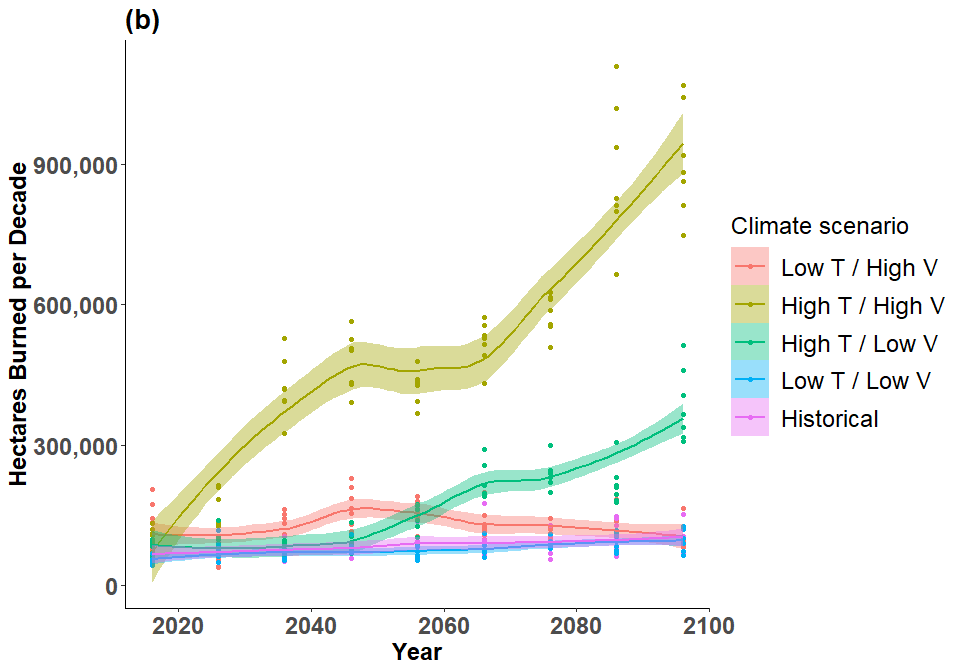<!-- -->

``` r
### Reducing it to total values for barplots
RepReducer_all<-function(Reps){
  Out2<-Reps %>%
    dplyr::group_by(Rep,Model)%>%
    dplyr::summarize(SumTotal=sum(Total))%>%
    dplyr:: group_by(Model)%>%
    dplyr::summarize(MeanTotal=mean(SumTotal),se=sd(SumTotal)/sqrt(n()))
  return(Out2)
}
CreateCI_all<-function(Variable,SE,Model,r){
  Hi<-Variable+(SE*qnorm(0.975))
  Lo<-Variable-(SE*qnorm(0.975))  
return(data.frame(Hi=Hi,Mean=Variable,Lo=Lo,ModelName=Model))  
}

MRImsd<-RepReducer_all(MRIB)
```

    ## `summarise()` has grouped output by 'Rep'. You can override using the `.groups` argument.

``` r
CNRMmsd<-RepReducer_all(CNRMB)
```

    ## `summarise()` has grouped output by 'Rep'. You can override using the `.groups` argument.

``` r
IPSLmsd<-RepReducer_all(IPSLB)
```

    ## `summarise()` has grouped output by 'Rep'. You can override using the `.groups` argument.

``` r
HadGemmsd<-RepReducer_all(HadGemB)
```

    ## `summarise()` has grouped output by 'Rep'. You can override using the `.groups` argument.

``` r
HRmsd<-RepReducer_all(HRB)
```

    ## `summarise()` has grouped output by 'Rep'. You can override using the `.groups` argument.

``` r
### Create as a dataframe using CI 
Boxes<-rbind(CreateCI_all(MRImsd$MeanTotal,MRImsd$se,MRImsd$Model),CreateCI_all(CNRMmsd$MeanTotal,CNRMmsd$se,CNRMmsd$Model),
      CreateCI_all(IPSLmsd$MeanTotal,IPSLmsd$se,IPSLmsd$Model),CreateCI_all(HadGemmsd$MeanTotal,HadGemmsd$se,HadGemmsd$Model),
      CreateCI_all(HRmsd$MeanTotal,HRmsd$se,HRmsd$Model))
options(scipen=1e8)
Boxes$Model<-Boxes$ModelName
## Sort factors
Boxes$Model <- factor(Boxes$Model, levels = c("CNRM","HadGEM","IPSL","MRI","HR"))
### Rename model function
Models=data.frame(Model=c("CNRM","HadGEM","IPSL","MRI","HR"),Modelfunction=c('LowT/HighV','HighT/HighV','HighT/LowV','LowT/LowV',"Historical"))
Boxes<-merge(Boxes,Models,by="Model")
Boxes$Modelfunction <- factor(Boxes$Modelfunction, levels = c('LowT/HighV','HighT/HighV','HighT/LowV','LowT/LowV',"Historical"))
```

``` r
### Create second plot 
p2<-ggplot(Boxes) +
    ggtitle("(a)")+
    geom_bar( aes(x=Modelfunction, y=Mean,fill=Modelfunction), stat="identity", alpha=0.7) +
    geom_errorbar( aes(x=Modelfunction, ymin=Lo, ymax=Hi), width=0.4, colour="orange", alpha=0.9, size=1.3)+
  ylab("Hectares Burned")+
  xlab("")+
  theme_classic()+
  theme(legend.position = "none")+
  scale_y_continuous(labels =scales::comma )+
  theme(axis.text=element_text(size=18,face="bold"),
        axis.title=element_text(size=18,face="bold"),
        axis.text.x=element_text(angle=25, hjust=1),
         plot.title = element_text(size = 20, face = "bold"))


p3=p1+theme(plot.margin=unit(c(.2,0.5,1.7,-2.5),"cm"))
p4=p2+theme(plot.margin=unit(c(.2,3.0,.0,1.0),"cm"))
grid.arrange(p4, p3, nrow = 1)
```

    ## `geom_smooth()` using method = 'loess' and formula 'y ~ x'

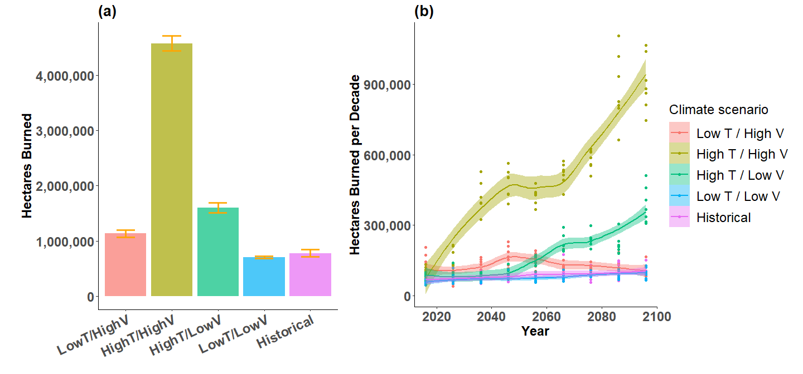<!-- -->
### Change in the last decade

``` r
Smooth %>%
  group_by(Decade,Model)%>%
  dplyr::summarise(sum(Total))%>%
  dplyr::filter(Decade==10)
```

    ## `summarise()` has grouped output by 'Decade'. You can override using the `.groups` argument.

    ## # A tibble: 5 x 3
    ## # Groups:   Decade [1]
    ##   Decade Model  `sum(Total)`
    ##    <dbl> <chr>         <dbl>
    ## 1     10 CNRM        347956.
    ## 2     10 HadGEM     1109094.
    ## 3     10 HR          543838.
    ## 4     10 IPSL        671919.
    ## 5     10 MRI         543625

``` r
6334875/711837.5    
```

    ## [1] 8.899327

``` r
1109093.8/543837.5
```

    ## [1] 2.039385

### % Change per simulation

``` r
Boxes
```

    ##    Model        Hi      Mean        Lo ModelName Modelfunction
    ## 1   CNRM 1202339.6 1134888.4 1067437.2      CNRM    LowT/HighV
    ## 2 HadGEM 4712939.5 4573925.0 4434910.5    HadGEM   HighT/HighV
    ## 3     HR  847950.3  782302.7  716655.0        HR    Historical
    ## 4   IPSL 1692334.0 1602085.7 1511837.5      IPSL    HighT/LowV
    ## 5    MRI  731237.8  707858.0  684478.3       MRI     LowT/LowV

``` r
##FRI 
(2371775*94)/782302 
```

    ## [1] 284.9882

``` r
(2371775*94)/1113178.6
```

    ## [1] 200.2795

``` r
(2371775*94)/4573925.0
```

    ## [1] 48.74301

``` r
(2371775*94)/707858.0
```

    ## [1] 314.9599

``` r
(2371775*94)/1602085.7
```

    ## [1] 139.1604

``` r
###Percent change 
100*(4573925.0-782302.7)/782302.7
```

    ## [1] 484.6746

``` r
100*(1602085.7-782302.7)/782302.7
```

    ## [1] 104.791

``` r
100*(1113178.6-782302.7)/782302.7
```

    ## [1] 42.29512

``` r
100*(707858.0-782302.7)/782302.7
```

    ## [1] -9.516099

### Looking at some of the supplemental diagnostics

``` r
CNRM_Fire1<-read.csv(paste0(Dir,"R_1/CNRM-CM5/scrapple-events-log.csv"))
HadGEM_Fire1<-read.csv(paste0(Dir,"R_1/HadGEM/scrapple-events-log.csv"))
IPSL_Fire1<-read.csv(paste0(Dir,"R_1/IPSL-CM5A-MR/scrapple-events-log.csv"))
MRI_Fire1<-read.csv(paste0(Dir,"R_1/MRI-CGCM3/scrapple-events-log.csv"))
CNRM_Fire2<-read.csv(paste0(Dir,"R_2/CNRM-CM5/scrapple-events-log.csv"))
HadGEM_Fire2<-read.csv(paste0(Dir,"R_2/HadGEM/scrapple-events-log.csv"))
IPSL_Fire2<-read.csv(paste0(Dir,"R_2/IPSL-CM5A-MR/scrapple-events-log.csv"))
MRI_Fire2<-read.csv(paste0(Dir,"R_2/MRI-CGCM3/scrapple-events-log.csv"))
CNRM_Fire3<-read.csv(paste0(Dir,"R_3/CNRM-CM5/scrapple-events-log.csv"))
HadGEM_Fire3<-read.csv(paste0(Dir,"R_3/HadGEM/scrapple-events-log.csv"))
IPSL_Fire3<-read.csv(paste0(Dir,"R_3/IPSL-CM5A-MR/scrapple-events-log.csv"))
MRI_Fire3<-read.csv(paste0(Dir,"R_3/MRI-CGCM3/scrapple-events-log.csv"))
CNRM_Fire4<-read.csv(paste0(Dir,"R_4/CNRM-CM5/scrapple-events-log.csv"))
HadGEM_Fire4<-read.csv(paste0(Dir,"R_4/HadGEM/scrapple-events-log.csv"))
IPSL_Fire4<-read.csv(paste0(Dir,"R_4/IPSL-CM5A-MR/scrapple-events-log.csv"))
MRI_Fire4<-read.csv(paste0(Dir,"R_4/MRI-CGCM3/scrapple-events-log.csv"))
CNRM_Fire5<-read.csv(paste0(Dir,"R_5/CNRM-CM5/scrapple-events-log.csv"))
HadGEM_Fire5<-read.csv(paste0(Dir,"R_5/HadGEM/scrapple-events-log.csv"))
IPSL_Fire5<-read.csv(paste0(Dir,"R_5/IPSL-CM5A-MR/scrapple-events-log.csv"))
MRI_Fire5<-read.csv(paste0(Dir,"R_5/MRI-CGCM3/scrapple-events-log.csv"))
CNRM_Fire6<-read.csv(paste0(Dir,"R_6/CNRM-CM5/scrapple-events-log.csv"))
HadGEM_Fire6<-read.csv(paste0(Dir,"R_6/HadGEM/scrapple-events-log.csv"))
IPSL_Fire6<-read.csv(paste0(Dir,"R_6/IPSL-CM5A-MR/scrapple-events-log.csv"))
MRI_Fire6<-read.csv(paste0(Dir,"R_6/MRI-CGCM3/scrapple-events-log.csv"))
CNRM_Fire7<-read.csv(paste0(Dir,"R_7/CNRM-CM5/scrapple-events-log.csv"))
HadGEM_Fire7<-read.csv(paste0(Dir,"R_7/HadGEM/scrapple-events-log.csv"))
IPSL_Fire7<-read.csv(paste0(Dir,"R_7/IPSL-CM5A-MR/scrapple-events-log.csv"))
MRI_Fire7<-read.csv(paste0(Dir,"R_7/MRI-CGCM3/scrapple-events-log.csv"))
```

``` r
## Take the mean value per year of the DNBR and the inputs
MeanDNBR<-function(Modely,Model_name){
  Out<-Modely%>%
    group_by(SimulationYear)%>%
    dplyr::summarize(MeanDNBR=mean(MeanDNBR),
              MeanFWI=mean(MeanFWI),
              MeanPET=mean(MeanPET),
              MeanWD=mean(MeanWD),
              MeanEFWS=mean(MeanEffectiveWindSpeed),
              MeanFineFuels=mean(MeanFineFuels),
              TotalBiomassMortality=sum(TotalBiomassMortality))
  Out$Model<-Model_name
  return(Out)
}

Models_Fire<-rbind(MeanDNBR(HadGEM_Fire1,"HadGEM"),MeanDNBR(CNRM_Fire1,"CNRM"),MeanDNBR(IPSL_Fire1,"IPSL"),MeanDNBR(MRI_Fire1,"MRI"),
                   MeanDNBR(HadGEM_Fire2,"HadGEM"),MeanDNBR(CNRM_Fire2,"CNRM"),MeanDNBR(IPSL_Fire2,"IPSL"),MeanDNBR(MRI_Fire2,"MRI"),
                   MeanDNBR(HadGEM_Fire3,"HadGEM"),MeanDNBR(CNRM_Fire3,"CNRM"),MeanDNBR(IPSL_Fire3,"IPSL"),MeanDNBR(MRI_Fire3,"MRI"),
                   MeanDNBR(HadGEM_Fire4,"HadGEM"),MeanDNBR(CNRM_Fire4,"CNRM"),MeanDNBR(IPSL_Fire4,"IPSL"),MeanDNBR(MRI_Fire4,"MRI"),
                   MeanDNBR(HadGEM_Fire5,"HadGEM"),MeanDNBR(CNRM_Fire5,"CNRM"),MeanDNBR(IPSL_Fire5,"IPSL"),MeanDNBR(MRI_Fire5,"MRI"),
                   MeanDNBR(HadGEM_Fire6,"HadGEM"),MeanDNBR(CNRM_Fire6,"CNRM"),MeanDNBR(IPSL_Fire6,"IPSL"),MeanDNBR(MRI_Fire6,"MRI"),
                   MeanDNBR(HadGEM_Fire7,"HadGEM"),MeanDNBR(CNRM_Fire7,"CNRM"),MeanDNBR(IPSL_Fire7,"IPSL"),MeanDNBR(MRI_Fire7,"MRI")
                   )%>%
  dplyr::group_by(SimulationYear,Model)%>%
  dplyr::summarise(MeanDNBR=mean(MeanDNBR),MeanFWI=mean(MeanFWI),MeanPET=mean(MeanPET),MeanWD=mean(MeanWD),
                   MeanEFWS=mean(MeanEFWS),MeanFineFuels=mean(MeanFineFuels),TotalBiomasMortality=mean(TotalBiomassMortality))
```

    ## `summarise()` has grouped output by 'SimulationYear'. You can override using the `.groups` argument.

## Mean annual DNBR

``` r
ggplot(data=Models_Fire, aes(x=SimulationYear, y=MeanDNBR, group=Model,color=Model)) +
  geom_line()+
  geom_point()
```

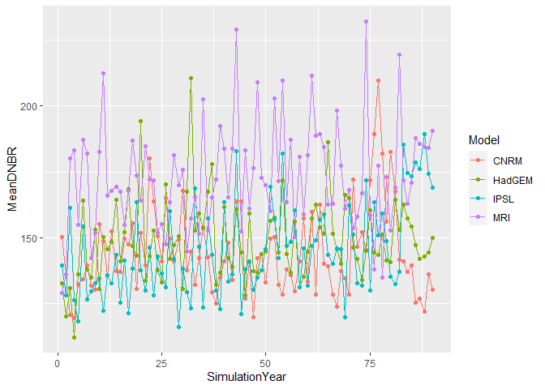<!-- -->
### Diagnostic variables

``` r
ggplot(data=Models_Fire, aes(x=SimulationYear, y=MeanPET, group=Model,color=Model)) +
  geom_line()+
  geom_point()
```

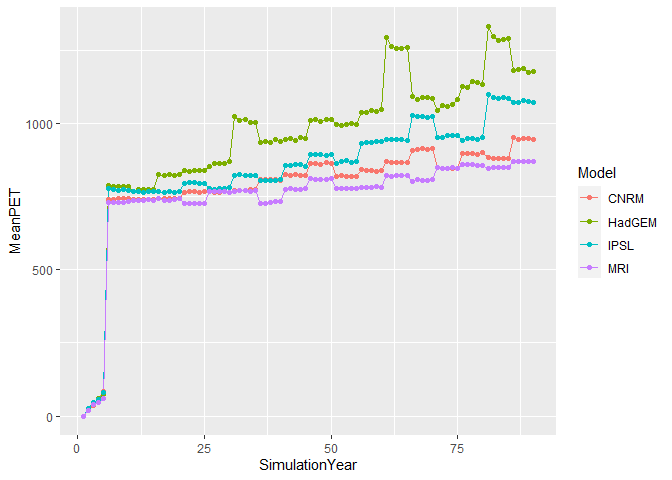<!-- -->

``` r
ggplot(data=Models_Fire, aes(x=SimulationYear, y=MeanWD, group=Model,color=Model)) +
  geom_line()+
  geom_point()
```

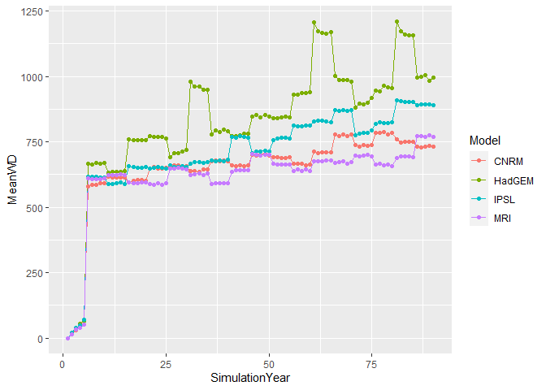<!-- -->

``` r
ggplot(data=Models_Fire, aes(x=SimulationYear, y=MeanFineFuels, group=Model,color=Model)) +
  geom_line()+
  geom_point()
```

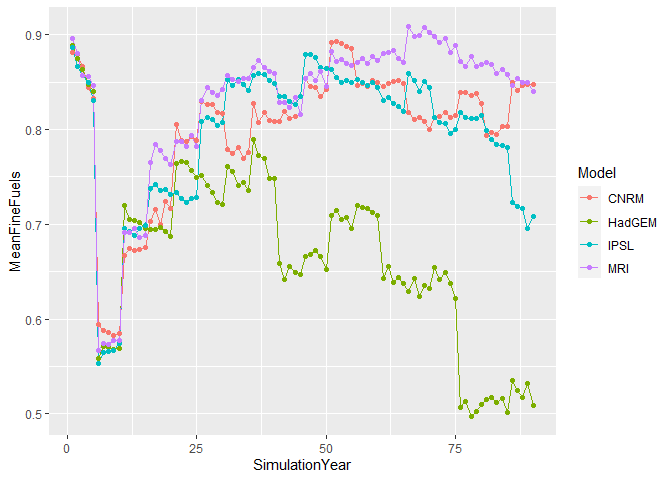<!-- -->

``` r
ggplot(data=Models_Fire, aes(x=SimulationYear, y=MeanEFWS, group=Model,color=Model)) +
  geom_line()+
  geom_point()
```

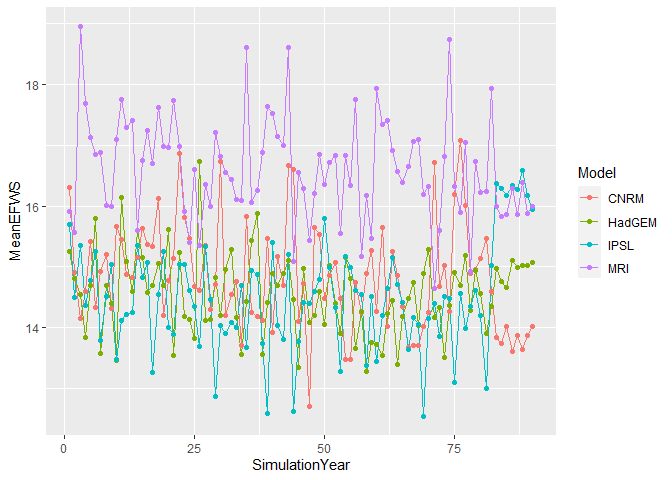<!-- -->

### Looking at fires that are greater 300

``` r
library(dplyr)


HighFirecounter<-function(Modely,Model_name){
   Out<-Modely%>%
    dplyr::mutate(Decade=floor(SimulationYear/10)*10)%>% ## Group by decade
    dplyr::group_by(Decade)%>%
    dplyr::mutate(AllFires=n())%>% ### Count 
    dplyr::filter(MeanDNBR > 300)%>% ### Look at fires greater than MEan DNBR >300
    dplyr::group_by(Decade)%>% ### Summerise
    dplyr::summarise(count=n(),all=mean(AllFires))
   Out$Model<-Model_name
   Out$Percent<-Out$count/Out$all
   return(Out)
}

Models_Fire<-rbind(HighFirecounter(HadGEM_Fire1,"HadGEM"),HighFirecounter(CNRM_Fire1,"CNRM"),HighFirecounter(IPSL_Fire1,"IPSL"),HighFirecounter(MRI_Fire1,"MRI"),
                   HighFirecounter(HadGEM_Fire2,"HadGEM"),HighFirecounter(CNRM_Fire2,"CNRM"),HighFirecounter(IPSL_Fire2,"IPSL"),HighFirecounter(MRI_Fire2,"MRI"),
                   HighFirecounter(HadGEM_Fire3,"HadGEM"),HighFirecounter(CNRM_Fire3,"CNRM"),HighFirecounter(IPSL_Fire3,"IPSL"),HighFirecounter(MRI_Fire3,"MRI"),
                   HighFirecounter(HadGEM_Fire4,"HadGEM"),HighFirecounter(CNRM_Fire4,"CNRM"),HighFirecounter(IPSL_Fire4,"IPSL"),HighFirecounter(MRI_Fire4,"MRI"),
                   HighFirecounter(HadGEM_Fire5,"HadGEM"),HighFirecounter(CNRM_Fire5,"CNRM"),HighFirecounter(IPSL_Fire5,"IPSL"),HighFirecounter(MRI_Fire5,"MRI"),
                   HighFirecounter(HadGEM_Fire6,"HadGEM"),HighFirecounter(CNRM_Fire6,"CNRM"),HighFirecounter(IPSL_Fire6,"IPSL"),HighFirecounter(MRI_Fire6,"MRI"),
                   HighFirecounter(HadGEM_Fire7,"HadGEM"),HighFirecounter(CNRM_Fire7,"CNRM"),HighFirecounter(IPSL_Fire7,"IPSL"),HighFirecounter(MRI_Fire7,"MRI")
                   )%>%
  dplyr::group_by(Decade,Model)%>%
  dplyr::summarise(All=mean(all),Count=mean(count),Percent=mean(Percent))
```

    ## `summarise()` has grouped output by 'Decade'. You can override using the `.groups` argument.

``` r
Models_Fire<-Models_Fire[Models_Fire$Decade<90,]
#png("HighSeverity.png",width=600,height=400)
ggplot(data=Models_Fire, aes(x=Decade, y=Percent*100, group=Model,color=Model)) +
  geom_line(lwd=3)+
  geom_point()+
  ylab("% of fires")+
  xlab("Years since 2016")+
  ggtitle("b) High Severity Fires (DRdNBR >300)")+
  theme_minimal()+
  theme(axis.text=element_text(size=12,face="bold"),
        axis.title=element_text(size=24,face="bold"),
        plot.title = element_text(size = 24, face = "bold"))
```

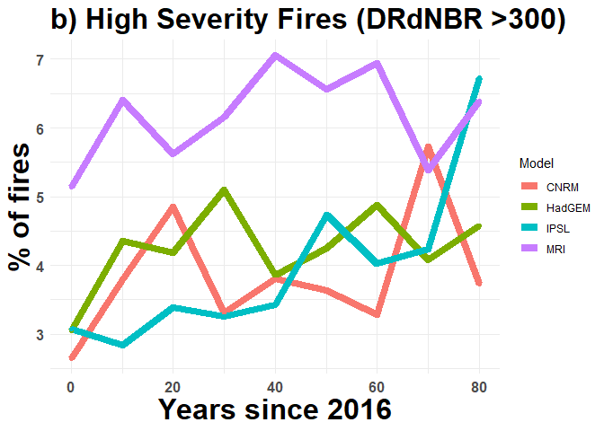<!-- -->

``` r
#dev.off()
```

### Looking at them by decade

``` r
#colnames(HadGEM_Fire)

MeanDNBR_dec<-function(Modely,Model_name){
  Out<-Modely%>%
    mutate(Decade=floor(SimulationYear/10)*10)%>%
    group_by(Decade)%>%
    dplyr::summarize(MeanDNBR=mean(MeanDNBR),
              MeanFWI=mean(MeanFWI),
              MeanPET=mean(MeanPET),
              MeanWD=mean(MeanWD),
              MeanFineFuels=mean(MeanFineFuels),
              MeanEfWd=mean(MeanEffectiveWindSpeed),
              TotalCoki=sum(CohortsKilled),
              TotalAvail=sum(AvailableCohorts),
              TotalBiomassMortality=sum(TotalBiomassMortality))%>%
    mutate(PercentKilled=TotalCoki/TotalAvail)
  Out$Model<-Model_name
  return(Out)
}
Models_Fire_dec<-rbind(MeanDNBR_dec(HadGEM_Fire1,"HadGEM"),MeanDNBR_dec(CNRM_Fire1,"CNRM"),MeanDNBR_dec(IPSL_Fire1,"IPSL"),MeanDNBR_dec(MRI_Fire1,"MRI"),
                   MeanDNBR_dec(HadGEM_Fire2,"HadGEM"),MeanDNBR_dec(CNRM_Fire2,"CNRM"),MeanDNBR_dec(IPSL_Fire2,"IPSL"),MeanDNBR_dec(MRI_Fire2,"MRI"),
                   MeanDNBR_dec(HadGEM_Fire3,"HadGEM"),MeanDNBR_dec(CNRM_Fire3,"CNRM"),MeanDNBR_dec(IPSL_Fire3,"IPSL"),MeanDNBR_dec(MRI_Fire3,"MRI"),
                   MeanDNBR_dec(HadGEM_Fire4,"HadGEM"),MeanDNBR_dec(CNRM_Fire4,"CNRM"),MeanDNBR_dec(IPSL_Fire4,"IPSL"),MeanDNBR_dec(MRI_Fire4,"MRI"),
                   MeanDNBR_dec(HadGEM_Fire5,"HadGEM"),MeanDNBR_dec(CNRM_Fire5,"CNRM"),MeanDNBR_dec(IPSL_Fire5,"IPSL"),MeanDNBR_dec(MRI_Fire5,"MRI"),
                   MeanDNBR_dec(HadGEM_Fire6,"HadGEM"),MeanDNBR_dec(CNRM_Fire6,"CNRM"),MeanDNBR_dec(IPSL_Fire6,"IPSL"),MeanDNBR_dec(MRI_Fire6,"MRI"),
                   MeanDNBR_dec(HadGEM_Fire7,"HadGEM"),MeanDNBR_dec(CNRM_Fire7,"CNRM"),MeanDNBR_dec(IPSL_Fire7,"IPSL"),MeanDNBR_dec(MRI_Fire7,"MRI")
                   )%>%
  group_by(Decade,Model)%>%
  dplyr::summarise(MeanDNBR=mean(MeanDNBR),MeanFWI=mean(MeanFWI),MeanPET=mean(MeanPET),MeanWD=mean(MeanWD),
                   MeanEfWd=mean(MeanEfWd),MeanFineFuels=mean(MeanFineFuels),TotalBiomasMortality=mean(TotalBiomassMortality),
                   PercentKilled=mean(PercentKilled))
```

    ## `summarise()` has grouped output by 'Decade'. You can override using the `.groups` argument.

``` r
Models_Fire_dec<-Models_Fire_dec[Models_Fire_dec$Decade<90,]
```

``` r
#png("MeanFineFuels.png",width=600,height=400)
ggplot(data=Models_Fire_dec, aes(x=Decade, y=MeanFineFuels, group=Model,color=Model)) +
  geom_line(lwd=3)+
  geom_point()+
  ylab("Mean fine fuel rating [0:1]")+
  xlab("Years since 2016")+
  ggtitle("b) Fine fuel rating")+
  theme_minimal()+
  theme(axis.text=element_text(size=12,face="bold"),
        axis.title=element_text(size=24,face="bold"),
        plot.title = element_text(size = 24, face = "bold"))
```

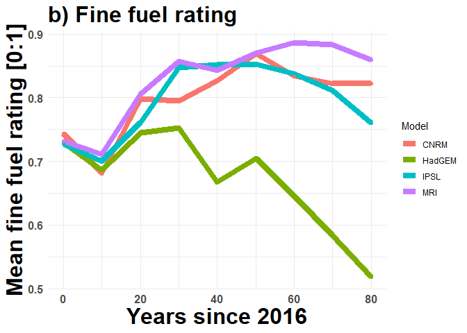<!-- -->

``` r
#dev.off()
```

``` r
ggplot(data=Models_Fire_dec, aes(x=Decade, y=MeanDNBR, group=Model,color=Model)) +
   geom_line(lwd=3)+
  geom_point()+
  ylab("Mean DNBR per event")+
  xlab("Years since 2006")+
  theme_minimal()+
  theme(axis.text=element_text(size=12,face="bold"),
        axis.title=element_text(size=14,face="bold"))
```

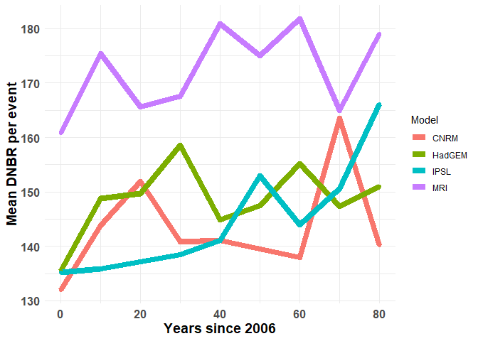<!-- -->

``` r
ggplot(data=Models_Fire_dec, aes(x=Decade, y=MeanDNBR, group=Model,color=Model)) +
  geom_line()+
  geom_point()
```

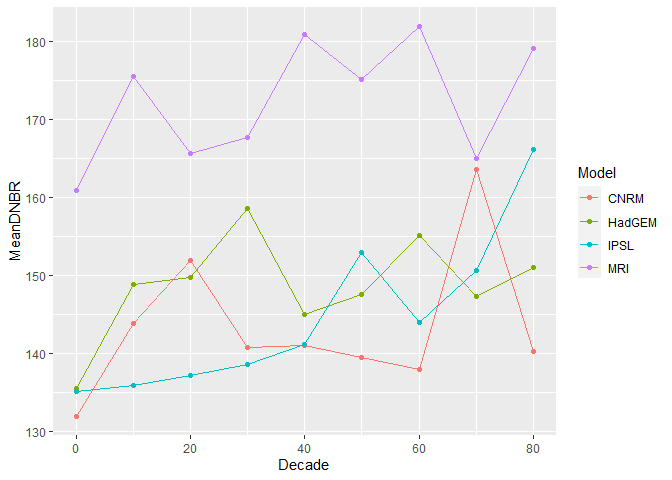<!-- -->

``` r
ggplot(data=Models_Fire_dec, aes(x=Decade, y=MeanPET, group=Model,color=Model)) +
  geom_line()+
  geom_point()
```

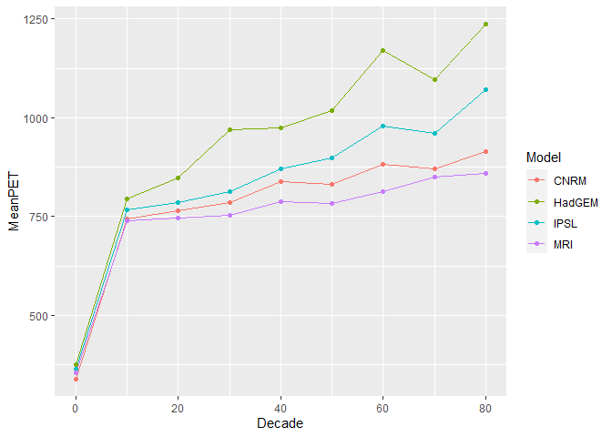<!-- -->

``` r
ggplot(data=Models_Fire_dec, aes(x=Decade, y=MeanWD, group=Model,color=Model)) +
  geom_line()+
  geom_point()
```

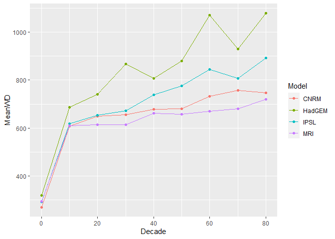<!-- -->

``` r
ggplot(data=Models_Fire_dec, aes(x=Decade, y=MeanEfWd, group=Model,color=Model)) +
  geom_line()+
  geom_point()
```

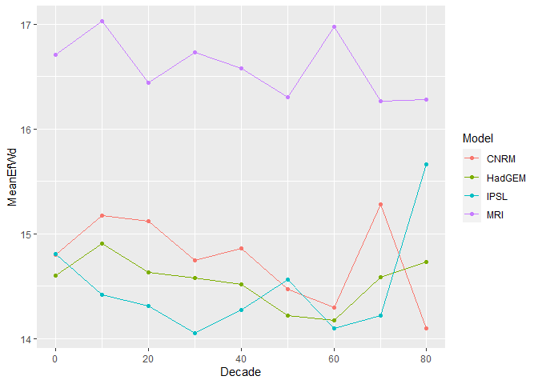<!-- -->

### Figure 4: Looking at the spatial distirbution of FFRI

``` r
### Load in libraries 
library(raster)
library(sf)
```

    ## Warning: package 'sf' was built under R version 4.1.2

    ## Linking to GEOS 3.9.1, GDAL 3.2.1, PROJ 7.2.1; sf_use_s2() is TRUE

``` r
library(RColorBrewer)
getwd()
```

    ## [1] "C:/Users/zjrobbin/Documents/GitHub/Project-Southern-Appalachians-2018/Research_Projects/Future_fire/Post_Run"

``` r
Oranges<-brewer.pal(9,"YlOrRd") ### Color pallete for the plot
```

``` r
### This is the primary function 
ProcessLANDIS<-function(names){
Stack<-NULL
for(n in names){ ### All the locations of the rasters of fire occurance
      print(n)
      print("Load")
      AllEvent<-stack(paste0(paste0(n,"/social-climate-fire/"),## Create a stack of all Event-ID rasters
                             list.files(paste0(n,"/social-climate-fire/"),
                                        pattern="event-ID"))) 
      AllEvent2<-AllEvent
      print("Clean")
      AllEvent2[AllEvent2>1]<-1 ### All values greater than 1 are 1 
      print("Sum")
      Event<-calc(AllEvent2,sum) ### Sum the number of events that occur
      if(n==names[1]){
      Stack<-Event
      }else{
      Stack<-Event+Stack ### Create one big stack of additive fire 
      }
  
}  
return(Stack)
}

## Process HADGEM
names<-c("Z:/Robbins/Sapps/CC_Runs_R3/R_1/HadGem/",
"Z:/Robbins/Sapps/CC_Runs_R3/R_2/HadGem/",
"Z:/Robbins/Sapps/CC_Runs_R3/R_3/HadGem/",
"Z:/Robbins/Sapps/CC_Runs_R3/R_4/HadGem/",
"Z:/Robbins/Sapps/CC_Runs_R3/R_5/HadGem/",
"Z:/Robbins/Sapps/CC_Runs_R3/R_6/HadGem/",
"Z:/Robbins/Sapps/CC_Runs_R3/R_7/HadGem/")

## How long it takes
start <- Sys.time()
HadGem1<-ProcessLANDIS(names)
end <- Sys.time()
total_time <- as.numeric (end - start, units = "mins") # or secs ... 
HadGemStack<-HadGem1
### Write raster to avoid reprocessing 
writeRaster(HadGemStack,"HadGEM_Stack2.tif",overwrite=T)

### Process MRI 
names<-c("Z:/Robbins/Sapps/CC_Runs_R3/R_1/MRI-CGCM3/",
"Z:/Robbins/Sapps/CC_Runs_R3/R_2/MRI-CGCM3/",
"Z:/Robbins/Sapps/CC_Runs_R3/R_3/MRI-CGCM3/",
"Z:/Robbins/Sapps/CC_Runs_R3/R_4/MRI-CGCM3/",
"Z:/Robbins/Sapps/CC_Runs_R3/R_5/MRI-CGCM3/",
"Z:/Robbins/Sapps/CC_Runs_R3/R_6/MRI-CGCM3/",
"Z:/Robbins/Sapps/CC_Runs_R3/R_7/MRI-CGCM3/")
start <- Sys.time()
MRI_Stack<-ProcessLANDIS(names)
end <- Sys.time()
total_time <- as.numeric (end - start, units = "mins") # or secs ... 
writeRaster(MRI_Stack,"MRI_Stack2.tif",overwrite=T)

### Process IPSL
names<-c("Z:/Robbins/Sapps/CC_Runs_R3/R_1/IPSL-CM5A-MR/",
"Z:/Robbins/Sapps/CC_Runs_R3/R_2/IPSL-CM5A-MR/",
"Z:/Robbins/Sapps/CC_Runs_R3/R_3/IPSL-CM5A-MR/",
"Z:/Robbins/Sapps/CC_Runs_R3/R_4/IPSL-CM5A-MR/",
"Z:/Robbins/Sapps/CC_Runs_R3/R_5/IPSL-CM5A-MR/",
"Z:/Robbins/Sapps/CC_Runs_R3/R_6/IPSL-CM5A-MR/",
"Z:/Robbins/Sapps/CC_Runs_R3/R_7/IPSL-CM5A-MR/")
start <- Sys.time()
IPSL_Stack<-ProcessLANDIS(names)
end <- Sys.time()
total_time <- as.numeric (end - start, units = "mins") # or secs ... 
writeRaster(IPSL_Stack,"IPSL_Stack2.tif",overwrite=T)

### Process CNRM-CM5
names<-c("Z:/Robbins/Sapps/CC_Runs_R3/R_1/CNRM-CM5/",
"Z:/Robbins/Sapps/CC_Runs_R3/R_2/CNRM-CM5/",
"Z:/Robbins/Sapps/CC_Runs_R3/R_3/CNRM-CM5/",
"Z:/Robbins/Sapps/CC_Runs_R3/R_4/CNRM-CM5/",
"Z:/Robbins/Sapps/CC_Runs_R3/R_5/CNRM-CM5/",
"Z:/Robbins/Sapps/CC_Runs_R3/R_6/CNRM-CM5/",
"Z:/Robbins/Sapps/CC_Runs_R3/R_7/CNRM-CM5/")
start <- Sys.time()
CNRM_Stack<-ProcessLANDIS(names)
end <- Sys.time()
total_time <- as.numeric (end - start, units = "mins") # or secs ... 
writeRaster(CNRM_Stack,"CNRM_Stack2.tif",overwrite=T)
```

``` r
### Load in the area of interest outlines 
Aoi<-read_sf("Z:/Robbins/Sapps/Model_Prep/Sapps_maps_2_18/Dissolved_AOI.shp")
### Load in the raster off the combined fire events
HadGemStack<-raster("C:/Users/zjrobbin/Documents/GitHub/Project-Southern-Appalachians-2018/Research_Projects/Future_fire/Post_Run/Analysis_Midpoint/HadGEM_Stack2.tif")
CNRM_Stack<-raster("C:/Users/zjrobbin/Documents/GitHub/Project-Southern-Appalachians-2018/Research_Projects/Future_fire/Post_Run/Analysis_Midpoint/CNRM_Stack2.tif")
IPSL_Stack<-raster("C:/Users/zjrobbin/Documents/GitHub/Project-Southern-Appalachians-2018/Research_Projects/Future_fire/Post_Run/Analysis_Midpoint/IPSL_Stack2.tif")
MRI_Stack<-raster("C:/Users/zjrobbin/Documents/GitHub/Project-Southern-Appalachians-2018/Research_Projects/Future_fire/Post_Run/Analysis_Midpoint/MRI_Stack2.tif")
### Set the projections and extents
projection(CNRM_Stack)<-projection(Aoi)
extent(CNRM_Stack)<-extent(Aoi)
projection(IPSL_Stack)<-projection(Aoi)
extent(IPSL_Stack)<-extent(Aoi)
projection(MRI_Stack)<-projection(Aoi)
extent(MRI_Stack)<-extent(Aoi)
projection(HadGemStack)<-projection(Aoi)
extent(HadGemStack)<-extent(Aoi)
### Reclassification 
reclass_df <- c(0,25,1, ## FRI 0-25 years  
              25, 50, 2, ## FRI 25-50 years 
             50, 100, 3,## FRI 50-100 years 
             100, 200, 4,## FRI 100-200 years 
             200,Inf,5)## FRI > 200 years 
### Create a reclassification matrix
df_reclass <- matrix(reclass_df,
                ncol = 3,
                byrow = TRUE)
### Calculate fri interval and reclassify to 1-5 scale
CNRM_reclass <- reclassify(630/ CNRM_Stack,
                     df_reclass)
MRI_reclass <- reclassify(630/ MRI_Stack,
                     df_reclass)
ISPL_reclass <- reclassify(630/ IPSL_Stack,
                     df_reclass)
HadGEM_reclass <- reclassify(630/ HadGemStack,
                     df_reclass)
```

``` r
### Plot the landscape 
par(mar=c(.1,.1,3.5,.1),mfrow=c(2,2))
plot(MRI_reclass,axes=F,box=F,col=c(rev(Oranges)[1],rev(Oranges)[3],rev(Oranges)[5],rev(Oranges)[7],"black"),legend=F,main="Low drought trend / low drought variance",cex.main=3.0) 
plot(Aoi$geometry,add=T,lwd=4.0,border="white")
plot(CNRM_reclass,axes=F,box=F,col=c(rev(Oranges)[1],rev(Oranges)[3],rev(Oranges)[5],rev(Oranges)[7],"black"),legend=F,main="Low drought trend / high drought variance", cex.main=3.0)
plot(Aoi$geometry,add=T,lwd=4.0,border="white")
plot(ISPL_reclass,axes=F,box=F,col=c(rev(Oranges)[1],rev(Oranges)[3],rev(Oranges)[5],rev(Oranges)[7],"black"),legend=F,main="High drought trend / low drought variance",cex.main=3.0) 
plot(Aoi$geometry,add=T,lwd=4.0,border="white")
plot(HadGEM_reclass,axes=F,box=F,col=c(rev(Oranges)[1],rev(Oranges)[3],rev(Oranges)[5],rev(Oranges)[7],"black"),legend=F,main="High drought trend / high drought variance",cex.main=3.0) 
plot(Aoi$geometry,add=T,lwd=4.0,border="white")
legend(366098.8,3879520,legend = c("0-25 Years","25-50 Years", '50-100 years',
                              "100-200 Years","200-Inf Years"),
       fill = c(rev(Oranges)[1],rev(Oranges)[3],rev(Oranges)[5],rev(Oranges)[7],"black"),
       border = TRUE,
       bg='white',cex=2.8,text.col="black")
```

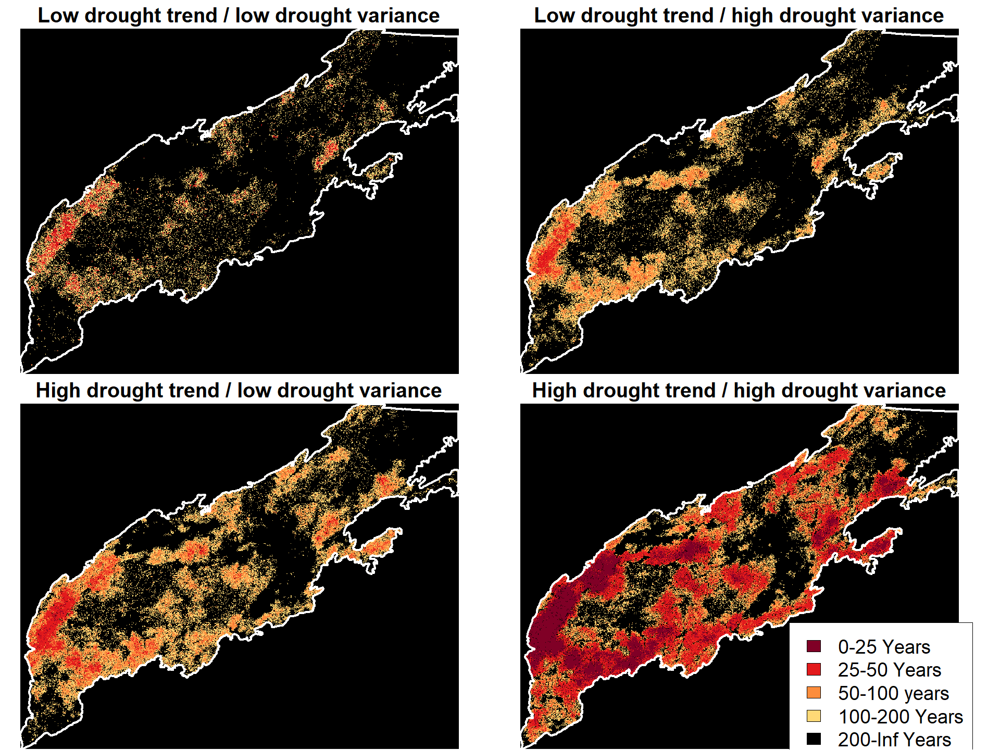<!-- -->

### Looking at the percentages across the landscape

``` r
MRI_df<-as.data.frame(table(as.data.frame(MRI_reclass)))
MRI_df$Freq[MRI_df$Var1==5]<-MRI_df$Freq[MRI_df$Var1==5]-1021216
MRI_df$Perc<-MRI_df$Freq/379484
MRI_df
```

    ##   Var1   Freq         Perc
    ## 1    2    251 0.0006614245
    ## 2    3  14046 0.0370134182
    ## 3    4  64566 0.1701415606
    ## 4    5 300621 0.7921835967

``` r
CNRM_df<-as.data.frame(table(as.data.frame(CNRM_reclass)))
CNRM_df$Freq[CNRM_df$Var1==5]<-CNRM_df$Freq[CNRM_df$Var1==5]-1021216
CNRM_df$Perc<-CNRM_df$Freq/379484
CNRM_df
```

    ##   Var1   Freq          Perc
    ## 1    1     16 0.00004216252
    ## 2    2   7110 0.01873596779
    ## 3    3  46590 0.12277197458
    ## 4    4  90426 0.23828672619
    ## 5    5 235342 0.62016316893

``` r
ISPL_df<-as.data.frame(table(as.data.frame(ISPL_reclass)))
ISPL_df$Freq[ISPL_df$Var1==5]<-ISPL_df$Freq[ISPL_df$Var1==5]-1021216
ISPL_df$Perc<-ISPL_df$Freq/379484
ISPL_df
```

    ##   Var1   Freq        Perc
    ## 1    1    528 0.001391363
    ## 2    2  20949 0.055203908
    ## 3    3  76903 0.202651495
    ## 4    4 101360 0.267099535
    ## 5    5 179744 0.473653698

``` r
HadGEM_df<-as.data.frame(table(as.data.frame(HadGEM_reclass)))
HadGEM_df$Freq[HadGEM_df$Var1==5]<-HadGEM_df$Freq[HadGEM_df$Var1==5]-1021216
HadGEM_df$Perc<-HadGEM_df$Freq/379484
HadGEM_df
```

    ##   Var1   Freq      Perc
    ## 1    1  57197 0.1507231
    ## 2    2 108592 0.2861570
    ## 3    3  80337 0.2117006
    ## 4    4  49363 0.1300793
    ## 5    5  83995 0.2213400

### Calculating relative biomass by FRI.

``` r
### Load in packages 
library(sf)
library(dplyr)
library(raster)
library(ggplot2)
### Raster of ecoregions to use as active/inactive sites 
ActiveNot<-raster("F:/Chatper3/R_1/Historic_Random/Ecos11_NCLD.tif")

### The bins of species 
# Xeric
Yellowpines<-c('PinuTaed','PinuPung','PinuRigi')
Whiteoaks<-c("QuerPrin","QuerAlba")
XeriredOaks<-c('QuerCocc','QuerVelu')
XeriHwd<-c("NyssSylv","OxydArbo","SassAlid")
WhitePine<-c("PinuStro")
# Mesic
Maples<-c("AcerRubr","AcerSacc","AcerPens")
MesicHard<-c("AescBuck","BetuLent","CaryGlab","CaryOvat","CaryAlba","FraxAmer",
             "QuerRubr","LiriTuli","TiliAmer","IlexOpac","MagnMacr","IlexOpac")
Hemlock<-c("TsugCana")
### Process the biomass by FRI 
ProcessBiomassFRI<-function(r,Model,Year){
  
  BiomassGroup<-function(group,ID,BioDir,ActiveNot,FRI_reclass){
    Sub<-Files[grepl(paste(group, collapse="|"), Files)]## Get all files in the group 
    SumoutYP<-(sum(raster::stack(paste0(BioDir,Sub)))) ### Create a raster stack and sum in 
    extent(SumoutYP)<-extent(ActiveNot)### Set extent 
    projection(SumoutYP)<-projection(ActiveNot)## Set projection 
    extent(FRI_reclass)<-extent(ActiveNot) ### Do the same with the FRI map 
    projection(FRI_reclass)<-projection(ActiveNot)
    FRI_YP<-as.data.frame(stack(FRI_reclass,SumoutYP,ActiveNot))### Create a stack 
    colnames(FRI_YP)<-c("FRI","Sum","ActiveNot")### Standardize namaes
    Out<-FRI_YP%>%
      filter(!ActiveNot==1)%>% ### Ignore the cells that are not on 
      group_by(FRI)%>% ### Group by FRI 
      dplyr::summarise(mean=mean(Sum)) ### Take the mean basal area
    Out<-merge(data.frame(FRI=(1:5)),Out,by='FRI',all.x=T) ### Create a data frame 
    Out$ID<-ID
    rm(ActiveNot)
    rm(SumoutYP)
    rm(FRI_YP)
    return(Out) 
  
  }
  
  ### Drive we are working in (replicate/Model )
 Dir<-paste0("F:/Chatper3/R_",r,"/",Model)
  ### Get all the event id rasters
  AllEvent2<-stack(paste0(paste0(Dir,"/social-climate-fire/"),list.files(paste0(Dir,"/social-climate-fire/"),pattern="event-ID")))
  ### Same process as above
  print("Clean")
  reup<-cbind(from = c(0, 1), to = c(0.99, Inf), becomes = c(0,1))
  #AllEvent2[AllEvent2>1]<-1
  AllEvent2<-reclassify(AllEvent2,reup)
  print("Sum")
  Event<-calc(AllEvent2,sum)
  reclass_df <- c(0, 25, 1,
                  25, 50, 2,
                  50, 100, 3,
                  100, 200, 4,
                  200,Inf,5)
  
  df_reclass <- matrix(reclass_df,
                       ncol = 3,
                       byrow = TRUE)
  FRI_reclass <- reclassify(90/ Event,
                               df_reclass)
  
  ### Get the biomass for a given year 
  BioDir<-paste0(Dir,"/biomass/")
  Files<-list.files(BioDir,pattern=paste0("-ageclass-",Year,".img"))
  ### Processs for each function type to create a dataframe
  print('calc')
  SumoutYP<-BiomassGroup(Yellowpines,"Yellowpines",BioDir,ActiveNot,FRI_reclass)
  SumoutWO<-BiomassGroup(Whiteoaks,"Whiteoaks",BioDir,ActiveNot,FRI_reclass)
  SumoutXRO<-BiomassGroup(XeriredOaks,"XeriredOaks",BioDir,ActiveNot,FRI_reclass)
  SumoutXHW<-BiomassGroup(XeriHwd,"XeriHwd",BioDir,ActiveNot,FRI_reclass)
  SumoutWP<-BiomassGroup(WhitePine,"WhitePine",BioDir,ActiveNot,FRI_reclass)
  SumoutMP<-BiomassGroup(Maples,"Maples",BioDir,ActiveNot,FRI_reclass)
  SumoutMHW<-BiomassGroup(MesicHard,"MesicHard",BioDir,ActiveNot,FRI_reclass)
  SumoutHLM<-BiomassGroup(Hemlock,"Hemlock",BioDir,ActiveNot,FRI_reclass)
  print("bind")
  ### bind to single dataframe
  DF<-rbind(SumoutYP,SumoutWO,SumoutXRO,SumoutXHW,SumoutWP,SumoutMP,SumoutMHW,SumoutHLM)
  ### Identifiers 
  DF$Model<-Model
  DF$rep<-r
  rm(df_reclass)
  rm(FRI_reclass)
  rm(AllEvent2)
  return(DF)
}

### The year 90 for each model and each replicate
HadGem1<-ProcessBiomassFRI(1,"HadGEM",90)
CNRM_FR1<-ProcessBiomassFRI(1,"CNRM-CM5",90)
IPSL_FRI1<-ProcessBiomassFRI(1,"IPSL-CM5A-MR",90)
MRI_FRI1<-ProcessBiomassFRI(1,"MRI-CGCM3",90)
Starting<-ProcessBiomassFRI(1,"MRI-CGCM3",0)
HadGem2<-ProcessBiomassFRI(2,"HadGEM",90)
CNRM_FRI2<-ProcessBiomassFRI(2,"CNRM-CM5",90)
IPSL_FRI2<-ProcessBiomassFRI(2,"IPSL-CM5A-MR",90)
MRI_FRI2<-ProcessBiomassFRI(2,"MRI-CGCM3",90)
HadGem3<-ProcessBiomassFRI(3,"HadGEM",90)
CNRM_FRI3<-ProcessBiomassFRI(3,"CNRM-CM5",90)
IPSL_FRI3<-ProcessBiomassFRI(3,"IPSL-CM5A-MR",90)
MRI_FRI3<-ProcessBiomassFRI(3,"MRI-CGCM3",90)
HadGem4<-ProcessBiomassFRI(4,"HadGEM",90)
CNRM_FRI4<-ProcessBiomassFRI(4,"CNRM-CM5",90)
IPSL_FRI4<-ProcessBiomassFRI(4,"IPSL-CM5A-MR",90)
MRI_FRI4<-ProcessBiomassFRI(4,"MRI-CGCM3",90)
HadGem5<-ProcessBiomassFRI(5,"HadGEM",90)
CNRM_FRI5<-ProcessBiomassFRI(5,"CNRM-CM5",90)
IPSL_FRI5<-ProcessBiomassFRI(5,"IPSL-CM5A-MR",90)
MRI_FRI5<-ProcessBiomassFRI(5,"MRI-CGCM3",90)
HadGem6<-ProcessBiomassFRI(6,"HadGEM",90)
CNRM_FRI6<-ProcessBiomassFRI(6,"CNRM-CM5",90)
IPSL_FRI6<-ProcessBiomassFRI(6,"IPSL-CM5A-MR",90)
MRI_FRI6<-ProcessBiomassFRI(6,"MRI-CGCM3",90)
HadGem7<-ProcessBiomassFRI(7,"HadGEM",90)
CNRM_FRI7<-ProcessBiomassFRI(7,"CNRM-CM5",90)
IPSL_FRI7<-ProcessBiomassFRI(7,"IPSL-CM5A-MR",90)
MRI_FRI7<-ProcessBiomassFRI(7,"MRI-CGCM3",90)
AllRuns<-rbind(HadGem1,CNRM_FR1,IPSL_FRI1,MRI_FRI1,
               HadGem2,CNRM_FRI2,IPSL_FRI2,MRI_FRI2,
               HadGem3,CNRM_FRI3,IPSL_FRI3,MRI_FRI3,
               HadGem4,CNRM_FRI4,IPSL_FRI4,MRI_FRI4,
               HadGem5,CNRM_FRI5,IPSL_FRI5,MRI_FRI5,
               HadGem6,CNRM_FRI6,IPSL_FRI6,MRI_FRI6,
               HadGem7,CNRM_FRI7,IPSL_FRI7,MRI_FRI7)
write.csv(AllRuns,"BiomassData27.csv")
write.csv(Starting,"Starting.csv")
```

``` r
options(scipen = 100000)
AllRuns<-read.csv('C:/Users/zjrobbin/Documents/GitHub/Project-Southern-Appalachians-2018/Research_Projects/Future_fire/Post_Run/Analysis_Midpoint/BiomassData27.csv')
Starting<-read.csv('C:/Users/zjrobbin/Documents/GitHub/Project-Southern-Appalachians-2018/Research_Projects/Future_fire/Post_Run/Analysis_Midpoint/BiomassData27.csv')
NinetyYear<-AllRuns %>%
  group_by(FRI,ID)%>%
  dplyr::summarise(mean_ls=mean(mean))
```

    ## `summarise()` has grouped output by 'FRI'. You can override using the `.groups` argument.

``` r
NinetyYear<-merge(NinetyYear,data.frame(FRI=c(1,2,3,4,5),Name=c("0-25 years","25-50 years","50-80 years","Not Cap","No fire")),by='FRI')


S1<-Starting %>%
  group_by(ID)%>%
  dplyr::summarise(mean_ls=mean(mean,na.rm=T))
S1$Name<-"Initial landscape state"
S1$FRI<-NA
Thisweirdplot<-rbind(NinetyYear,S1)
Thisweirdplot<-Thisweirdplot %>%
  filter(!Name %in% c("Not Cap"))

Thisweirdplot$Name<- factor(Thisweirdplot$Name, levels=c("Initial landscape state","No fire","50-80 years","25-50 years","0-25 years"))

Totals<-Thisweirdplot %>%
  group_by(Name)%>%
  dplyr::summarise(total=sum(mean_ls))
LUT<-data.frame(ID=c("Hemlock","Maples","MesicHard","Whiteoaks","WhitePine","XeriHwd","XeriredOaks","Yellowpines"),
                CoolerName=c("Hemlock","Mesic maples","Mesic hardwood","Xeric white oaks","White pine","Xeric hardwood","Xeric red oaks","Yellow pines"))
AllandAll<-merge(Thisweirdplot,Totals,'Name',all.x=T)
AllandAll$Perc<-AllandAll$mean_ls/AllandAll$total
AllandAll<-merge(AllandAll,LUT,by="ID",all.x=T)

AllandAll$CoolerName<- factor(AllandAll$CoolerName, levels=c("Xeric white oaks","Mesic hardwood","Mesic maples","Xeric red oaks","White pine","Xeric hardwood","Yellow pines","Hemlock"))
AllandAll$Name<- factor(AllandAll$Name, levels=c("Initial landscape state","No fire","50-80 years","25-50 years","0-25 years"))
p <- ggplot(AllandAll, aes(x =Name, y = Perc*100,fill=Name)) + 
  geom_bar(stat="identity") + 
  facet_wrap(~ CoolerName, ncol=3)+
  #theme_update(text = element_text(size=40))+
  theme_classic()+
  ylab("Percent of total live biomass")+
  theme(axis.title.x=element_blank(),
        axis.text.x=element_blank(),
        axis.ticks.x=element_blank(),
        text = element_text(size=20))+
  scale_fill_manual(values=c("grey",'black',rev(Oranges)[5],rev(Oranges)[3],rev(Oranges)[1]))+ 
  labs(fill='Fire return Interval') 
p
```

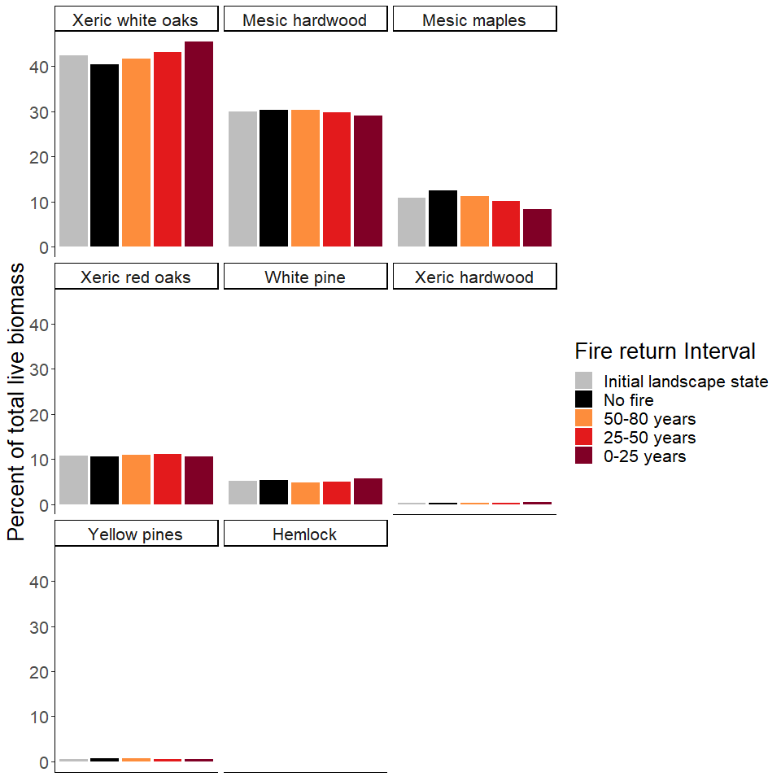<!-- -->
