Scrapple Param 9/21
================
Zjrobbins
09/2021

This is a program to parameter and test a SCRPPLE Fire model for the
Southern Appalachains\_

Based on and borrowing the code structures of the Scrapple proof of
concept designed by: Alec Kretchun, 2017

#### Ignitions

The purpose of this section is to paramaterized the function for
ignitions based on fire weather index. To do this we look the historical
record of ignitions and pair it with fire weather index. We then will
conduct a zero inflated poission model fit to this data. Lastly we
examine how well this model fits the record.

``` r
library(raster)
```

    ## Loading required package: sp

``` r
library(foreign)
library(plyr)
#library(likelihood)
library(dplyr)
```

    ## 
    ## Attaching package: 'dplyr'

    ## The following objects are masked from 'package:plyr':
    ## 
    ##     arrange, count, desc, failwith, id, mutate, rename, summarise,
    ##     summarize

    ## The following objects are masked from 'package:raster':
    ## 
    ##     intersect, select, union

    ## The following objects are masked from 'package:stats':
    ## 
    ##     filter, lag

    ## The following objects are masked from 'package:base':
    ## 
    ##     intersect, setdiff, setequal, union

``` r
library(pscl)
```

    ## Warning: package 'pscl' was built under R version 4.1.1

    ## Classes and Methods for R developed in the
    ## Political Science Computational Laboratory
    ## Department of Political Science
    ## Stanford University
    ## Simon Jackman
    ## hurdle and zeroinfl functions by Achim Zeileis

``` r
library(boot)
library(rgdal)
```

    ## rgdal: version: 1.5-23, (SVN revision 1121)
    ## Geospatial Data Abstraction Library extensions to R successfully loaded
    ## Loaded GDAL runtime: GDAL 3.2.1, released 2020/12/29
    ## Path to GDAL shared files: C:/Users/zjrobbin/Documents/R/win-library/4.1/rgdal/gdal
    ## GDAL binary built with GEOS: TRUE 
    ## Loaded PROJ runtime: Rel. 7.2.1, January 1st, 2021, [PJ_VERSION: 721]
    ## Path to PROJ shared files: C:/Users/zjrobbin/Documents/R/win-library/4.1/rgdal/proj
    ## PROJ CDN enabled: FALSE
    ## Linking to sp version:1.4-5
    ## To mute warnings of possible GDAL/OSR exportToProj4() degradation,
    ## use options("rgdal_show_exportToProj4_warnings"="none") before loading rgdal.
    ## Overwritten PROJ_LIB was C:/Users/zjrobbin/Documents/R/win-library/4.1/rgdal/proj

``` r
library(reticulate)
#plot(wind_map)
```

First start with the ignitions data.

Short, Karen C. 2017. Spatial wildfire occurrence data for the United
States, 1992-2015 \[FPA_FOD_20170508\]. 4th Edition. Fort Collins, CO:
Forest Service Research Data Archive.
<https://doi.org/10.2737/RDS-2013-0009.4>
<https://www.fs.usda.gov/rds/archive/Product/RDS-2013-0009.4/>

Abstract:This data publication contains a spatial database of wildfires
that occurred in the United States from 1992 to 2015. It is the third
update of a publication originally generated to support the national
Fire Program Analysis (FPA) system. The wildfire records were acquired
from the reporting systems of federal, state, and local fire
organizations. The following core data elements were required for
records to be included in this data publication: discovery date, final
fire size, and a point location at least as precise as Public Land
Survey System (PLSS) section (1-square mile grid). The data were
transformed to conform, when possible, to the data standards of the
National Wildfire Coordinating Group (NWCG). Basic error-checking was
performed and redundant records were identified and removed, to the
degree possible. The resulting product, referred to as the Fire Program
Analysis fire-occurrence database (FPA FOD), includes 1.88 million
geo-referenced wildfire records, representing a total of 140 million
acres burned during the 24-year period.

[meta](https://www.fs.usda.gov/rds/archive/products/RDS-2013-0009.4/_metadata_RDS-2013-0009.4.html)

These data is spatially located then divided into lightning ignitions
and accidental human ignited values.

127\<- we are filtering out fires smaller than 250x250 which would be
\~15.4 acres.

``` r
l_fire_dat <- read.csv(paste(w_dir,"Natural_KS21.csv", sep=""))
head(l_fire_dat)
```

    ##   FOD_ID     FPA_ID SOURCE_SYSTEM_TYPE SOURCE_SYSTEM NWCG_REPORTING_AGENCY
    ## 1   5986 FS-1430181                FED   FS-FIRESTAT                    FS
    ## 2   7339 FS-1432907                FED   FS-FIRESTAT                    FS
    ## 3   7404 FS-1433029                FED   FS-FIRESTAT                    FS
    ## 4   7454 FS-1433136                FED   FS-FIRESTAT                    FS
    ## 5   7762 FS-1433711                FED   FS-FIRESTAT                    FS
    ## 6   7817 FS-1433808                FED   FS-FIRESTAT                    FS
    ##   NWCG_REPORTING_UNIT_ID             NWCG_REPORTING_UNIT_NAME
    ## 1                USNCNCF   National Forests in North Carolina
    ## 2                USNCNCF   National Forests in North Carolina
    ## 3                USGACHF Chattahoochee-Oconee National Forest
    ## 4                USGACHF Chattahoochee-Oconee National Forest
    ## 5                USNCNCF   National Forests in North Carolina
    ## 6                USGACHF Chattahoochee-Oconee National Forest
    ##   SOURCE_REPORTING_UNIT           SOURCE_REPORTING_UNIT_NAME
    ## 1                   811   National Forests in North Carolina
    ## 2                   811   National Forests in North Carolina
    ## 3                   803 Chattahoochee-Oconee National Forest
    ## 4                   803 Chattahoochee-Oconee National Forest
    ## 5                   811   National Forests in North Carolina
    ## 6                   803 Chattahoochee-Oconee National Forest
    ##   LOCAL_FIRE_REPORT_ID LOCAL_INCIDENT_ID FIRE_CODE        FIRE_NAME
    ## 1                   50              <NA>      B0EQ      PADDY CREEK
    ## 2                   56                10      CFB2     HORSE BRANCH
    ## 3                   28                 4      B6VQ      MAUNEY MTN.
    ## 4                   43                 5      B6VQ     LAUREL RIDGE
    ## 5                   86                 5      CJ3A       GIBBS PEAK
    ## 6                   47                 7      B6VQ TABLE PINE RIDGE
    ##   ICS_209_PLUS_INCIDENT_JOIN_ID ICS_209_PLUS_COMPLEX_JOIN_ID MTBS_ID
    ## 1                          <NA>                           NA    <NA>
    ## 2                          <NA>                           NA    <NA>
    ## 3                          <NA>                           NA    <NA>
    ## 4                          <NA>                           NA    <NA>
    ## 5                          <NA>                           NA    <NA>
    ## 6                          <NA>                           NA    <NA>
    ##   MTBS_FIRE_NAME COMPLEX_NAME FIRE_YEAR  DISCOVERY_DATE DISCOVERY_DOY
    ## 1           <NA>         <NA>      2005 7/13/2005 20:00           195
    ## 2           <NA>         <NA>      2006  4/2/2006 20:00            93
    ## 3           <NA>         <NA>      2006  4/8/2006 20:00            99
    ## 4           <NA>         <NA>      2006  4/9/2006 20:00           100
    ## 5           <NA>         <NA>      2006 4/27/2006 20:00           118
    ## 6           <NA>         <NA>      2006 5/22/2006 20:00           143
    ##   DISCOVERY_TIME NWCG_CAUSE_CLASSIFICATION NWCG_GENERAL_CAUSE
    ## 1           1200                   Natural            Natural
    ## 2           1545                   Natural            Natural
    ## 3           1525                   Natural            Natural
    ## 4           1507                   Natural            Natural
    ## 5           1230                   Natural            Natural
    ## 6           1300                   Natural            Natural
    ##   NWCG_CAUSE_AGE_CATEGORY       CONT_DATE CONT_DOY CONT_TIME FIRE_SIZE
    ## 1                      NA 7/13/2005 20:00      195      1330      0.10
    ## 2                      NA  4/2/2006 20:00       93      1800      1.00
    ## 3                      NA  4/8/2006 20:00       99      1830     22.40
    ## 4                      NA  4/9/2006 20:00      100      1700      0.58
    ## 5                      NA 4/27/2006 20:00      118      1600      1.00
    ## 6                      NA 5/22/2006 20:00      143      1845      1.30
    ##   FIRE_SIZE_CLASS LATITUDE LONGITUDE           OWNER_DESCR STATE COUNTY
    ## 1               A 35.78167 -81.92917      STATE OR PRIVATE    NC     23
    ## 2               B 35.36111 -83.60972                  USFS    NC     75
    ## 3               C 34.90833 -84.46306                  USFS    GA    291
    ## 4               B 34.83028 -83.97056 MISSING/NOT SPECIFIED    GA    291
    ## 5               B 35.73639 -82.28694                  USFS    NC    199
    ## 6               B 34.66000 -83.38250                  USFS    GA    137
    ##   FIPS_CODE        FIPS_NAME             US_L4NAME Shape_Leng Shape_Area
    ## 1     37023     Burke County Amphibolite Mountains   116133.6  338328649
    ## 2     37075    Graham County Amphibolite Mountains   116133.6  338328649
    ## 3     13291     Union County Amphibolite Mountains   116133.6  338328649
    ## 4     13291     Union County Amphibolite Mountains   116133.6  338328649
    ## 5     37199    Yancey County Amphibolite Mountains   116133.6  338328649
    ## 6     13137 Habersham County Amphibolite Mountains   116133.6  338328649
    ##   Hectares              Shape                  X
    ## 1  33832.9  c(416025.01933308  3960130.68510779)
    ## 2  33832.9 c(262882.181530172  3916216.59681353)
    ## 3  33832.9 c(183571.450558101  3868354.02642606)
    ## 4  33832.9 c(228330.732248442  3858246.20844729)
    ## 5  33832.9 c(383622.833336587  3955474.20732127)
    ## 6  33832.9 c(281675.087300242  3837921.79005626)

``` r
l_fire_dat<-l_fire_dat%>%
  subset(FIRE_SIZE>15.44)
##This moves us from 676 to 155

l_fire_days <- as.data.frame(cbind(l_fire_dat$FIRE_YEAR, l_fire_dat$DISCOVERY_DOY)) #Extracting year and julian day
colnames(l_fire_days) <- c("YEAR", "DISCOVERY_DOY")
l_fire_days_sort <- l_fire_days[order(l_fire_days[,1]),] #sorting by year
```

Here we can see the number of lightning ignited firest per year

``` r
library(RColorBrewer)

red<-RColorBrewer::brewer.pal(9,'YlOrRd')
#plot no of fires/yr
l_fire_days_sort_count<- cbind(l_fire_days_sort, rep(1, nrow(l_fire_days_sort)))
l_fires_count <- cbind.data.frame(unique(l_fire_days_sort_count$YEAR) , 
                                 tapply(l_fire_days_sort_count$`rep(1, nrow(l_fire_days_sort))`,l_fire_days_sort_count$YEAR, sum))
colnames(l_fires_count) <- c("YEAR", "COUNT")

barplot(l_fires_count$COUNT, main ="No of ign/yr Lightning Observed",col=red,names.arg=l_fires_count$YEAR)
```

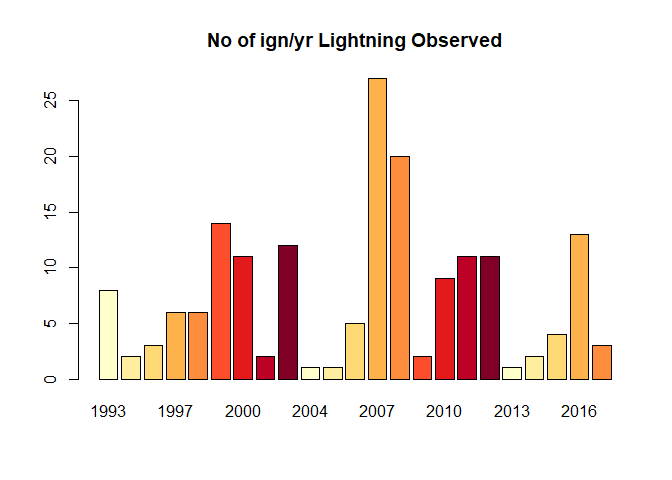<!-- -->

``` r
h_fire_dat <- read.csv(paste(w_dir, "/Human_KS21.csv", sep=""))
h_fire_dat<-h_fire_dat%>%
  subset(FIRE_SIZE>15.44)
##Goes from 24789 to 1531
#head(h.fire.dat)
h_fire_days <- as.data.frame(cbind(h_fire_dat$FIRE_YEAR, h_fire_dat$DISCOVERY_DOY)) #Extracting year and julian day

colnames(h_fire_days) <- c("YEAR", "DISCOVERY_DOY")
h_fire_days_sort <- h_fire_days[order(h_fire_days[,1]),] #sorting by year
#plot no of fires/yr
h_fire_days_sort_count<- cbind(h_fire_days_sort, rep(1, nrow(h_fire_days_sort)))
h_fires_count <- cbind.data.frame(unique(h_fire_days_sort_count$YEAR) , 
                                  tapply(h_fire_days_sort_count$`rep(1, nrow(h_fire_days_sort))`,h_fire_days_sort_count$YEAR, sum))
colnames(h_fires_count) <- c("YEAR", "COUNT")
barplot(h_fires_count$COUNT, main ="No of ign/yr Human Accidental Observed",col=red,names.arg=h_fires_count$YEAR)
```

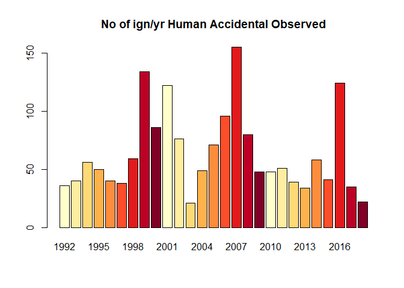<!-- -->

Match them up with FWI data generated from the historic record of
weather fed through LANDIS-II Fire weather to get the models calculation
of FWI.

``` r
ign_types <- c("Lightning", "HumanAccidental")

fire_days_list <- list(l_fire_days_sort, h_fire_days_sort) ##organizing all ignition types into a list


##Import daily historic FWI data
FWI_dat <- read.csv(paste0(w_dir,"Climate-future-input-log_916.csv"))

FWI_dat<-with(FWI_dat,aggregate(FWI,by=list(Year=Year,Timestep=Timestep),FUN=mean))
FWI_dat <- FWI_dat[,c(1,2,3)]
colnames(FWI_dat)[3]<-"FWI"
FWI_day<-with(FWI_dat,aggregate(FWI,by=list(Timestep),FUN=max))


FWI_dat$ID <- paste(FWI_dat$Year, "_", FWI_dat$Timestep, sep="") #creating date identifier out of date and julian day


igns_list <- list()

for (i in 1:length(ign_types[1:2])){#THIS DOESN'T INCLUDE RX BURNS BUT THATS CAUSE WE ARE PROVIDING THOSE TO SCRAPPLE DIRECT
  ign_type_select <- fire_days_list[[i]] ##selecting each ignition type individually
  fire_days_count <- ddply(ign_type_select, .(ign_type_select$YEAR, ign_type_select$DISCOVERY_DOY), nrow) #finds duplicate rows in fire data
  colnames(fire_days_count) <- c("YEAR", "JD", "No_FIRES") #Renaming columns for consistency
  fire_days_count$ID <- paste(fire_days_count$YEAR, "_", fire_days_count$JD, sep="") #creating date identifier out of date and julian day

  ##Merging dataframes by year and julian day
  fire_days_short <- subset(fire_days_count, fire_days_count$YEAR<2017) ##restricting fire records to climate file years
  FWI_short <- subset(FWI_dat, FWI_dat$Year > 1991) #restricting climate data to fire history records
  merge_col <- FWI_short$ID
  FWI_fire_merge <- join(FWI_short, fire_days_short, type="left") ##Merging based on unique date id
  FWI_fire_number <- FWI_fire_merge[,c(1,3,7)] #pulling out FWI and number of fires
  FWI_fire_number[is.na(FWI_fire_number)] <- 0 #converting NAs to 0, meaning 0 fires
  plot(FWI_fire_number[,2], FWI_fire_number[,3], main =ign_types[i], xlab = "dailyFWI", ylab = "noFires") #plotting FWI against no of fires just to look at pattern
  igns_list[[i]] <- FWI_fire_number 
}
```

    ## Joining by: ID
    ## Joining by: ID

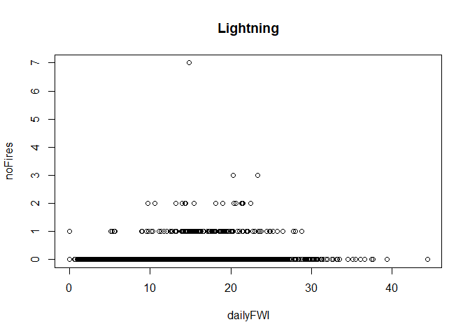<!-- -->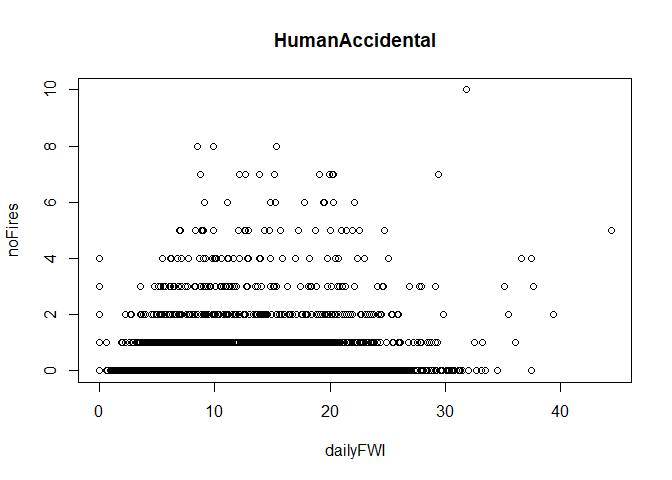<!-- -->

``` r
plot(FWI_day$Group.1,FWI_day$x)
```

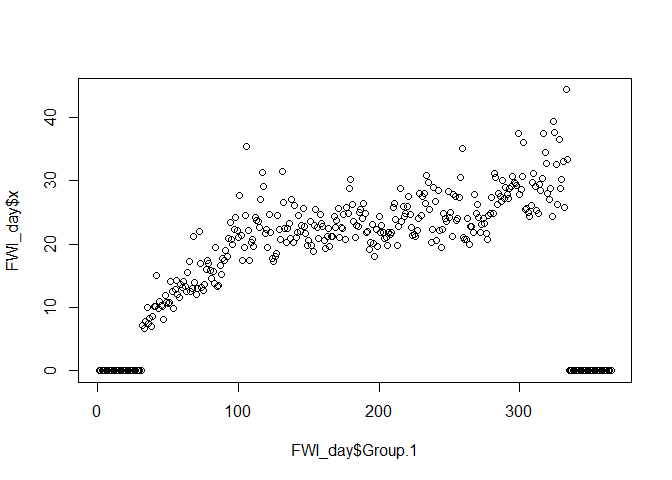<!-- -->

``` r
#Lighting
print("Ignition")
```

    ## [1] "Ignition"

``` r
summary(igns_list[[1]])
```

    ##       Year           FWI            No_FIRES      
    ##  Min.   :1992   Min.   : 0.000   Min.   :0.00000  
    ##  1st Qu.:1998   1st Qu.: 5.688   1st Qu.:0.00000  
    ##  Median :2004   Median :12.124   Median :0.00000  
    ##  Mean   :2004   Mean   :11.075   Mean   :0.01874  
    ##  3rd Qu.:2010   3rd Qu.:16.068   3rd Qu.:0.00000  
    ##  Max.   :2016   Max.   :44.354   Max.   :7.00000

``` r
#Humnan
print("Human")
```

    ## [1] "Human"

``` r
summary(igns_list[[2]])
```

    ##       Year           FWI            No_FIRES     
    ##  Min.   :1992   Min.   : 0.000   Min.   : 0.000  
    ##  1st Qu.:1998   1st Qu.: 5.688   1st Qu.: 0.000  
    ##  Median :2004   Median :12.124   Median : 0.000  
    ##  Mean   :2004   Mean   :11.075   Mean   : 0.181  
    ##  3rd Qu.:2010   3rd Qu.:16.068   3rd Qu.: 0.000  
    ##  Max.   :2016   Max.   :44.354   Max.   :10.000

Fit the lightning model

``` r
Lightning<-as.data.frame(igns_list[[1]])

Lightning<-Lightning[-2758,]
#Lightning$No_FIRES
###Lightning
zeroinf_mod <- zeroinfl(No_FIRES~FWI,data=Lightning, dist="poisson")
summary(zeroinf_mod)
```

    ## 
    ## Call:
    ## zeroinfl(formula = No_FIRES ~ FWI, data = Lightning, dist = "poisson")
    ## 
    ## Pearson residuals:
    ##      Min       1Q   Median       3Q      Max 
    ## -0.26426 -0.14742 -0.10088 -0.04934 21.49612 
    ## 
    ## Count model coefficients (poisson with log link):
    ##             Estimate Std. Error z value Pr(>|z|)  
    ## (Intercept) -0.45334    0.56623  -0.801   0.4233  
    ## FWI         -0.06882    0.02859  -2.407   0.0161 *
    ## 
    ## Zero-inflation model coefficients (binomial with logit link):
    ##             Estimate Std. Error z value Pr(>|z|)    
    ## (Intercept)  6.17411    0.65961   9.360  < 2e-16 ***
    ## FWI         -0.26377    0.04205  -6.273 3.55e-10 ***
    ## ---
    ## Signif. codes:  0 '***' 0.001 '**' 0.01 '*' 0.05 '.' 0.1 ' ' 1 
    ## 
    ## Number of iterations in BFGS optimization: 15 
    ## Log-likelihood: -742.8 on 4 Df

``` r
#Tst<-predict(zeroinf_mod,type="zero")
```

Should be noted there is a lot of variance in the random draw

``` r
zero<-predict(zeroinf_mod,data.frame(FWI=Lightning$FWI), type = "zero")
#print(zero)
#n<-data.frame(FWI=Lightning$FWI)
lambda <- predict(zeroinf_mod,data.frame(FWI=Lightning$FWI), type = "count")
Simulation<-ifelse(rbinom(9124,size = 1, prob = zero) > 0, 0, rpois(9124, lambda = lambda))

ReturnDf<-cbind(Simulation,Lightning)
Sample<-aggregate(ReturnDf$Simulation,by=list(year=ReturnDf$Year),FUN=sum)
barplot(Sample$x, main ="No of ign/yr Lightning Simulated",col='black', ylim=c(0,25),names.arg=Sample$year)
```

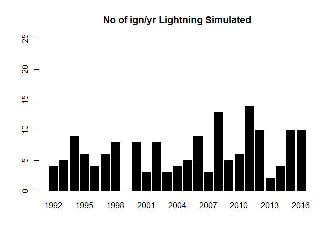<!-- -->

``` r
Simulation_Stack_ZIP<-function(zeros,lambdas,data,nsimulations){
  Samples<-NULL
  for(i in 1:nsimulations){
  Simulation<-ifelse(rbinom(9124,size = 1, prob = zeros) > 0, 0, rpois(9125, lambda = lambdas))
  ReturnDf<-cbind(Simulation,data)
  Sample<-aggregate(ReturnDf$Simulation,by=list(year=ReturnDf[,2]),FUN=sum)
  if(i==1){Samples<-Sample}else{Samples<-cbind(Samples,Sample[,2])}
  }
  return(cbind(Samples[1],rowMeans(Samples[-1])))
}
```

``` r
#Tst<-predict(zeroinf_mod,type="zero")
zero<-predict(zeroinf_mod,data.frame(FWI=seq(0,40,0.1)), type = "zero",xlab="")
#print(zero)
#n<-data.frame(FWI=Lightning$FWI)
lambda <- predict(zeroinf_mod,data.frame(FWI=seq(0,40,0.1)), type = "count")


par(mfrow=c(1,2))
plot(seq(0,40,0.1),zero,xlab="FWI",ylab="(p) of zero ignitions",main="Lightning Ignition and FWI",type="l",lwd="5.0",cex.axis=1.5,cex.lab=1.5,cex.main=1.5)
plot(seq(0,40,0.1),lambda,ylab="Probable count of ignitions",xlab="FWI",type="l",lwd="5.0",cex.axis=1.5,cex.lab=1.5)
```

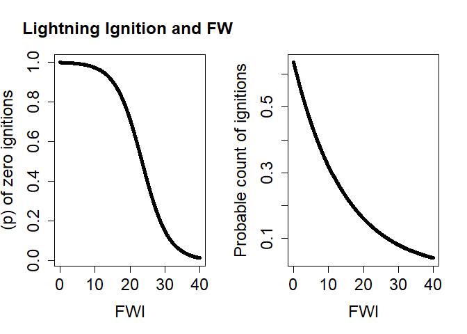<!-- -->

It is a noisy random draw so lets run 1000 and take the mean.

``` r
Sims_Zip<-Simulation_Stack_ZIP(zero,lambda,Lightning,10)
barplot(Sims_Zip$`rowMeans(Samples[-1])`, main ="No of ign/yr Lightning Simulated x1000",col='black', ylim=c(0,20),names.arg=Sample$year)
```

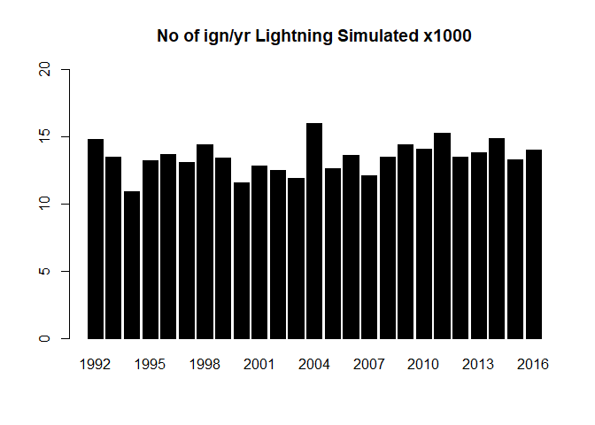<!-- -->

We see here that in a set of runs the random draw accounts for a greater
influence than the predictor.

And here is the historic,

``` r
barplot(l_fires_count$COUNT, main ="No of ign/yr Lightning Observed",col=red,ylim=c(0,50),names.arg=l_fires_count$YEAR)
```

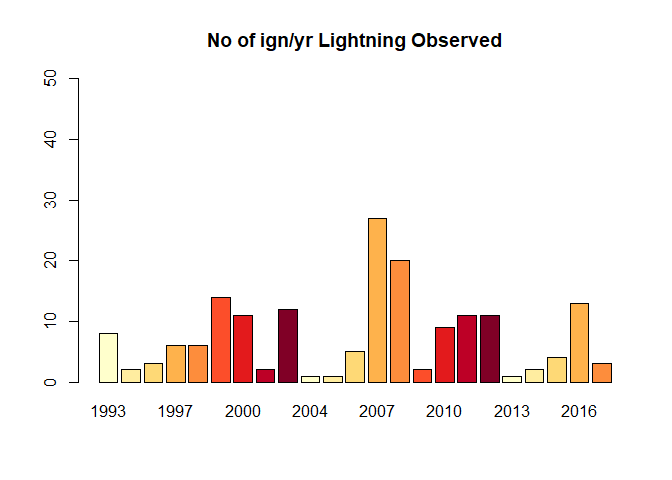<!-- -->

``` r
#https://fukamilab.github.io/BIO202/04-C-zero-data.html
#Dispersion statistic
E2 <- resid(zeroinf_mod, type = "pearson")
N  <- nrow(Lightning)
p  <- length(coef(zeroinf_mod))  
sum(E2^2) / (N - p)
```

    ## [1] 0.8212613

``` r
Model<-glm(No_FIRES~FWI,data=Lightning, family="poisson")
summary(Model)
```

    ## 
    ## Call:
    ## glm(formula = No_FIRES ~ FWI, family = "poisson", data = Lightning)
    ## 
    ## Deviance Residuals: 
    ##     Min       1Q   Median       3Q      Max  
    ## -1.2658  -0.2123  -0.1654  -0.1075   4.4847  
    ## 
    ## Coefficients:
    ##             Estimate Std. Error z value Pr(>|z|)    
    ## (Intercept) -5.78825    0.20478  -28.27   <2e-16 ***
    ## FWI          0.12550    0.01107   11.34   <2e-16 ***
    ## ---
    ## Signif. codes:  0 '***' 0.001 '**' 0.01 '*' 0.05 '.' 0.1 ' ' 1
    ## 
    ## (Dispersion parameter for poisson family taken to be 1)
    ## 
    ##     Null deviance: 1372.9  on 9123  degrees of freedom
    ## Residual deviance: 1249.5  on 9122  degrees of freedom
    ## AIC: 1554.7
    ## 
    ## Number of Fisher Scoring iterations: 7

The Poisson Looks good too.

``` r
Pois<-glm(No_FIRES~FWI,data=Lightning, family="poisson")

print("Scores for candidate Accidental Ignition Models")
```

    ## [1] "Scores for candidate Accidental Ignition Models"

``` r
print(data.frame(Model=c("ZIP","Pois"),Score=c(AIC(zeroinf_mod),AIC(Pois))))
```

    ##   Model    Score
    ## 1   ZIP 1493.664
    ## 2  Pois 1554.654

``` r
TotalIG<-sum(l_fires_count$COUNT)
Total_Sim_IG<-sum(Sample$x)


Mean_IG<-mean(l_fires_count$COUNT)
Mean_IG_Sim<-mean(Sample$x)
Var_IG<-var(l_fires_count$COUNT)
Var_IG_Sim<-var(Sample$x)
boxplot(Sample$x,l_fires_count$COUNT,names.arg=c("Simulated","Observed"))
```

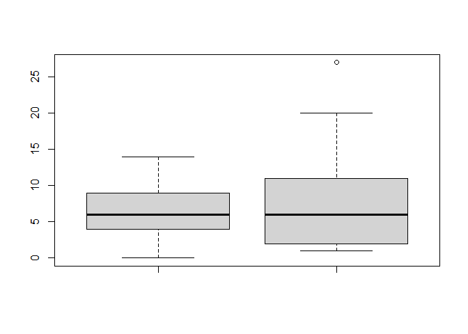<!-- -->

### Fit the human accidental model

``` r
Accidental<-as.data.frame(igns_list[[2]])

###Lightning
Acc_zeroinf_mod <- zeroinfl(No_FIRES~FWI,data=Accidental, dist="poisson")
summary(Acc_zeroinf_mod)
```

    ## 
    ## Call:
    ## zeroinfl(formula = No_FIRES ~ FWI, data = Accidental, dist = "poisson")
    ## 
    ## Pearson residuals:
    ##     Min      1Q  Median      3Q     Max 
    ## -0.3618 -0.3106 -0.2999 -0.2716 14.0279 
    ## 
    ## Count model coefficients (poisson with log link):
    ##              Estimate Std. Error z value Pr(>|z|)    
    ## (Intercept) -0.167024   0.068607  -2.434   0.0149 *  
    ## FWI          0.027328   0.004199   6.508 7.61e-11 ***
    ## 
    ## Zero-inflation model coefficients (binomial with logit link):
    ##              Estimate Std. Error z value Pr(>|z|)    
    ## (Intercept)  1.735716   0.085814  20.227   <2e-16 ***
    ## FWI         -0.003042   0.005826  -0.522    0.601    
    ## ---
    ## Signif. codes:  0 '***' 0.001 '**' 0.01 '*' 0.05 '.' 0.1 ' ' 1 
    ## 
    ## Number of iterations in BFGS optimization: 9 
    ## Log-likelihood: -4248 on 4 Df

Accidental

Likelihood of an ignition day:

Should be noted this bar plot is a random simulation

``` r
#Tst<-predict(zeroinf_mod,type="zero")
zero<-predict(Acc_zeroinf_mod,data.frame(FWI=seq(0,40,0.1)), type = "zero")
#print(zero)
#n<-data.frame(FWI=Lightning$FWI)
lambda <- predict(Acc_zeroinf_mod,data.frame(FWI=seq(0,40,0.1)), type = "count")

par(mfrow=c(1,2))
plot(seq(0,40,0.1),zero,ylim=c(0,1),xlab="FWI",ylab="(p) of zero ignitions",main="Accidental Ignition and FWI",type="l",lwd="5.0",cex.axis=1.5,cex.lab=1.5,cex.main=1.5)
plot(seq(0,40,0.1),lambda,ylab="Probable count of ignitions",xlab="FWI",type="l",lwd="5.0",cex.axis=1.5,cex.lab=1.5)
```

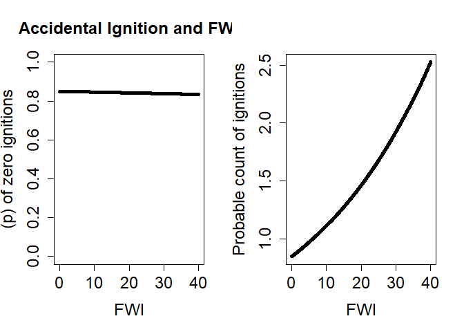<!-- -->

``` r
Simulation<-ifelse(rbinom(9124,size = 1, prob = zero) > 0, 0, rpois(9124, lambda = lambda))

ReturnDf<-cbind(Simulation,Lightning)
Sample<-aggregate(ReturnDf$Simulation,by=list(year=ReturnDf$Year),FUN=sum)


barplot(Sample$x, main ="No of ign/yr Accidental_Simulated",col='black', ylim=c(0,150),names.arg=Sample$year)
```

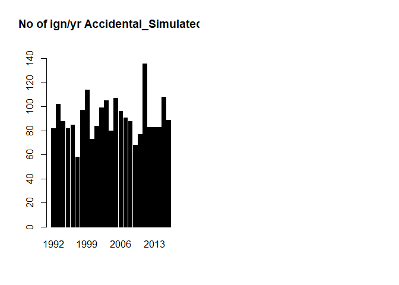<!-- -->

``` r
barplot(h_fires_count$COUNT, main ="No of ign/yr Human Accidental Observed",col=red,ylim=c(0,140))
```

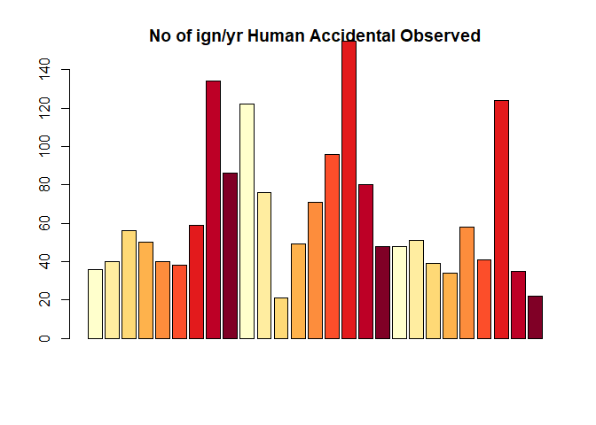<!-- -->

``` r
E2 <- resid(Acc_zeroinf_mod, type = "pearson")
N  <- nrow(Accidental)
p  <- length(coef(Acc_zeroinf_mod))  
sum(E2^2) / (N - p)
```

    ## [1] 1.182733

Summary Statistics

``` r
TotalIG<-sum(h_fires_count$COUNT)
Total_Sim_IG<-sum(Sample$x)


Mean_IG<-mean(h_fires_count$COUNT)
Mean_IG_Sim<-mean(Sample$x)
Var_IG<-var(h_fires_count$COUNT)
Var_IG_Sim<-var(Sample$x)
boxplot(Sample$x,h_fires_count$COUNT,names.arg=c("Simulated","Observed"))
```

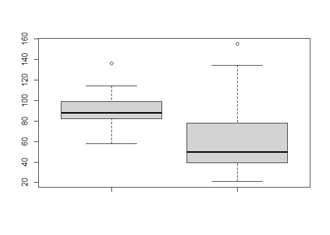<!-- -->

Left is simulated, Right is Observed

``` r
print(data.frame(Names=c("Simulation","Observed"),Total=c(Total_Sim_IG,TotalIG),Mean=c(Mean_IG_Sim,Mean_IG),
                 Var=c(Var_IG_Sim,Var_IG)))
```

    ##        Names Total    Mean       Var
    ## 1 Simulation  2258 90.3200  260.3933
    ## 2   Observed  1709 63.2963 1247.5242

#### Fire Spread Parameters.

``` r
##Alec Kretchun, 2017
library(geosphere)
```

    ## Warning: package 'geosphere' was built under R version 4.1.1

``` r
library(maptools)
```

    ## Checking rgeos availability: TRUE

``` r
library(raster)
library(dplyr)
library(rgdal)
library(rgeos)
```

    ## Warning: package 'rgeos' was built under R version 4.1.1

    ## rgeos version: 0.5-8, (SVN revision 679)
    ##  GEOS runtime version: 3.9.1-CAPI-1.14.2 
    ##  Please note that rgeos will be retired by the end of 2023,
    ## plan transition to sf functions using GEOS at your earliest convenience.
    ##  GEOS using OverlayNG
    ##  Linking to sp version: 1.4-5 
    ##  Polygon checking: TRUE

``` r
library(geosphere)
library(nplr)
```

    ## Warning: package 'nplr' was built under R version 4.1.1

    ## 
    ## Attaching package: 'nplr'

    ## The following object is masked from 'package:raster':
    ## 
    ##     overlay

``` r
library(pscl)
library(ROCR)
```

    ## Warning: package 'ROCR' was built under R version 4.1.1

``` r
library(likelihood)
```

    ## Warning: package 'likelihood' was built under R version 4.1.1

    ## Loading required package: nlme

    ## 
    ## Attaching package: 'nlme'

    ## The following object is masked from 'package:dplyr':
    ## 
    ##     collapse

    ## The following object is masked from 'package:raster':
    ## 
    ##     getData

``` r
library(hexbin)
library(RColorBrewer)
##Read things
```

Ecoregions: This is the ecoregions from LANDIS_II to link weather to
location.

``` r
w_dir <- "Z:/Robbins/Sapps/Chapter3/Code/Scrpple_111721/Inputs/"

fwi_dat <- read.csv(paste0(w_dir,"Climate-future-input-log_916.csv"),stringsAsFactors = FALSE)
wind_map<- raster::raster(paste(w_dir,"11_Ecoregions.tif",sep=""))
```

    ## Warning in showSRID(SRS_string, format = "PROJ", multiline = "NO", prefer_proj =
    ## prefer_proj): Discarded datum unknown in Proj4 definition

``` r
plot(wind_map)
```

<!-- -->

``` r
unique(wind_map$X11_Ecoregions)
```

    ##  [1]  1  2  3  4  5  6  7  8  9 10 11

Here we are looking to fit a zero inflated poisson equation looking at
how fire size (or probability of spread) is related to the FWI, wind,
and fuels. We wil do a similar process as above, of matching each fire
event to a database on weather, wind and the fuels.

Wind data This is Grit metdata fro the University of Idaho
<http://www.climatologylab.org/gridmet.html> From their website.

WHAT IS GRIDMET? gridMET is a dataset of daily high-spatial resolution
(\~4-km, 1/24th degree) surface meteorological data covering the
contiguous US from 1979-yesterday. We have also extended these data to
cover southern British Columbia in our real time products. These data
can provide important inputs for ecological, agricultural, and
hydrological models. These data are updated daily. gridMET is the
preferred naming convention for these data; however, the data are also
known as cited as METDATA.

<http://www.climatologylab.org/gridmet.html>

[meta](https://cida.usgs.gov/thredds/dodsC/UofIMETDATA.html)

``` r
wsv_dat <- read.csv(paste(w_dir,"Wind_Gridmet.csv",sep=""),stringsAsFactors = FALSE)
#wsv_dat<-wsv_dat[,c(-1)]
```

Fuels:

Cropped to the landscape.

``` r
###Fixing landis GDAL problem

ExampleRaster<-raster(paste(w_dir,"11_Ecoregions.tif",sep=""))
```

    ## Warning in showSRID(SRS_string, format = "PROJ", multiline = "NO", prefer_proj =
    ## prefer_proj): Discarded datum unknown in Proj4 definition

``` r
projy<-crs(ExampleRaster)


#raster of fuel types from LANDFIRE

#fccs_raster <- raster(paste(w_dir,"Crop_Fuel.tif",sep="")) #raster of 2001 fuel beds
###Secondfule<-
fccs_raster<-raster(paste(w_dir,"LANDIS_fuels_spinup.IMG",sep=""))
plot(fccs_raster)
```

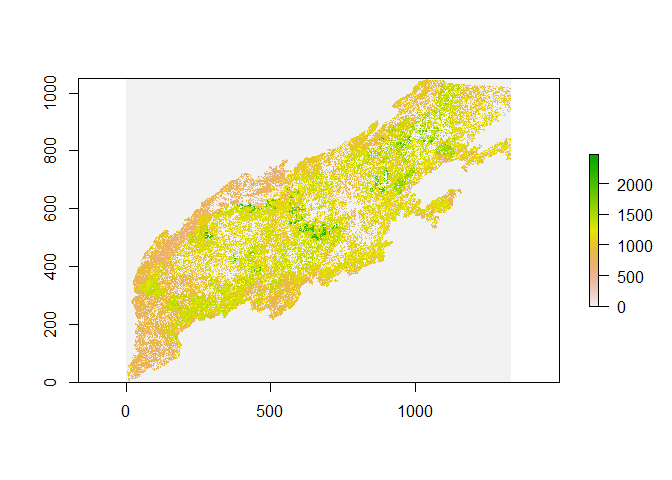<!-- -->

``` r
crs(fccs_raster)<-projy
extent(fccs_raster)<-extent(ExampleRaster)
plot(fccs_raster)
```

<!-- -->

``` r
fccs_raster
```

    ## class      : RasterLayer 
    ## dimensions : 1050, 1334, 1400700  (nrow, ncol, ncell)
    ## resolution : 260.1117, 260.1117  (x, y)
    ## extent     : 153228.8, 500217.8, 3779459, 4052577  (xmin, xmax, ymin, ymax)
    ## crs        : +proj=utm +zone=17 +ellps=GRS80 +units=m +no_defs 
    ## source     : LANDIS_fuels_spinup.IMG 
    ## names      : LANDIS_fuels_spinup

``` r
##
```

``` r
#Fuel bed LUT
#fccs_defs <- read.csv(paste(w_dir, "us_110flm_12202013.csv",sep="")) #definitions of fuelbed types

fuel_map <- projectRaster(fccs_raster, to = wind_map, method='bilinear') #I chose nearest neighbor for the fuels maps cause its a categorical variable
#Resample to fill in zeros
### Manual cardinal stretching


r=fccs_raster
r[r==0] <- NA

fill.na <- function(x, i=5) {
  if( is.na(x)[i] ) {
    return( round(mean(x, na.rm=TRUE),0) )
  } else {
    return( round(x[i],0) )
  }
}  

r2 <- focal(r, w = matrix(1,3,3), fun = fill.na, 
            pad = TRUE, na.rm = FALSE )
plot(r2)
r3<-focal(r2, w = matrix(1,3,3), fun = fill.na, 
            pad = TRUE, na.rm = FALSE )

plot(r3)

r4<-focal(r3, w = matrix(1,3,3), fun = fill.na, 
            pad = TRUE, na.rm = FALSE )

plot(r4)
fuel_map<-r4

plot(fuel_map)

writeRaster(fuel_map,paste0(w_dir,"InterpolatedFuels.tif"))
```

Azimuth and Slope Maps:

True wind spread is relative to the the slope and aspect. To capture
that a zimuth and slope need to be usped as well

``` r
fuel_map<-raster(paste0(w_dir,"InterpolatedFuels.tif"))
```

    ## Warning in showSRID(SRS_string, format = "PROJ", multiline = "NO", prefer_proj
    ## = prefer_proj): Discarded datum Unknown_based_on_GRS80_ellipsoid in Proj4
    ## definition

``` r
slope_azi_map <- raster(paste(w_dir,"SAPPS_aspect_inverted_atModelRes.tif",sep=""))
```

    ## Warning in showSRID(SRS_string, format = "PROJ", multiline = "NO", prefer_proj =
    ## prefer_proj): Discarded datum unknown in Proj4 definition

``` r
uphill_azi_map <- projectRaster(slope_azi_map, to = fuel_map, method='bilinear')
wdir_dat <- read.csv(paste(w_dir,"Winddir.csv",sep=""),stringsAsFactors = FALSE)
colnames(wdir_dat) <- c("date", "eco1", 'eco2', 'eco3', 'eco4','eco5','eco6','eco8','eco9','eco10','eco11')

SNslope_map <-  raster(paste(w_dir,"SAPPS_Slope_ChrisArcmapprocess_modelres.tif",sep=""))
```

    ## Warning in showSRID(SRS_string, format = "PROJ", multiline = "NO", prefer_proj =
    ## prefer_proj): Discarded datum unknown in Proj4 definition

``` r
#slope_map <- projectRaster(SNslope_map, to = fuel_map, method='bilinear')
```

``` r
wind_map <- projectRaster(wind_map, to = fuel_map, method='ngb')
##Stacking all rasters as a test
climate_stack <- stack(wind_map, fuel_map, uphill_azi_map, slope_azi_map)
plot(climate_stack)
```

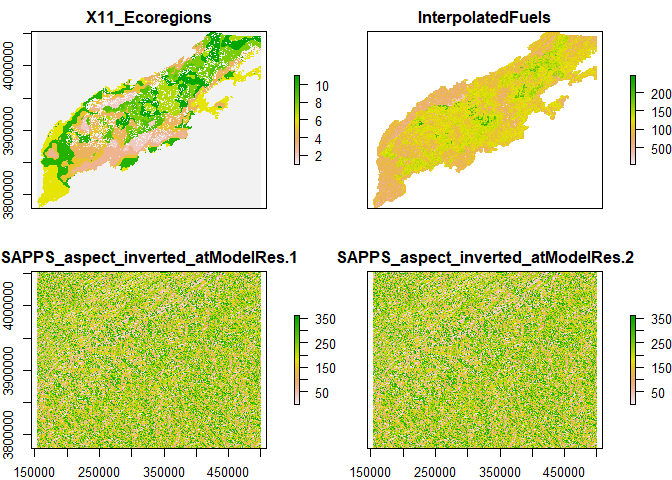<!-- -->

Now we will clean up the variable stack

``` r
################## PROCESSING EXTERNAL DATA SETS TO USE WITH EPA REGION AND CONSUME LOOK UP TABLES #####################
### THIS IS WHERE I TAKE CATEGORICAL VARIABLES FROM INPUT RASTERS AND SET UP LOOKUPS FOR REAL VALUES OF WIND SPEED, FUEL BIOMASS ETC ######

##Process FWI values produced by LANDIS climate library to prep for attaching to larger spread matrix
##Need to attach ecoregion info
fwi_dat_slim <- fwi_dat[,c(1,2,3,27)]
colnames(fwi_dat)
```

    ##  [1] "Year"                 "Timestep"             "EcoregionName"       
    ##  [4] "EcoregionIndex"       "ppt"                  "min_airtemp"         
    ##  [7] "max_airtemp"          "std_ppt"              "std_temp"            
    ## [10] "winddirection"        "windspeed"            "ndeposition"         
    ## [13] "co2"                  "relativehumidity"     "min_relativehumidity"
    ## [16] "max_relativehumidity" "specifichumidty"      "pet"                 
    ## [19] "par"                  "ozone"                "shortwave"           
    ## [22] "temperature"          "DuffMoistureCode"     "DroughtCode"         
    ## [25] "BuildUpIndex"         "FineFuelMoistureCode" "FWI"                 
    ## [28] "X"

``` r
fwi_date_info <- with(fwi_dat_slim, paste(Year, Timestep))
fwi_dates <- strptime(fwi_date_info, "%Y %j") #COnverting from julian day to y-m-d
#unique(fwi_date_dat$EcoregionName)
fwi_date_dat <- cbind(as.POSIXct(fwi_dates), fwi_dat_slim[,3:4]) #attaching 
colnames(fwi_date_dat) <- c("Date", "Ecoregion", "FWI")
fwi_date_dat$Ecoregion<-gsub("eco","",fwi_date_dat$Ecoregion)
fwi_date_dat$Ecoregion<-as.numeric(as.character(fwi_date_dat$Ecoregion))
##Attach LANDFIRE fuel loading info based on fuel type number
##I selected columns I thought would define fine fuels, but these can change if we need. Units are tons/acre
#fccs_loading <- fccs_defs[,c("Value", "Litter","Duff")] ##removed "shrubs_primary_loading", "shrubs_secondary_loading",
#fccs_loading_total <- rowSums(fccs_loading[,c(2,3)])
#fccs_loading_total <- fccs_loading_total #* 224.17 #convert from tons/acre to g/m-2


#fccs_finefuels <- cbind(fccs_loading[,1], fccs_loading_total)
#colnames(fccs_finefuels) <- c("fueltype", "finefuels_loading")

##Linking up successful spread days with actual wind speed 

colnames(wsv_dat) <- c("date", "eco1", 'eco2', 'eco3', 'eco4','eco5','eco6','eco8','eco9','eco10','eco11')
```

Geomac Files Boundary Files:

GeoMAC is an internet based mapping application which allows the public
to access online maps of current fire locations and perimeters using
standard web browsers.

Please select from the menu on the top to get help on the application
and information on the individual map layers. The data in the viewer is
displayed in the Web Mercator (Auxiliary Sphere) projection (WGS84
datum).

If additional assistance is needed please email <geomac@usgs.gov>.

<https://www.geomac.gov/viewer/viewer.shtml>

<https://rmgsc.cr.usgs.gov/outgoing/GeoMAC/historic_fire_data/>

These shape files provide daily boundaries for fires. These have been
isolated to the study area.

``` r
##Empty objects and column names and stuff used in loops
newfire<-readOGR(paste(w_dir,"fire_geomac_loc.shp",sep=""))
```

    ## OGR data source with driver: ESRI Shapefile 
    ## Source: "Z:\Robbins\Sapps\Chapter3\Code\Scrpple_111721\Inputs\fire_geomac_loc.shp", layer: "fire_geomac_loc"
    ## with 591 features
    ## It has 64 fields
    ## Integer64 fields read as strings:  OBJECTID fireyear

``` r
## Putting into sets based on differnces in meta-data (columns not matched)
newfire1<-newfire[newfire$incidentna!=0,]
newfire2<-newfire[newfire$incidentna==0,]
newfire_df<-data.frame(newfire)
perimeter_map<-newfire
### Here we are cleaning the data
perimeter_map$TrueDate<-as.Date(perimeter_map$perimeterd)
perimeter_map$TrueDate[is.na(perimeter_map$TrueDate)]<-as.Date(perimeter_map$date_[is.na(perimeter_map$TrueDate)])
### Subseting to our time period of climate coverage (< 2017)
perimeter_map<-perimeter_map[perimeter_map$TrueDate<"2017-01-01",]
perimeter_map$incidentna[perimeter_map$incidentna=='0']<-perimeter_map$fire_name[perimeter_map$incidentna=='0']
perimeter_map$incidentna[perimeter_map$incidentna==0]<-perimeter_map$fire_name[perimeter_map$incidentna==0]
DFP<-as.data.frame(perimeter_map)
fire_names<-as.character(perimeter_map$incidentna)
## Here we plot the shapefiles to see that they overlap
###Climate regions
plot(ExampleRaster)
plot(newfire,add=TRUE)
```

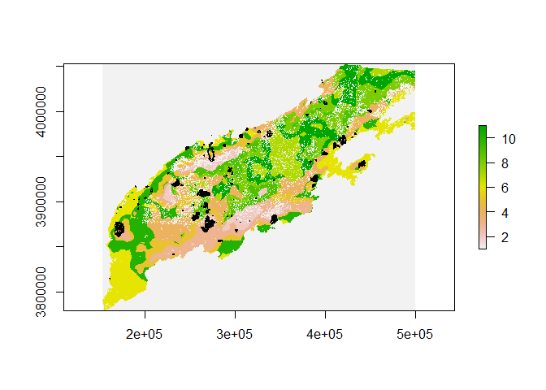<!-- -->

``` r
plot(fuel_map)
plot(newfire,add=TRUE)
```

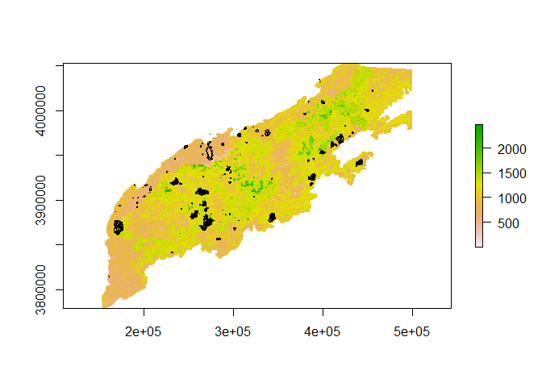<!-- -->

### Visually filtering fires.

Looking for fires, that are not just the final burn shape.

``` r
#Setting up names of fire perimeter shapefiles
years <- 1992:2018
```

``` r
 #  library(raster)
 #  climate_day_mat <- NULL
 # # One_fire <- newfire[newfire$incidentna,] #This pulls out all fire names
 #  
 #  ##Select for fires that lasted more than 1 day
 #  fire_names_manydays <- unique(fire_names[duplicated(fire_names)])
 #  fire_names_manydays <- fire_names_manydays[!is.na(fire_names_manydays)] ##Remo
 #  for (i in 1:length(fire_names_manydays)){
 #    
 #    #fire_select <- perimeter_map[perimeter_map$fire_name == fire_names_manydays[i],] #selecting an individual fire_ doesn't work 7/7 #
 #    #print(fire_names_manydays[i])
 #    fire_select <- subset(perimeter_map, perimeter_map$incidentna ==fire_names_manydays[i])#selecting an individual fire
 #    fire_days <- as.character(sort(unique(fire_select$perimeterd)))
 #  
 #   #print(max)
 #   #print(max[4]) 
 #   #if(is.na(fire_days)){fire_days<-as.character(sort(unique(fire_select$date_)))}
 #    #sorting fire days into chronological order
 #   # print(fire_days)
 #    ##Add a short escape in case fire days <= 1
 #    if(length(fire_days) < 2) next
 #    par(mfrow=c(3,3))
 #    for(j in 1:(length(fire_days))){
 #    max<-raster::bbox( subset(fire_select, fire_select$perimeterd == max(fire_days)))
 #    fire_day_select <- subset(fire_select, fire_select$perimeterd == fire_days[j])
 #    plot(fire_day_select,axes=T,main=paste0(fire_day_select$incidentna,"   Day number ",j),xlim=c(max[1],max[3]),ylim=c(max[2],max[4]))
 #    #selecting the first fire perim from that date, in case there are multiples
 #    }
   # }
```

Class A (“BOTELER”,“Halls Top”,“SILVER MINE”,‘Chestnut Knob’,“Rough
Ridge”,“DICK’S CREEK”,‘CLIFFSIDE’,‘Rattlesnake Hollow’,‘MAPLE
SPRINGS’,‘Rock Mountain’,“OLD ROUGHY”, “KNOB”,“QUARRY CREEK”,“DOBSON
3”,“CLEAR CREEK”,“TELLICO”,“TIMBER RIDGE”,“East Miller Cove”,“FEREBEE
MEMORIAL”,“HORTON”,“CAMP BRANCH”,“DOBSON KNOB”) Class B (“PARTY
ROCK”,“Pinnacle Mountain”, “COBBLY NOB”,)

``` r
SoundInc<-c("BOTELER","Halls Top","SILVER MINE",'Chestnut Knob',"Rough Ridge","DICK'S CREEK",'CLIFFSIDE','Rattlesnake Hollow','MAPLE SPRINGS','Rock Mountain',"OLD ROUGHY",
"KNOB","Quarry Creek","DOBSON 3","CLEAR CREEK","TELLICO","TIMBER RIDGE","East Miller Cove","FEREBEE MEMORIAL","HORTON","CAMP BRANCH","DOBSON KNOB","Wolf Creek","HAPPY VALLEY RIDGE","ROUGH RIDGE","WHITE CREEK")
Firesinclude<-perimeter_map %>%
  subset(perimeter_map$incidentna %in% SoundInc)
#SoundInc[!SoundInc %in% unique(Firesinclude$incidentna)]

length(unique(perimeter_map$incidentna))
```

    ## [1] 90

Pre-Processing for the Geomac files

Here we are calculating the spread direction and rate for each file The
direction is determined by looking at the differnce between the
centroids of the fire between two steps.

``` r
climate_day_mat <- NULL

wsv_dat_df<-as.data.frame(wsv_dat)
##Select for fires that lasted more than 1 day
fire_names_manydays <-fire_names[!duplicated(fire_names)]
fire_names_manydays <- fire_names_manydays[!is.na(fire_names_manydays)] ##Removing potential NAs
fire_names_manydays<- fire_names_manydays[fire_names_manydays %in% SoundInc]

### For each fire for each day. 
for (i in 1:length(fire_names_manydays)){
 # print(fire_names_manydays[i])

  fire_select <- subset(perimeter_map, perimeter_map$incidentna ==fire_names_manydays[i])#selecting an individual fire
  fire_days <- as.character(sort(unique(fire_select$TrueDate)))
  ### Check that there are two days worth of data to look at. 
  if(length(fire_days) < 2) next
  storedcells<-NULL
  dftest<-as.data.frame(fire_select)
   ### This subloop looks through each set of polygons (t, t+1) and finds the last day in which expansion occurs
  ### this will indicate when to tell th algorithim to consider the remaining cells failed spread. 
  
  for(j in 1:(length(fire_days)-1)){
    ## Day t shape
    fire_day_select <- subset(fire_select, fire_select$TrueDate == fire_days[j])# selecting the first day of the fire
    fire_day_select<-fire_day_select[order(fire_day_select$acres),]
    fire_day_select <- fire_day_select[1,] #selecting the first fire perim from that date, in case there are multiples
    ## Day t+1 shape
    fire_day_select_1 <- subset(fire_select, fire_select$TrueDate== fire_days[j+1])# getting day 2 fire perimeter
    fire_day_select_1<-fire_day_select_1[order(fire_day_select_1$acres),]
    fire_day_select_1 <- fire_day_select_1[1,] #selecting the first fire perim from that date, in case there are multiples
    area_expansion <-(area(fire_day_select_1)/4046.86)-(area(fire_day_select)/4046.86)
    if(area_expansion < 30.00){
      next()
      }
    lastday<-j
 
  }
 
  for(j in 1:(length(fire_days)-1)){
 
    Failedvalues<-NA
    Successcells<-NA
    EndFailedvalues<-NA
    #print(paste0("day  ",j))
    ## day t shape
    fire_day_select <- subset(fire_select, fire_select$TrueDate == fire_days[j])# selecting the first day of the fire
    fire_day_select<-fire_day_select[order(fire_day_select$acres),]
    fire_day_select <- fire_day_select[1,] #selecting the first fire perim from that date, in case there are multiples
    ## day t+1 shape
    fire_day_select_1 <- subset(fire_select, fire_select$TrueDate== fire_days[j+1])#getting day 2 fire perimeter
    fire_day_select_1<-fire_day_select_1[order(fire_day_select_1$acres),]
    fire_day_select_1 <- fire_day_select_1[1,] #selecting the first fire perim from that date, in case there are multiples
    ## calculate area of expansion, Area m2 to acres.
    area_expansion <-(area(fire_day_select_1)/4046.86)-(area(fire_day_select)/4046.86)
    ### In this case the spread would be less than one 250m cell in our simulation.
    if(area_expansion < 30.00){
      #print("next")
      next()
      }
    
    ### Here we associate the wind and fire weather index, and reclassify the 
    ### raster to associate with spread/not spread cells
    wind_today<-wsv_dat_df %>%
      subset(date==gsub("/","-",paste0(fire_days[j],'T00:00:00Z')))
    WindMap<-climate_stack$X11_Ecoregions
    WindTrans=as.matrix(data.frame(was=c(1,2,3,4,5,6,8,9,10,11),
               is=as.numeric(t(wind_today[2:11]))))
    Wind_Reclas<-reclassify(WindMap,WindTrans)
    windir_today<-wdir_dat %>%
      subset(date==gsub("/","-",paste0(fire_days[j],'T00:00:00Z')))
    WindDirRe=as.matrix(data.frame(was=c(1,2,3,4,5,6,8,9,10,11),
               is=as.numeric(t(windir_today[2:11]))))
    WindDir_Reclas<-reclassify(WindMap,WindDirRe)
    
    
    fire_today<-fwi_date_dat%>%
      subset(Date ==gsub("/","-",paste0(fire_days[j],'T00:00:00Z')))%>%
      arrange(Ecoregion)
    FireMap<-climate_stack$X11_Ecoregions
    FireTrans=as.matrix(data.frame(was=c(1,2,3,4,5,6,8,9,10,11),
               is=fire_today$FWI))
    FireWeather<-reclassify(FireMap,FireTrans)  
    End_stack<-stack(climate_stack,FireWeather,Wind_Reclas,WindDir_Reclas)
    
    #Creating vector of fire dates. It doesnt work when I bind them below for some reason 
    date_char <- as.POSIXct(as.character(fire_day_select$TrueDate)) 
    
    ##Extracting climate and fuels variables from raster stack.
    #This will compile a data frame of every cell that fire perimeters touch and whether 
    day1 <- extract(End_stack, fire_day_select, cellnumbers = TRUE, df=TRUE, method="simple")
    
    day2 <- extract(End_stack, fire_day_select_1, cellnumbers = TRUE, df=TRUE, method="simple")
    
    # First find day not in stored, then find adajecnts, remove adjecnets in stored. 
    
    day1cells<-day1$cell[!day1$cell %in% storedcells]
    storedcells<-c(storedcells,day1$cell)
    if( length(day1cells) >0){ 
    adjacentcells1<-adjacent(End_stack,day1cells,directions=4, pairs=TRUE,id=TRUE)
    adjacentcells1<-unique(adjacentcells1[,3])
    adjacentcells1<-adjacentcells1[!adjacentcells1 %in% storedcells]
    }else(adjacentcells1=NA)
    newspread<-day2$cell[!day2$cell %in% storedcells]
    ### Calculate failed spread, areas where spred could occur, but are have not previously been tried. 
    Failedvalues<-data.frame()
    if( length(day1cells) >0){ 
    FailedCells=adjacentcells1[!adjacentcells1 %in% newspread]
    Failedvalues<-as.data.frame(extract(End_stack,adjacentcells1))
    }
    if (nrow(Failedvalues)>0){ Failedvalues$spread_success<-0}
    Successcells<-as.data.frame(extract(End_stack,newspread))
    if (nrow(Successcells)==0){next}
    ### Successful spread gets one 
    Successcells$spread_success<-1
    ### Here if it is the last day of spread, calculate one more days possible spread,
    ### all of which is counted as failed. 
    EndFailedvalues<-data.frame()
    if(j==(lastday)){
    ### Creating the same wind and fire weather index as above. 
    wind_today<-wsv_dat_df %>%
      subset(date==gsub("/","-",paste0(fire_days[j],'T00:00:00Z')))
    WindMap<-climate_stack$X11_Ecoregions
    WindTrans=as.matrix(data.frame(was=c(1,2,3,4,5,6,8,9,10,11),
               is=as.numeric(t(wind_today[2:11]))))
    Wind_Reclas<-reclassify(WindMap,WindTrans)
    windir_today<-wdir_dat %>%
      subset(date==gsub("/","-",paste0(fire_days[j],'T00:00:00Z')))
    WindDirRe=as.matrix(data.frame(was=c(2,3,4,5,6,7,8,9,10,11),
               is=as.numeric(t(windir_today[2:11]))))
    WindDir_Reclas<-reclassify(WindMap,WindDirRe)
    fire_today<-fwi_date_dat%>%
      subset(Date ==gsub("/","-",paste0(fire_days[j],'T00:00:00Z')))%>%
      arrange(Ecoregion)
    FireMap<-climate_stack$X11_Ecoregions
    FireTrans=as.matrix(data.frame(was=c(1,2,3,4,5,6,8,9,10,11),
               is=fire_today$FWI))
    FireWeather<-reclassify(FireMap,FireTrans)  
    End_stack<-stack(climate_stack,FireWeather)
    End_stack<-stack(End_stack,Wind_Reclas)
    EndCells<-adjacent(End_stack,day2$cell,directions=4, pairs=TRUE,id=TRUE)
    EndCells<-unique(EndCells[,3])
    EndCells<-EndCells[!EndCells %in% storedcells]
    EndFailedvalues<-as.data.frame(extract(End_stack,EndCells))
    EndFailedvalues$spread_success<-0
    }
    ### Adding cells to one dataframe.
    if(nrow(Failedvalues)>0 & nrow(Successcells)>0){
    Dfout<-rbind(Failedvalues,Successcells)}else{Dfout<-Successcells}
    if(nrow(EndFailedvalues)>0){Dfout<-rbind(Dfout,EndFailedvalues) }
   # print(table(Dfout$spread_success))
    Dfout$Area_expansion<-area_expansion
    climate_day_df <- cbind(fire_names_manydays[j],
                                 as.character(date_char),Dfout) #Putting everything into a big dataframe with all climate variables
    climate_day_mat <- rbind.data.frame(climate_day_mat, climate_day_df) #binding individual days to every other day
  }
  
}
## Save for future analysis
write.csv(climate_day_mat,"Spread_91621.csv")
#rm(k)
unique(as.Date(climate_day_mat$V2,origin="1970-1-1"))
table(climate_day_mat$spread_success)  
Expansion<-climate_day_mat[climate_day_mat$Area_expansion>1,]
table(Expansion$spread_success)
```

``` r
fix<-function(x){return(as.numeric(as.character(x)))}
### Cleaning up the dataframe. 
climate_day_mat<-read.csv("Z:/Robbins/Sapps/Chapter3/Code/Scrpple_111721/Spread_91621.csv")
climate_day_total<-climate_day_mat[-1]

### Looking at files that have all the nessecary data 
climate_day_total<-climate_day_total[climate_day_total$X11_Ecoregions.1!=0,]
climate_day_complete <- climate_day_total[complete.cases(climate_day_total[2:10]),]

##Attaching a unique ID to each row in case we need it later
climate_day_complete <- cbind(1:nrow(climate_day_complete), climate_day_complete)

##Renaming columns
#climate_day_complete<-climate_day_complete[,-1]
colnames(climate_day_complete) <- c("ID","FireName",  "date", "wind_region", "fuel_number", "uphill_azi", "slope",
                               "FWI","WSPD" , "spread","expansion")
climate_day_complete$expansion<-climate_day_complete$expansion*0.404686 ## To hectares
climate_day_complete$fuel_number<-climate_day_complete$fuel_number/2500
climate_day_complete$fuel_number[climate_day_complete$fuel_number >1.0]<-1.0


U_b <- 5 # This changes based on fire severity. Combustion bounancy.
### Caculating windspeed in direction of spread 
relative_wd <- as.numeric(climate_day_complete$WSPD) - as.numeric(climate_day_complete$uphill_azi)
### Calculating effective wind speed. 
climate_day_complete$effective_wsv <- U_b * ((fix(climate_day_complete$WSPD)/U_b) ^ 2 + 2*(fix(climate_day_complete$WSPD)/U_b) *  
                sin(fix(climate_day_complete$slope)) * cos(relative_wd) + (sin(fix(climate_day_complete$slope))^2)^0.5)

head(climate_day_complete)
```

    ##   ID FireName       date wind_region fuel_number uphill_azi    slope   FWI
    ## 1  1  BOTELER 2016-11-01           1      0.6004   151.4595 151.4595 22.25
    ## 2  2  BOTELER 2016-11-01           1      0.6004   145.3944 145.3944 22.25
    ## 3  3  BOTELER 2016-11-01           1      0.5944   137.9744 137.9744 22.25
    ## 4  4  BOTELER 2016-11-01           1      0.5728   121.1148 121.1148 22.25
    ## 5  5  BOTELER 2016-11-01           1      0.5816   142.9772 142.9772 22.25
    ## 6  6  BOTELER 2016-11-01           1      0.5672   181.8610 181.8610 22.25
    ##       WSPD spread expansion effective_wsv
    ## 1 3.961008      0  197.1839     1.3987293
    ## 2 3.961008      0  197.1839     0.8953127
    ## 3 3.961008      0  197.1839     5.3556092
    ## 4 3.961008      0  197.1839     3.3041842
    ## 5 3.961008      0  197.1839     2.5403460
    ## 6 3.961008      0  197.1839     5.9208814

``` r
hexbinplot(fix(climate_day_complete$spread)~fix(climate_day_complete$FWI),xlab="FWI",ylab="Spread",xbins=50,aspect=1,type="r")
```

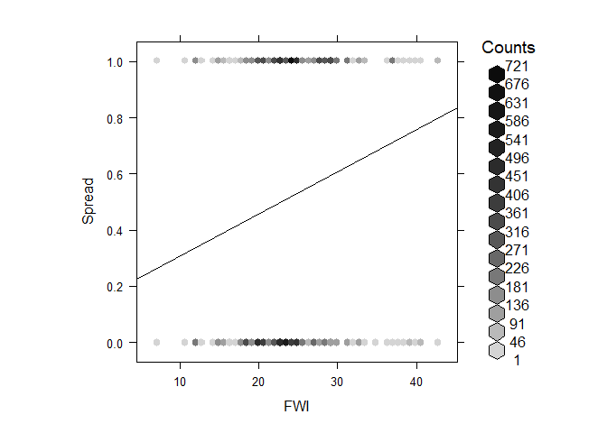<!-- -->

``` r
hexbinplot(fix(climate_day_complete$spread)~fix(climate_day_complete$effective_wsv),xlab="Wind Speed",ylab="Spread",xbins=50,aspect=1,type="r")
```

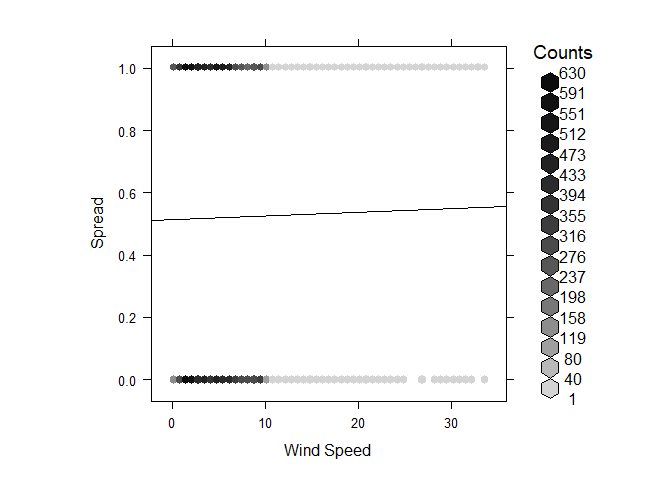<!-- -->

``` r
hexbinplot(fix(climate_day_complete$spread)~fix(climate_day_complete$fuel_number),xlab="Fuel number",ylab="Spread",xbins=50,aspect=1,type="r")
```

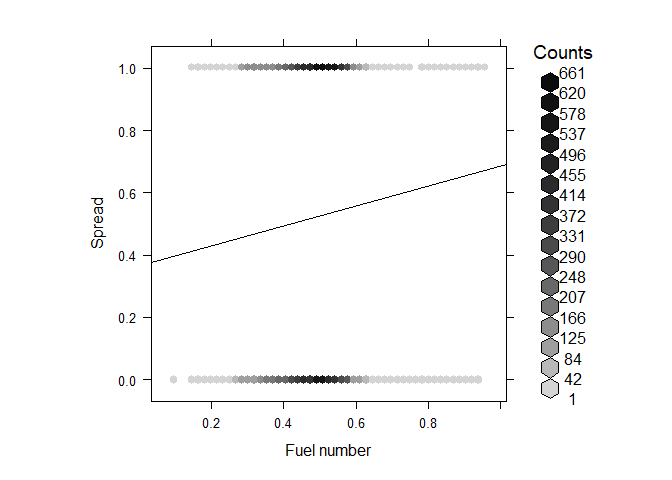<!-- -->

``` r
hexbinplot(fix(climate_day_complete$expansion)~fix(climate_day_complete$FWI),xlab="FWI",ylab="Spread",xbins=50,aspect=1,type="r")
```

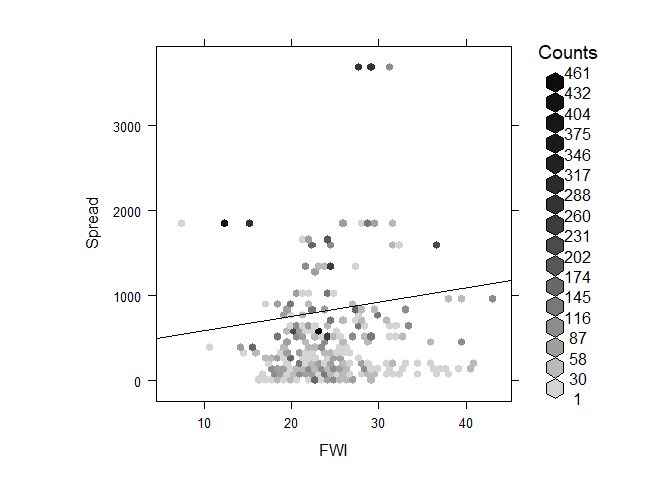<!-- -->

``` r
hexbinplot(fix(climate_day_complete$expansion)~fix(climate_day_complete$effective_wsv),xlab="Wind Speed",ylab="Spread",xbins=50,aspect=1,type="r")
```

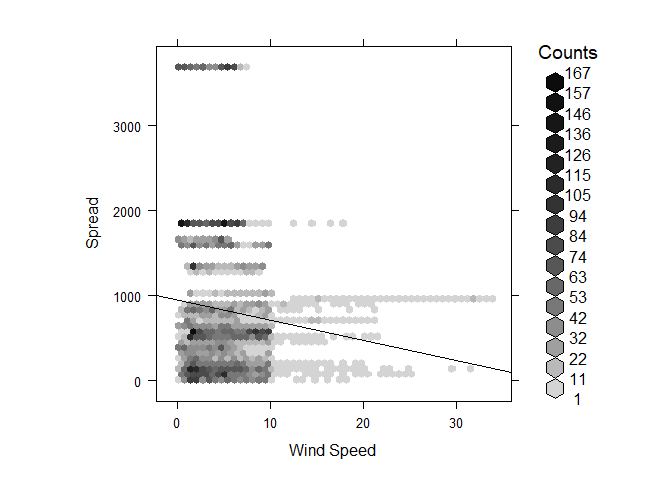<!-- -->

``` r
spread_vars_short<-climate_day_complete
#table(spread_vars_short$spread)
Full_logit <- glm(spread ~fix(FWI)+fix(fuel_number)+fix(effective_wsv), 
                  data = spread_vars_short, family = "binomial")
summary(Full_logit)
```

    ## 
    ## Call:
    ## glm(formula = spread ~ fix(FWI) + fix(fuel_number) + fix(effective_wsv), 
    ##     family = "binomial", data = spread_vars_short)
    ## 
    ## Deviance Residuals: 
    ##     Min       1Q   Median       3Q      Max  
    ## -1.7950  -1.1739   0.8052   1.1280   1.7968  
    ## 
    ## Coefficients:
    ##                     Estimate Std. Error z value Pr(>|z|)    
    ## (Intercept)        -1.722893   0.113352 -15.200  < 2e-16 ***
    ## fix(FWI)            0.064951   0.003466  18.737  < 2e-16 ***
    ## fix(fuel_number)    0.724858   0.189213   3.831 0.000128 ***
    ## fix(effective_wsv) -0.020668   0.004784  -4.320 1.56e-05 ***
    ## ---
    ## Signif. codes:  0 '***' 0.001 '**' 0.01 '*' 0.05 '.' 0.1 ' ' 1
    ## 
    ## (Dispersion parameter for binomial family taken to be 1)
    ## 
    ##     Null deviance: 17100  on 12348  degrees of freedom
    ## Residual deviance: 16681  on 12345  degrees of freedom
    ## AIC: 16689
    ## 
    ## Number of Fisher Scoring iterations: 4

``` r
#hist(spread_vars_short$finefuels)
AIC(Full_logit)
```

    ## [1] 16689.47

Calculating Spread Probability

``` r
Full_logit <- glm(fix(spread) ~  fix(fuel_number)+fix(FWI), 
                  data = spread_vars_short, family = "binomial")
summary(Full_logit)
```

    ## 
    ## Call:
    ## glm(formula = fix(spread) ~ fix(fuel_number) + fix(FWI), family = "binomial", 
    ##     data = spread_vars_short)
    ## 
    ## Deviance Residuals: 
    ##     Min       1Q   Median       3Q      Max  
    ## -1.7609  -1.1759   0.7948   1.1358   1.6542  
    ## 
    ## Coefficients:
    ##                   Estimate Std. Error z value Pr(>|z|)    
    ## (Intercept)      -1.740204   0.113415  -15.34  < 2e-16 ***
    ## fix(fuel_number)  0.725350   0.188870    3.84 0.000123 ***
    ## fix(FWI)          0.061306   0.003369   18.20  < 2e-16 ***
    ## ---
    ## Signif. codes:  0 '***' 0.001 '**' 0.01 '*' 0.05 '.' 0.1 ' ' 1
    ## 
    ## (Dispersion parameter for binomial family taken to be 1)
    ## 
    ##     Null deviance: 17100  on 12348  degrees of freedom
    ## Residual deviance: 16700  on 12346  degrees of freedom
    ## AIC: 16706
    ## 
    ## Number of Fisher Scoring iterations: 4

``` r
#hist(spread_vars_short$finefuels)
AIC(Full_logit)
```

    ## [1] 16705.94

``` r
Nofinefuels_logit<-glm(fix(spread) ~ fix(effective_wsv) + fix(FWI), 
                  data = spread_vars_short, family = "binomial")

summary(Nofinefuels_logit)
```

    ## 
    ## Call:
    ## glm(formula = fix(spread) ~ fix(effective_wsv) + fix(FWI), family = "binomial", 
    ##     data = spread_vars_short)
    ## 
    ## Deviance Residuals: 
    ##     Min       1Q   Median       3Q      Max  
    ## -1.6967  -1.1726   0.8125   1.1367   1.7629  
    ## 
    ## Coefficients:
    ##                     Estimate Std. Error z value Pr(>|z|)    
    ## (Intercept)        -1.423111   0.081292 -17.506  < 2e-16 ***
    ## fix(effective_wsv) -0.020710   0.004784  -4.329  1.5e-05 ***
    ## fix(FWI)            0.066869   0.003423  19.534  < 2e-16 ***
    ## ---
    ## Signif. codes:  0 '***' 0.001 '**' 0.01 '*' 0.05 '.' 0.1 ' ' 1
    ## 
    ## (Dispersion parameter for binomial family taken to be 1)
    ## 
    ##     Null deviance: 17100  on 12348  degrees of freedom
    ## Residual deviance: 16696  on 12346  degrees of freedom
    ## AIC: 16702
    ## 
    ## Number of Fisher Scoring iterations: 4

``` r
AIC(Nofinefuels_logit)
```

    ## [1] 16702.2

``` r
(AIC(Full_logit)-AIC(Nofinefuels_logit))
```

    ## [1] 3.747428

Removing the fine fuels component has a negligible influence on model
preformance

``` r
JustFWI<-glm(fix(spread) ~ fix(FWI), 
                  data = spread_vars_short, family = "binomial")
summary(JustFWI)
```

    ## 
    ## Call:
    ## glm(formula = fix(spread) ~ fix(FWI), family = "binomial", data = spread_vars_short)
    ## 
    ## Deviance Residuals: 
    ##     Min       1Q   Median       3Q      Max  
    ## -1.7361  -1.1758   0.8334   1.1401   1.6198  
    ## 
    ## Coefficients:
    ##              Estimate Std. Error z value Pr(>|z|)    
    ## (Intercept) -1.440802   0.081661  -17.64   <2e-16 ***
    ## fix(FWI)     0.063243   0.003326   19.02   <2e-16 ***
    ## ---
    ## Signif. codes:  0 '***' 0.001 '**' 0.01 '*' 0.05 '.' 0.1 ' ' 1
    ## 
    ## (Dispersion parameter for binomial family taken to be 1)
    ## 
    ##     Null deviance: 17100  on 12348  degrees of freedom
    ## Residual deviance: 16715  on 12347  degrees of freedom
    ## AIC: 16719
    ## 
    ## Number of Fisher Scoring iterations: 4

``` r
AIC(JustFWI)
```

    ## [1] 16718.74

``` r
AIC(Full_logit)
```

    ## [1] 16705.94

``` r
(AIC(Full_logit)-AIC(JustFWI))
```

    ## [1] -12.79445

Using just fire weather index preforms far worse than either the full or
the no fine fuels model

``` r
NoWind<-glm(fix(spread) ~  fix(fuel_number)+fix(FWI), data = spread_vars_short, family = "binomial")

summary(NoWind)
```

    ## 
    ## Call:
    ## glm(formula = fix(spread) ~ fix(fuel_number) + fix(FWI), family = "binomial", 
    ##     data = spread_vars_short)
    ## 
    ## Deviance Residuals: 
    ##     Min       1Q   Median       3Q      Max  
    ## -1.7609  -1.1759   0.7948   1.1358   1.6542  
    ## 
    ## Coefficients:
    ##                   Estimate Std. Error z value Pr(>|z|)    
    ## (Intercept)      -1.740204   0.113415  -15.34  < 2e-16 ***
    ## fix(fuel_number)  0.725350   0.188870    3.84 0.000123 ***
    ## fix(FWI)          0.061306   0.003369   18.20  < 2e-16 ***
    ## ---
    ## Signif. codes:  0 '***' 0.001 '**' 0.01 '*' 0.05 '.' 0.1 ' ' 1
    ## 
    ## (Dispersion parameter for binomial family taken to be 1)
    ## 
    ##     Null deviance: 17100  on 12348  degrees of freedom
    ## Residual deviance: 16700  on 12346  degrees of freedom
    ## AIC: 16706
    ## 
    ## Number of Fisher Scoring iterations: 4

``` r
#min(fix(spread_vars_short$FWI))
#max(fix(spread_vars_short$FWI))
```

``` r
AIC(NoWind)
```

    ## [1] 16705.94

``` r
(AIC(Full_logit)-AIC(NoWind))
```

    ## [1] 0

``` r
anova(Nofinefuels_logit,Full_logit)
```

    ## Analysis of Deviance Table
    ## 
    ## Model 1: fix(spread) ~ fix(effective_wsv) + fix(FWI)
    ## Model 2: fix(spread) ~ fix(fuel_number) + fix(FWI)
    ##   Resid. Df Resid. Dev Df Deviance
    ## 1     12346      16696            
    ## 2     12346      16700  0  -3.7474

The fuels plus FWI model preforms the worse of all

Plotting out the influence.

``` r
High_FF<-data.frame(FWI=seq(min(fix(spread_vars_short$FWI)),40,length.out = 1000),fuel_number=rep(quantile(fix(spread_vars_short$fuel_number),.99),1000))
Med_FF<-data.frame(FWI=seq(min(fix(spread_vars_short$FWI)),40,length.out = 1000),fuel_number=rep(quantile(fix(spread_vars_short$fuel_number),.50),1000))
Low_FF<-data.frame(FWI=seq(min(fix(spread_vars_short$FWI)),40,length.out = 1000),fuel_number=rep(quantile(fix(spread_vars_short$fuel_number),.01),1000))


plot(High_FF$FWI,predict(Full_logit,High_FF,type="response"),ylab="Probability of Spread",xlab="Fire Weather Index",cex.axis=1.5,cex.lab=1.5,cex.main=1.7,type="l",lwd=5.0,main="Fire Spread Probability")
lines(Med_FF$FWI,predict(Full_logit,Med_FF,type="response"),col="red",lwd=5.0)
lines(Low_FF$FWI,predict(Full_logit,Low_FF,type="response"),col="blue",lwd=5.0)
legend(10,.8,legend=c("99th percentile fuel","Median fine fuel","1st percentile fuel"),lty=c(1,1,1),lwd=c(5.0,5.0,5.0),col=c("black","red","blue"),cex=1.2)
```

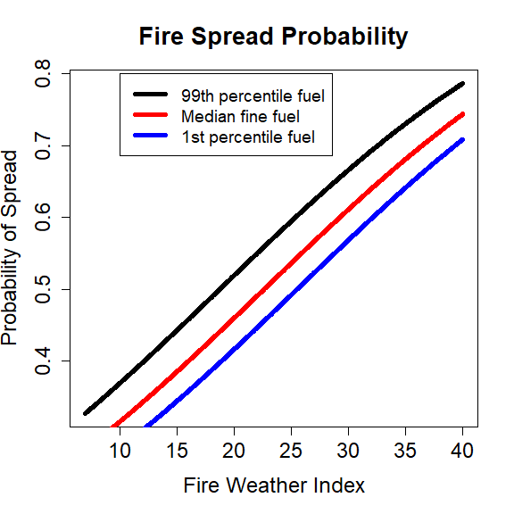<!-- -->

``` r
High_FF<-data.frame(fuel_number=seq(0,1,length.out = 1000),FWI=rep(quantile(fix(spread_vars_short$FWI),.99),1000))
Med_FF<-data.frame(fuel_number=seq(0,1,length.out = 1000),FWI=rep(quantile(fix(spread_vars_short$FWI),.5),1000))
Low_FF<-data.frame(fuel_number=seq(0,1,length.out = 1000),FWI=rep(quantile(fix(spread_vars_short$FWI),.01),1000))

plot(High_FF$fuel_number,predict(Full_logit,High_FF,type="response"),ylab="Probability of Spread",ylim=c(0,1.0),
     xlab="Fine fuel rating",cex=1.2)
points(Med_FF$fuel_number,predict(Full_logit,Med_FF,type="response"),col="red")
points(Low_FF$fuel_number,predict(Full_logit,Low_FF,type="response"),col="blue")
legend(.58,.32,legend=c("99th percentile FWI","Median FWI","1st percentile FWI"),lty=c(1,1,1),col=c("black","red","blue"),cex=1.2)
```

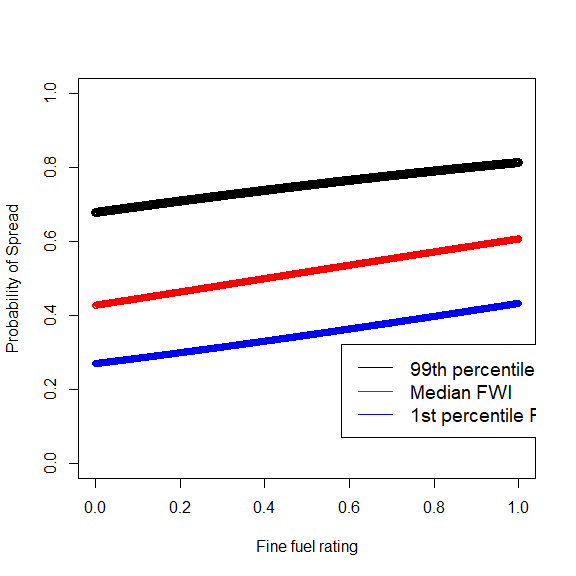<!-- -->

``` r
hist(spread_vars_short$FWI)
```

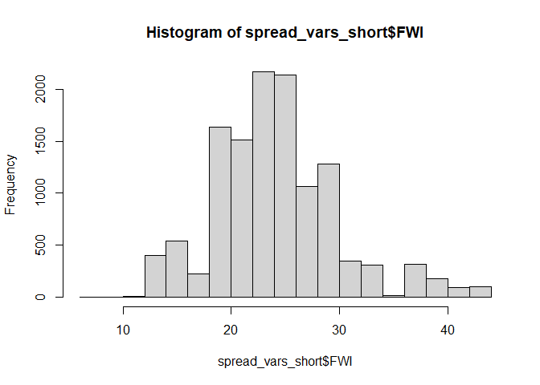<!-- -->

#### Maximum Daily Spread

``` r
####Maximum daily spread area
#Linear relationship

my_colors<-colorRampPalette(rev(brewer.pal(11,'Spectral')))
# colnames(spread_vars_short)
# removezero<-spread_vars_success
# 
# 
# 
# hexbinplot(fix(spread_vars_success$expansion)~fix(spread_vars_success[,2]),xlab="FWI",ylab="Spread",xbins=50,aspect=1,type="r",colramp=my_colors)
# hexbinplot(fix(spread_vars_success$expansion)~fix(spread_vars_success[,4]),xlab="Windspeed",ylab="Spread",xbins=50,aspect=1,type="r",colramp=my_colors)
```

``` r
library(dplyr)
spvar<-spread_vars_short[spread_vars_short$expansion>=0,]
colnames(spvar)
```

    ##  [1] "ID"            "FireName"      "date"          "wind_region"  
    ##  [5] "fuel_number"   "uphill_azi"    "slope"         "FWI"          
    ##  [9] "WSPD"          "spread"        "expansion"     "effective_wsv"

``` r
spva2<-spvar %>%
  dplyr::group_by(FireName,date)%>%
  dplyr::summarise(FWI=mean(FWI),WSPD=mean(WSPD),expansion=mean(expansion))
```

    ## `summarise()` has grouped output by 'FireName'. You can override using the `.groups` argument.

``` r
Expansionfull<-glm(fix(expansion) ~ fix(WSPD) + fix(FWI), 
             data =spvar )

summary(Expansionfull)
```

    ## 
    ## Call:
    ## glm(formula = fix(expansion) ~ fix(WSPD) + fix(FWI), data = spvar)
    ## 
    ## Deviance Residuals: 
    ##     Min       1Q   Median       3Q      Max  
    ## -1370.8   -583.2   -201.4    472.3   2729.7  
    ## 
    ## Coefficients:
    ##             Estimate Std. Error t value Pr(>|t|)    
    ## (Intercept)  288.176     32.407   8.892  < 2e-16 ***
    ## fix(WSPD)    173.646      6.458  26.890  < 2e-16 ***
    ## fix(FWI)      -6.334      1.555  -4.073 4.67e-05 ***
    ## ---
    ## Signif. codes:  0 '***' 0.001 '**' 0.01 '*' 0.05 '.' 0.1 ' ' 1
    ## 
    ## (Dispersion parameter for gaussian family taken to be 691229.5)
    ## 
    ##     Null deviance: 9151568998  on 12348  degrees of freedom
    ## Residual deviance: 8533919271  on 12346  degrees of freedom
    ## AIC: 201097
    ## 
    ## Number of Fisher Scoring iterations: 2

``` r
library(MASS)
```

    ## 
    ## Attaching package: 'MASS'

    ## The following object is masked from 'package:dplyr':
    ## 
    ##     select

    ## The following objects are masked from 'package:raster':
    ## 
    ##     area, select

``` r
ExpansionFWI<-glm(fix(expansion) ~ fix(FWI), data =spvar)
summary(ExpansionFWI)
```

    ## 
    ## Call:
    ## glm(formula = fix(expansion) ~ fix(FWI), data = spvar)
    ## 
    ## Deviance Residuals: 
    ##    Min      1Q  Median      3Q     Max  
    ## -967.5  -603.0  -249.6   230.2  2798.4  
    ## 
    ## Coefficients:
    ##             Estimate Std. Error t value Pr(>|t|)    
    ## (Intercept)  415.399     32.984   12.59   <2e-16 ***
    ## fix(FWI)      16.887      1.331   12.69   <2e-16 ***
    ## ---
    ## Signif. codes:  0 '***' 0.001 '**' 0.01 '*' 0.05 '.' 0.1 ' ' 1
    ## 
    ## (Dispersion parameter for gaussian family taken to be 731653.1)
    ## 
    ##     Null deviance: 9151568998  on 12348  degrees of freedom
    ## Residual deviance: 9033720953  on 12347  degrees of freedom
    ## AIC: 201798
    ## 
    ## Number of Fisher Scoring iterations: 2

``` r
ExpansionWSPD<-glm(expansion~ WSPD, data =spvar)
summary(ExpansionWSPD)
```

    ## 
    ## Call:
    ## glm(formula = expansion ~ WSPD, data = spvar)
    ## 
    ## Deviance Residuals: 
    ##     Min       1Q   Median       3Q      Max  
    ## -1397.3   -574.6   -226.8    451.1   2704.8  
    ## 
    ## Coefficients:
    ##             Estimate Std. Error t value Pr(>|t|)    
    ## (Intercept)  193.278     22.539   8.575   <2e-16 ***
    ## WSPD         159.040      5.374  29.595   <2e-16 ***
    ## ---
    ## Signif. codes:  0 '***' 0.001 '**' 0.01 '*' 0.05 '.' 0.1 ' ' 1
    ## 
    ## (Dispersion parameter for gaussian family taken to be 692102.3)
    ## 
    ##     Null deviance: 9151568998  on 12348  degrees of freedom
    ## Residual deviance: 8545386554  on 12347  degrees of freedom
    ## AIC: 201112
    ## 
    ## Number of Fisher Scoring iterations: 2

``` r
AIC(ExpansionFWI)-AIC(ExpansionWSPD)
```

    ## [1] 686.2684

``` r
hist(fix(spread_vars_short$expansion))
```

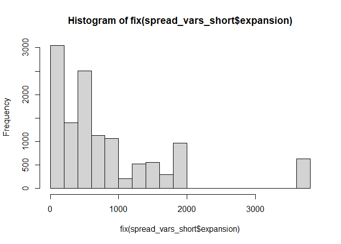<!-- -->

``` r
anova(Expansionfull,ExpansionFWI)
```

    ## Analysis of Deviance Table
    ## 
    ## Model 1: fix(expansion) ~ fix(WSPD) + fix(FWI)
    ## Model 2: fix(expansion) ~ fix(FWI)
    ##   Resid. Df Resid. Dev Df   Deviance
    ## 1     12346 8533919271              
    ## 2     12347 9033720953 -1 -499801682

``` r
AIC(Expansionfull)-AIC(ExpansionFWI)
```

    ## [1] -700.851

``` r
Expansionfull<-glm(fix(expansion) ~ fix(WSPD), 
             data =spvar )
anova(Expansionfull,ExpansionFWI)
```

    ## Analysis of Deviance Table
    ## 
    ## Model 1: fix(expansion) ~ fix(WSPD)
    ## Model 2: fix(expansion) ~ fix(FWI)
    ##   Resid. Df Resid. Dev Df   Deviance
    ## 1     12347 8545386554              
    ## 2     12347 9033720953  0 -488334398

``` r
AIC(Expansionfull)-AIC(ExpansionFWI)
```

    ## [1] -686.2684

``` r
plot(seq(0,30,.5),predict(ExpansionWSPD,newdata=data.frame(WSPD=seq(0,30,.5)),type="response"),ylab="Max daily HA burned",xlab="Windspeed Km/h")
```

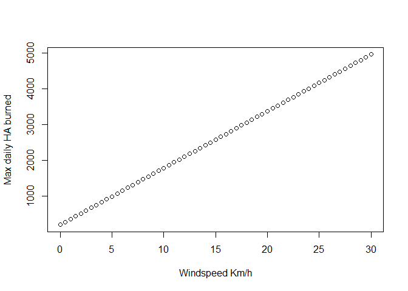<!-- -->

``` r
hist(spread_vars_short$WSPD)
```

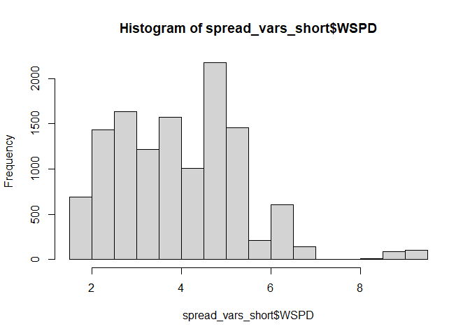<!-- -->
