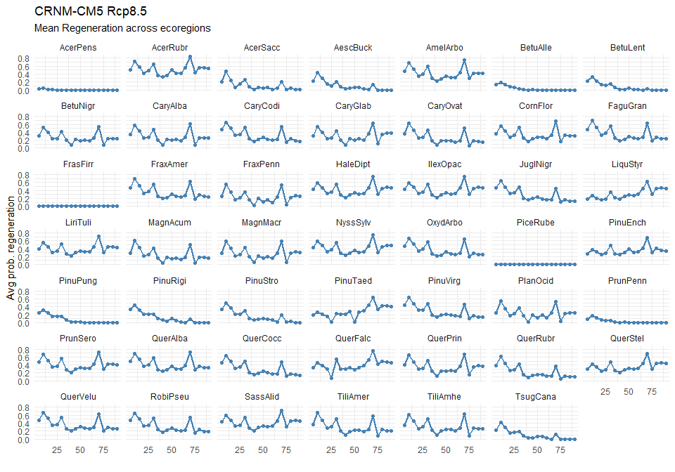
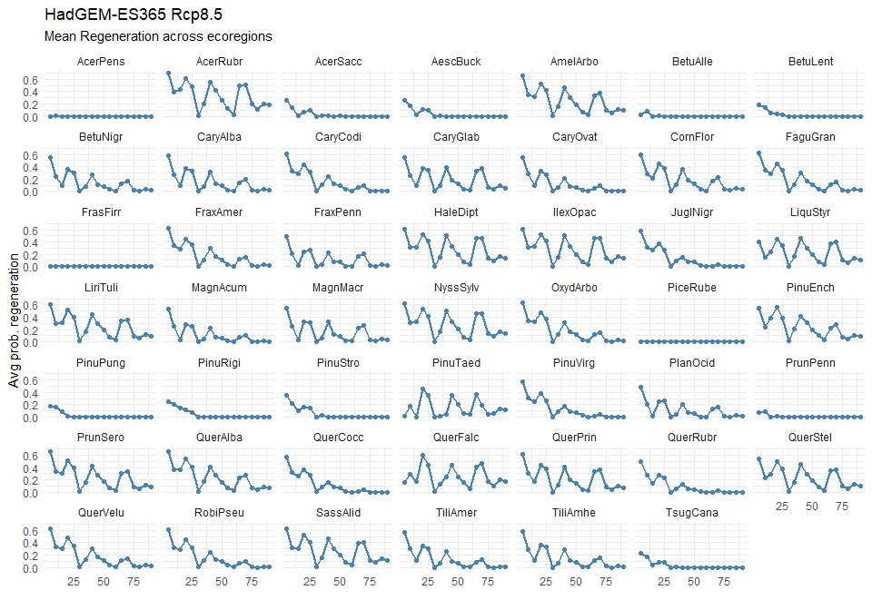
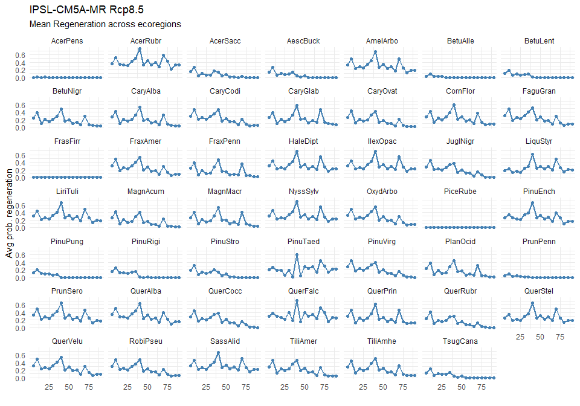
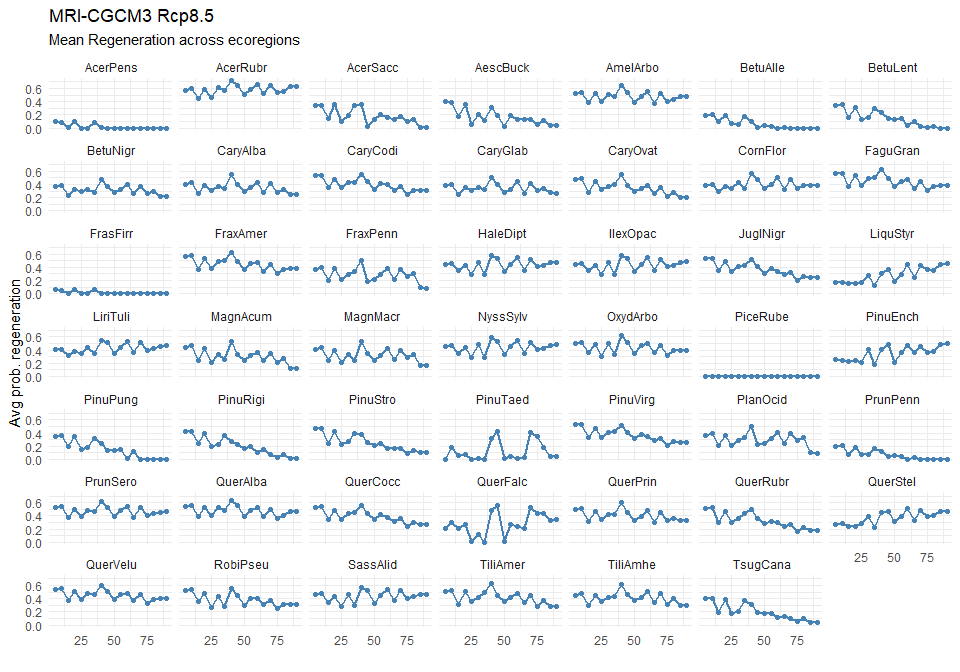

Regeneration Notebook
================

``` r
library(ggplot2)
library(dplyr)
```

    ## 
    ## Attaching package: 'dplyr'

    ## The following objects are masked from 'package:stats':
    ## 
    ##     filter, lag

    ## The following objects are masked from 'package:base':
    ## 
    ##     intersect, setdiff, setequal, union

``` r
Dir<-'F:/Chapter3/'

Regen_model<-function(Dir,Model){
  Regen1<-read.csv(paste0(Dir,"R_1/",Model,"/NECN-prob-establish-log.csv"))
  Regen2<-read.csv(paste0(Dir,"R_2/",Model,"/NECN-prob-establish-log.csv"))
  Regen3<-read.csv(paste0(Dir,"R_3/",Model,"/NECN-prob-establish-log.csv"))
  Regen4<-read.csv(paste0(Dir,"R_4/",Model,"/NECN-prob-establish-log.csv"))
  Regen5<-read.csv(paste0(Dir,"R_5/",Model,"/NECN-prob-establish-log.csv"))
  Regen6<-read.csv(paste0(Dir,"R_6/",Model,"/NECN-prob-establish-log.csv"))
  Regen7<-read.csv(paste0(Dir,"R_7/",Model,"/NECN-prob-establish-log.csv"))

  return(rbind(Regen1,Regen2,Regen3,Regen4,Regen5,Regen6,Regen7)%>%
    group_by(Time,SpeciesName)%>%
    dplyr::summarise(AvgTempMult=mean(AvgTempMult),AvgMinJanTempMult=mean(AvgMinJanTempMult),
                   AvgSoilMoistureMult=mean(AvgSoilMoistureMult),AvgProbEst=mean(AvgProbEst)))

}
```

``` r
Model<-'CNRM-CM5'

CNRM<-Regen_model(Dir,'CNRM-CM5')
```

    ## `summarise()` has grouped output by 'Time'. You can override using the `.groups` argument.

``` r
colnames(CNRM)
```

    ## [1] "Time"                "SpeciesName"         "AvgTempMult"        
    ## [4] "AvgMinJanTempMult"   "AvgSoilMoistureMult" "AvgProbEst"

``` r
ggplot(data = CNRM, aes(x=Time,y=AvgProbEst)) +
  geom_line(color = "steelblue",size = 1) +
  geom_point(color="steelblue") + 
  facet_wrap(~ SpeciesName)+
  labs(title = "CRNM-CM5 Rcp8.5",
       subtitle = "Mean Regeneration across ecoregions",
       y = "Avg prob. regeneration", x = "")+
  theme_minimal()
```

<!-- -->

``` r
Model<-'HadGEM'

HadGEM<-Regen_model(Dir,'HadGEM')
```

    ## `summarise()` has grouped output by 'Time'. You can override using the `.groups` argument.

``` r
colnames(HadGEM)
```

    ## [1] "Time"                "SpeciesName"         "AvgTempMult"        
    ## [4] "AvgMinJanTempMult"   "AvgSoilMoistureMult" "AvgProbEst"

``` r
ggplot(data = HadGEM, aes(x=Time,y=AvgProbEst)) +
  geom_line(color = "steelblue",size = 1) +
  geom_point(color="steelblue") + 
  facet_wrap(~ SpeciesName)+
  labs(title = "HadGEM-ES365 Rcp8.5",
       subtitle = "Mean Regeneration across ecoregions",
       y = "Avg prob. regeneration", x = "")+
  theme_minimal()
```

<!-- -->

``` r
Model<-'Historic_Random'

Historic_Random<-Regen_model(Dir,'Historic_Random')
```

    ## `summarise()` has grouped output by 'Time'. You can override using the `.groups` argument.

``` r
colnames(Historic_Random)
```

    ## [1] "Time"                "SpeciesName"         "AvgTempMult"        
    ## [4] "AvgMinJanTempMult"   "AvgSoilMoistureMult" "AvgProbEst"

``` r
png('HR.png',width=700,height=500)
ggplot(data = Historic_Random, aes(x=Time,y=AvgProbEst)) +
  geom_line(color = "steelblue",size = 1) +
  geom_point(color="steelblue") + 
  facet_wrap(~ SpeciesName)+
  labs(title = "Historic_Random Rcp8.5",
       subtitle = "Mean Regeneration across ecoregions",
       y = "Avg prob. regeneration", x = "")+
  theme_minimal()
dev.off()
```

    ## png 
    ##   2

``` r
Model<-'IPSL-CM5A-MR'

IPSL<-Regen_model(Dir,'IPSL-CM5A-MR')
```

    ## `summarise()` has grouped output by 'Time'. You can override using the `.groups` argument.

``` r
colnames(Historic_Random)
```

    ## [1] "Time"                "SpeciesName"         "AvgTempMult"        
    ## [4] "AvgMinJanTempMult"   "AvgSoilMoistureMult" "AvgProbEst"

``` r
ggplot(data = IPSL, aes(x=Time,y=AvgProbEst)) +
  geom_line(color = "steelblue",size = 1) +
  geom_point(color="steelblue") + 
  facet_wrap(~ SpeciesName)+
  labs(title = "IPSL-CM5A-MR Rcp8.5",
       subtitle = "Mean Regeneration across ecoregions",
       y = "Avg prob. regeneration", x = "")+
  theme_minimal()
```

<!-- -->

``` r
Model<-'MRI-CGCM3'

MRI<-Regen_model(Dir,'MRI-CGCM3')
```

    ## `summarise()` has grouped output by 'Time'. You can override using the `.groups` argument.

``` r
colnames(Historic_Random)
```

    ## [1] "Time"                "SpeciesName"         "AvgTempMult"        
    ## [4] "AvgMinJanTempMult"   "AvgSoilMoistureMult" "AvgProbEst"

``` r
ggplot(data = MRI, aes(x=Time,y=AvgProbEst)) +
  geom_line(color = "steelblue",size = 1) +
  geom_point(color="steelblue") + 
  facet_wrap(~ SpeciesName)+
  labs(title = "MRI-CGCM3 Rcp8.5",
       subtitle = "Mean Regeneration across ecoregions",
       y = "Avg prob. regeneration", x = "")+
  theme_minimal()
```

<!-- -->
