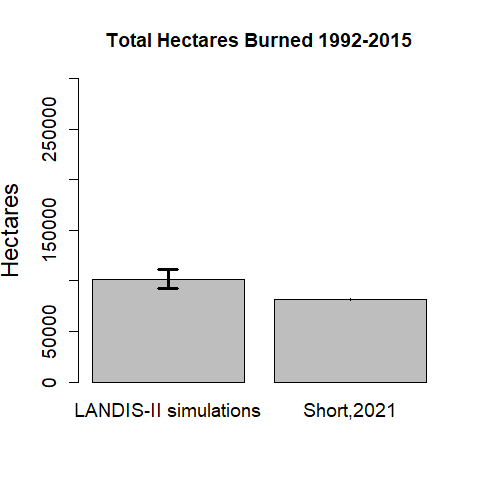
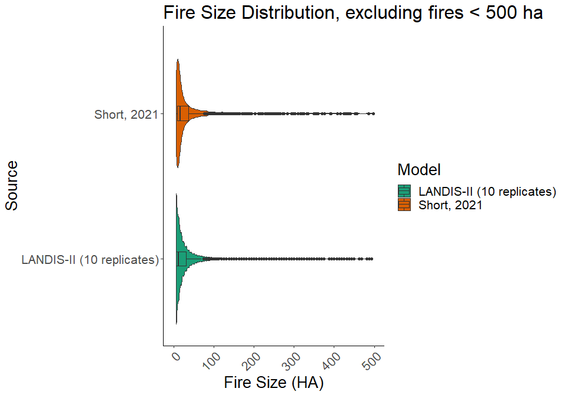
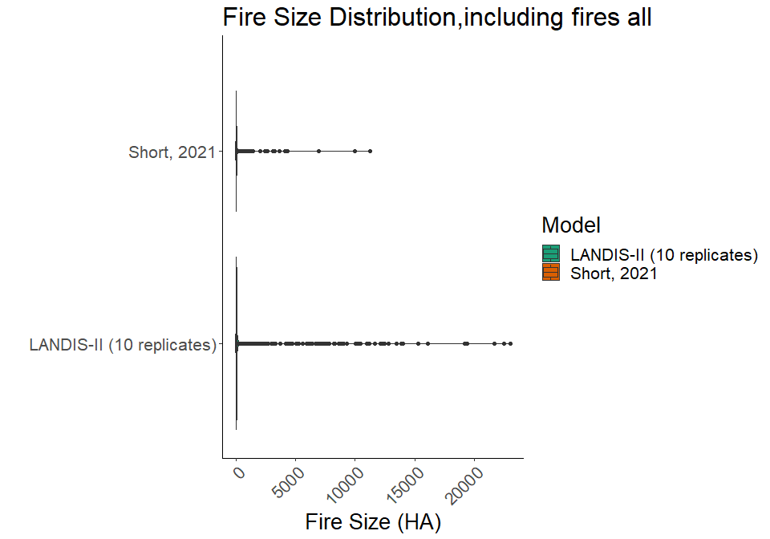
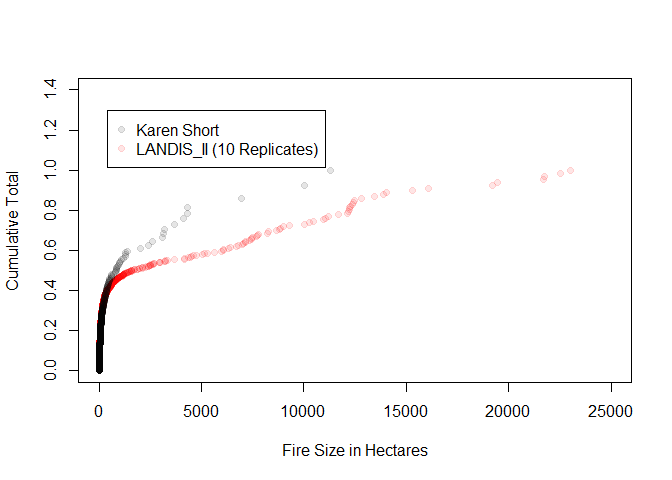
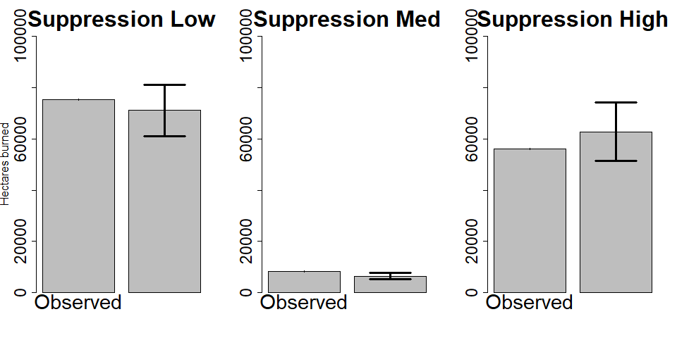

R Notebook
================

``` r
## Libraries
library(grDevices)
library(ggplot2)
library(sf)
```

    ## Warning: package 'sf' was built under R version 4.1.2

    ## Linking to GEOS 3.9.1, GDAL 3.2.1, PROJ 7.2.1; sf_use_s2() is TRUE

``` r
library(ggplot2)
library(vioplot)
```

    ## Warning: package 'vioplot' was built under R version 4.1.1

    ## Loading required package: sm

    ## Warning: package 'sm' was built under R version 4.1.1

    ## Package 'sm', version 2.2-5.7: type help(sm) for summary information

    ## Loading required package: zoo

    ## Warning: package 'zoo' was built under R version 4.1.1

    ## 
    ## Attaching package: 'zoo'

    ## The following objects are masked from 'package:base':
    ## 
    ##     as.Date, as.Date.numeric

``` r
library(RColorBrewer)
options(dplyr.summarise.inform = FALSE)
library(dplyr, warn.conflicts = FALSE)
```

``` r
### Load in the ten replicates 
Drive<-'F:/Scrpple_Tests_917/Runs10102/'
 
  EventLog1<-read.csv(
    paste0(Drive,'Scrpple_LANDIS_Sapps_VeryHigh1/scrapple-events-log.csv'))
  EventLog2<-read.csv(
    paste0(Drive,'Scrpple_LANDIS_Sapps_VeryHigh2/scrapple-events-log.csv'))
  EventLog3<-read.csv(
    paste0(Drive,'Scrpple_LANDIS_Sapps_VeryHigh3/scrapple-events-log.csv'))
  EventLog4<-read.csv(
    paste0(Drive,'Scrpple_LANDIS_Sapps_VeryHigh4/scrapple-events-log.csv'))
  EventLog5<-read.csv(
    paste0(Drive,'Scrpple_LANDIS_Sapps_VeryHigh5/scrapple-events-log.csv'))
  EventLog6<-read.csv(
    paste0(Drive,'Scrpple_LANDIS_Sapps_VeryHigh6/scrapple-events-log.csv'))
  EventLog7<-read.csv(
    paste0(Drive,'Scrpple_LANDIS_Sapps_VeryHigh7/scrapple-events-log.csv'))
  EventLog8<-read.csv(
    paste0(Drive,'Scrpple_LANDIS_Sapps_VeryHigh8/scrapple-events-log.csv'))
  EventLog9<-read.csv(
    paste0(Drive,'Scrpple_LANDIS_Sapps_VeryHigh9/scrapple-events-log.csv'))
  EventLog10<-read.csv(
    paste0(Drive,'Scrpple_LANDIS_Sapps_VeryHigh10/scrapple-events-log.csv'))
```

#### Ignition:

Here we take the data from Short et al., 2021 and compare it to the mean
and confidence interval of the simulations. We remove fires that are
smaller then a cell size \~ 6.25 ha (15.44 acres).

Short KC. 2021. Spatial wildfire occurrence data for the United States,
1992-2018 \[FPA_FOD_20210617\] (5th Edition).
<https://www.fs.usda.gov/rds/archive/Catalog/RDS-2013-0009.5>. Last
accessed 15/11/2021

``` r
#Lightning ignitions
l_fire_dat<-read.csv("Z:/Robbins/Sapps/Chapter3/Code/Scrpple_111721/Inputs/Natural_KS21.csv")
l_fire_dat<-l_fire_dat[c(-1)]
l<-l_fire_dat%>%
  subset(FIRE_SIZE>15.44)
# Human accidental igntion
h_fire_dat<-read.csv("Z:/Robbins/Sapps/Chapter3/Code/Scrpple_111721/Inputs/Human_KS21.csv")
h<-h_fire_dat[c(-1)]
h<-h%>%
  subset(FIRE_SIZE>15.44)

l_fire_dat<-rbind(l,h) #Combine
l_fire_dat<-l_fire_dat[l_fire_dat$FIRE_YEAR<2017,] ## Only looking through 2016 to match simulations

##Calculating the SE.
se <- function(x) sqrt(var(x)/length(x))
Hrm<-sum(as.data.frame(table(h$FIRE_YEAR))[,2])
Hrse<-se(as.data.frame(table(h$FIRE_YEAR))[,2])
Lrm<-sum(as.data.frame(table(l$FIRE_YEAR))[,2])
Lrse<-se(as.data.frame(table(l$FIRE_YEAR))[,2])
### Loading in the model data.

Am_1<-sum(as.data.frame(table(EventLog1$SimulationYear[EventLog1$IgnitionType==" Accidental"]))[,2])
Am_2<-sum(as.data.frame(table(EventLog2$SimulationYear[EventLog2$IgnitionType==" Accidental"]))[,2])
Am_3<-sum(as.data.frame(table(EventLog3$SimulationYear[EventLog3$IgnitionType==" Accidental"]))[,2])
Am_4<-sum(as.data.frame(table(EventLog4$SimulationYear[EventLog4$IgnitionType==" Accidental"]))[,2])
Am_5<-sum(as.data.frame(table(EventLog5$SimulationYear[EventLog5$IgnitionType==" Accidental"]))[,2])
Am_6<-sum(as.data.frame(table(EventLog6$SimulationYear[EventLog6$IgnitionType==" Accidental"]))[,2])
Am_7<-sum(as.data.frame(table(EventLog7$SimulationYear[EventLog7$IgnitionType==" Accidental"]))[,2])
Am_8<-sum(as.data.frame(table(EventLog8$SimulationYear[EventLog8$IgnitionType==" Accidental"]))[,2])
Am_9<-sum(as.data.frame(table(EventLog9$SimulationYear[EventLog9$IgnitionType==" Accidental"]))[,2])
Am_10<-sum(as.data.frame(table(EventLog10$SimulationYear[EventLog10$IgnitionType==" Accidental"]))[,2])
Amm<-mean(c(Am_1,Am_2,Am_3,Am_4,Am_5,Am_6,Am_7,Am_8,Am_9,Am_10))
Amse<-se(c(Am_1,Am_2,Am_3,Am_4,Am_5,Am_6,Am_7,Am_8,Am_9,Am_10))
Lm_1<-sum(as.data.frame(table(EventLog1$SimulationYear[EventLog1$IgnitionType==" Lightning"]))[,2])
Lm_2<-sum(as.data.frame(table(EventLog2$SimulationYear[EventLog2$IgnitionType==" Lightning"]))[,2])
Lm_3<-sum(as.data.frame(table(EventLog3$SimulationYear[EventLog3$IgnitionType==" Lightning"]))[,2])
Lm_4<-sum(as.data.frame(table(EventLog4$SimulationYear[EventLog4$IgnitionType==" Lightning"]))[,2])
Lm_5<-sum(as.data.frame(table(EventLog5$SimulationYear[EventLog5$IgnitionType==" Lightning"]))[,2])
Lm_6<-sum(as.data.frame(table(EventLog6$SimulationYear[EventLog6$IgnitionType==" Lightning"]))[,2])
Lm_7<-sum(as.data.frame(table(EventLog7$SimulationYear[EventLog7$IgnitionType==" Lightning"]))[,2])
Lm_8<-sum(as.data.frame(table(EventLog8$SimulationYear[EventLog8$IgnitionType==" Lightning"]))[,2])
Lm_9<-sum(as.data.frame(table(EventLog9$SimulationYear[EventLog9$IgnitionType==" Lightning"]))[,2])
Lm_10<-sum(as.data.frame(table(EventLog9$SimulationYear[EventLog10$IgnitionType==" Lightning"]))[,2])
Lmm<-mean(c(Lm_1,Lm_2,Lm_3,Lm_4,Lm_5,Lm_6,Lm_7,Lm_8,Lm_9,Lm_10))
## Calculating SE
Lmse<-se(c(Lm_1,Lm_2,Lm_3,Lm_4,Lm_5,Lm_6,Lm_7,Lm_8,Lm_9,Lm_10))
```

``` r
### Plotting a comparison. 
Plotting<-data.frame(Names=c('LightningModel','LightningData','HumanModel','HumanData'),
           Means=c(Lmm,Lrm,Amm,Hrm),
           se=c(Lmse,Lrse,Amse,Hrse)
           )


par(mfrow=c(2,1))
barCenters <- barplot(Plotting$Means[1:2], names.arg=c("LANDIS-II simulations", "Short, 2021"), col="gray", las=1,ylim=c(0,300),main="Lightning Ignitions (1992-2016)",
                      cex.names=1.2,cex.axis=1.2)
segments(barCenters[1], Plotting$Means[1]+Plotting$se[1]*2, barCenters[1], Plotting$Means[1:2]-Plotting$se[1:2]*2, lwd=5)

barCenters <- barplot(Plotting$Means[3:4], names.arg=c("LANDIS-II simulations", "Short, 2021"), col="gray", las=1, ylim=c(0,2000),cex.names=1.2,cex.axis=1.2,
                      main="Accidental Ignitions (1992-2016)")
segments(barCenters[1], Plotting$Means[3]+Plotting$se[3]*2, barCenters[1], Plotting$Means[3]-Plotting$se[3]*2, lwd=5)
```

<!-- -->

``` r
###Getting values 
print("lightning means")
```

    ## [1] "lightning means"

``` r
Plotting$Means[1:2]
```

    ## [1] 168.9 174.0

``` r
print('lightning CI')
```

    ## [1] "lightning CI"

``` r
Plotting$Means[1]+Plotting$se[1]*2
```

    ## [1] 177.6608

``` r
Plotting$Means[1]-Plotting$se[1]*2
```

    ## [1] 160.1392

``` r
print("human-accidental means")
```

    ## [1] "human-accidental means"

``` r
Plotting$Means[3:4]
```

    ## [1] 1623.9 1709.0

``` r
print("human-accidental CI")
```

    ## [1] "human-accidental CI"

``` r
Plotting$Means[3]+Plotting$se[3]*2
```

    ## [1] 1649.954

``` r
Plotting$Means[3]-Plotting$se[3]*2
```

    ## [1] 1597.846

# Looking at total area burned.

### 1992- 2016

``` r
## Sum the model run for non rx fire, multiply the number of sites by 6.25 to get to 
## hectares
ModelRuns<-c(sum(EventLog1$TotalSitesBurned[EventLog1$IgnitionType!=" Rx"])*6.25,
             sum(EventLog2$TotalSitesBurned[EventLog2$IgnitionType!=" Rx" ])*6.25,
             sum(EventLog3$TotalSitesBurned[EventLog3$IgnitionType!=" Rx" ])*6.25,
             sum(EventLog4$TotalSitesBurned[EventLog4$IgnitionType!=" Rx"])*6.25,
             sum(EventLog5$TotalSitesBurned[EventLog5$IgnitionType!=" Rx"])*6.25,
             sum(EventLog6$TotalSitesBurned[EventLog6$IgnitionType!=" Rx"])*6.25,
             sum(EventLog7$TotalSitesBurned[EventLog7$IgnitionType!=" Rx"])*6.25,
             sum(EventLog8$TotalSitesBurned[EventLog8$IgnitionType!=" Rx"])*6.25,
             sum(EventLog9$TotalSitesBurned[EventLog9$IgnitionType!=" Rx"])*6.25,
             sum(EventLog10$TotalSitesBurned[EventLog10$IgnitionType!=" Rx"])*6.25)
## Mean of model runs
mean(ModelRuns)
```

    ## [1] 140316.2

``` r
## Standard error
se(ModelRuns)
```

    ## [1] 10624.34

``` r
### get the mean from K.Short and covert for acres to ha. 
bars<-c(mean(ModelRuns),sum(l_fire_dat$FIRE_SIZE[l_fire_dat$FIRE_YEAR<2017])/2.54)                  

error<-c(se(ModelRuns),0)
### Plot 
foo<-barplot(bars,names.arg=c("LANDIS-II simulations","Short, 2021"),main="Total Hectares Burned 1992-2016",ylab="Hectares",ylim=c(0,300000),cex.names=1.2,cex.lab=1.5,cex.axis=1.5)
arrows(x0=foo,y0=bars+error*2,y1=bars-error*2,angle=90,code=3,length=0.1,lwd=3.0)
```

    ## Warning in arrows(x0 = foo, y0 = bars + error * 2, y1 = bars - error * 2, :
    ## zero-length arrow is of indeterminate angle and so skipped

<!-- -->

#### Means and CI

``` r
## Results by number
bars
```

    ## [1] 140316.2 147366.5

``` r
bars-error*2
```

    ## [1] 119067.6 147366.5

``` r
bars+error*2
```

    ## [1] 161564.9 147366.5

``` r
(144197.2-147366.5)/147366.5
```

    ## [1] -0.02150624

### Removing 2016

Here is the model pulling out 2016 to look at the contribution of big
fire years

``` r
## Sum the model run for non rx fire, multiply the number of sites by 6.25 to get to 
## hectares
ModelRuns<-c(sum(EventLog1$TotalSitesBurned[EventLog1$IgnitionType!=" Rx" & EventLog1$SimulationYear < 24 ])*6.25,
             sum(EventLog2$TotalSitesBurned[EventLog2$IgnitionType!=" Rx" & EventLog2$SimulationYear < 24])*6.25,
             sum(EventLog3$TotalSitesBurned[EventLog3$IgnitionType!=" Rx" & EventLog3$SimulationYear < 24])*6.25,
             sum(EventLog4$TotalSitesBurned[EventLog4$IgnitionType!=" Rx"& EventLog4$SimulationYear < 24 ])*6.25,
             sum(EventLog5$TotalSitesBurned[EventLog5$IgnitionType!=" Rx"& EventLog5$SimulationYear < 24 ])*6.25,
             sum(EventLog6$TotalSitesBurned[EventLog6$IgnitionType!=" Rx"& EventLog6$SimulationYear < 24  ])*6.25,
             sum(EventLog7$TotalSitesBurned[EventLog7$IgnitionType!=" Rx"& EventLog7$SimulationYear < 24  ])*6.25,
             sum(EventLog8$TotalSitesBurned[EventLog8$IgnitionType!=" Rx"& EventLog8$SimulationYear < 24  ])*6.25,
             sum(EventLog9$TotalSitesBurned[EventLog9$IgnitionType!=" Rx"& EventLog9$SimulationYear < 24  ])*6.25,
             sum(EventLog10$TotalSitesBurned[EventLog10$IgnitionType!=" Rx"& EventLog10$SimulationYear < 24  ])*6.25)

bars<-c(mean(ModelRuns),sum(l_fire_dat$FIRE_SIZE[l_fire_dat$FIRE_YEAR<2016])/2.54)                    
error<-c(se(ModelRuns),0)
foo<-barplot(bars,names.arg=c("LANDIS-II simulations","Short,2021"),main="Total Hectares Burned 1992-2015",ylab="Hectares",ylim=c(0,300000),cex.names=1.2,cex.lab=1.5,cex.axis=1.2)
arrows(x0=foo,y0=bars+error*2,y1=bars-error*2,angle=90,code=3,length=0.1,lwd=3.0)
```

    ## Warning in arrows(x0 = foo, y0 = bars + error * 2, y1 = bars - error * 2, :
    ## zero-length arrow is of indeterminate angle and so skipped

<!-- -->
#### Means and CI

``` r
## Results by number
bars
```

    ## [1] 101691.88  81580.65

``` r
bars-error*2
```

    ## [1] 92452.22 81580.65

``` r
bars+error*2
```

    ## [1] 110931.53  81580.65

``` r
(102238.19-81580.65)/81580.65
```

    ## [1] 0.2532162

### Fire size distribution

Here we use violin plots to look at the fire size distribution

``` r
All_Events<-rbind(EventLog1,EventLog2,EventLog3,EventLog4,EventLog5,EventLog6,EventLog7,EventLog8,EventLog9,EventLog10)
All_Events<-All_Events[All_Events$IgnitionType!=" Rx" ,]

VioFrame<-data.frame(
          Model=c(rep("Short, 2021",length(l_fire_dat$FIRE_SIZE)),
                            rep("LANDIS-II (10 replicates)",length(All_Events$TotalSitesBurned))
                  ),
           Score=c(l_fire_dat$FIRE_SIZE/2.47105,
                    All_Events$TotalSitesBurned*6.25))


p <- ggplot(VioFrame, aes(x=Model, y=as.numeric(Score), fill=Model)) + 
     geom_violin()+ 
     coord_flip() + 
     geom_boxplot(width=0.1)+
     scale_fill_brewer(palette="Dark2")+
     labs(title="Fire Size Distribution, excluding fires < 500 ha",x="Source", y = "Fire Size (HA)")+
     scale_y_continuous(limits = c(-1, 500))+
     theme_classic()+
     theme(text = element_text(size=20),
        axis.text.x = element_text(angle=45, hjust=1)) 
     
p
```

    ## Warning: Removed 273 rows containing non-finite values (stat_ydensity).

    ## Warning: Removed 273 rows containing non-finite values (stat_boxplot).

<!-- -->

``` r
q <- ggplot(VioFrame, aes(x=Model, y=as.numeric(Score), fill=Model)) + #
     geom_violin()+ 
     coord_flip() + 
     geom_boxplot(width=0.1)+
     scale_fill_brewer(palette="Dark2")+
     labs(title="Fire Size Distribution,including fires all",x="", y = "Fire Size (HA)")+
     theme_classic()+
     theme(text = element_text(size=20),
        axis.text.x = element_text(angle=45, hjust=1)) 
q
```

<!-- -->

#### Binned into size classes

``` r
options(scipen=999)
binned<-VioFrame %>%
  mutate(class=(cut(VioFrame$Score, breaks = c(0, 50,100, 1000,5000, 10000,500000))))%>%
  group_by(Model,class)%>%
  count(class)
binned%>%
  group_by(Model)%>%
  summarise(FiresTotal=sum(n))
```

    ## # A tibble: 2 x 2
    ##   Model                     FiresTotal
    ##   <chr>                          <int>
    ## 1 LANDIS-II (10 replicates)      17924
    ## 2 Short, 2021                     1823

``` r
binned$perc<-binned$n/c(16170,16170 ,16170,16170,16170,16170,1823,1823,1823,1823,1823,1823)*100
binned$classname<-c("0-50 ha","50-100 ha","100-1,000 ha","1,000-5,000 ha","5,000-10,000 ha","10,000-50,000 ha",
                    "0-50 ha","50-100 ha","100-1,000 ha","1,000-5,000 ha","5,000-10,000 ha","10,000-50,000 ha")

binned$classname <- factor(binned$classname, levels = c("0-50 ha","50-100 ha","100-1,000 ha","1,000-5,000 ha","5,000-10,000 ha","10,000-50,000 ha"))
q <- ggplot(binned,aes(x=Model, y=perc, fill=Model)) + # fill=name allow to automatically dedicate a color for each g
      facet_wrap(~classname, scales = "free")+
      geom_bar(stat="identity")+
      scale_fill_brewer(palette="Dark2")+
      theme_classic()+
      ylab("Percent of fires")+
      theme(text = element_text(size=10),
        axis.text.x = element_text())
     
q
```

<!-- -->

### Interannual variability

Here we are looking at annual area burned. We compare 10 model
replicates to the K.Short database

``` r
AreaBurned<-aggregate(list(Area_Burned=l_fire_dat$FIRE_SIZE),by=list(Year=l_fire_dat$FIRE_YEAR),FUN=sum)
AreaBurned$Area_Burned<-AreaBurned$Area_Burned/2.47


Sim_AB1<-aggregate(list(Area_Burned=EventLog1$TotalSitesBurned),by=list(Year=EventLog1$SimulationYear),FUN=sum)
Sim_AB1$Area_Burned<-Sim_AB1$Area_Burned*6.25
Sim_AB2<-aggregate(list(Area_Burned=EventLog2$TotalSitesBurned),by=list(Year=EventLog2$SimulationYear),FUN=sum)
Sim_AB2$Area_Burned<-Sim_AB2$Area_Burned*6.25
Sim_AB3<-aggregate(list(Area_Burned=EventLog3$TotalSitesBurned),by=list(Year=EventLog3$SimulationYear),FUN=sum)
Sim_AB3$Area_Burned<-Sim_AB3$Area_Burned*6.25
Sim_AB4<-aggregate(list(Area_Burned=EventLog4$TotalSitesBurned),by=list(Year=EventLog4$SimulationYear),FUN=sum)
Sim_AB4$Area_Burned<-Sim_AB4$Area_Burned*6.25
Sim_AB5<-aggregate(list(Area_Burned=EventLog5$TotalSitesBurned),by=list(Year=EventLog5$SimulationYear),FUN=sum)
Sim_AB5$Area_Burned<-Sim_AB5$Area_Burned*6.25
Sim_AB6<-aggregate(list(Area_Burned=EventLog6$TotalSitesBurned),by=list(Year=EventLog6$SimulationYear),FUN=sum)
Sim_AB6$Area_Burned<-Sim_AB6$Area_Burned*6.25
Sim_AB7<-aggregate(list(Area_Burned=EventLog7$TotalSitesBurned),by=list(Year=EventLog7$SimulationYear),FUN=sum)
Sim_AB7$Area_Burned<-Sim_AB7$Area_Burned*6.25
Sim_AB8<-aggregate(list(Area_Burned=EventLog8$TotalSitesBurned),by=list(Year=EventLog8$SimulationYear),FUN=sum)
Sim_AB8$Area_Burned<-Sim_AB8$Area_Burned*6.25
Sim_AB9<-aggregate(list(Area_Burned=EventLog9$TotalSitesBurned),by=list(Year=EventLog9$SimulationYear),FUN=sum)
Sim_AB9$Area_Burned<-Sim_AB9$Area_Burned*6.25
Sim_AB10<-aggregate(list(Area_Burned=EventLog10$TotalSitesBurned),by=list(Year=EventLog10$SimulationYear),FUN=sum)
Sim_AB10$Area_Burned<-Sim_AB10$Area_Burned*6.25
```

Here is the regression of predicted model runs and observered datasets

``` r
par(pty="s")
plot(c(Sim_AB1$Area_Burned,Sim_AB2$Area_Burned,Sim_AB3$Area_Burned,Sim_AB4$Area_Burned,Sim_AB5$Area_Burned,Sim_AB6$Area_Burned,Sim_AB7$Area_Burned,Sim_AB8$Area_Burned,Sim_AB9$Area_Burned,Sim_AB10$Area_Burned),c(AreaBurned$Area_Burned,AreaBurned$Area_Burned,AreaBurned$Area_Burned,AreaBurned$Area_Burned,AreaBurned$Area_Burned,AreaBurned$Area_Burned,AreaBurned$Area_Burned,AreaBurned$Area_Burned,AreaBurned$Area_Burned,AreaBurned$Area_Burned),xlim=c(0,80000),ylim=c(0,80000),xlab="Predicted area burn per year",ylab="Observed area burned per year",pch=16,cex.axis=1.2,cex.lab=1.2, main="Comparison of observed and 10 replicates r2= 0.46")
lines(seq(0,30000,1000),seq(0,30000,1000),lwd=2.0)
```

<!-- -->

``` r
lm1<-lm(c(Sim_AB1$Area_Burned,Sim_AB2$Area_Burned,Sim_AB3$Area_Burned,Sim_AB4$Area_Burned,Sim_AB5$Area_Burned,Sim_AB6$Area_Burned,Sim_AB7$Area_Burned,Sim_AB8$Area_Burned,Sim_AB9$Area_Burned,Sim_AB10$Area_Burned)~c(AreaBurned$Area_Burned,AreaBurned$Area_Burned,AreaBurned$Area_Burned,AreaBurned$Area_Burned,AreaBurned$Area_Burned,AreaBurned$Area_Burned,AreaBurned$Area_Burned,AreaBurned$Area_Burned,AreaBurned$Area_Burned,AreaBurned$Area_Burned))
summary(lm1)
```

    ## 
    ## Call:
    ## lm(formula = c(Sim_AB1$Area_Burned, Sim_AB2$Area_Burned, Sim_AB3$Area_Burned, 
    ##     Sim_AB4$Area_Burned, Sim_AB5$Area_Burned, Sim_AB6$Area_Burned, 
    ##     Sim_AB7$Area_Burned, Sim_AB8$Area_Burned, Sim_AB9$Area_Burned, 
    ##     Sim_AB10$Area_Burned) ~ c(AreaBurned$Area_Burned, AreaBurned$Area_Burned, 
    ##     AreaBurned$Area_Burned, AreaBurned$Area_Burned, AreaBurned$Area_Burned, 
    ##     AreaBurned$Area_Burned, AreaBurned$Area_Burned, AreaBurned$Area_Burned, 
    ##     AreaBurned$Area_Burned, AreaBurned$Area_Burned))
    ## 
    ## Residuals:
    ##    Min     1Q Median     3Q    Max 
    ## -28208  -2721  -1204    652  48185 
    ## 
    ## Coefficients:
    ##                                                                                                                                                                                                                                                     Estimate
    ## (Intercept)                                                                                                                                                                                                                                       5418.69015
    ## c(AreaBurned$Area_Burned, AreaBurned$Area_Burned, AreaBurned$Area_Burned, AreaBurned$Area_Burned, AreaBurned$Area_Burned, AreaBurned$Area_Burned, AreaBurned$Area_Burned, AreaBurned$Area_Burned, AreaBurned$Area_Burned, AreaBurned$Area_Burned)    0.49430
    ##                                                                                                                                                                                                                                                   Std. Error
    ## (Intercept)                                                                                                                                                                                                                                        486.05401
    ## c(AreaBurned$Area_Burned, AreaBurned$Area_Burned, AreaBurned$Area_Burned, AreaBurned$Area_Burned, AreaBurned$Area_Burned, AreaBurned$Area_Burned, AreaBurned$Area_Burned, AreaBurned$Area_Burned, AreaBurned$Area_Burned, AreaBurned$Area_Burned)    0.03386
    ##                                                                                                                                                                                                                                                   t value
    ## (Intercept)                                                                                                                                                                                                                                         11.15
    ## c(AreaBurned$Area_Burned, AreaBurned$Area_Burned, AreaBurned$Area_Burned, AreaBurned$Area_Burned, AreaBurned$Area_Burned, AreaBurned$Area_Burned, AreaBurned$Area_Burned, AreaBurned$Area_Burned, AreaBurned$Area_Burned, AreaBurned$Area_Burned)   14.60
    ##                                                                                                                                                                                                                                                              Pr(>|t|)
    ## (Intercept)                                                                                                                                                                                                                                       <0.0000000000000002
    ## c(AreaBurned$Area_Burned, AreaBurned$Area_Burned, AreaBurned$Area_Burned, AreaBurned$Area_Burned, AreaBurned$Area_Burned, AreaBurned$Area_Burned, AreaBurned$Area_Burned, AreaBurned$Area_Burned, AreaBurned$Area_Burned, AreaBurned$Area_Burned) <0.0000000000000002
    ##                                                                                                                                                                                                                                                      
    ## (Intercept)                                                                                                                                                                                                                                       ***
    ## c(AreaBurned$Area_Burned, AreaBurned$Area_Burned, AreaBurned$Area_Burned, AreaBurned$Area_Burned, AreaBurned$Area_Burned, AreaBurned$Area_Burned, AreaBurned$Area_Burned, AreaBurned$Area_Burned, AreaBurned$Area_Burned, AreaBurned$Area_Burned) ***
    ## ---
    ## Signif. codes:  0 '***' 0.001 '**' 0.01 '*' 0.05 '.' 0.1 ' ' 1
    ## 
    ## Residual standard error: 6967 on 248 degrees of freedom
    ## Multiple R-squared:  0.4622, Adjusted R-squared:  0.4601 
    ## F-statistic: 213.2 on 1 and 248 DF,  p-value: < 0.00000000000000022

``` r
Plotter<-data.frame(Time=rep(1992:2016,11),Hectares=c(AreaBurned$Area_Burned,Sim_AB1$Area_Burned,Sim_AB2$Area_Burned,Sim_AB3$Area_Burned,Sim_AB4$Area_Burned,Sim_AB5$Area_Burned,
                      Sim_AB6$Area_Burned,Sim_AB7$Area_Burned,Sim_AB8$Area_Burned,Sim_AB9$Area_Burned,Sim_AB10$Area_Burned),
           Data=c(rep("Short, 2021",25),rep("LANDIS-II runs",250)))

rsq_label <- paste('R^2 == ',0.46)

ggplot(Plotter, aes(x=Time, y=Hectares, color=Data)) +
  geom_point(size=5.0)+
  theme_classic()+
  ylab("Hectares burned annually")+
  annotate(geom = 'text', x = 1995, y = 50000, label = rsq_label, hjust = 0, vjust = 1, parse = TRUE,size=12)+
  theme(axis.text=element_text(size=30,face="bold"),
        axis.title=element_text(size=30,face="bold"),
         plot.title = element_text(size = 20, face = "bold"),
        legend.key.size = unit(2, 'cm'),
        legend.text = element_text(size=20),
        legend.title = element_text(size=20))+
  scale_colour_manual(values = c('LANDIS-II runs'=alpha(c("black"), .1), 'Short, 2021'="red"),)
```

<!-- -->

``` r
mean(AreaBurned$Area_Burned)
```

    ## [1] 6061.717

``` r
sum(AreaBurned$Area_Burned[AreaBurned$Year %in% seq(1992,2002)])
```

    ## [1] 43579.42

Cumulative sum to look at all events and total area burned for the
observed and simulated sets.

``` r
perc<-cumsum(All_Events$TotalSitesBurned[order(All_Events$TotalSitesBurned)])/(sum(All_Events$TotalSitesBurned))
plot(All_Events$TotalSitesBurned[order(All_Events$TotalSitesBurned)]*6.25,perc,ylim=c(0,1))
```

<!-- -->

``` r
#l_fire_dat$FIRE_SIZE
perc2<-cumsum(l_fire_dat$FIRE_SIZE[order(l_fire_dat$FIRE_SIZE)])/(sum(l_fire_dat$FIRE_SIZE))
#plot(perc2)
max(l_fire_dat$FIRE_SIZE[order(l_fire_dat$FIRE_SIZE)]/2.47105)
```

    ## [1] 11278.61

``` r
plot(All_Events$TotalSitesBurned[order(All_Events$TotalSitesBurned)]*6.25,perc,ylim=c(0,1.4),xlim=c(0,25000),pch=19,col=adjustcolor("red",alpha.f = .1),
     xlab="Fire Size in Hectares", ylab="Cumulative Total")
points(l_fire_dat$FIRE_SIZE[order(l_fire_dat$FIRE_SIZE)]/2.47105,perc2,pch=19,col=adjustcolor("black",alpha.f = .1))
legend(400,1.3,legend=c("Karen Short","LANDIS_II (10 Replicates)"),col=c(adjustcolor("black",alpha.f = .1),adjustcolor("red",alpha.f = .1)),
       pch=c(19,19))
```

<!-- -->

#############Validating suppression

``` r
library(raster)
```

    ## Loading required package: sp

    ## 
    ## Attaching package: 'raster'

    ## The following object is masked from 'package:dplyr':
    ## 
    ##     select

``` r
library(lubridate)
```

    ## 
    ## Attaching package: 'lubridate'

    ## The following objects are masked from 'package:raster':
    ## 
    ##     intersect, union

    ## The following objects are masked from 'package:base':
    ## 
    ##     date, intersect, setdiff, union

``` r
library(dplyr)
library(sf)
w_dir<-"Z:/Robbins/Sapps/Chapter3/Code/Scrpple_111721/Inputs/"
### Load in the intial communities. 
CNF<-raster("Z:/Robbins/Sapps/Chapter3/Code/Scrpple_111721/Inputs/MR_InitialCommunity_2_18.tif")


 
#EventLog1<-read.csv(
#    paste0(Drive,'Scrpple_LANDIS_Sapps_VeryHigh1/scrapple-events-log.csv'))

### Load in each calibartion set. 
Scr_Drive1<-paste0(Drive,'Scrpple_LANDIS_Sapps_VeryHigh1/')
Scr_Drive2<-paste0(Drive,'Scrpple_LANDIS_Sapps_VeryHigh2/')
Scr_Drive3<-paste0(Drive,'Scrpple_LANDIS_Sapps_VeryHigh3/')
Scr_Drive4<-paste0(Drive,'Scrpple_LANDIS_Sapps_VeryHigh4/')
Scr_Drive5<-paste0(Drive,'Scrpple_LANDIS_Sapps_VeryHigh5/')
Scr_Drive6<-paste0(Drive,'Scrpple_LANDIS_Sapps_VeryHigh6/')
Scr_Drive7<-paste0(Drive,'Scrpple_LANDIS_Sapps_VeryHigh7/')
Scr_Drive8<-paste0(Drive,'Scrpple_LANDIS_Sapps_VeryHigh8/')
Scr_Drive9<-paste0(Drive,'Scrpple_LANDIS_Sapps_VeryHigh9/')
Scr_Drive10<-paste0(Drive,'Scrpple_LANDIS_Sapps_VeryHigh10/')
## Load in calibration climate log 
Climate<-read.csv(paste0("Z:/Robbins/Sapps/Chapter3/Code/Scrpple_111721/Inputs/Climate_Log_FWI_728.csv"))
## Create proper date
Climate$Date<-as.Date(Climate$Timestep,origin=paste0(Climate$Year,"-01-01"))
## Group FWI by month year. 
MonthlyFWI<-Climate%>%
  mutate(month=lubridate::month(Climate$Date))%>%
  group_by(month,Year)%>%
  summarise(FWI=mean(FWI))
### Load in K.Short 2021 data
l_fire_dat <- read.csv(paste(w_dir,"Natural_KS21.csv", sep=""))
h_fire_dat <- read.csv(paste(w_dir, "Human_KS21.csv", sep=""))
l_fire_dat<-rbind(l_fire_dat,h_fire_dat)
l_fire_dat$month<-month(as.Date(l_fire_dat$DISCOVERY_DOY,origin=paste0(l_fire_dat$FIRE_YEAR,"-01-01")))
l_fire_dat$Year<-l_fire_dat$FIRE_YEAR
l_fire_dat<-merge(l_fire_dat,MonthlyFWI,by=c('month','Year'),all.x=T)
### Format to just fires less than 500 
l_fire_dat<-l_fire_dat%>%
  subset(FIRE_SIZE>15.44& FIRE_SIZE <500 & FIRE_YEAR<2017) 
## Spatially locate
xy <-l_fire_dat[,c("LONGITUDE","LATITUDE")]
Spati <- SpatialPointsDataFrame(coords = xy, data = l_fire_dat,
                                proj4string = CRS("+proj=longlat +ellps=WGS84 +datum=WGS84 +no_defs "))%>%
  spTransform(projection(CNF))%>%
  as("sf")
### reformat
l_fire_dat <- Spati
l_fire_dat<-l_fire_dat[c("FIRE_YEAR","FIRE_SIZE",'FWI','geometry')]
### Load in suppression background suppression map to sort ignitions
Suppression12<-raster("Z:/Robbins/Sapps/Chapter3/Code/Scrpple_111721/Inputs/Suppressionv1_2.tif")
SuppressionLUT<-cbind(l_fire_dat,extract(Suppression12,l_fire_dat))
colnames(SuppressionLUT)<-c("FIRE_YEAR","FIRE_SIZE",'FWI','Suppression_code','geometry')
### Supset by FWI 
SuppressionLUT<-SuppressionLUT%>%mutate(FWI_cat=ifelse(SuppressionLUT$FWI >20,3,if_else(SuppressionLUT$FWI >15,2,1)))
### Group by the total per fWI per suppression code
SuppressionR<-SuppressionLUT%>%
  group_by(FIRE_YEAR, FWI_cat, Suppression_code)%>%
  summarise(Total_acres=sum(FIRE_SIZE),Fires=n())
SuppressionR$AP_Fire<-SuppressionR$Total_acres/SuppressionR$Fires
Supp_sumr<-SuppressionR%>%
  group_by(Suppression_code, FWI_cat)%>%
  summarise(AP_Fire=mean(AP_Fire),AP_Fire_sd=sd(AP_Fire),
            TotalAcres=sum(Total_acres),MP_Year=mean(Total_acres),TotalFires=sum(Fires))
########### Moving on the MTBS 
MTBS_GA<-read_sf('Z:/Robbins/Sapps/Chapter3/Code/Scrpple_111721/Inputs/MTBS_Shapes.shp')
Wild<-MTBS_GA%>%
  subset(Fire_Type=="Wildfire")
DF<-NULL
for(i in 1:92){
  ## For each in transform the 
  Wild_repo<-st_transform(Wild,crs(Suppression12))%>%as("sf")
  ### Extact the suppression levle
  One_extract<-raster::extract(Suppression12,Wild_repo[i,])
  ### Make a dataframe
  table_count<-as.data.frame(table(One_extract))
  table_count$ID<-i
  table_count$Year<-Wild_repo[i,]$Year
  table_count$month<-Wild_repo[i,]$StartMonth
  DF<-rbind(table_count,DF)
}
## Convert to acres
DF$Acres<-DF$Freq*15.44
colnames(DF)<-c("Suppression_code","Cells","FireID","Year","month","Acres")
### Join with climate data 
DF<-merge(DF,MonthlyFWI,by=c('month','Year'),all.x=T)
### Group by FWI 
DF<-DF%>%mutate(FWI_cat=ifelse(DF$FWI >20,3,if_else(DF$FWI >15,2,1)))
### sume by suppresion FWI_Cat
LargeFires<-DF %>%
  group_by(Suppression_code,FWI_cat)%>%
  summarise(TotalAcres=sum(Acres),TotalFires=n())
LargeFires$AP_Fire<-LargeFires$TotalAcres/LargeFires$TotalFires
LargeFires<-na.omit(LargeFires)
Bothsets<-rbind(as.data.frame(Supp_sumr)[c("Suppression_code","FWI_cat","TotalAcres","TotalFires")],as.data.frame(LargeFires)[c("Suppression_code","FWI_cat","TotalAcres","TotalFires")])
Summer<-Bothsets %>%
  group_by(Suppression_code,FWI_cat)%>%
  summarise(Acres=sum(TotalAcres),TotalFires=sum(TotalFires))
### Look at Hectares per fire. 
Summer$APF<-Summer$Acres/Summer$TotalFires
Summer$HPF<-Summer$APF*0.4046

##########################################
###Loading in Scpple Ouputs###############
##########################################

ProcessLANDIS<-function(Scr_Drive){
  DF<-NULL
  for(t in 1:25){
    ### Load in event ID
    Event<-raster(paste0(Scr_Drive,"social-climate-fire/event-ID-",t,".img"))
    crs(Event)<-crs(Suppression12)
    extent(Event)<-extent(Suppression12)
    ## Group by suppression 
    Pros_1<-as.data.frame(stack(Event,Suppression12))
    colnames(Pros_1)<-c("EventID","Suppression")
    Pros_1<-Pros_1 %>%
      filter(EventID>0)%>%
      group_by(EventID,Suppression)%>%
      summarise(Count=n())
    Pros_1$year<-t
    DF<-rbind(Pros_1,DF)
  }
  DF2<-DF

  colnames(DF)<-c("EventID","Suppression","Hectares","Year")
  ### Join to scrapple log to get mean FWI
  Scrp_Log<-read.csv(paste0(Scr_Drive,"scrapple-events-log.csv"))
  FullSet<-merge(DF,Scrp_Log[c("EventID","MeanFWI","IgnitionType")],by="EventID")
  ### Remove the Rx. 
  FullSet<-FullSet[!FullSet$IgnitionType==" Rx",]
  FullSet$Hectares<-FullSet$Hectares*6.25
  FullSet$FWIclass<-ifelse(FullSet$MeanFWI>20,3,ifelse(FullSet$MeanFWI>15,2,1))
  Sumr2<-FullSet%>%
    group_by(Suppression,FWIclass)%>%
    summarise(Hectares=sum(Hectares),Fires=n())
  return(Sumr2)
}
### For each replicate. 
Sumr2_r1<-ProcessLANDIS(Scr_Drive1)
Sumr2_r2<-ProcessLANDIS(Scr_Drive2)
Sumr2_r3<-ProcessLANDIS(Scr_Drive3)
Sumr2_r4<-ProcessLANDIS(Scr_Drive4)
Sumr2_r5<-ProcessLANDIS(Scr_Drive5)
Sumr2_r6<-ProcessLANDIS(Scr_Drive6)  
Sumr2_r7<-ProcessLANDIS(Scr_Drive7)
Sumr2_r8<-ProcessLANDIS(Scr_Drive8)
Sumr2_r9<-ProcessLANDIS(Scr_Drive9)  
Sumr2_r10<-ProcessLANDIS(Scr_Drive10)
```

``` r
Summer$Data_hectares<-Summer$Acres*.404686 ### To hectares
Data<-Summer[,c("Suppression_code","FWI_cat",'Data_hectares')]
### Summerise by suppression code
Data<-Data%>%
  group_by(Suppression_code)%>%
  dplyr::summarise(Data_hectares=sum(Data_hectares))
## Join each unique
Model<-cbind(Sumr2_r1[,c(3)],Sumr2_r2[,c(3)],Sumr2_r3[,c(3)],Sumr2_r4[,c(3)],Sumr2_r5[,c(3)],Sumr2_r6[,c(3)],Sumr2_r7[,c(3)],Sumr2_r8[,c(3)],Sumr2_r9[,c(3)],Sumr2_r10[,c(3)])
### Group by supression code
Sup1<-Model[1,]+Model[2,]+Model[3,]
Sup2<-Model[4,]+Model[5,]+Model[6,]
Sup3<-Model[7,]+Model[8,]+Model[9,]
Model2<-rbind(Sup1,Sup2,Sup3)
### Calculate the mean and sd 
Mean<-transform(Model2, mean=apply(Model2,1, mean))[,c(11)]
SE<-transform(Model2, SE=apply(Model2,1, se))[,c(11)]
Model<-cbind(data.frame(Suppression_code=c(1,2,3),Mean,SE))
colnames(Model)<-c("Suppression_code",'Model_hectares_mean','Model_hectares_SE')
Combined<-merge(Data,Model,by=c("Suppression_code"))
```

``` r
### Create plot 
Plotter<-function(SC,main,ylaby){
  Combos<-Combined[Combined$Suppression_code==SC,]
  bars<-c(Combos$Data_hectares,Combos$Model_hectares_mean)
  errs<-c(0,Combos$Model_hectares_SE)
  foo<-barplot(bars,names.arg=c("Observed","Model"),main=main,cex.names=2.7,cex.lab=1.5,cex.axis=2.2,ylim=c(0,100000),ylab=ylaby,cex.main=3.0)
  arrows(x0=foo,y0=bars+errs*2,y1=bars-errs*2,angle=90,code=3,length=0.3,lwd=3.0)
}
#png("Suppression.png",width=1000,height=400)
par(mfrow=c(1,3))
Plotter(1,"Suppression Low","Hectares burned")
Plotter(2,"Suppression Med",NA)
Plotter(3,"Suppression High",NA)
```

<!-- -->

``` r
#dev.off()
```
