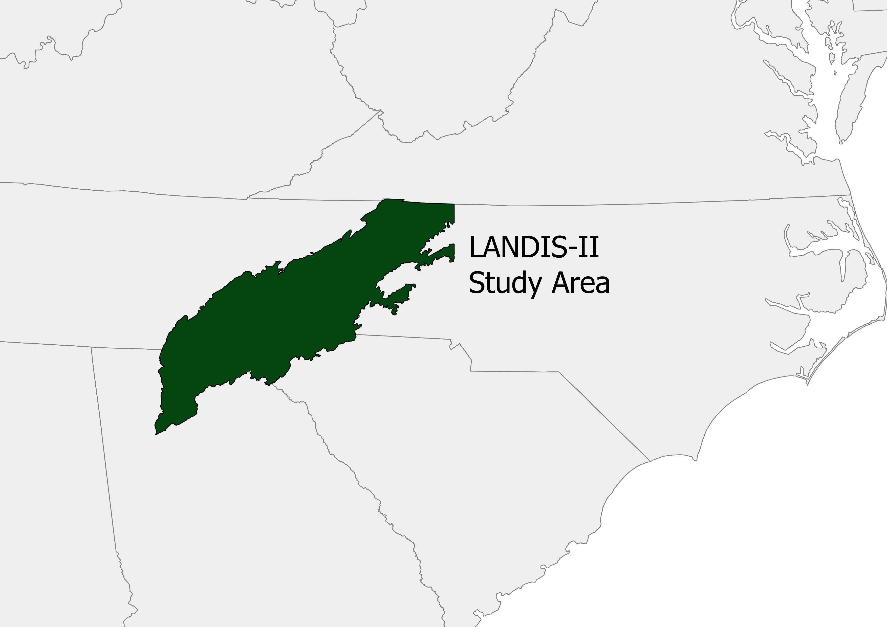
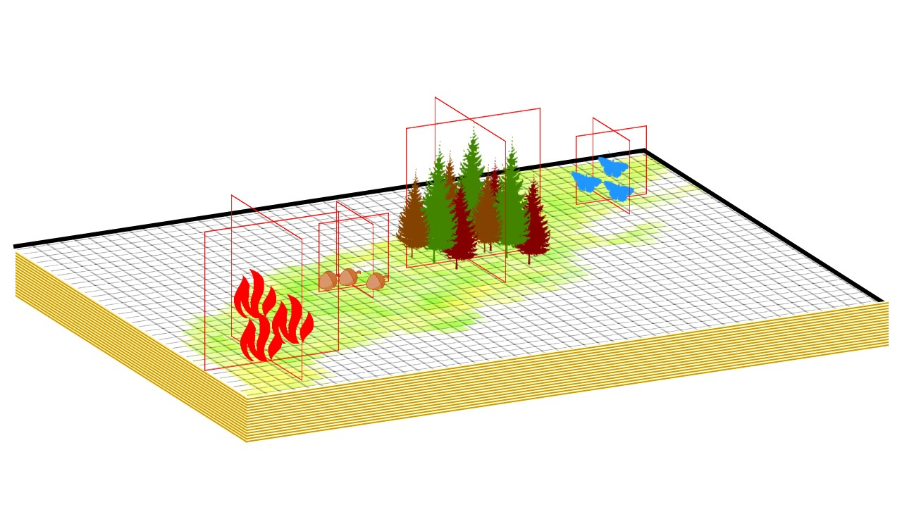

Southern Appalachians LANDIS-II Project
================

See Metadata:  URL HERE

### Overveiw of research:

<h4>
The Southern Appalachians represent a hotbed of biodiversity, given their diverse geomorphic structure, lack of glacial coverage in the last ice-age and unique vegetative assemblages (Adams, 2000). Many dynamics determine the composition of this landscape, often reaching back hundreds of years. Fire plays an important role in this area both historically through native American burning, though its exclusion in the modern era, and currently through its reintroduction in the restoration of historic ecological ecosystems (Lafon et al., 2017). Additionally the near-extinction of the previously dominant American Chestnut (Castanea dentata), drastically altered the landscape leading to novel assemblages of species (Ellison et., al 2005, Vandermast and Lear and Clinton 2002). Future climate will also play a role in determining the composition and health of these forests.
<h4>

<h4>
Given these conditions, researchers and managers need an ability to forecast and understanding how our interactions with the landscape will alter future conditions. LANDIS-II (Scheller et al., 2007) is a spatially explicit, landscape dynamics simulation model. We will parameterize and validate a LANDIS-II model for the southern Appalachians and simulate scenarios to forecast future forest conditions. Some things we will consider are management and prescription burning scenarios, and conditions under differing climate forecasts. If you would like to hear more about what we are doing, or are interested in using or contributing to this process feel free to contact.
<h4>

  

### People

-   Zachary Robbins *North Carolina State University*

-   Dr E. Louise Loudermilk *U.S Forest Service*

-   Dr. Robert Scheller *North Carolina State University*

-   Dr. Steve Flanagan *U.S. Forest Service*

-   Derek Wallace *U.S. Forest Service*

-   Christopher Gerstle *North Carolina State University*

### See how we parameterized the model

[Understanding The Landscape](https://github.com/LANDIS-II-Foundation/Project-Southern-Appalachians-2018/tree/master/Parameterizing/FIA%20Analysis)

[Parameterizing Forest Cohorts](https://github.com/LANDIS-II-Foundation/Project-Southern-Appalachians-2018/tree/master/Parameterizing/Forests/InitialCommunities)

[Soils Model](https://github.com/LANDIS-II-Foundation/Project-Southern-Appalachians-2018/tree/master/Parameterizing/Soils)

[Historic and Future Climate](https://github.com/LANDIS-II-Foundation/Project-Southern-Appalachians-2018/tree/master/Parameterizing/Climate)

[Species Validation](https://github.com/LANDIS-II-Foundation/Project-Southern-Appalachians-2018/tree/master/Parameterizing/Forests/SpeciesParameters)

[Landscape Validation](https://github.com/LANDIS-II-Foundation/Project-Southern-Appalachians-2018/tree/master/Parameterizing/Forests)

#### Thanks to Our Funders:

Oak Ridge Institue for Science and Education

Last updated 3/27/2019

#### Citations

Adams, J. (2000). Precious heritage: the status of biodiversity in the United States. Oxford University Press on Demand. 190 Ellison, A. M., Bank, M. S., Clinton, B. D., Colburn, E. A., Elliott, K., Ford, C. R., ... & Mohan, J. (2005). Loss of foundation species: consequences for the structure and dynamics of forested ecosystems. Frontiers in Ecology and the Environment, 3(9), 479-486.

Lafon, C. W., Naito, A. T., Grissino-Mayer, H. D., Horn, S. P., & Waldrop, T. A. (2017). Fire history of the Appalachian region: a review and synthesis.

Scheller, R. M., Domingo, J. B., Sturtevant, B. R., Williams, J. S., Rudy, A., Gustafson, E. J., & Mladenoff, D. J. (2007). Design, development, and application of LANDIS-II, a spatial landscape simulation model with flexible temporal and spatial resolution. ecological modelling, 201(3-4), 409-419.

Vandermast, D. B., Van Lear, D. H., & Clinton, B. D. (2002). American chestnut as an allelopath in the southern Appalachians. Forest Ecology and Management, 165(1-3), 173-181.
